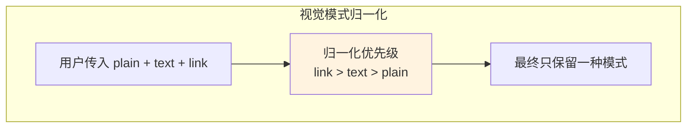
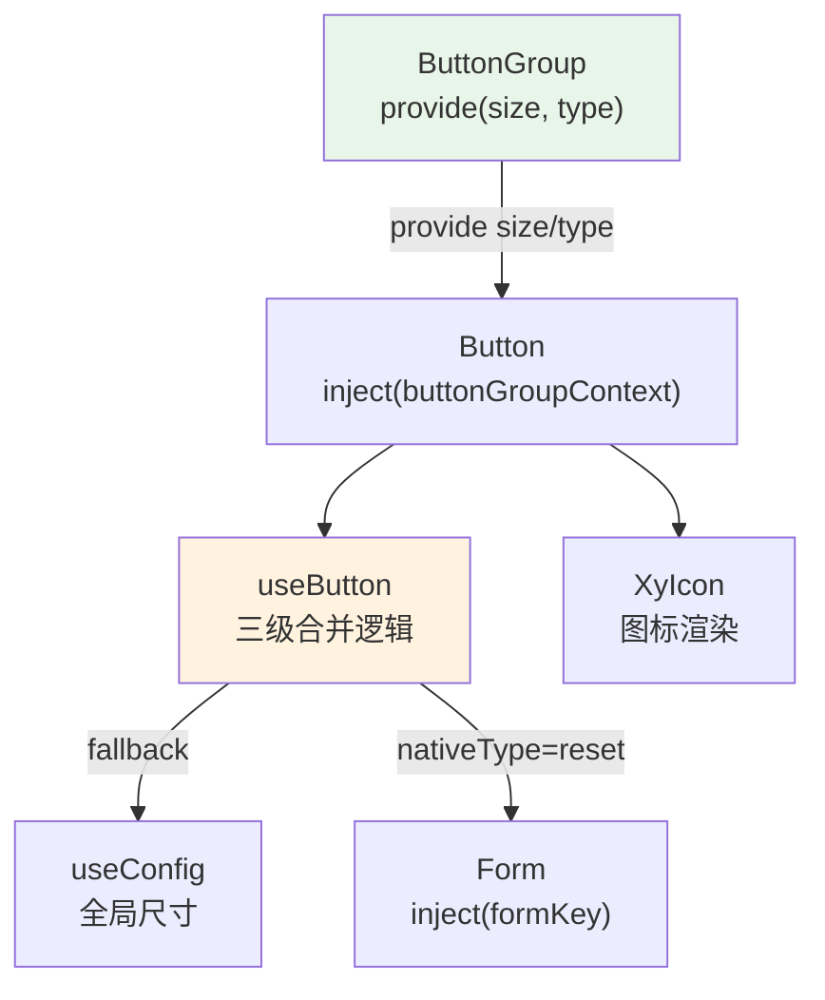
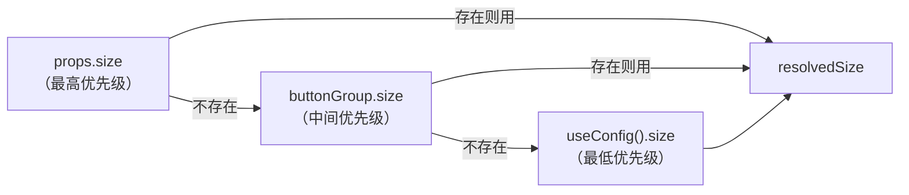
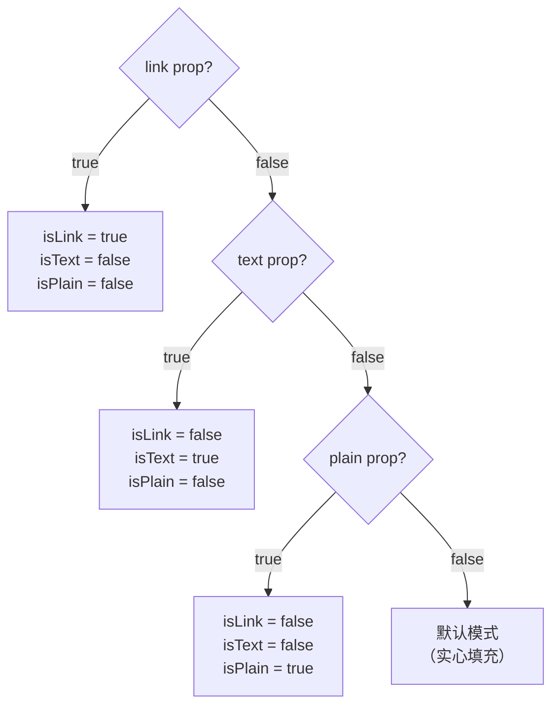
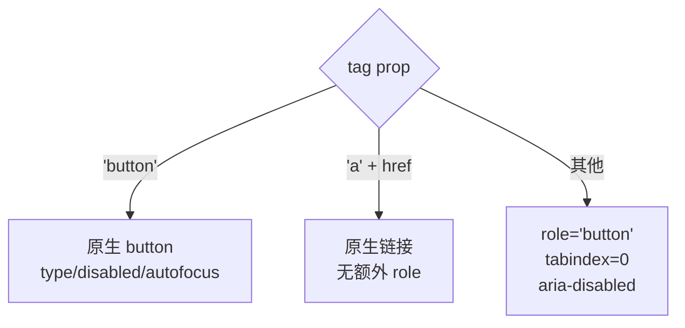

# 10 Button 按钮

> 导读：Button 是页面操作的入口组件，承载主操作、次操作和轻量动作三种语义。通过 useButton composable 实现尺寸/类型的 provide-inject 三级合并、视觉模式归一化（plain/text/link 互斥）和动态标签的无障碍适配。

## 设计哲学

Button 解决的核心问题是：**为页面中的操作行为提供统一的视觉语义和交互规范。** 一个中后台页面通常有三种操作层级——主操作（保存/提交）、次操作（取消/导出）和轻量动作（链接式跳转），Button 通过 `type` + `plain/text/link` 组合覆盖这三种场景。

与 Element Plus `el-button` 的关键差异：

| 维度 | xiaoye-components | Element Plus |
|------|-------------------|--------------|
| 视觉风格 | `color-mix` 柔和混色（非纯色填充） | 纯色实心填充 |
| 视觉模式互斥 | `link > text > plain` 自动归一化 + 开发警告 | 三者独立，可能视觉冲突 |
| disabled 语义 | `disabled || loading` 合并禁用 | `disabled` 和 `loading` 独立 |
| 动态标签 | `<component :is="tag">` + role/tabindex 自动补全 | 固定 `<button>` 标签 |
| ButtonGroup | 双向 provide/inject（size + type） | 仅 size inject |
| 圆形按钮 | `circle` 仅在 icon-only 时生效 + 开发警告 | 直接应用 circle |
| 无障碍 | 纯图标按钮必须 `aria-label` + 开发警告 | 无此校验 |



## 源码架构

### 文件结构

```
button/
├── src/
│   ├── button.vue          # 主组件
│   ├── button.ts           # Props 类型定义
│   ├── use-button.ts       # 核心 composable
│   ├── button-group.vue    # 按钮组组件
│   ├── button-group.ts     # ButtonGroupProps 类型
│   └── constants.ts        # provide/inject key
└── index.ts                # withInstall 导出
```

### 组件关系图



### 核心 type 定义

```ts
export const buttonTypes = ["default", "primary", "success", "warning", "danger"] as const;
export type ButtonType = (typeof buttonTypes)[number];

export interface ButtonProps {
  size?: ComponentSize;           // 'sm' | 'md' | 'lg'
  disabled?: boolean;
  type?: ButtonType;
  icon?: string;                  // Iconify 图标名
  nativeType?: 'button' | 'submit' | 'reset';
  loading?: boolean;
  loadingIcon?: string;
  plain?: boolean;
  text?: boolean;
  link?: boolean;
  bg?: boolean;                   // text 模式下加背景
  autofocus?: boolean;
  round?: boolean;
  circle?: boolean;
  block?: boolean;
  tag?: string | Component;       // 动态渲染标签
}
```

## 核心实现

### 1. 尺寸/类型的三级合并

useButton composable 中的合并策略遵循 `本地 prop > ButtonGroup > 全局配置` 的优先级链：

```ts
const resolvedSize = computed(
  () => props.size ?? buttonGroup?.size.value ?? globalSize.value
);
const resolvedType = computed(
  () => props.type ?? buttonGroup?.type.value ?? "default"
);
```



**WHY 三级合并？** 单个 Button 的 `size` prop 允许精细控制，ButtonGroup 的 `size` allow 批量统一，全局 ConfigProvider 的 `size` 覆盖全站默认。三级链路确保"局部可控 > 批量统一 > 全站兜底"。

### 2. 视觉模式归一化

`plain` / `text` / `link` 三个视觉模式并非独立——它们是互斥的层级关系：

```ts
const isLink = computed(() => props.link);
const isText = computed(() => !isLink.value && props.text);
const isPlain = computed(() => !isLink.value && !isText.value && props.plain);
```



开发模式下会触发 `warnOnce` 提示，告知用户同时传入多个模式时的归一化规则。这种"允许传入但不允许冲突"的策略比直接类型排除更宽容——用户的组合代码不会报错，但会得到明确的行为提示。

### 3. 动态标签与无障碍适配

Button 支持 `tag` prop 替换渲染标签（如 `<a>` 用于导航链接），这带来无障碍挑战——非 `<button>` 标签需要手动补充 `role` 和 `tabindex`：

```ts
const isButtonTag = computed(() => props.tag === "button");
const isLinkTag = computed(() => props.tag === "a" && typeof attrs.href === "string");
const needsButtonRole = computed(() => !isButtonTag.value && !isLinkTag.value);

const buttonAttrs = computed(() => {
  if (isButtonTag.value) {
    return {
      type: props.nativeType,
      disabled: isDisabled.value,
      autofocus: props.autofocus,
      "aria-busy": props.loading ? "true" : undefined
    };
  }
  return {
    role: needsButtonRole.value ? "button" : undefined,
    "aria-disabled": isDisabled.value ? "true" : undefined,
    tabindex: isDisabled.value ? -1 : (needsButtonRole.value ? 0 : attrs.tabindex)
  };
});
```



**WHY needsButtonRole？** `<a>` 有 href 时本身就是可交互元素，不需要 role="button"；只有 `<div>` / `<span>` 等非语义标签才需要 role 补全。

### 4. loading 状态的双重禁用

```ts
const isDisabled = computed(() => props.disabled || props.loading);
```

**WHY 合并禁用？** loading 时按钮不应该被再次点击——这不是 UI 决策而是交互逻辑：loading 状态意味着上一个操作尚未完成。将 `disabled || loading` 合为 `isDisabled` 简化了所有下游判断，避免开发者忘记在 loading 时也禁用按钮。

### 5. nativeType=reset 的 Form 联动

```ts
function handleClick(event: MouseEvent) {
  if (isDisabled.value) {
    event.preventDefault();
    event.stopPropagation();
    return;
  }

  if (isButtonTag.value && props.nativeType === "reset" && form) {
    event.preventDefault();
    form.resetFields();
  }

  emit("click", event);
}
```

**WHY intercept reset？** HTML `<button type="reset">` 的原生行为是重置表单输入值到初始状态，而非清空。但中后台场景的"重置"语义通常是"清空筛选条件回到默认值"，与原生行为不同。通过 inject `formKey` 获取 Form 实例的 `resetFields` 方法，将 reset 重定义为业务语义。

### 6. ButtonGroup 的 provide/inject

ButtonGroup 通过 `provide(buttonGroupContextKey, { size, type })` 向子 Button 传递全局配置，子 Button 通过 `inject(buttonGroupContextKey, null)` 接收后参与三级合并。

```ts
// button-group.vue
provide(buttonGroupContextKey, {
  size: computed(() => props.size),
  type: computed(() => props.type)
});
```

这种双向注入使得 ButtonGroup 不仅能统一子按钮的尺寸，还能统一语义类型（如一组 danger 按钮）。

## API 参考

### Button Props

| Property | Type | Default | Description |
|----------|------|---------|-------------|
| size | `ComponentSize` | - | 尺寸，三级合并：prop > group > global |
| type | `ButtonType` | `"default"` | 语义类型 |
| disabled | `boolean` | `false` | 禁用（与 loading 合并） |
| icon | `string` | - | Iconify 图标名 |
| nativeType | `"button" \| "submit" \| "reset"` | `"button"` | 原生 button type |
| loading | `boolean` | `false` | 加载态 |
| loadingIcon | `string` | `"mdi:loading"` | 加载图标 |
| plain | `boolean` | `false` | 朴素模式 |
| text | `boolean` | `false` | 文本模式 |
| link | `boolean` | `false` | 链接模式 |
| bg | `boolean` | `false` | text 模式下加背景 |
| autofocus | `boolean` | `false` | 自动聚焦 |
| round | `boolean` | `false` | 圆角胶囊 |
| circle | `boolean` | `false` | 圆形（仅 icon-only 时生效） |
| block | `boolean` | `false` | 全宽块级 |
| tag | `string \| Component` | `"button"` | 渲染标签 |

### Button Emits

| Event | Type | Description |
|-------|------|-------------|
| click | `(event: MouseEvent) => void` | 点击事件 |

### Button Slots

| Slot | Description |
|------|-------------|
| default | 按钮文字 |
| icon | 自定义前置图标 |
| loading | 自定义加载图标 |
| prefix | 前置内容 |
| suffix | 后置内容 |

### Button Exposes

| Name | Type | Description |
|------|------|-------------|
| ref | `HTMLElement \| null` | DOM 引用 |
| size | `ComputedRef<ComponentSize>` | 合并后尺寸 |
| type | `ComputedRef<ButtonType>` | 合并后类型 |
| disabled | `ComputedRef<boolean>` | 合并后禁用状态 |

### ButtonGroup Props

| Property | Type | Default | Description |
|----------|------|---------|-------------|
| size | `ComponentSize` | - | 子按钮统一尺寸 |
| type | `ButtonType` | - | 子按钮统一类型 |
| direction | `"horizontal" \| "vertical"` | `"horizontal"` | 排列方向 |

## 样式系统

### BEM 类名

| 类名 | 说明 |
|------|------|
| `.xy-button` | 根元素 |
| `.xy-button--default` | 默认变体 |
| `.xy-button--primary` | 主要变体 |
| `.xy-button--success` | 成功变体 |
| `.xy-button--warning` | 警告变体 |
| `.xy-button--danger` | 危险变体 |
| `.xy-button--sm/md/lg` | 尺寸变体 |
| `.xy-button__icon` | 图标容器 |
| `.xy-button__icon--loading` | 加载图标容器 |
| `.xy-button__icon--suffix` | 后置图标容器 |
| `.xy-button__label` | 文字容器 |
| `.xy-button-group` | 按钮组 |
| `.is-disabled` | 禁用态 |
| `.is-loading` | 加载态 |
| `.is-plain` | 朴素态 |
| `.is-text` | 文本态 |
| `.is-link` | 链接态 |
| `.is-round` | 圆角态 |
| `.is-circle` | 圆形态 |
| `.is-block` | 块级态 |
| `.is-has-bg` | 文本+背景态 |
| `.is-icon-only` | 纯图标态 |

### CSS 变量引用

Button 样式大量使用 `color-mix()` 混色和设计令牌：

| 变量 | 用途 |
|------|------|
| `--xy-color-primary` / `-hover` / `-active` | primary 系列色 |
| `--xy-color-success` / `-hover` / `-active` | success 系列色 |
| `--xy-color-warning` / `-hover` / `-active` | warning 系列色 |
| `--xy-color-danger` / `-hover` / `-active` | danger 系列色 |
| `--xy-color-primary-soft` / `-soft-hover` | plain primary 柔和色 |
| `--xy-color-on-fill` | 实心按钮文字色 |
| `--xy-bg-color-floating` | 默认按钮背景基色 |
| `--xy-bg-color-subtle` | hover/plain 背景 |
| `--xy-border-color-subtle` / `-strong` | 边框色 |
| `--xy-border-color` | 默认边框色 |
| `--xy-text-color` | 文字色 |
| `--xy-radius-md` / `--xy-radius-pill` | 圆角 |
| `--xy-shadow-xs` | hover 微阴影 |
| `--xy-space-2` | icon 与文字间距 |
| `--xy-font-size-sm/md/lg` | 字号 |
| `--xy-transition-duration-fast` | 过渡时长 |
| `--xy-transition-timing` | 过渡曲线 |

### 混色策略

默认按钮的背景使用 `color-mix(in srgb, var(--xy-bg-color-floating) 98%, var(--xy-bg-color-subtle))` 而非纯色——这在亮色模式下呈现微妙的浮层感，在暗色模式下自动适配为更深的混合色，无需额外的主题覆盖。

hover 状态的阴影使用 `color-mix(in srgb, var(--xy-text-color-heading) 4%, transparent)`——将文字色与透明混色，生成 4% 透明度的微阴影，确保任何主题下阴影都存在但极其克制。

## 小结

1. **三级合并链路**：尺寸和类型遵循 `prop > ButtonGroup > globalConfig` 的三级优先级，确保"局部可控 > 批量统一 > 全站兜底"
2. **视觉模式归一化**：`link > text > plain` 互斥优先级 + 开发警告，避免多模式冲突的视觉混乱
3. **动态标签 + 无障碍自补全**：`tag` prop 支持语义标签替换，useButton 自动为非 `<button>` 标签补充 `role` / `tabindex` / `aria-*` 属性