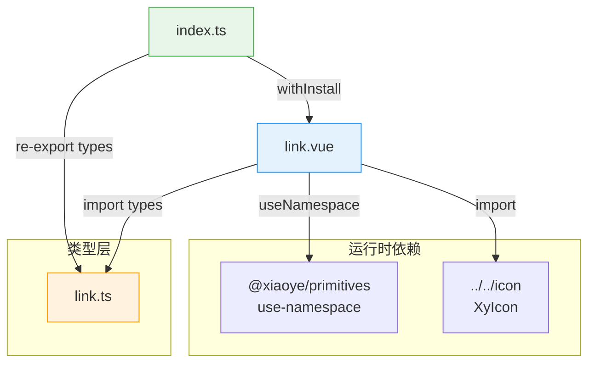

# 11 Link 链接

`xy-link` 承载正文跳转、说明区弱操作和文本级动作。它始终渲染为原生 `<a>` 元素，在有 `href` 时保留浏览器默认跳转语义，无 `href` 时自动补全 `role="link"` + `tabindex="0"` 使其仍可键盘触发。与 `xy-button link` 的核心差异在于：Link 走原生链接语义，Button link 仍属于按钮体系。

<p class="xy-section-lead">
  如果一个操作本质上是在"跳到别处"，优先用 `xy-link`。如果它仍然是当前页面里的动作，只是想做得更轻，再考虑 `xy-button link`。
</p>

## 设计哲学

### 解决什么问题

中后台界面中大量存在"查看详情""了解更多""打开文档"这类轻量跳转操作。它们不适合用按钮承载——按钮暗示"当前页面内的动作"，而这类操作的本质是导航。原生 `<a>` 标签虽然语义正确，但缺少统一的视觉体系：下划线策略、语义色、禁用态、图标布局都需要逐项目手写。

`xy-link` 的设计目标：

1. **保留原生链接语义**——始终渲染 `<a>`，有 `href` 时浏览器默认跳转行为完整保留，中键/右键菜单、`target="_blank"` 等均无需额外处理。
2. **无 href 时仍可交互**——自动补 `role="link"` + `tabindex="0"` + `Enter` 键触发，使"动作型链接"（如表格行内操作）也能被键盘和辅助技术正确识别。
3. **下划线策略可配置**——`always / hover / never` 三档 + 布尔兼容，覆盖正文排版、工具栏、纯装饰等不同场景。
4. **禁用态语义完整**——移除 `href/target`、输出 `aria-disabled`、阻止事件冒泡，三重保障。

### 与 Element Plus ElLink 的差异

| 维度 | Element Plus `ElLink` | xiaoye `XyLink` |
|------|----------------------|------------------|
| 下划线控制 | `underline: boolean`，仅开/关 | `underline: boolean \| 'always' \| 'hover' \| 'never'`，三档 + 布尔兼容 |
| 无 href 语义 | 不补 `role`/`tabindex` | 自动补 `role="link"` + `tabindex="0"` + `Enter` 键触发 |
| 禁用态处理 | 仅阻止 click + 加 `is-disabled` 类 | 移除 `href/target` + `aria-disabled` + 阻止 click + 阻止 stopPropagation |
| 图标布局 | `icon` 插槽仅一个 | `icon` prop（前置）+ `icon` 插槽（后置），支持双图标 |
| 纯图标模式 | 无专门处理 | 自动加 `is-icon-only` 类，消除多余 gap |
| focus-visible | 无专门样式 | `outline` + `box-shadow` + `border-radius` 三合一焦点环 |

## 源码架构



### 目录结构

```
packages/components/link/
├── index.ts              # 组件注册入口，withInstall + 类型重导出
├── src/
│   ├── link.ts           # Props / Emits / Slots 类型定义 + 常量
│   └── link.vue          # 模板 + 逻辑（单文件组件，无 setup 拆分）
└── __tests__/
    └── link.spec.ts      # 7 个测试用例
```

> 源码路径：`packages/components/link/`

## 核心 Props / Emits / Slots 类型定义

类型定义位于 `src/link.ts`（`packages/components/link/src/link.ts`）：

```ts
export const linkTypes = ["default", "primary", "success", "warning", "info", "danger"] as const;
export const linkUnderlineModes = ["always", "never", "hover"] as const;

export type LinkType = (typeof linkTypes)[number];
export type LinkUnderlineMode = (typeof linkUnderlineModes)[number];
export type LinkUnderline = boolean | LinkUnderlineMode;
export type LinkTarget = "_blank" | "_parent" | "_self" | "_top" | (string & NonNullable<unknown>);
export type LinkClickHandler = (event: MouseEvent) => void;

export interface LinkProps {
  type?: LinkType;
  underline?: LinkUnderline;
  disabled?: boolean;
  href?: string;
  target?: LinkTarget;
  icon?: string;
}
```

Emits 与 Slots 定义位于 `link.vue` 的 `<script setup>` 内：

```ts
const emit = defineEmits<{
  click: [event: MouseEvent];
}>();

defineSlots<{
  default?: () => unknown;
  icon?: () => unknown;
}>();
```

### Props 默认值

```ts
withDefaults(defineProps<LinkProps>(), {
  type: "default",
  underline: "hover",
  disabled: false,
  href: "",
  target: "_self"
});
```

## 核心实现

### 模板渲染逻辑

模板始终渲染为 `<a>` 元素，通过 `v-bind="linkAttrs"` 动态控制属性：

```vue
<a :class="linkKls" v-bind="linkAttrs" @click="handleClick" @keydown="handleKeydown">
  <span v-if="props.icon" class="xy-link__icon" aria-hidden="true">
    <XyIcon :icon="props.icon" :size="14" />
  </span>
  <span v-if="$slots.default" class="xy-link__inner">
    <slot />
  </span>
  <span v-if="$slots.icon" class="xy-link__icon xy-link__icon--suffix" aria-hidden="true">
    <slot name="icon" />
  </span>
</a>
```

渲染优先级：`icon` prop 渲染为前置图标（`xy-link__icon`），`icon` 插槽渲染为后缀图标（`xy-link__icon xy-link__icon--suffix`），两者可同时存在。所有图标元素均标记 `aria-hidden="true"`，避免读屏重复播报。

### 交互状态管理

组件通过 5 个 computed 属性管理交互状态：

**1. `hasHref` —— 是否存在有效 href**

```ts
const hasHref = computed(() => Boolean(props.href));
```

**2. `isFocusableAction` —— 是否为可聚焦的动作型链接**

```ts
const isFocusableAction = computed(() => !props.disabled && !hasHref.value);
```

当没有 `href` 且未禁用时，组件需要作为可聚焦的动作元素，补全 `role` 和 `tabindex`。

**3. `underline` —— 下划线策略归一化**

```ts
const underline = computed<LinkUnderlineMode>(() => {
  if (props.underline === true) return "hover";
  if (props.underline === false) return "never";
  return props.underline;
});
```

将布尔值兼容映射为字符串枚举，后续逻辑和样式只处理三档。

**4. `resolvedRole` —— 语义角色**

```ts
const resolvedRole = computed(() => {
  if (!hasHref.value) return "link";
  return typeof attrs.role === "string" ? attrs.role : undefined;
});
```

无 `href` 时强制 `role="link"`；有 `href` 时原生 `<a>` 已具备链接语义，不额外输出 `role`，除非使用者显式传入。

**5. `resolvedTabindex` —— 键盘聚焦**

```ts
const resolvedTabindex = computed(() => {
  if (props.disabled) return -1;
  const tabindex = attrs.tabindex;
  if (typeof tabindex === "string" || typeof tabindex === "number") return tabindex;
  return isFocusableAction.value ? 0 : undefined;
});
```

禁用时 `tabindex="-1"` 移出 Tab 序列；有 `href` 时原生 `<a>` 已可聚焦，不输出 `tabindex`；无 `href` 且未禁用时补 `tabindex="0"`。

### linkAttrs —— 属性聚合

```ts
const linkAttrs = computed<AnchorHTMLAttributes & Record<string, unknown>>(() => ({
  ...attrs,
  href: props.disabled || !hasHref.value ? undefined : props.href,
  target: props.disabled || !hasHref.value ? undefined : props.target,
  role: resolvedRole.value,
  tabindex: resolvedTabindex.value,
  "aria-disabled": props.disabled ? "true" : undefined
}));
```

关键设计：禁用时不输出 `href/target`，这样浏览器不会尝试导航，也避免读屏将禁用链接识别为可跳转。

### 事件处理

**`handleClick`** —— 禁用时 `preventDefault` + `stopPropagation` 双重阻断：

```ts
function handleClick(event: MouseEvent) {
  if (props.disabled) {
    event.preventDefault();
    event.stopPropagation();
    return;
  }
  emit("click", event);
}
```

**`handleKeydown`** —— 无 href 时 Enter 键触发 click：

```ts
function handleKeydown(event: KeyboardEvent) {
  if (!isFocusableAction.value || event.key !== "Enter") return;
  event.preventDefault();
  (event.currentTarget as HTMLAnchorElement | null)?.click();
}
```

只有动作型链接（无 `href`）才需要键盘代理，有 `href` 的原生 `<a>` 已自带 Enter 触发能力。

### linkKls —— 类名聚合

```ts
const linkKls = computed(() => [
  ns.base.value,                                    // xy-link
  `${ns.base.value}--${props.type}`,                // xy-link--primary
  ns.is("disabled", props.disabled),                // is-disabled
  ns.is("underline", underline.value === "always"), // is-underline
  ns.is("hover-underline", underline.value === "hover" && !props.disabled),
  ns.is("icon-only", !hasDefaultSlot.value)         // is-icon-only
]);
```

注意 `is-hover-underline` 在禁用时不输出，避免禁用态下悬停仍出现下划线。

## 样式系统

样式定义位于 `packages/theme/src/components/link.css`。

### BEM 命名

| 类名 | 含义 |
|------|------|
| `xy-link` | 根元素 |
| `xy-link--{type}` | 语义色变体（`default / primary / success / warning / info / danger`） |
| `xy-link__inner` | 文字内容容器 |
| `xy-link__icon` | 图标容器 |
| `xy-link__icon--suffix` | 后置图标 |
| `is-disabled` | 禁用态 |
| `is-underline` | 始终下划线 |
| `is-hover-underline` | 悬停下划线 |
| `is-icon-only` | 纯图标模式 |

### CSS 变量引用

Link 组件不定义组件级 CSS 变量，全部引用全局设计令牌：

| 变量 | 用途 | 出现位置 |
|------|------|----------|
| `--xy-text-secondary` | default 类型默认色 | 根元素、`xy-link--default` |
| `--xy-text-heading` | default 类型 hover 色 | `xy-link--default:hover` |
| `--xy-text-muted` | 禁用态文字色 | `is-disabled` |
| `--xy-brand` / `--xy-brand-hover` | primary 语义色 | `xy-link--primary` |
| `--xy-success` / `--xy-success-hover` | success 语义色 | `xy-link--success` |
| `--xy-warning` / `--xy-warning-hover` | warning 语义色 | `xy-link--warning` |
| `--xy-info` / `--xy-info-hover` | info 语义色 | `xy-link--info` |
| `--xy-danger` / `--xy-danger-hover` | danger 语义色 | `xy-link--danger` |
| `--xy-font-size-md` | 字号 | 根元素 |
| `--xy-line-height` | 行高 | 根元素 |
| `--xy-transition-duration-fast` / `--xy-transition-timing` | 过渡动画 | 根元素 transition |
| `--xy-radius-sm` | focus-visible 圆角 | `:focus-visible` |
| `--xy-mix-light` | focus-visible 混色 | `:focus-visible` |

### 关键样式细节

**下划线实现**：不使用 `border-bottom`，而是用原生 `text-decoration-line`，配合 `text-decoration-thickness: 1px` 和 `text-underline-offset: 3px` 精细控制。下划线颜色使用 `color-mix(in srgb, currentColor 18%, transparent)` 实现半透明效果，与文字色自动联动。

**focus-visible 焦点环**：`outline` + `box-shadow` 双层设计，`outline` 使用 `color-mix` 混合主色与 `--xy-mix-light`，`box-shadow` 使用主色 12% 透明度，配合 `--xy-radius-sm` 圆角，视觉上与组件形状一致。

**双类名选择器**（`.xy-link.xy-link`）：提高选择器优先级，防止被外部 reset 样式意外覆盖。

**禁用态下划线**：`is-disabled:hover` 时强制 `text-decoration: none`，确保禁用态悬停不会出现下划线。

## 与其他组件的联动

### xy-button link

`xy-button` 的 `link` 属性会渲染出视觉上与 `xy-link` 相似的链接风格按钮，但底层仍是 `<button>` 元素。两者选择依据：

| 场景 | 推荐组件 |
|------|----------|
| 跳转到其他页面 | `xy-link` |
| 当前页面内的动作 | `xy-button link` |
| 需要原生 `<a>` 语义和浏览器行为 | `xy-link` |
| 需要按钮的 loading / disabled / 分组 | `xy-button link` |

### xy-descriptions

`xy-descriptions` 组件内置了 Link 的集成。当描述项配置了 `item.link` 属性时，会自动渲染为 `xy-link`：

```ts
// packages/components/descriptions/src/descriptions.vue
import XyLink from "../../link";
```

```vue
<xy-link v-else-if="item.link" v-bind="item.link">
  {{ item.label }}
</xy-link>
```

这使得描述列表中的跳转操作无需手动组合组件。

### xy-icon

Link 的 `icon` prop 直接传递给 `XyIcon` 组件，固定 `size="14"` 以匹配文字行高。`icon` 插槽则允许传入任意自定义图标内容，不受尺寸约束。

## 扩展与定制

### 自定义下划线样式

Link 的下划线颜色基于 `currentColor` 的 `color-mix` 计算，修改文字色即可联动下划线。如需完全自定义下划线样式，可覆盖 `text-decoration-color`：

```css
.xy-link--primary {
  text-decoration-color: var(--xy-brand);
}
```

### 自定义焦点环

焦点环的 `outline` 和 `box-shadow` 均基于 `--xy-brand` 计算。如需调整焦点环颜色或大小：

```css
.xy-link:focus-visible {
  outline-color: var(--xy-success);
  outline-offset: 3px;
}
```

### 通过 CSS 变量调整全局风格

由于 Link 全部引用全局令牌，修改令牌即可批量影响所有 Link 实例：

```css
:root {
  --xy-font-size-md: 13px;        /* 缩小链接字号 */
  --xy-transition-duration-fast: 0.2s;  /* 放慢过渡 */
}
```

### 组件级 CSS 变量扩展

当前 Link 未定义组件级 CSS 变量（如 `--xy-link-font-size`），所有样式直接引用全局令牌。如果项目需要 Link 粒度的主题定制，可以在 `link.css` 中补充组件级变量层：

```css
.xy-link {
  --xy-link-gap: 6px;
  --xy-link-icon-size: 14px;
  gap: var(--xy-link-gap);
}
.xy-link__icon .xy-icon {
  font-size: var(--xy-link-icon-size);
}
```

### 注册方式

组件通过 `withInstall` 工具注册，位于 `packages/components/link/index.ts`：

```ts
import Link from "./src/link.vue";
import { withInstall } from "@xiaoye/primitives";

export const XyLink = withInstall(Link, "xy-link");
export default XyLink;
```

`withInstall` 为组件添加 `install` 方法，支持 `app.use(XyLink)` 全局注册和 `app.component("xy-link", XyLink)` 单独注册。

## 基础用法

:::demo `type` 用来表达语义等级。和 Button 不同，Link 天生更轻，不承担大面积主操作按钮的视觉职责。
link/basic
:::

## 下划线策略

`underline` 支持 `always / hover / never`，同时兼容布尔值写法，其中 `true` 会映射为 `hover`，`false` 会映射为 `never`。

:::demo 推荐默认使用 `hover`，这样既保留链接感，又不会让正文里出现过多常显装饰线。
link/underline
:::

## 跳转与禁用

当存在 `href` 时，`xy-link` 会保持原生链接行为；当 `disabled` 为 `true` 时，会移除 `href / target` 并阻止交互。没有 `href` 时，它也可以作为轻量文本动作使用。

:::demo 跳转型链接和动作型链接都可以承载，但如果它是页面主决策，仍然优先用 Button。
link/disabled
:::

## 图标

`icon` 属性适合前置图标，`icon` 插槽适合补充后置图标或自定义图形。纯图标 `xy-link` 需要显式提供 `aria-label`。

:::demo 图标不会改变 Link 的语义，只是在文字周围补充方向感和信息密度。
link/icon
:::

## 何时使用

- 在说明区、表格正文或卡片摘要里补充"查看详情""了解更多"这类弱操作。
- 需要原生链接语义、`href / target` 或浏览器默认跳转行为。
- 需要比 `xy-button link` 更轻、更接近正文排版的文本操作。

## 何时不使用

- 当前动作仍然属于表单提交、保存、删除这类页面内操作。
- 你需要明显的主次操作层级，而不只是正文跳转。
- 你希望操作和 Button 体系的尺寸、状态、分组能力保持一致。

## 最佳实践

### Link vs Button link

| 场景 | 推荐组件 |
|------|----------|
| 跳转到其他页面 | `xy-link` |
| 当前页面内的动作 | `xy-button link` |
| 需要原生 `<a>` 语义和浏览器行为 | `xy-link` |
| 需要按钮的 loading / disabled / 分组 | `xy-button link` |

### 下划线策略

```vue
<xy-link underline="hover">默认：悬停时显示下划线</xy-link>
<xy-link underline="always">始终显示下划线</xy-link>
<xy-link underline="never">不显示下划线</xy-link>
```

正文中的链接推荐 `hover` 策略，既保留链接感又不会让正文出现过多装饰线。

## Link API

### Link Attributes

| 属性        | 说明              | 类型                                                                     | 默认值      |
| ----------- | ----------------- | ------------------------------------------------------------------------ | ----------- |
| `type`      | 链接语义色        | `LinkType` | `'default'` |
| `underline` | 下划线显示策略    | `LinkUnderline` | `'hover'`   |
| `disabled`  | 是否禁用交互      | `boolean`                                                                | `false`     |
| `href`      | 原生链接地址      | `string`                                                                 | `''`        |
| `target`    | 原生跳转目标      | `LinkTarget` | `'_self'`   |
| `icon`      | 前置 Iconify 图标 | `string`                                                                 | —           |

### Link Events

| 事件    | 说明                           | 参数         |
| ------- | ------------------------------ | ------------ |
| `click` | 点击链接时触发；禁用时不会触发 | `LinkClickHandler` |

### Link Slots

| 插槽      | 说明                     |
| --------- | ------------------------ |
| `default` | 链接主内容               |
| `icon`    | 自定义后置图标或附加图形 |

## 可访问性与行为约定

- 有 `href` 时保持原生 `<a>` 语义，浏览器默认跳转仍然生效。
- 没有 `href` 时组件会补 `role="link"` 和 `tabindex="0"`，允许通过 `Enter` 触发文本动作。
- `disabled` 时会输出 `aria-disabled="true"`，同时移除 `href / target` 并阻止点击事件。
- 纯图标 `xy-link` 应显式补 `aria-label`，例如 `<xy-link icon="mdi:information-outline" aria-label="查看说明" />`。
