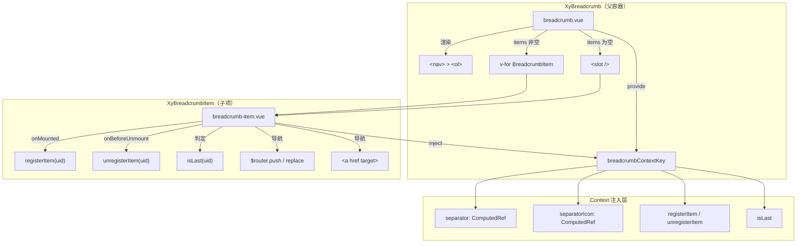
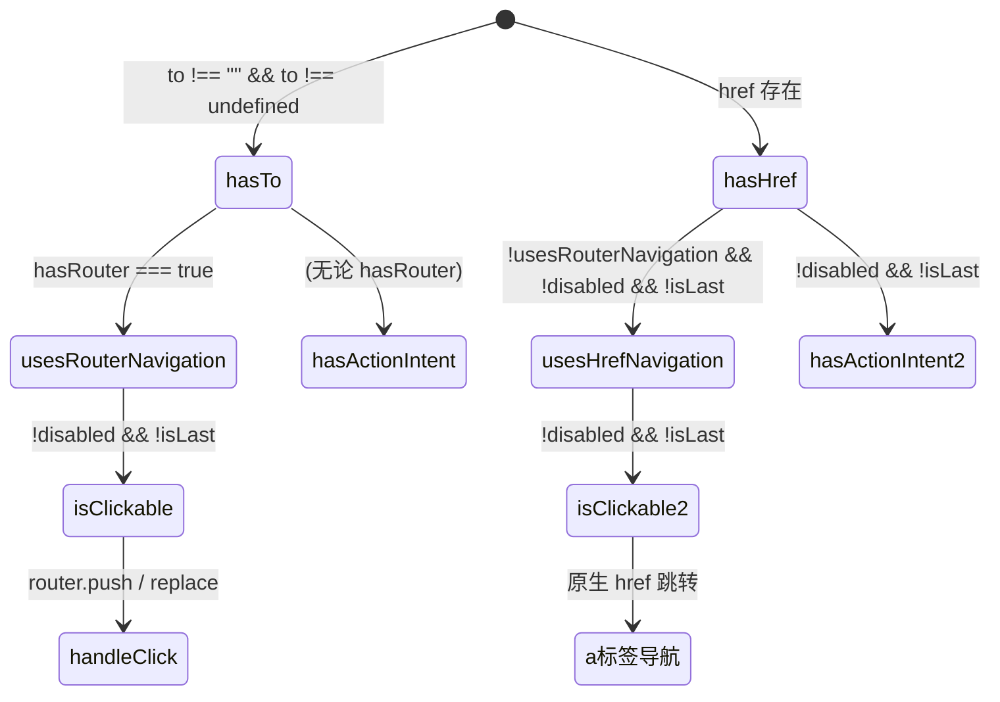

# 12 Breadcrumb 面包屑

`xy-breadcrumb` 采用父容器注册制 + 子项自举导航的双层架构，在保留 `to / replace` 路由兼容口的同时补齐了 `href / target / disabled / aria-current` 等原生语义，使其在 SSR 和无 Router 场景下也能正确降级。

## 设计哲学

面包屑的核心职责是**回答"我在哪里"**——它不是导航栏，不承载站点全局切换；它是位置标注，让用户在深层页面中快速理解层级关系并回溯上层。

与 Element Plus `el-breadcrumb` 相比，`xy-breadcrumb` 的差异集中在以下几点：

| 维度 | Element Plus | xy-breadcrumb |
|------|-------------|---------------|
| 子项注册 | 隐式 `provide/inject`，无 UID 管理 | 显式 `registerItem / unregisterItem` + UID 数组，精确判定末项 |
| 导航方式 | 仅 `to` (Router) | `to` (Router) + `href / target` (原生链接)，双路径并存 |
| 禁用态 | 无原生 `disabled` | `disabled` prop + `aria-disabled` + 可点击语义移除 |
| 声明式渲染 | 无 | `items` prop 支持纯数据驱动 |
| 无障碍 | `aria-label` 在 `<el-breadcrumb>` 上 | `<nav role="navigation" aria-label>` + `<ol>` 语义列表 + `aria-current="page"` |

核心理念：**每个 Item 自己决定导航方式**，父容器只负责分发分隔符和判定末项——职责边界清晰，不把路由逻辑耦合到容器层。

## 源码架构



### 目录结构

```
packages/components/breadcrumb/
├── index.ts                 # 统一导出 + withInstall 注册
├── src/
│   ├── breadcrumb.ts        # BreadcrumbProps / BreadcrumbItemData 类型定义
│   ├── breadcrumb.vue       # 父容器：provide context + 双模式渲染
│   ├── breadcrumb-item.ts   # BreadcrumbItemProps / BreadcrumbRouteTarget 类型定义
│   ├── breadcrumb-item.vue  # 子项：inject context + 自举导航逻辑
│   └── context.ts           # InjectionKey + BreadcrumbContext 接口
└── __tests__/
    └── breadcrumb.spec.ts   # 单元测试
```

## 核心类型定义

### BreadcrumbProps

```ts
// packages/components/breadcrumb/src/breadcrumb.ts

interface BreadcrumbItemData {
  label: string;
  to?: BreadcrumbRouteTarget;
  replace?: boolean;
  href?: string;
  target?: LinkTarget;
  disabled?: boolean;
}

interface BreadcrumbProps {
  separator?: string;          // 字符分隔符，默认 "/"
  separatorIcon?: string;      // 图标分隔符，优先级高于 separator
  ariaLabel?: string;          // nav 的 aria-label，默认 "面包屑"
  items?: BreadcrumbItemData[]; // 声明式数据，为空时走 slot 渲染
}
```

### BreadcrumbItemProps

```ts
// packages/components/breadcrumb/src/breadcrumb-item.ts

type BreadcrumbRouteTarget = string | Record<string, unknown>;

interface BreadcrumbItemProps {
  to?: BreadcrumbRouteTarget;  // 路由目标，需宿主提供 $router
  replace?: boolean;           // 是否 replace 而非 push
  href?: string;               // 原生链接，无 router 时的首选
  target?: LinkTarget;         // 链接 target，默认 "_self"
  disabled?: boolean;          // 禁用态
}
```

### BreadcrumbContext

```ts
// packages/components/breadcrumb/src/context.ts

interface BreadcrumbContext {
  separator: ComputedRef<string>;
  separatorIcon: ComputedRef<string>;
  registerItem: (uid: number) => void;
  unregisterItem: (uid: number) => void;
  isLast: (uid: number) => boolean;
}

const breadcrumbContextKey: InjectionKey<BreadcrumbContext> = Symbol("xy-breadcrumb");
```

`InjectionKey` 带泛型约束，保证 `inject` 端拿到的是类型安全的上下文对象，而不是 `unknown`。`separator` 和 `separatorIcon` 以 `ComputedRef` 形式注入，使子项能响应式地跟随父容器 prop 变更。

## 核心实现

### 父容器：双模式渲染

`breadcrumb.vue` 的模板核心是一个分支——`items` 非空时走声明式 `v-for`，否则走 `<slot />`：

```vue
<nav :class="rootClasses" role="navigation" :aria-label="props.ariaLabel" v-bind="nativeAttrs">
  <ol class="xy-breadcrumb__list">
    <slot v-if="normalizedItems.length === 0" />
    <breadcrumb-item
      v-for="item in normalizedItems"
      v-else
      :key="`${item.label}-${item.href ?? ''}-${String(item.to ?? '')}`"
      v-bind="itemProps(item)"
    >
      {{ item.label }}
    </breadcrumb-item>
  </ol>
</nav>
```

关键设计点：

- **`normalizedItems`**：`computed(() => props.items ?? [])`，用 `??` 而非 `||` 处理 `undefined`，允许显式传 `undefined` 回退到 slot 渲染。
- **复合 key**：`label-href-to` 三元组拼接，避免同 label 不同路由时的 key 冲突。
- **`inheritAttrs: false`**：手动拆分 `class / style` 到 `<nav>`，其余 attrs 透传，避免属性掉到错误的子节点。

### UID 注册制

父容器维护一个 `itemUids: ref<number[]>([])`，子项在 `onMounted` 时调用 `registerItem(uid)` 注册，`onBeforeUnmount` 时调用 `unregisterItem(uid)` 移除：

```ts
function registerItem(uid: number) {
  if (!itemUids.value.includes(uid)) {
    itemUids.value = [...itemUids.value, uid];
  }
}

function unregisterItem(uid: number) {
  itemUids.value = itemUids.value.filter((current) => current !== uid);
}

function isLast(uid: number) {
  return itemUids.value.at(-1) === uid;
}
```

使用展开运算符 `[...itemUids.value, uid]` 而非 `push`，保证每次变更都触发响应式更新。`at(-1)` 精准取末项 UID，`isLast` 决定子项是否渲染分隔符、是否标注 `aria-current="page"`、是否阻止导航。

### 子项：导航状态机

`breadcrumb-item.vue` 的核心是 6 个 computed 构成的导航状态机：



6 个 computed 的推导链：

| Computed | 推导条件 | 作用 |
|----------|---------|------|
| `hasRouter` | `$router.push` 和 `$router.replace` 均为 function | 判断宿主是否注入了 Router |
| `hasTo` | `to !== "" && to !== undefined` | 判断是否有路由目标 |
| `hasHref` | `Boolean(href)` | 判断是否有原生链接 |
| `usesRouterNavigation` | `hasTo && hasRouter` | 走 `$router.push/replace` |
| `usesHrefNavigation` | `!usesRouterNavigation && hasHref && !disabled && !isLast` | 走原生 `<a>` 标签 |
| `isClickable` | `!disabled && !isLast && (usesRouterNavigation \|\| usesHrefNavigation)` | 决定是否响应点击/键盘 |

**优先级规则**：`to` + Router > `href`。当 `to` 存在且 Router 可用时，忽略 `href`；只有 Router 不可用或 `to` 为空时，`href` 才生效。

### 动态标签渲染

子项的根标签和内层标签都是动态的：

```ts
const rootTag = computed(() => (breadcrumbContext ? "li" : "span"));
const innerTag = computed(() => (usesHrefNavigation.value ? "a" : "span"));
```

- **根标签**：在 `XyBreadcrumb` 内部渲染为 `<li>`（语义列表项），独立使用时降级为 `<span>`。
- **内层标签**：走 `href` 导航时渲染为 `<a>`，否则渲染为 `<span>` + `role="link"` + `tabindex="0"` 辅助键盘交互。

### 点击与键盘处理

```ts
function handleClick(event: MouseEvent) {
  if (!isClickable.value) {
    event.preventDefault();
    return;
  }
  if (!usesRouterNavigation.value) return; // href 交给 <a> 原生行为
  event.preventDefault();
  props.replace ? router?.replace?.(props.to) : router?.push?.(props.to);
}

function handleKeydown(event: KeyboardEvent) {
  if (!isClickable.value || usesHrefNavigation.value || event.key !== "Enter") return;
  event.preventDefault();
  (event.currentTarget as HTMLElement | null)?.click();
}
```

`handleClick` 的三层守卫：不可点击直接 `preventDefault`；可点击但走 `href` 则放行给原生 `<a>`；走 Router 则 `preventDefault` 后手动导航。`handleKeydown` 只在 Router 模式下对 Enter 键生效，`href` 模式由 `<a>` 原生键盘行为兜底。

### 无障碍

- 父容器输出 `<nav role="navigation" aria-label="面包屑">`，满足 WCAG 面包屑模式。
- 子项列表用 `<ol>` 语义化，表达层级顺序。
- 末项自动标注 `aria-current="page"`。
- `disabled` 项输出 `aria-disabled="true"` 并移除 `href` / `role="link"` / `tabindex`。
- 分隔符标注 `role="presentation" aria-hidden="true"`，避免读屏器朗读分隔符。
- Router 模式下可点击项补充 `role="link"` + `tabindex="0"`，确保键盘可达。

## 样式系统

### BEM 命名

| 类名 | 层级 | 说明 |
|------|------|------|
| `xy-breadcrumb` | Block | `<nav>` 根容器 |
| `xy-breadcrumb__list` | Element | `<ol>` 列表 |
| `xy-breadcrumb__item` | Element | `<li>` 列表项 |
| `xy-breadcrumb__inner` | Element | 文字/链接内层 |
| `xy-breadcrumb__separator` | Element | 分隔符容器 |
| `xy-breadcrumb__separator-icon` | Element | 分隔符图标 |
| `is-current` | Modifier | 末项/当前页 |
| `is-disabled` | Modifier | 禁用项 |
| `is-link` | Modifier | 可点击项 |

### CSS 变量

组件在 `xy-breadcrumb` 块级作用域内定义局部变量，同时引用全局 Design Token：

```css
.xy-breadcrumb {
  --xy-breadcrumb-font-size: 14px;
  --xy-breadcrumb-line-height: 1.5;
  --xy-breadcrumb-color: var(--xy-text-color-secondary);
  --xy-breadcrumb-link-color: var(--xy-text-color-subtle);
  --xy-breadcrumb-link-hover-color: var(--xy-text-color-heading);
  --xy-breadcrumb-current-color: var(--xy-text-color-heading);
  --xy-breadcrumb-disabled-color: color-mix(in srgb, var(--xy-text-color-secondary) 76%, var(--xy-mix-light));
  --xy-breadcrumb-separator-gap: 10px;
  --xy-breadcrumb-separator-color: color-mix(in srgb, var(--xy-text-color-secondary) 68%, var(--xy-mix-light));
}
```

`color-mix` 用于在全局 token 基础上微调透明度，而非硬编码新色值——切换暗黑模式时，这些变量会自动跟随全局 token 变化，无需组件层面额外处理。

### 交互过渡

`inner` 层统一挂了 `color` / `background-color` / `border-color` / `box-shadow` 四组过渡，引用全局 `--xy-transition-duration` 和 `--xy-transition-timing`，确保与组件库其他交互反馈节奏一致。

`focus-visible` 态使用 `outline` + `box-shadow` 双层高亮，并混入 `--xy-color-primary` 保证焦点环在亮/暗模式下都可见。

### 状态样式优先级

CSS 源码中的书写顺序隐含了优先级：`is-link:hover` > `is-link` > 默认 > `is-disabled` > `is-current`。当前页 (`is-current`) 通过更具体的选择器 `.xy-breadcrumb__item.is-current .xy-breadcrumb__inner` 覆盖 hover 态，保证当前页始终不可交互。

## 与其他组件的联动

### XyIcon

分隔符图标通过 `XyIcon` 渲染，传入 `separatorIcon` prop（如 `mdi:chevron-right`），固定 `size="14"`。`XyIcon` 内部使用 `@iconify/vue`，支持按需加载图标集，不会因为面包屑引入全量图标包。

### Link 类型复用

`BreadcrumbItemProps.target` 的类型 `LinkTarget` 直接复用自 `packages/components/link/src/link.ts`，保持跨组件的类型一致：

```ts
type LinkTarget = "_blank" | "_parent" | "_self" | "_top" | (string & NonNullable<unknown>);
```

末尾的交叉类型 `(string & NonNullable<unknown>)` 是 TypeScript 的技巧——它允许任意字符串通过类型检查，但 IDE 自动补全只会提示四个标准值。

### withInstall 注册

导出时通过 `@xiaoye/primitives` 的 `withInstall` 包装，同时把 `XyBreadcrumbItem` 挂到 `XyBreadcrumb.Item` 上，支持两种导入方式：

```ts
import { XyBreadcrumb, XyBreadcrumbItem } from "@xiaoye/components";  // 独立导入
import { XyBreadcrumb } from "@xiaoye/components";                     // 命名空间导入
XyBreadcrumb.Item  // => XyBreadcrumbItem
```

## 扩展与定制

### 自定义分隔符

分隔符渲染逻辑在 `breadcrumb-item.vue` 中：`separatorIcon` 非空时渲染 `XyIcon`，否则输出字符。如果需要更复杂的分隔符（如 SVG 动画），可以不传 `separator` 和 `separatorIcon`，通过 `context.ts` 注入自定义分隔符组件——当前架构的 `provide/inject` 通道天然支持扩展。

### 自定义 Item 渲染

当前 `items` 渲染只支持 `label` 文本。如果需要图标 + 文本组合、徽标等富内容，使用 slot 模式：

```vue
<xy-breadcrumb>
  <xy-breadcrumb-item to="/dashboard">
    <xy-icon icon="mdi:home" /> 工作台
  </xy-breadcrumb-item>
  <xy-breadcrumb-item>详情页</xy-breadcrumb-item>
</xy-breadcrumb>
```

### 与路由元信息联动

在中后台场景中，面包屑数据通常来自路由 `meta`。一个典型模式是在路由守卫中收集匹配路由的 `meta.breadcrumb`，传入 `items` prop：

```ts
const breadcrumbItems = computed(() =>
  route.matched
    .filter((r) => r.meta?.breadcrumb)
    .map((r) => ({
      label: r.meta.breadcrumb as string,
      to: r.path,
    }))
);
```

### 样式覆盖

所有视觉变量均在 `xy-breadcrumb` 块级作用域内定义，可通过父级选择器直接覆盖：

```css
.my-page .xy-breadcrumb {
  --xy-breadcrumb-font-size: 13px;
  --xy-breadcrumb-separator-gap: 6px;
  --xy-breadcrumb-link-color: var(--xy-color-primary);
}
```

无需 `!important`，因为 CSS 自定义属性的层叠规则天然支持就近覆盖。

---

> 源码路径：`packages/components/breadcrumb/` | 样式路径：`packages/theme/src/components/breadcrumb.css`
