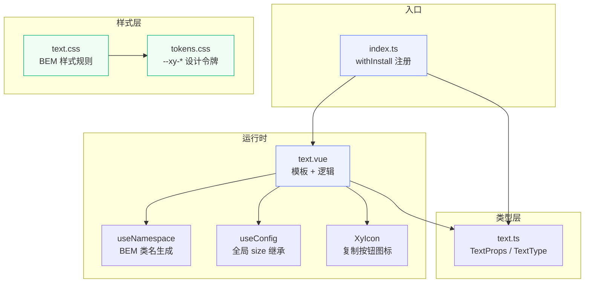

# 13 Text 文本

`xy-text` 为行内文本赋予语义色、尺寸节奏、截断省略、一键复制与展开收起能力——在保持原生标签语义的前提下，把散落在各处的文本样式收归组件级管控。

## 设计哲学

文本是 UI 中最常见也最容易被「随意写死」的元素。`xy-text` 要解决的核心问题不是「渲染一段文字」，而是**让文本的色、号、省略和交互行为可声明、可管控、可主题化**。

与同类组件的差异：

| 维度 | xy-text | 常见做法 |
|------|---------|----------|
| 语义色 | `type` prop 直接映射 6 种语义色 token | 手写 `color: var(...)` 或硬编码色值 |
| 截断 | `truncated` / `line-clamp` + 自动 `title` 回填 | 每次手写 `text-overflow: ellipsis`，手动补 tooltip |
| 展开收起 | `expandable` 一键开启，按需出现 | 自行维护状态和按钮 |
| 复制 | `copyable` 内置剪贴板写入 + 反馈 | 每次对接 `navigator.clipboard` |
| 语义标签 | `tag` 动态切换 `span/p/del/strong…` | 组件写死根标签，语义丢失 |
| 全局尺寸 | 自动继承 `ConfigProvider` 的 `size` | 无全局尺寸链路 |

核心设计原则：**只做文本层的增强，不越界做富文本、链接或标记**。需要可点击跳转用 `xy-link`，需要独立标签用 `xy-tag`，需要编辑用 `xy-editor`。

## 源码架构



### 目录结构

```
packages/components/text/
├── index.ts              # 导出入口，withInstall 注册
├── src/
│   ├── text.ts           # TextProps 类型定义 + TextType 常量
│   └── text.vue          # SFC：模板 + 组合式逻辑
└── __tests__/
    └── text.spec.ts      # 单元测试（7 个用例）
```

样式文件位于主题包：

```
packages/theme/src/components/text.css
packages/xiaoye-primitives/src/theme/tokens.css   # 设计令牌定义
```

## 核心 Props / Emits / Slots 类型定义

```ts
// packages/components/text/src/text.ts

export const textTypes = ["default", "primary", "success", "info", "warning", "danger"] as const;

export type TextType = (typeof textTypes)[number];

export interface TextProps {
  /** 文本语义色，映射 --xy-color-{type} */
  type?: TextType;
  /** 尺寸，可被 ConfigProvider 全局注入 */
  size?: ComponentSize; // "" | "xs" | "sm" | "md" | "lg" | "xl"
  /** 单行截断省略 */
  truncated?: boolean;
  /** 多行截断最大行数 */
  lineClamp?: number | string;
  /** 渲染根标签，默认 span */
  tag?: string;
  /** 显示复制按钮 */
  copyable?: boolean;
  /** 溢出时是否补充 tooltip（预留） */
  ellipsisTooltip?: boolean;
  /** 支持展开 / 收起 */
  expandable?: boolean;
  /** 加粗 */
  strong?: boolean;
  /** 下划线 */
  underline?: boolean;
  /** 删除线 */
  delete?: boolean;
}
```

组件**不发射自定义事件**（Emits 为空），所有交互通过内部状态闭环处理。

唯一插槽：

| 插槽 | 说明 |
|------|------|
| `default` | 文本内容，渲染在 `.xy-text__content` 内 |

## 核心实现

### 模板渲染逻辑

模板结构分三层：**根元素**、**内容层**、**操作层**。

```vue
<!-- 根元素：动态标签 + BEM 类名 + line-clamp 行内样式 -->
<component :is="props.tag" ref="rootRef" :class="textKls" :style="style">
  <!-- 内容层：min-width:0 保证 flex 子项可收缩 -->
  <span ref="textRef" class="xy-text__content">
    <slot />
  </span>
  <!-- 复制按钮 -->
  <button v-if="props.copyable" type="button" class="xy-text__action"
    :aria-label="copied ? '已复制' : '复制内容'" @click="handleCopy">
    <XyIcon :icon="copied ? 'mdi:check' : 'mdi:content-copy'" />
  </button>
  <!-- 展开/收起按钮 -->
  <button v-if="showExpandButton" type="button" class="xy-text__toggle"
    @click="toggleExpanded">
    {{ expanded ? '收起' : '展开' }}
  </button>
</component>
```

### 尺寸合并策略

```ts
const { size: globalSize } = useConfig();
const mergedSize = computed(() => props.size ?? globalSize.value);
```

优先使用组件级 `size` prop，未指定时回退到 `ConfigProvider` 注入的全局尺寸。默认值为 `md`，由 CSS 类 `.xy-text--md` 提供基准字号。

### 截断与 title 回填

这是 Text 组件最复杂的运行时逻辑，核心函数是 `bindTitle()`：

```ts
function bindTitle() {
  // 1. 用户显式传了 title → 不干预，直接返回
  if (typeof attrs.title === "string" && attrs.title.length > 0) {
    hasOverflow.value = false;
    return;
  }

  // 2. 单行截断：比较 offsetWidth vs scrollWidth
  if (props.truncated && !expanded.value) {
    shouldAddTitle = element.offsetWidth > 0 && element.scrollWidth > element.offsetWidth;
  }

  // 3. 多行截断：比较 offsetHeight vs scrollHeight
  else if (hasLineClamp.value && !expanded.value) {
    shouldAddTitle = element.offsetHeight > 0 && element.scrollHeight > element.offsetHeight;
  }

  // 4. 写入/移除 title 属性
  if (shouldAddTitle && text) {
    root.setAttribute("title", text);
  } else {
    root.removeAttribute("title");
  }
}
```

调用时机覆盖了组件完整生命周期：

```ts
onMounted(bindTitle);
onUpdated(bindTitle);
watch(
  () => [props.truncated, props.lineClamp, props.expandable, expanded.value],
  bindTitle
);
```

关键设计决策：
- 单行用 `scrollWidth > offsetWidth` 判断水平溢出，多行用 `scrollHeight > offsetHeight` 判断垂直溢出
- `offsetWidth > 0` 的前置检查排除组件隐藏（`display: none`）时的误判
- 用户显式传 `title` 时，组件**永不覆盖**——尊重调用方的控制权

### 复制功能

```ts
async function handleCopy() {
  const text = textRef.value?.textContent?.trim() ?? "";
  if (!text) return;

  // 优先 Clipboard API，降级 execCommand
  if (navigator.clipboard?.writeText) {
    await navigator.clipboard.writeText(text);
  } else {
    const textarea = document.createElement("textarea");
    // ... 降级方案
    document.execCommand("copy");
  }

  // 1200ms 反馈态
  copied.value = true;
  copiedTimer = window.setTimeout(() => { copied.value = false; }, 1200);
}
```

图标从 `mdi:content-copy` 切换到 `mdi:check`，提供即时视觉反馈。`copiedTimer` 在连续点击时先 `clearTimeout` 再重置，避免闪烁。

### 展开收起

```ts
const isEllipsisEnabled = computed(
  () => !expanded.value && (props.truncated || hasLineClamp.value)
);
const showExpandButton = computed(
  () => props.expandable && (hasOverflow.value || expanded.value)
);
```

`showExpandButton` 同时依赖 `hasOverflow`（真实溢出）和 `expanded`（已展开状态），确保：
- 内容未溢出时不出现按钮
- 展开后按钮仍然显示（提供「收起」入口）

## 样式系统

### BEM 命名

| 类名 | 语义 |
|------|------|
| `.xy-text` | Block：根容器 |
| `.xy-text__content` | Element：文本内容容器 |
| `.xy-text__action` | Element：复制按钮 |
| `.xy-text__toggle` | Element：展开/收起按钮 |
| `.xy-text--{type}` | Modifier：语义色（default/primary/success/info/warning/danger） |
| `.xy-text--{size}` | Modifier：尺寸（sm/md/lg） |
| `.xy-text.is-truncated` | State：单行截断激活 |
| `.xy-text.is-line-clamp` | State：多行截断激活 |
| `.xy-text.is-strong` | State：加粗 |
| `.xy-text.is-underline` | State：下划线 |
| `.xy-text.is-delete` | State：删除线 |
| `.xy-text.is-expanded` | State：已展开 |

### CSS 变量引用

Text 组件的样式完全基于 `--xy-*` 设计令牌，零硬编码色值：

```css
/* 字号 */
.xy-text          { font-size: var(--xy-font-size-md); }   /* 14px */
.xy-text--sm      { font-size: var(--xy-font-size-sm); }   /* 12px */
.xy-text--lg      { font-size: var(--xy-font-size-lg); }   /* 16px */

/* 语义色 */
.xy-text--default { color: var(--xy-text-primary); }          /* #1c1c1e */
.xy-text--primary { color: var(--xy-brand); }       /* #5b76fe */
.xy-text--success { color: var(--xy-success); }       /* #00b473 */
.xy-text--info    { color: var(--xy-info); }          /* #566277 */
.xy-text--warning { color: var(--xy-warning); }       /* #d98a1f */
.xy-text--danger  { color: var(--xy-danger); }        /* #e5484d */

/* 操作按钮 */
.xy-text__action,
.xy-text__toggle  { color: var(--xy-text-muted);
                     border-radius: var(--xy-radius-md);
                     transition: color var(--xy-transition-duration-fast) var(--xy-transition-timing), ...; }
```

暗黑模式无需任何组件级覆盖——`tokens.css` 中 `[data-theme="dark"]` 重新定义了所有 `--xy-color-*` 和 `--xy-text-primary-*` 变量，Text 组件自动跟随。

### 截断样式实现

单行截断通过 `.xy-text__content` 实现，而非根元素——这是因为根元素是 `inline-flex`，需要在子元素上做 `text-overflow`：

```css
.xy-text.is-truncated .xy-text__content {
  display: inline-block;
  max-width: 100%;
  overflow: hidden;
  text-overflow: ellipsis;
  white-space: nowrap;
  vertical-align: bottom;
}
```

多行截断使用 `-webkit-line-clamp` 方案：

```css
.xy-text.is-line-clamp .xy-text__content {
  display: -webkit-inline-box;
  -webkit-box-orient: vertical;
  overflow: hidden;
}
```

`-webkit-line-clamp` 的具体行数通过行内样式 `style="WebkitLineClamp: N"` 动态注入（见 `style` computed）。

### 语义装饰样式

下划线使用了 `color-mix` 实现半透明下划线色，避免纯黑下划线刺眼：

```css
.xy-text.is-underline {
  text-decoration: underline;
  text-underline-offset: 3px;
  text-decoration-color: color-mix(in srgb, currentColor 18%, transparent);
}
```

## 与其他组件的联动

### Descriptions 描述列表

Text 作为 `display-component-map` 中的渲染器，被 `xy-descriptions` 内部消费：

```ts
// packages/components/shared/display-component-map.ts
import { XyText } from "../text";

export const displayComponentMap = {
  avatar: XyAvatar,
  image: XyImage,
  link: XyLink,
  progress: XyProgress,
  tag: XyTag,
  text: XyText    // ← 描述列表中 text 类型的值由 XyText 渲染
} as const;
```

当 Descriptions 的某个字段配置 `type: "text"` 且 `copyable: true` 时，会渲染出带复制按钮的 Text 组件（测试中可见 `.xy-text__action` 的断言）。

### ConfigProvider 全局尺寸

Text 通过 `useConfig()` 读取 `ConfigProvider` 注入的 `size`，与 Button、Alert、Divider、Avatar 等组件共享同一套尺寸链路。修改全局尺寸时，所有未显式传 `size` 的 Text 实例同步响应。

### Icon 图标

复制按钮内部使用 `XyIcon` 渲染 `mdi:content-copy` / `mdi:check` 图标，样式上通过 `.xy-text > .xy-icon { vertical-align: -2px }` 微调对齐。

## 扩展与定制

### 新增语义色

1. 在 `text.ts` 的 `textTypes` 数组中追加类型值
2. 在 `text.css` 中新增 `.xy-text--{type}` 规则，引用对应的 `--xy-color-{type}` 令牌
3. 在 `tokens.css` 的 `:root` 和 `[data-theme="dark"]` 中定义新令牌

### 自定义截断行为

`bindTitle()` 函数在 `onMounted` / `onUpdated` 和 prop watch 中执行，如需在窗口 resize 后重新检测溢出，可外部监听 `resize` 事件后触发组件更新（如修改 key 或切换 prop），或通过 `expose` 暴露 `bindTitle` 方法。

### ellipsisTooltip

`ellipsisTooltip` prop 已在类型定义中预留，当前逻辑中仅控制 `title` 属性的移除策略。后续可结合 `xy-tooltip` 组件，在 `shouldAddTitle` 为 true 时渲染 Tooltip 弹层替代原生 `title`，提供更丰富的溢出内容展示。

### 通过 CSS 变量覆盖

无需修改组件源码，在应用层覆盖令牌即可定制视觉表现：

```css
:root {
  --xy-font-size-md: 15px;       /* 调整默认字号 */
  --xy-brand: #6366f1;   /* 替换主色 */
  --xy-radius-md: 4px;           /* 增大操作按钮圆角 */
}
```

### tag 属性的语义化实践

```vue
<!-- 删除线语义 -->
<xy-text tag="del" delete>已下架商品</xy-text>

<!-- 段落语义 -->
<xy-text tag="p" line-clamp="3">这是一段较长的摘要内容...</xy-text>

<!-- 强调语义 -->
<xy-text tag="strong" type="danger">重要提示</xy-text>
```

`tag` 只改变根元素的 HTML 标签名，不影响组件的样式类、截断逻辑和交互行为，确保视觉表现与语义标签解耦。
