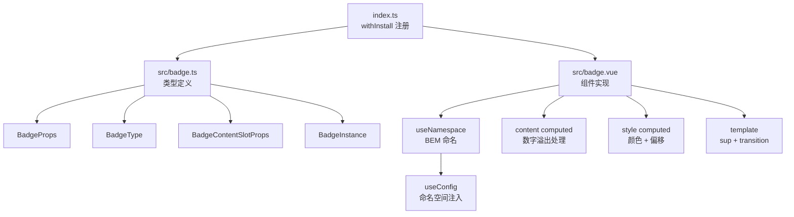

# 14 Badge 徽标

`xy-badge` 在图标、按钮或文本右上角叠加数值、小圆点或自定义内容，用于未读计数、状态标记和轻量提醒。支持数字溢出截断、零值隐藏、偏移微调和内容插槽。

## 设计哲学

Badge 解决的核心问题是：**在不打断用户当前视觉流的前提下，以最小面积传递"有新信息"这一信号。** 它本质上是一个定位在宿主元素右上角的 `<sup>` 覆盖层，通过 `position: absolute` 实现附着，通过 `v-if` 控制显隐。

与 Element Plus `el-badge` 的关键差异：

| 维度 | xiaoye-components | Element Plus |
|------|-------------------|--------------|
| 视觉风格 | 柔和填充 + 描边（`soft` 背景 + `color-mix` 边框） | 纯色实心填充 |
| 零值处理 | `showZero` + `is-hide-zero` CSS 类，零值时 DOM 保留但视觉隐藏 | 零值时直接不渲染内容文字 |
| 内容插槽 | 作用域插槽 `content`，暴露计算后的 `value` | 仅支持默认插槽替换 |
| 命名空间 | `useNamespace` 动态前缀，可全局配置 | 硬编码 `el-` 前缀 |
| 样式变量 | 三层变量（`--xy-badge-bg` / `--xy-badge-color` / `--xy-badge-border`）按类型切换 | 单一 `--el-badge-bg` |

## 源码架构



### 目录结构

```
packages/components/badge/
├── index.ts              # 导出入口，withInstall 注册
├── src/
│   ├── badge.ts          # Props / Emits / Slots 类型定义
│   └── badge.vue         # 组件主体：模板 + 逻辑
└── __tests__/
    └── badge.spec.ts     # 单元测试
```

样式独立维护在主题包：

```
packages/theme/src/components/badge.css
```

## 核心 Props / Slots 类型定义

类型定义位于 `packages/components/badge/src/badge.ts`：

```ts
export const badgeTypes = ["primary", "success", "warning", "info", "danger"] as const;

export type BadgeType = (typeof badgeTypes)[number];

export interface BadgeContentSlotProps {
  value: string;
}

export interface BadgeProps {
  value?: string | number;
  max?: number;
  isDot?: boolean;
  hidden?: boolean;
  type?: BadgeType;
  showZero?: boolean;
  color?: string;
  badgeStyle?: StyleValue;
  offset?: [number, number];
  badgeClass?: string;
}

export type BadgeInstance = InstanceType<typeof Badge>;
```

### 默认值一览

```ts
withDefaults(defineProps<BadgeProps>(), {
  value: "",
  max: 99,
  isDot: false,
  hidden: false,
  type: "danger",
  showZero: true,
  color: "",
  badgeStyle: undefined,
  offset: () => [0, 0],
  badgeClass: ""
});
```

### Slots 定义

```ts
defineSlots<{
  default?: () => unknown;
  content?: (props: BadgeContentSlotProps) => unknown;
}>();
```

`content` 插槽是作用域插槽，参数 `value` 为经过溢出处理后的字符串值（如 `"99+"`），允许调用方基于计算结果自定义渲染。

## 核心实现

### 模板渲染逻辑

模板结构位于 `packages/components/badge/src/badge.vue`，核心渲染逻辑如下：

```vue
<div :class="ns.base.value">
  <slot />
  <transition name="xy-zoom-in-center">
    <sup
      v-if="!props.hidden && (content || props.isDot || slots.content)"
      :class="[
        `${ns.base.value}__content`,
        `${ns.base.value}__content--${props.type}`,
        ns.is('fixed', hasDefaultSlot),
        ns.is('dot', props.isDot),
        ns.is('hide-zero', !props.showZero && props.value === 0),
        props.badgeClass
      ]"
      :style="style"
    >
      <slot name="content" :value="content">
        {{ content }}
      </slot>
    </sup>
  </transition>
</div>
```

渲染决策的关键点：

1. **显隐条件**：`v-if="!hidden && (content || isDot || slots.content)"` -- 三者满足其一即渲染 `<sup>`，`hidden` 优先级最高。
2. **固定定位**：当 `default` 插槽存在时，添加 `is-fixed` 类，通过 `position: absolute` 将徽章附着在宿主右上角。
3. **零值隐藏**：不销毁 DOM，而是添加 `is-hide-zero` 类，CSS 层 `display: none`。这样做的优势是值从 0 变为非 0 时，`transition` 动画能正常触发。
4. **过渡动画**：使用 `xy-zoom-in-center` 过渡，进入时从 `scale(0.8) + opacity: 0` 过渡到正常状态。

### 数字溢出处理

`content` 计算属性是 Badge 的核心逻辑：

```ts
const content = computed<string>(() => {
  if (props.isDot) {
    return "";           // 点状模式不渲染文字
  }

  if (typeof props.value === "number" && typeof props.max === "number") {
    return props.max < props.value
      ? `${props.max}+`  // 溢出：显示 "99+"
      : `${props.value}`; // 正常：显示数值
  }

  return `${props.value}`; // 字符串值原样输出
});
```

决策流程：

- `isDot` 为 `true` 时，直接返回空字符串，点状模式不渲染文字内容。
- 当 `value` 和 `max` 均为 `number` 类型时，比较大小：若 `value > max`，输出 `"{max}+"` 格式（默认 `"99+"`）。
- `value` 为字符串时，不做溢出处理，原样输出 -- 这使得 `"new"` / `"hot"` 等文字徽章成为可能。
- 该计算结果同时暴露给 `content` 作用域插槽的 `value` 参数。

### 样式计算

```ts
const style = computed<StyleValue>(() => [
  {
    backgroundColor: props.color || undefined,
    marginRight: `${-props.offset[0]}px`,
    marginTop: `${props.offset[1]}px`
  },
  props.badgeStyle ?? {}
]);
```

- `color` prop 直接覆盖 `backgroundColor`，优先级高于类型变量。
- `offset[0]` 通过负 `marginRight` 实现水平位移（向右推），`offset[1]` 通过正 `marginTop` 实现垂直位移（向下推）。
- `badgeStyle` 最后合并，可覆盖前面的计算值。

### 组件暴露

```ts
defineExpose({ content });
```

仅暴露 `content` 计算属性，允许父组件通过 `ref` 读取当前徽章的计算值。

## 样式系统

### BEM 命名

通过 `useNamespace("badge")` 生成，命名空间默认为 `xy`，可通过 `XyConfigProvider` 全局替换：

| 类名 | 含义 |
|------|------|
| `.xy-badge` | 根容器，`position: relative; display: inline-block` |
| `.xy-badge__content` | 徽章内容区 `<sup>` 元素 |
| `.xy-badge__content--{type}` | 类型修饰，如 `--primary` / `--danger` |
| `.is-fixed` | 存在宿主元素时的固定定位 |
| `.is-dot` | 点状模式 |
| `.is-hide-zero` | 零值隐藏 |

`useNamespace` 实现（`packages/xiaoye-primitives/src/composables/use-namespace.ts`）：

```ts
export function useNamespace(block: string) {
  const { namespace } = useConfig();
  const base = computed(() => `${namespace.value}-${block}`);
  const is = (state: string, active?: boolean) => (active ? `is-${state}` : "");
  const cssVarBlock = (name: string) => `--${namespace.value}-${block}-${name}`;
  return { namespace, base, is, cssVarBlock };
}
```

### CSS 变量体系

样式文件 `packages/theme/src/components/badge.css` 采用三层局部变量设计，每种类型覆盖三个变量：

```css
.xy-badge__content {
  /* 默认 danger 类型的变量值 */
  --xy-badge-bg: var(--xy-danger-soft);
  --xy-badge-color: var(--xy-danger);
  --xy-badge-border: color-mix(in srgb, var(--xy-danger) 10%, var(--xy-border-subtle));

  background: var(--xy-badge-bg);
  color: var(--xy-badge-color);
  border: 1px solid var(--xy-badge-border);
}
```

类型切换时只需覆盖这三个变量，无需重复写 `background` / `color` / `border`：

```css
.xy-badge__content--primary {
  --xy-badge-bg: var(--xy-brand-soft);
  --xy-badge-color: var(--xy-brand);
  --xy-badge-border: color-mix(in srgb, var(--xy-brand) 10%, var(--xy-border-subtle));
}
```

`color-mix()` 函数用于将语义色以低比例混入边框底色，产生柔和的描边效果。这是 xiaoye-components 区别于 Element Plus 纯色实心填充的核心视觉差异。

### 点状模式样式

```css
.xy-badge__content.is-dot {
  width: 8px;
  min-width: 8px;
  height: 8px;
  padding: 0;
  border-radius: 50%;
  background: var(--xy-badge-color);   /* 点状模式直接使用语义色填充 */
  border-color: color-mix(in srgb, var(--xy-bg-raised) 96%, transparent);
  box-shadow: none;
}
```

点状模式不再使用 `--xy-badge-bg` 柔和背景，而是直接用 `--xy-badge-color` 实色填充，确保小面积下的视觉识别度。

### 过渡动画

```css
.xy-zoom-in-center-enter-active,
.xy-zoom-in-center-leave-active {
  transition:
    opacity var(--xy-transition-duration-fast) var(--xy-transition-timing),
    transform var(--xy-transition-duration-fast) var(--xy-transition-timing);
}

.xy-zoom-in-center-enter-from,
.xy-zoom-in-center-leave-to {
  opacity: 0;
  transform: scale(0.8);
}
```

动画时长和缓动函数均引用全局 transition 变量，保持与组件库其他过渡效果的一致性。

## 与其他组件的联动

### 典型组合

Badge 作为轻量标记组件，常见的组合方式：

```vue
<!-- 与 Button 组合：消息按钮 -->
<xy-badge :value="5">
  <xy-button>消息</xy-button>
</xy-badge>

<!-- 与 Avatar 组合：在线状态 -->
<xy-badge is-dot type="success">
  <xy-avatar src="user.png" />
</xy-badge>

<!-- 独立使用：状态标签 -->
<xy-badge type="warning" value="Beta" />
```

### Menu 组件中的徽标

Menu 组件内部实现了自己的徽标渲染逻辑（`packages/components/menu/src/menu.vue`），直接用 `<span>` + `__item-badge` 类名渲染，未复用 Badge 组件。这是刻意的设计：Menu 的徽标需要跟随菜单项的布局和主题变化，独立实现更灵活。

### HeaderTabs 增强组件

`packages/pro-components/header-tabs/src/header-tabs.ts` 的 tab 项数据结构包含 `badge` 字段，用于在页签上显示计数标记。

## 扩展与定制

### 自定义颜色

`color` prop 直接覆盖 `backgroundColor`，绕过类型变量体系：

```vue
<xy-badge value="NEW" color="#722ed1">自定义紫色</xy-badge>
```

当需要更精细的控制（如同时修改文字颜色、边框），使用 `badgeStyle`：

```vue
<xy-badge
  value="HOT"
  :badge-style="{ backgroundColor: '#eb2f96', color: '#fff', borderColor: '#eb2f96' }"
/>
```

### 偏移微调

`offset` 接受 `[x, y]` 元组，通过 margin 实现位移：

```vue
<xy-badge :value="12" :offset="[4, 6]">
  <xy-button>微调位置</xy-button>
</xy-badge>
```

内部实现为 `marginRight: -4px; marginTop: 6px`，负值 marginRight 使徽章右移，正值 marginTop 使其下移。

### 内容插槽

`content` 作用域插槽接收计算后的 `value`，可实现自定义渲染：

```vue
<xy-badge :value="99" :max="99">
  <template #content="{ value }">
    <span class="custom-badge">{{ value }} 条未读</span>
  </template>
</xy-badge>
```

插槽优先级高于默认的 `{{ content }}` 渲染，但 `<sup>` 容器及其类型样式仍保留。

### CSS 变量覆盖

通过覆盖局部变量实现主题级定制：

```css
/* 全局降低 danger 徽章的视觉强度 */
.xy-badge__content--danger {
  --xy-badge-bg: var(--xy-danger-soft);
  --xy-badge-color: color-mix(in srgb, var(--xy-danger) 70%, var(--xy-color-text));
}

/* 自定义第五种类型 */
.xy-badge__content--purple {
  --xy-badge-bg: color-mix(in srgb, #722ed1 10%, var(--xy-bg-raised));
  --xy-badge-color: #722ed1;
  --xy-badge-border: color-mix(in srgb, #722ed1 10%, var(--xy-border-subtle));
}
```

### 命名空间替换

通过 `XyConfigProvider` 修改全局命名空间后，所有类名和 CSS 变量前缀同步变化：

```vue
<xy-config-provider namespace="my">
  <xy-badge :value="3" />  <!-- 类名: my-badge / my-badge__content -->
</xy-config-provider>
```

对应的 CSS 变量前缀也变为 `--my-badge-bg` / `--my-badge-color` / `--my-badge-border`。

## API

### Badge Attributes

| 属性          | 说明                       | 类型                                                  | 默认值     |
| ------------- | -------------------------- | ----------------------------------------------------- | ---------- |
| `value`       | 显示值                     | `string \| number`                                    | `''`       |
| `max`         | 最大值，超出时显示 `{max}+` | `number`                                            | `99`       |
| `is-dot`      | 是否显示为小圆点           | `boolean`                                             | `false`    |
| `hidden`      | 是否隐藏徽章               | `boolean`                                             | `false`    |
| `type`        | 徽章类型                   | `BadgeType` | `'danger'` |
| `show-zero`   | 值为 0 时是否显示          | `boolean`                                             | `true`     |
| `color`       | 自定义背景色               | `string`                                              | `''`       |
| `badge-style` | 自定义徽章样式             | `StyleValue`                                          | —          |
| `offset`      | 徽章偏移量 `[x, y]`        | `[number, number]`                                    | `[0, 0]`   |
| `badge-class` | 自定义徽章类名             | `string`                                              | `''`       |

### Badge Slots

| 插槽      | 说明                             | 参数                          |
| --------- | -------------------------------- | ----------------------------- |
| `default` | 宿主内容                         | —                             |
| `content` | 自定义徽章内容                   | `{ value: string }`           |

### Badge Exposes

| 暴露项    | 说明         | 类型                    |
| --------- | ------------ | ----------------------- |
| `content` | 计算后的徽章值 | `ComputedRef<string>` |
