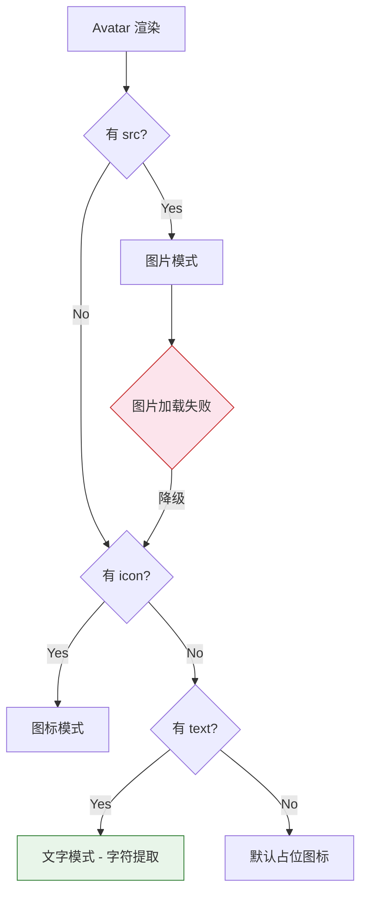
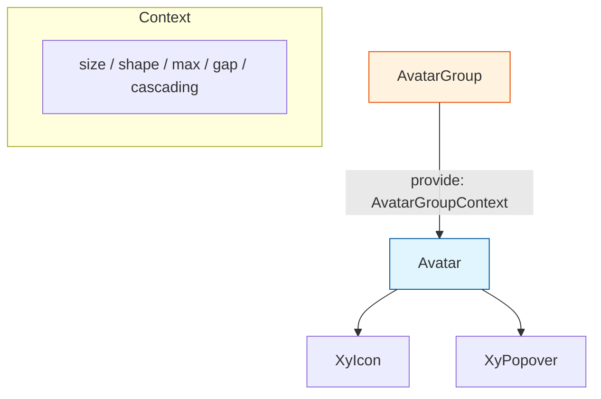
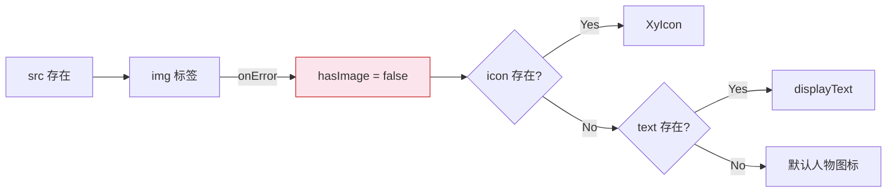
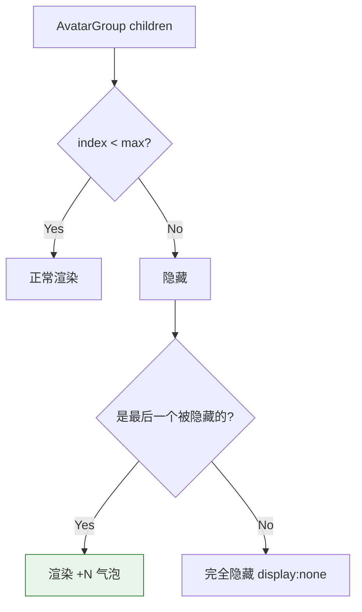

# 15 Avatar 头像

> 导读：Avatar 用图标、图片或文字三种形态统一表达用户/实体的视觉标识，AvatarGroup 则在空间受限时以堆叠 + 计数的方式优雅收束多人头像。

## 设计哲学

- **解决的问题**：头像在后台系统中几乎出现在每个页面——用户信息、审批流、评论列表、操作日志。但原生实现缺乏统一的降级策略：图片加载失败怎么办？文字头像如何从姓名提取？多人头像如何排列？Avatar 组件把这些问题收敛为一个声明式方案。
- **设计决策**：采用三路渲染策略——`src` 存在时渲染图片、`icon` 存在时渲染图标、否则从 `text` 提取首字符。渲染优先级 `src > icon > text`，当图片加载失败时自动降级到图标或文字，无需外部错误处理。`text` 的字符提取规则支持中英文：优先取姓氏/名首字母，中文取最后一个字（"张三" → "三"），英文取首字母大写（"John" → "J"）。
- **差异化**：AvatarGroup 提供 `max` + `maxPopover` 的组合方案——超出部分以 "+N" 气泡展示，气泡内可通过 slot 完全自定义内容。`cascading` 属性控制堆叠方向（`ascend` 左高右低 / `descend` 右高左低），满足不同视觉层级需求。



## 源码架构

### 文件结构

```
packages/components/avatar/
├── index.ts              # 导出入口
├── src/
│   ├── avatar.vue        # 主组件
│   ├── avatar.ts         # 类型定义 & 常量
│   ├── avatar-group.vue  # 头像组
│   ├── avatar-group.ts   # 头像组类型
│   └── context.ts        # InjectKey & AvatarGroupContext
└── __tests__/
```

### 组件关系图



### 核心 type 定义

```ts
type AvatarFit = "fill" | "contain" | "cover" | "none" | "scale-down"
type AvatarShape = "circle" | "square"

interface AvatarProps {
  size?: number | string
  src?: string
  srcSet?: string
  alt?: string
  icon?: string
  text?: string
  shape?: AvatarShape
  fit?: AvatarFit
  bgColor?: string
  color?: string
}

interface AvatarGroupProps {
  max?: number
  maxPopover?: boolean
  size?: number | string
  shape?: AvatarShape
  gap?: number | string
  cascading?: "ascend" | "descend"
}
```

## 核心实现

### 1. 三路渲染与降级

Avatar 的模板核心是一个三向条件渲染，配合 `onError` 回调实现图片到图标/文字的自动降级：

```ts
const hasImage = ref(true)

function handleImageError() {
  hasImage.value = false
  emit("error")
}

const displayText = computed(() => {
  if (!props.text) return ""
  const trimmed = props.text.trim()
  if (!trimmed) return ""
  const hasChinese = /[一-鿿]/.test(trimmed)
  if (hasChinese) return trimmed.charAt(trimmed.length - 1)
  return trimmed.charAt(0).toUpperCase()
})
```



**WHY**：将 `hasImage` 设为 `ref` 而非 computed，是因为图片加载是异步事件——初始渲染时 src 存在就应该显示图片，只有 `onError` 触发后才应降级。如果用 computed 依赖 src，则无法区分"还没加载完"和"加载失败"。

### 2. 字符提取算法

```ts
const displayText = computed(() => {
  if (!props.text) return ""
  const trimmed = props.text.trim()
  if (!trimmed) return ""
  const hasChinese = /[一-鿿]/.test(trimmed)
  if (hasChinese) return trimmed.charAt(trimmed.length - 1)
  return trimmed.charAt(0).toUpperCase()
})
```

**WHY**：中文姓名的习惯是姓前名后（"张三"），取最后一个字（"三"）作为头像标识比取第一个字更自然——因为同姓的人远多于同名的人。英文则取首字母大写是通用惯例。这个设计符合国内企业后台系统的主流使用习惯。

### 3. AvatarGroup 的堆叠与计数

AvatarGroup 通过 `provide/inject` 将 `size`、`shape`、`max` 等配置下发到每个 Avatar，同时利用 CSS 的负 margin 实现堆叠效果：

```ts
// avatar-group.vue
provide(AVATAR_GROUP_KEY, {
  size: computed(() => props.size),
  shape: computed(() => props.shape),
  gap: computed(() => props.gap),
  max: computed(() => props.max),
  maxPopover: computed(() => props.maxPopover),
  cascading: computed(() => props.cascading),
})

// avatar.vue - 注入并合并
const group = inject(AVATAR_GROUP_KEY, undefined)
const mergedSize = computed(() => props.size ?? group?.size.value)
const mergedShape = computed(() => props.shape ?? group?.shape.value)
```



**WHY**：超出 max 的头像不是直接丢弃，而是 `display:none` 隐藏——这样当 `max` 动态变化时（如响应式布局），被隐藏的头像可以即时恢复显示，无需重新创建 DOM。

### 4. 级联堆叠的 z-index 策略

```ts
const cascadingZIndex = computed(() => {
  if (!group?.cascading.value) return undefined
  if (group.cascading.value === "ascend") {
    return siblings.length - index
  }
  return index + 1
})
```

**WHY**：`ascend`（左高右低）是最常见的堆叠方向——时间线上越新的人越靠前，视觉上越靠前的头像应该覆盖后面的。`descend` 则用于审批流等场景——第一个审批人的头像最突出。

## API 参考

### Avatar Props

| 属性 | 类型 | 默认值 | 说明 |
|------|------|--------|------|
| size | `number \| string` | — | 尺寸（px 或 CSS 值），AvatarGroup 内自动合并 |
| src | `string` | — | 图片地址 |
| srcSet | `string` | — | 响应式图片 srcset |
| alt | `string` | — | 图片 alt 文本 |
| icon | `string` | — | 图标名，优先级低于 src |
| text | `string` | — | 文字，自动提取首字符 |
| shape | `"circle" \| "square"` | `"circle"` | 形状 |
| fit | `AvatarFit` | `"cover"` | 图片填充模式 |
| bgColor | `string` | — | 自定义背景色 |
| color | `string` | — | 自定义文字/图标色 |

### Avatar Emits

| 事件 | 参数 | 说明 |
|------|------|------|
| error | `()` | 图片加载失败时触发 |

### Avatar Slots

| 名称 | 说明 |
|------|------|
| default | 自定义内容（优先级高于 src/icon/text） |

### Avatar Exposes

| 属性 | 类型 | 说明 |
|------|------|------|
| ref | `HTMLElement` | 组件根元素 |

### AvatarGroup Props

| 属性 | 类型 | 默认值 | 说明 |
|------|------|--------|------|
| max | `number` | — | 最大显示数量 |
| maxPopover | `boolean` | `true` | 超出部分是否以气泡展示 |
| size | `number \| string` | — | 统一尺寸，子 Avatar 可覆盖 |
| shape | `"circle" \| "square"` | `"circle"` | 统一形状 |
| gap | `number \| string` | — | 堆叠间距 |
| cascading | `"ascend" \| "descend"` | — | 堆叠层级方向 |

### AvatarGroup Slots

| 名称 | 说明 |
|------|------|
| default | Avatar 子组件 |
| overflow | 自定义溢出气泡内容 |

## 样式系统

### BEM 类名

| 类名 | 说明 |
|------|------|
| `.xy-avatar` | 根元素 |
| `.xy-avatar--circle` | 圆形 |
| `.xy-avatar--square` | 方形 |
| `.xy-avatar__image` | 图片元素 |
| `.xy-avatar__text` | 文字元素 |
| `.xy-avatar__icon` | 图标元素 |
| `.xy-avatar-group` | 头像组根 |
| `.xy-avatar-group__overflow` | 溢出计数气泡 |
| `.xy-avatar-group__popover` | 溢出气泡弹出层 |

### CSS 变量引用

| 变量 | 用途 |
|------|------|
| `--xy-brand` | 默认背景色（无 bgColor 时） |
| `--xy-color-white` | 默认文字/图标色 |
| `--xy-text-primary` | 无 bgColor 时的文字色回退 |
| `--xy-bg-container` | 默认背景色回退 |
| `--xy-font-size-sm` | 文字字号 |
| `--xy-radius-pill` | 圆形圆角 |
| `--xy-radius-md` | 方形圆角 |
| `--xy-shadow-1` | 头像阴影 |
| `--xy-transition-duration-fast` | 过渡时长 |
| `--xy-z-index-popover` | 溢出气泡层级 |

### 主题定制方式

Avatar 的颜色系统分两层：
- **有 bgColor/color**：直接使用传入值，不经过主题变量，适合品牌色头像。
- **无 bgColor**：使用 `--xy-brand` 作为背景色、`--xy-color-white` 作为前景色，跟随主题色变化。

AvatarGroup 的堆叠间距通过 `gap` prop 控制，如果需要全局修改默认间距，可通过 ConfigProvider 注入 `gap` 的默认值。

## 小结

1. **三路渲染 + 自动降级**：`src > icon > text` 的优先级链，配合 `onError` 回调实现图片失败时的无缝降级，用户无需编写任何错误处理逻辑。
2. **智能字符提取**：中文取末字、英文取首字母大写，贴合中文姓名习惯，一个 `text` prop 即可产生合理的文字头像。
3. **AvatarGroup 的堆叠 + 计数方案**：通过 `provide/inject` 实现配置下发，`max` + `maxPopover` 的组合在空间受限时优雅收束，`cascading` 的 z-index 策略满足不同视觉层级需求。