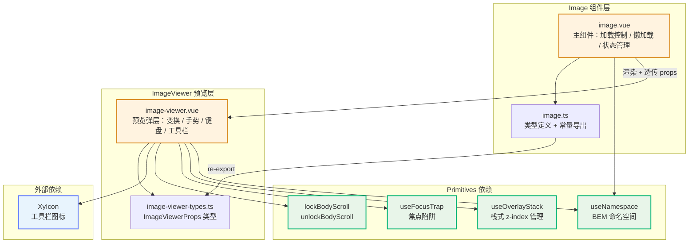
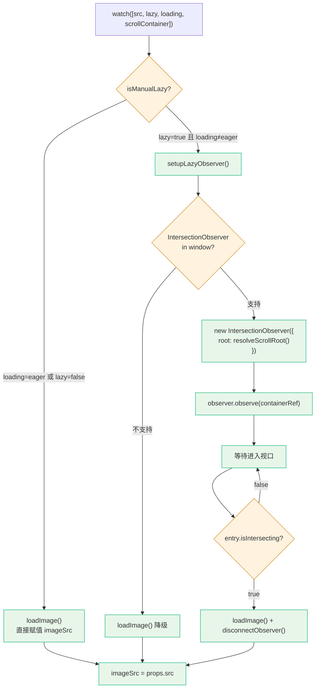

# 16 Image 图片

> 导读：本文从源码层面拆解 `xy-image` 的实现架构——双组件协作（Image + ImageViewer）、IntersectionObserver 懒加载策略、预览层的变换矩阵与交互手势系统、overlay 栈式 z-index 管理以及完整的无障碍语义。理解这些机制，是定制图片加载链路、扩展预览交互或排查预览层遮挡问题的前提。

## 设计哲学

### 解决什么问题

图片是中后台页面中出现频率最高的媒体元素，但原生 `` 在工程化场景下有三个核心缺失：

1. **加载态不可控**——原生图片在请求期间只显示空白，无法提供占位反馈；加载失败时浏览器行为不一致，无法统一兜底。
2. **懒加载缺少容器感知**——原生 `loading="lazy"` 只能基于 viewport 触发，无法指定滚动容器，在虚拟滚动、抽屉内嵌列表等场景下会提前加载或永不加载。
3. **预览交互缺失**——详情页大图查看、多图轮播、缩放旋转拖拽等操作需要自行拼装，且要处理 z-index 层叠、body 滚动锁定、焦点陷阱等底层问题。

`xy-image` 通过 **Image + ImageViewer 双组件协作** 一次性解决上述问题，同时保持对外 API 的简洁性——大多数场景只需 `<xy-image src="..." preview-src-list="[...]" />` 即可。

### 与 Element Plus ElImage 的差异

| 维度 | Element Plus ElImage | xy-image |
|------|---------------------|----------|
| 懒加载策略 | 仅支持 `loading="lazy"` 原生属性 | 同时支持原生 `loading` 和 `IntersectionObserver` 手动懒加载，可指定滚动容器 |
| 预览层 z-index | 固定值或手动传入 | 接入 `useOverlayStack` 全局栈式管理，自动递增，多预览层不遮挡 |
| 预览层滚动锁定 | 手动 `overflow: hidden` | 使用 `lockBodyScroll / unlockBodyScroll` 工具函数，兼容 iOS 弹性滚动 |
| 焦点管理 | 无 | `useFocusTrap` 自动捕获焦点，关闭后恢复触发元素焦点 |
| 触摸手势 | 无双指缩放 | 支持双指缩放（pinch gesture）和单指拖拽平移 |
| 偏移边界 | 无限制 | `clampOffsets` 将拖拽平移限制在可视区域内，图片不会拖出画布 |
| 预览失败重试 | 无 | 默认提供"重新加载"按钮，`viewer-error` 插槽可通过 `retry()` 手动触发 |
| 无障碍 | 基础 `role="dialog"` | 完整 AOM：`aria-modal`、`aria-label` 动态文案、`aria-busy`、`aria-live` 进度播报、屏幕阅读器操作指引 |
| CSS 变量 | SCSS 变量 | 原生 CSS 自定义属性 + `color-mix()` 实现半透明混合，无需预处理器 |
| 属性透传 | `$attrs` 全量透传 | 拆分 `containerAttrs`（style/id/role/data-/aria-）与 `imgAttrs`（其余属性），避免 class 和语义属性泄漏到错误层级 |

## 源码架构

### 组件关系



### 目录结构

```
packages/components/image/
├── index.ts                    # withInstall 注册，导出 XyImage / XyImageViewer
├── src/
│   ├── image.vue               # 主组件：懒加载、状态机、属性拆分
│   ├── image.ts                # ImageProps / ImageFit / ImageLoading / Slot 类型
│   ├── image-viewer.vue        # 预览层：变换矩阵、手势、键盘、工具栏
│   └── image-viewer-types.ts   # ImageViewerProps 独立类型
└── __tests__/
    └── image.spec.ts           # 单元测试（含 IntersectionObserver mock）
```

关键文件职责：

- **`image.vue`**——图片加载的有限状态机（idle -> loading -> loaded / error），IntersectionObserver 生命周期管理，`$attrs` 拆分为容器属性和图片属性。
- **`image.ts`**——纯类型文件，定义 `ImageProps`、`ImageFit`、`ImageLoading`、三个 Slot Props 类型，以及 `ImageInstance` / `ImageViewerInstance` 类型导出。
- **`image-viewer.vue`**——预览层的全部交互逻辑：变换矩阵（scale / deg / offsetX / offsetY）、鼠标拖拽、触摸手势（单指拖拽 + 双指缩放）、键盘导航、滚轮缩放、双击切换、工具栏动作分发。
- **`image-viewer-types.ts`**——`ImageViewerProps` 独立定义，供 `image-viewer.vue` 直接引用，避免循环依赖。

## 核心 Props / Emits / Slots 类型定义

### ImageProps

```ts
// packages/components/image/src/image.ts

export interface ImageProps {
  src?: string;                                    // 图片地址
  alt?: string;                                    // 原生 alt
  fit?: ImageFit;                                  // 'fill' | 'contain' | 'cover' | 'none' | 'scale-down'
  loading?: ImageLoading;                          // 'eager' | 'lazy'（原生属性）
  lazy?: boolean;                                  // 是否启用 IntersectionObserver 懒加载
  scrollContainer?: string | HTMLElement;          // 懒加载监听容器
  previewSrcList?: string[];                       // 预览图片列表
  previewTeleported?: boolean;                     // 预览层是否 Teleport 到 body
  zIndex?: number;                                 // 预览层 z-index（不传则走 overlay 栈）
  initialIndex?: number;                           // 预览初始索引
  infinite?: boolean;                              // 翻页是否循环
  hideOnClickModal?: boolean;                      // 点击遮罩关闭
  closeOnPressEscape?: boolean;                    // Escape 关闭
  zoomRate?: number;                               // 缩放倍率
  scale?: number;                                  // 初始缩放
  minScale?: number;                               // 最小缩放
  maxScale?: number;                               // 最大缩放
  showProgress?: boolean;                          // 显示预览进度
  crossorigin?: 'anonymous' | 'use-credentials' | '';
}
```

### Emits

```ts
// image.vue
defineEmits<{
  load: [event: Event];        // 图片加载成功
  error: [event: Event];       // 图片加载失败
  close: [];                   // 预览层关闭
  show: [];                    // 预览层打开
  switch: [index: number];     // 预览图片切换
}>();
```

### Slots

```ts
defineSlots<{
  placeholder?: () => unknown;                                    // 加载占位
  error?: () => unknown;                                          // 加载失败
  'viewer-error'?: (props: ImageViewerErrorSlotProps) => unknown; // 预览失败
  progress?: (props: ImageViewerProgressSlotProps) => unknown;    // 预览进度
  toolbar?: (props: ImageViewerToolbarSlotProps) => unknown;      // 预览工具栏
}>();
```

其中 Slot Props 类型定义：

```ts
interface ImageViewerErrorSlotProps {
  activeIndex: number;
  src: string;
  retry: () => void;              // 手动重试加载
}

interface ImageViewerProgressSlotProps {
  activeIndex: number;
  total: number;
}

interface ImageViewerToolbarSlotProps {
  actions: (action: ImageViewerAction) => void;  // 分发工具栏动作
  prev: () => void;                              // 上一张
  next: () => void;                              // 下一张
  reset: () => void;                             // 重置变换
  activeIndex: number;
  setActiveItem: (index: number) => void;        // 跳转指定索引
}
```

## 核心实现

### 懒加载：IntersectionObserver 策略

`xy-image` 提供两种懒加载机制，通过 `loading` 和 `lazy` 两个 prop 协同控制：



关键设计决策：

1. **`isManualLazy` 计算属性**——当 `loading="eager"` 时，即使 `lazy=true` 也强制走直接加载路径。这确保原生 eager 语义优先级最高。
2. **`resolveScrollRoot()`**——支持 `HTMLElement` 实例和 CSS 选择器两种方式指定滚动容器，返回值作为 `IntersectionObserver` 的 `root` 选项。不传则默认为 viewport。
3. **降级策略**——在 SSR（`typeof window === "undefined"`）或浏览器不支持 `IntersectionObserver` 时，自动降级为直接加载。
4. **响应式重置**——`watch` 监听 `[src, lazy, loading, scrollContainer]`，任何变化都会重新走懒加载决策路径，并清理旧 Observer。

### 图片预览：ImageViewer 变换系统

预览层的核心是一个四维变换矩阵：

```ts
const transform = ref({
  scale: props.scale,   // 缩放比例
  deg: 0,               // 旋转角度（步进 90°）
  offsetX: 0,           // 水平平移
  offsetY: 0            // 垂直平移
});
```

渲染时通过计算属性 `imageStyle` 将变换矩阵映射为 CSS `transform`：

```ts
const imageStyle = computed(() => ({
  transform: `translate(${transform.value.offsetX}px, ${transform.value.offsetY}px) scale(${transform.value.scale}) rotate(${transform.value.deg}deg)`,
  maxWidth: mode.value === 'contain' ? '100%' : 'none',
  maxHeight: mode.value === 'contain' ? '100%' : 'none',
}));
```

**缩放边界约束**——`clampScale()` 将缩放值限制在 `[minScale, maxScale]` 区间内（默认 `[0.2, 7]`）：

```ts
function clampScale(value: number) {
  return Math.min(props.maxScale, Math.max(props.minScale, value));
}
```

**平移边界约束**——`clampOffsets()` 根据当前缩放比例、画布尺寸和图片尺寸，计算最大允许偏移量，防止图片被拖出可视区域：

```ts
function clampOffsets(nextScale: number, nextOffsetX: number, nextOffsetY: number) {
  const maxOffsetX = Math.max((imageWidth * nextScale - canvasWidth) / 2, 0);
  const maxOffsetY = Math.max((imageHeight * nextScale - canvasHeight) / 2, 0);
  return {
    offsetX: Math.min(maxOffsetX, Math.max(-maxOffsetX, nextOffsetX)),
    offsetY: Math.min(maxOffsetY, Math.max(-maxOffsetY, nextOffsetY)),
  };
}
```

### 手势交互系统

ImageViewer 实现了三套手势交互，覆盖桌面端和移动端：

| 交互 | 触发方式 | 实现函数 |
|------|---------|---------|
| 鼠标拖拽平移 | `mousedown` → `mousemove` → `mouseup` | `startDragging()` |
| 单指触摸拖拽 | `touchstart`（1 指）→ `touchmove` → `touchend` | `startDragging()` |
| 双指缩放 | `touchstart`（2 指）→ `touchmove` → `touchend` | `startPinchGesture()` |
| 双击切换 | `dblclick` | `handleDoubleClick()` |
| 滚轮缩放 | `wheel` | `handleWheel()` |
| 键盘导航 | `keydown` | `handleKeydown()` |

**双指缩放（Pinch Gesture）** 的核心算法：

```ts
function startPinchGesture(touches: TouchList) {
  const initialDistance = getTouchDistance(touches);   // 初始两指间距
  const initialScale = transform.value.scale;          // 初始缩放值

  const handleTouchMove = (event: TouchEvent) => {
    const nextDistance = getTouchDistance(event.touches);
    const nextScale = clampScale(
      initialDistance > 0
        ? (initialScale * nextDistance) / initialDistance
        : initialScale
    );
    // 同步更新平移偏移（跟随双指中心点）
    const nextOffsets = clampOffsets(nextScale, ...);
    transform.value = { ...transform.value, scale: nextScale, ...nextOffsets };
  };
}
```

**拖拽清理机制**——所有手势监听器通过 `clearDragListeners` / `clearPinchListeners` 闭包引用清理，组件卸载时 `stopInteraction()` 确保无内存泄漏。

### 加载失败处理

Image 和 ImageViewer 各自独立处理加载失败：

**Image 层**（`image.vue`）：

```ts
function handleError(event: Event) {
  isLoading.value = false;
  hasLoadError.value = true;
  emit('error', event);
}
```

模板中优先渲染 `error` 插槽，否则显示默认失败文案：

```vue
<slot v-if="hasLoadError" name="error">
  <div class="xy-image__error">图片加载失败</div>
</slot>
```

**ImageViewer 层**（`image-viewer.vue`）：

- 失败时显示 `viewer-error` 插槽（默认含"重新加载"按钮）
- `retryLoad()` 通过递增 `imageRequestVersion` 强制 `` 重新挂载（利用 `:key="viewerImageKey"` 机制）
- 加载中 / 加载失败时，底部工具栏自动收起（`showToolbar` 为 `false`）

### 占位符

加载期间，Image 在图片上方叠加一个绝对定位的 wrapper 层：

```vue
<div v-if="isLoading" class="xy-image__wrapper">
  <slot name="placeholder">
    <div class="xy-image__placeholder" />
  </div>
</div>
```

同时图片本身通过 `.is-loading` 类设置 `opacity: 0`，实现占位符到图片的无闪烁过渡。`load` 事件触发后 `isLoading` 置为 `false`，wrapper 层移除，图片恢复 `opacity: 1`。

## 样式系统

### BEM 命名

通过 `useNamespace("image")` 生成命名空间前缀 `xy-image`，所有子元素遵循 BEM 规范：

| 类名 | 语义 |
|------|------|
| `xy-image` | 容器块 |
| `xy-image__inner` | 图片元素 |
| `xy-image__inner.is-loading` | 加载中（opacity: 0） |
| `xy-image__preview` | 可预览图片（cursor: zoom-in） |
| `xy-image__wrapper` | 占位符叠加层 |
| `xy-image__placeholder` | 占位符内容 |
| `xy-image__error` | 失败态内容 |
| `xy-image-viewer` | 预览层容器 |
| `xy-image-viewer__mask` | 遮罩层 |
| `xy-image-viewer__canvas` | 图片画布 |
| `xy-image-viewer__image` | 预览图片 |
| `xy-image-viewer__image.is-draggable` | 可拖拽态 |
| `xy-image-viewer__image.is-dragging` | 拖拽中（transition: none） |
| `xy-image-viewer__close` | 关闭按钮 |
| `xy-image-viewer__arrow` | 翻页箭头 |
| `xy-image-viewer__progress` | 进度指示器 |
| `xy-image-viewer__actions` | 工具栏容器 |
| `xy-image-viewer__action` | 工具栏按钮 |
| `xy-image-viewer__action--accent` | 强调按钮（重置） |
| `xy-image-viewer__error` | 预览失败态 |
| `xy-image-viewer__retry` | 重试按钮 |
| `xy-image-viewer__loading` | 预览加载态 |

### CSS 变量

样式文件位于 `packages/theme/src/components/image.css`，组件级变量定义在 `.xy-image` 块内：

```css
.xy-image {
  --xy-image-placeholder-bg: color-mix(in srgb, var(--xy-bg-subtle) 74%, var(--xy-bg-raised));
  --xy-image-error-bg: color-mix(in srgb, var(--xy-bg-subtle) 68%, var(--xy-bg-raised));
  --xy-image-error-color: var(--xy-text-secondary);
  --xy-image-viewer-mask: color-mix(in srgb, var(--xy-overlay-color) 92%, transparent);
  --xy-image-viewer-btn-bg: color-mix(in srgb, var(--xy-bg-floating) 18%, transparent);
  --xy-image-viewer-btn-border: color-mix(in srgb, var(--xy-bg-container) 14%, transparent);
  --xy-image-viewer-btn-color: color-mix(in srgb, var(--xy-bg-container) 92%, var(--xy-text-heading));
}
```

这些变量引用的全局令牌包括：

| 全局令牌 | 用途 |
|---------|------|
| `--xy-bg-subtle` | 占位符 / 错误态背景混合 |
| `--xy-bg-raised` | 占位符 / 错误态背景混合 |
| `--xy-text-secondary` | 错误态文字颜色 |
| `--xy-overlay-color` | 预览遮罩背景 |
| `--xy-bg-floating` | 预览按钮 / 工具栏背景 |
| `--xy-bg-container` | 预览按钮文字 / 边框混合 |
| `--xy-text-heading` | 预览按钮文字混合 |
| `--xy-border-subtle` | 占位符 / 错误态内阴影 |
| `--xy-brand` | 焦点可见轮廓 |
| `--xy-brand-soft` | 重置按钮强调色 |
| `--xy-radius-lg` | 错误态圆角 |
| `--xy-radius-pill` | 胶囊圆角（重试 / 进度 / 工具栏） |
| `--xy-font-size-sm` | 小号字体 |
| `--xy-transition-duration-fast` | 过渡时长 |
| `--xy-transition-timing` | 过渡缓动 |

所有半透明混合使用原生 `color-mix(in srgb, ...)` 实现，无需 SCSS / Less 预处理器。

## 与其他组件的联动

### XyIcon

ImageViewer 的关闭按钮、翻页箭头和工具栏按钮均使用 `XyIcon` 渲染图标（Iconify 格式）：

```ts
import XyIcon from "../../icon";
```

使用的图标集：`mdi:close`、`mdi:chevron-left`、`mdi:chevron-right`、`mdi:magnify-minus-outline`、`mdi:magnify-plus-outline`、`mdi:rotate-left`、`mdi:rotate-right`、`mdi:restore`。

### useOverlayStack

ImageViewer 通过 `useOverlayStack()` 接入全局浮层栈，获得：

- **自动 z-index 递增**——每次 `openLayer()` 时 z-index 自增，确保后打开的预览层在上层。
- **isTopMost() 判断**——键盘和滚轮事件只在当前预览层为栈顶时响应，避免被底层预览层拦截。

```ts
const { zIndex: overlayZIndex, isTopMost, openLayer, closeLayer } = useOverlayStack();
```

### useFocusTrap

预览层使用 `useFocusTrap` 实现焦点陷阱，确保 Tab 键不会跳出预览对话框：

```ts
const focusTrap = useFocusTrap(wrapperRef, {
  active: () => props.modelValue,
  autoFocus: "container",
  restoreFocus: true,
});
```

- `autoFocus: "container"`——打开时自动聚焦预览容器。
- `restoreFocus: true`——关闭时恢复到触发预览的元素焦点。

### lockBodyScroll / unlockBodyScroll

预览层打开时锁定 body 滚动，关闭时解锁。这比简单的 `overflow: hidden` 更健壮，能正确处理 iOS Safari 的弹性滚动问题。

### Teleport

ImageViewer 支持 `teleported` prop，控制预览层是否通过 `<teleport to="body">` 挂载到 body 末尾。当 `teleported` 为 `true` 时，预览层不受父容器 `overflow: hidden` 裁切。

## 扩展与定制

### 自定义占位符和失败态

```vue
<xy-image src="/photo.jpg">
  <template #placeholder>
    <xy-skeleton variant="image" :width="200" :height="150" />
  </template>
  <template #error>
    <div class="my-error">
      <xy-icon icon="mdi:image-broken-variant" />
      <span>图片暂不可用</span>
    </div>
  </template>
</xy-image>
```

### 自定义预览工具栏

通过 `toolbar` 插槽完全接管工具栏渲染。Slot Props 提供 `actions`、`prev`、`next`、`reset`、`activeIndex`、`setActiveItem` 六个操作函数：

```vue
<xy-image
  src="/thumb.jpg"
  :preview-src-list="['/a.jpg', '/b.jpg', '/c.jpg']"
>
  <template #toolbar="{ actions, prev, next, reset, activeIndex, setActiveItem }">
    <button @click="actions('zoomIn')">放大</button>
    <button @click="actions('zoomOut')">缩小</button>
    <button @click="actions('clockwise')">旋转</button>
    <button @click="reset">重置</button>
    <span>{{ activeIndex + 1 }}</span>
  </template>
</xy-image>
```

### 自定义预览进度

```vue
<xy-image src="/thumb.jpg" :preview-src-list="list" :show-progress="true">
  <template #progress="{ activeIndex, total }">
    <span>{{ activeIndex + 1 }} / {{ total }}</span>
  </template>
</xy-image>
```

### 自定义预览失败态

```vue
<xy-image src="/thumb.jpg" :preview-src-list="list">
  <template #viewer-error="{ activeIndex, src, retry }">
    <div class="custom-viewer-error">
      <p>第 {{ activeIndex + 1 }} 张图片加载失败</p>
      <button @click="retry">点击重试</button>
    </div>
  </template>
</xy-image>
```

### 手动控制预览

通过 `ref` 暴露的 `showPreview` / `closePreview` 方法，可以在外部逻辑中控制预览开关：

```vue
<script setup lang="ts">
import { ref } from 'vue';
import type { ImageInstance } from '@xiaoye/components/image';

const imageRef = ref<ImageInstance | null>(null);

function openFromOutside() {
  imageRef.value?.showPreview();
}
</script>

<template>
  <xy-image ref="imageRef" src="/thumb.jpg" :preview-src-list="list" />
  <xy-button @click="openFromOutside">外部打开预览</xy-button>
</template>
```

### 属性透传机制

`image.vue` 设置 `inheritAttrs: false`，然后通过两个计算属性将 `$attrs` 拆分到不同层级：

- **`containerAttrs`**——`style`、`id`、`role`、`data-*`、`aria-*` 透传到外层 `<div>` 容器。
- **`imgAttrs`**——其余属性（如 `referrerpolicy`、`decoding` 等）透传到内层 `` 元素。
- **`class`**——始终透传到外层容器，不会泄漏到 ``。

这种拆分确保语义属性（`role`、`aria-*`）挂载在容器上，而图片专属属性挂载在 `` 上，避免 AOM 语义混乱。

---

> 相关源码路径：
> - 主组件：`packages/components/image/src/image.vue`
> - 类型定义：`packages/components/image/src/image.ts`
> - 预览层：`packages/components/image/src/image-viewer.vue`
> - 预览层类型：`packages/components/image/src/image-viewer-types.ts`
> - 注册入口：`packages/components/image/index.ts`
> - 样式文件：`packages/theme/src/components/image.css`
> - 单元测试：`packages/components/image/__tests__/image.spec.ts`
