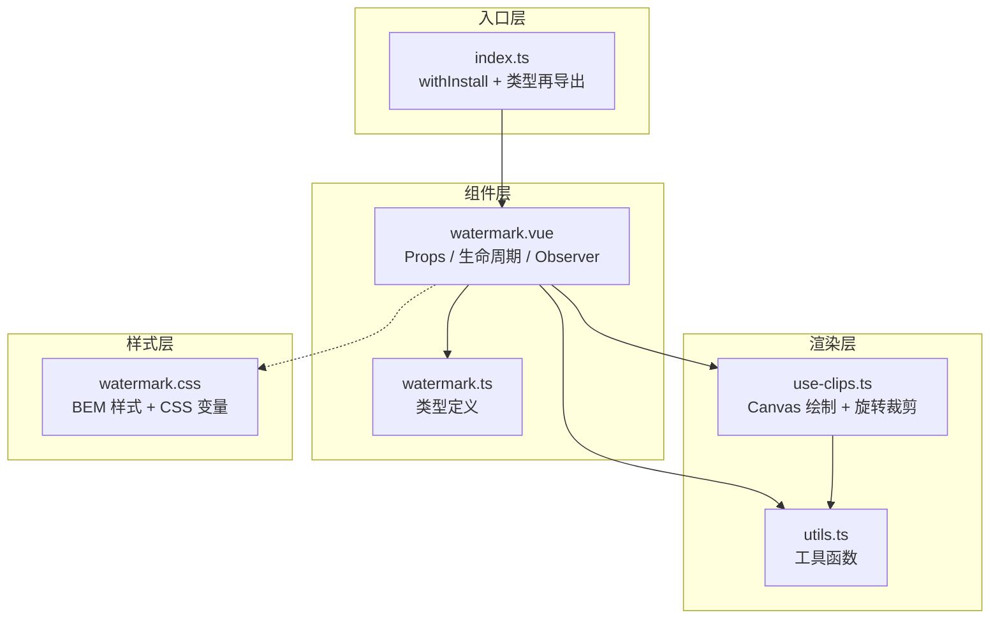
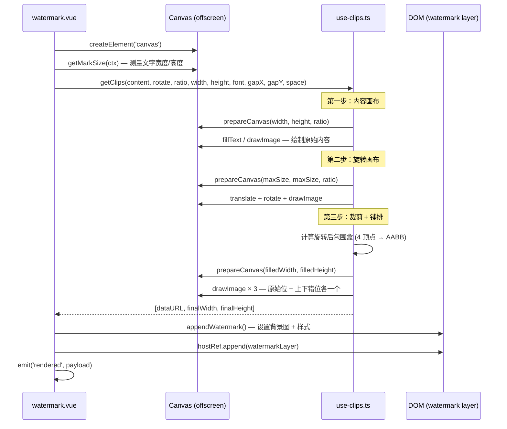

# 17 Watermark 水印

> 导读：Watermark 通过 Canvas 绘制水印纹理、转为 base64 背景图铺满容器，并用 MutationObserver 实时守护水印层不被篡改或删除——在保护数据安全的同时保持零侵入的 DOM 结构。

## 设计哲学

### 解决什么问题

企业级应用存在两类典型需求：**信息溯源**（标记当前页面属于哪个环境、哪位用户）和**信息防扩散**（降低截图传播后的可辨识度）。两者的共同要求是：水印必须**持续可见、难以移除、不影响业务交互**。

传统方案通常在服务端给图片加水印，或在前端用绝对定位的 div 叠加半透明文字。前者无法覆盖动态页面，后者可以被 DevTools 轻松删掉。`xy-watermark` 的方案是：

1. 用 Canvas 绘制水印图案，转为 `dataURL` 作为背景图，避免水印内容出现在 DOM 文本节点中。
2. 通过 `MutationObserver` 监听水印层的删除和属性篡改，自动恢复。

### 与 Ant Design Vue 的 Watermark 差异

| 维度 | Ant Design Vue | xiaoye-components |
|------|---------------|-------------------|
| 水印宿主 | 仅自身容器 | 支持 `target` 选择器 / `HTMLElement` / `fullscreen` 三种模式 |
| 图片降级 | 加载失败后无水印 | 失败后自动回退到 `content` 文本水印 |
| 自恢复开关 | 无（始终启用） | `autoObserve` 可关闭，适配 SSR / 测试场景 |
| 定位上下文 | 要求外部容器自带定位 | 自动检测并注入 `position: relative` |
| Expose API | 无 | 暴露 `rerender` / `getDataUrl` / `getTarget` / `removeWatermark` |
| 渲染令牌 | 无 | `renderToken` 防止异步竞态 |

## 源码架构



### 目录结构

```
packages/components/watermark/
├── index.ts                  # withInstall 注册 + 类型再导出
├── src/
│   ├── watermark.vue         # 主组件：Props 响应式 / 生命周期 / MutationObserver
│   ├── watermark.ts          # 类型定义：WatermarkProps / WatermarkFont / WatermarkRenderPayload 等
│   ├── use-clips.ts          # Canvas 绘制核心：文本/图片 → 旋转 → 裁剪 → 铺排 → dataURL
│   └── utils.ts              # 工具函数：pixelRatio / style 序列化 / 防删除判定 / 字体归一化
└── __tests__/
    └── watermark.spec.ts     # 15 个用例覆盖文本/图片/防删除/fullscreen/target 等
```

## 核心 Props / Emits / Slots 类型定义

> 源文件：`packages/components/watermark/src/watermark.ts`

### WatermarkProps

```ts
export interface WatermarkProps {
  zIndex?: number;                         // 水印层层级，默认 9
  rotate?: number;                         // 旋转角度（°），默认 -22
  width?: number;                          // 水印宽度，文本模式自动测量
  height?: number;                         // 水印高度，文本模式自动测量
  image?: string;                          // 图片水印地址，优先级高于 content
  content?: string | string[];             // 文字水印，支持多行
  font?: WatermarkFont;                    // 字体样式配置
  gap?: [number, number];                  // 水印间距 [x, y]，默认 [100, 100]
  offset?: [number, number];               // 左上角偏移，默认取 gap 的一半
  disabled?: boolean;                      // 是否禁用，默认 false
  opacity?: number;                        // 透明度 0~1，默认 1
  repeat?: WatermarkRepeat;                // 背景重复策略，默认 'repeat'
  autoObserve?: boolean;                   // 是否启用 MutationObserver 自恢复，默认 true
  fullscreen?: boolean;                    // 是否挂到 document.body，默认 false
  target?: string | HTMLElement;           // 外部宿主容器
}
```

### WatermarkFont

```ts
export interface WatermarkFont {
  color?: string;                          // 默认 'rgba(0,0,0,.15)'
  fontSize?: number | string;              // 默认 16
  fontWeight?: WatermarkFontWeight;        // 默认 'normal'
  fontStyle?: WatermarkFontStyle;          // 默认 'normal'
  fontFamily?: string;                     // 默认 'sans-serif'
  fontGap?: number;                        // 多行行间距，默认 3
  textAlign?: WatermarkTextAlign;          // 默认 'center'
  textBaseline?: WatermarkTextBaseline;    // 默认 'hanging'
}
```

### Emits

```ts
defineEmits<{
  rendered: [payload: WatermarkRenderPayload];
  "image-error": [event: Event];
}>();
```

其中 `WatermarkRenderPayload` 携带了渲染产物的完整上下文：

```ts
export interface WatermarkRenderPayload {
  dataUrl: string;                         // base64 数据
  width: number;                           // 水印宽度（物理像素已除以 ratio）
  height: number;                          // 水印高度
  source: WatermarkRenderSource;           // "text" | "image"
  target: HTMLElement;                     // 实际挂载宿主
}
```

### Slots

组件仅提供 `default` 插槽，承载需要叠加水印的业务内容。水印层 `.xy-watermark__layer` 作为宿主的子元素追加，与插槽内容平级。

## 核心实现

### Canvas 渲染水印

渲染流程由 `renderWatermark()` 驱动，核心分为三步：**测量 → 绘制 → 挂载**。



#### 第一步：内容画布

`use-clips.ts` 中 `prepareCanvas()` 根据水印宽高和设备像素比（`devicePixelRatio`）创建高分辨率 Canvas：

```ts
// use-clips.ts — prepareCanvas
const realWidth = width * ratio;
const realHeight = height * ratio;
canvas.width = Math.ceil(realWidth);
canvas.height = Math.ceil(realHeight);
```

文本绘制时，`getMarkSize()` 在 `watermark.vue` 中预先通过 `ctx.measureText()` 测量每行文字的宽度和高度，多行文字的行高由 `fontSize + fontGap` 累加。旋转角度导致的水平扩展量 `space` 也在此计算：

```ts
// watermark.vue — getMarkSize
const angle = (Math.PI / 180) * Number(rotate);
space = Math.ceil(Math.abs(Math.sin(angle) * defaultHeight) / 2);
defaultWidth += space;
```

#### 第二步：旋转画布

创建一个边长为 `max(width, height)` 的正方形 Canvas，将内容画布居中绘制后施加旋转变换。这一步确保旋转后的内容不超出画布边界。

#### 第三步：裁剪与铺排

旋转后需要计算新的包围盒。`use-clips.ts` 通过对内容矩形四个顶点施加旋转矩阵变换，求出 AABB：

```ts
// use-clips.ts — getRotatePos
function getRotatePos(x: number, y: number) {
  const targetX = x * Math.cos(angle) - y * Math.sin(angle);
  const targetY = x * Math.sin(angle) + y * Math.cos(angle);
  return [targetX, targetY];
}
```

随后创建铺排画布，绘制三次：一次原位、两次错位（分别在 `y - halfGapY` 和 `y + halfGapY` 位置偏移 `cutWidth + gapX`）。这种交错铺排使得相邻水印在视觉上形成密铺效果，不会出现大面积空白。

最终通过 `canvas.toDataURL()` 输出 base64 字符串。

### 异步竞态防护

`renderWatermark()` 使用递增的 `renderToken` 防止异步回调（图片 `onload`）在 props 变更后写入过期数据：

```ts
// watermark.vue — renderWatermark
renderToken += 1;
const token = renderToken;

// ... 异步回调中
if (token !== renderToken) {
  return;  // token 不匹配，丢弃本次渲染
}
```

当 `image` props 快速切换时，旧图片的 `onload` 回调会因为 token 不匹配而被丢弃，避免旧水印覆盖新水印。

### MutationObserver 防删除

这是 Watermark 组件安全性的核心机制。`connectObserver()` 对宿主元素启动 `MutationObserver`，监听 `childList`、`attributes` 和 `subtree`：

```ts
// watermark.vue — connectObserver
observerRef.value = new MutationObserver((mutations) => {
  if (stopObservation.value) return;

  mutations.forEach((mutation) => {
    if (reRendering(mutation, watermarkRef.value)) {
      destroyWatermark();
      renderWatermark();
    }
  });
});
```

`reRendering()` 判定两种需要恢复的情况：

```ts
// utils.ts — reRendering
export function reRendering(mutation: MutationRecord, watermarkElement?: HTMLElement) {
  // 情况一：水印层 DOM 节点被移除
  if (mutation.removedNodes.length > 0 && watermarkElement) {
    shouldRerender = Array.from(mutation.removedNodes).includes(watermarkElement);
  }
  // 情况二：水印层属性被篡改（如 style 被清空）
  if (mutation.type === "attributes" && mutation.target === watermarkElement) {
    shouldRerender = true;
  }
  return shouldRerender;
}
```

#### 暂停观察机制

组件自身在修改水印层（`appendWatermark`）时也需要操作 DOM，这会触发 Observer 回调造成无限循环。`pauseObservation()` 通过设置 `stopObservation` 标志位并在下一个微任务（`setTimeout(fn, 0)`）后恢复，让组件自身的 DOM 操作跳过 Observer 检查：

```ts
// watermark.vue — pauseObservation
function pauseObservation() {
  stopObservation.value = true;
  if (observationTimer) clearTimeout(observationTimer);
  observationTimer = setTimeout(() => {
    stopObservation.value = false;
    observationTimer = null;
  }, 0);
}
```

### 宿主解析与定位上下文注入

`resolveHostElement()` 按 `fullscreen → target(HTMLElement) → target(选择器) → wrapperRef` 优先级解析实际挂载宿主：

```ts
// watermark.vue — resolveHostElement（简化）
if (props.fullscreen) return document.body;
if (isElementTarget(props.target)) return props.target;
if (typeof props.target === "string") return document.querySelector(props.target);
return wrapperRef.value;
```

水印层使用 `position: absolute` 定位，要求宿主具有定位上下文。`syncHostTarget()` 检测宿主的 `computedStyle.position`，若为 `static` 则注入 `xy-watermark-target--relative` 类名，并在组件卸载时清理：

```ts
// watermark.vue — syncHostTarget
const hostPosition = window.getComputedStyle(hostRef.value).position;
if (!hostPosition || hostPosition === "static") {
  hostRef.value.classList.add("xy-watermark-target--relative");
  patchedHostRef.value = hostRef.value;
}
```

### 图片加载降级

当 `image` 加载失败时，组件不会直接放弃水印，而是回退到文本模式：

```ts
// watermark.vue — renderWatermark（图片分支）
image.onerror = (event) => {
  emit("image-error", event instanceof Event ? event : new Event("error"));
  if (!hasWatermarkContent(undefined, props.content)) {
    destroyWatermark();
    clearRenderedState();
    return;
  }
  drawCanvas(props.content ?? "", "text");  // 回退到文本
};
```

`hasWatermarkContent()` 工具函数确保只有当 `content` 也有有效内容时才执行降级，否则清空水印。

## 样式系统

> 源文件：`packages/theme/src/components/watermark.css`

组件使用 BEM 命名（`xy-watermark`），通过 `useNamespace` 生成类名前缀。

```css
.xy-watermark {
  position: relative;
  display: block;
  isolation: isolate;           /* 创建独立层叠上下文 */
}

.xy-watermark-target--relative {
  position: relative !important;
  isolation: isolate;
}

.xy-watermark__layer {
  position: absolute;
  inset: 0;
  border-radius: inherit;       /* 跟随宿主圆角 */
  pointer-events: none;         /* 不拦截交互事件 */
  user-select: none;            /* 不允许选中水印文本 */
  background-repeat: repeat;
  background-origin: border-box;
  background-clip: padding-box;
  opacity: 0.9;
  transition: opacity var(--xy-transition-duration-fast) var(--xy-transition-timing);
}
```

关键设计点：

- **`isolation: isolate`**：宿主和水印层各自形成独立层叠上下文，确保 `zIndex` 在局部生效，不会与外部元素产生层级冲突。
- **`pointer-events: none`**：水印层不拦截任何鼠标/触摸事件，保证业务内容交互不受影响。
- **`border-radius: inherit`**：水印层自动适配宿主的圆角，不会在圆角容器内溢出。
- **`background-origin / background-clip`**：确保背景图从 border-box 起始并裁切到 padding-box，与宿主的盒模型对齐。
- **CSS 变量**：`--xy-transition-duration-fast` 和 `--xy-transition-timing` 来自主题令牌系统，水印层透明度变化可跟随全局过渡配置。

## 与其他组件的联动

### 与 ConfigProvider 的联动

通过 `useNamespace`，Watermark 的类名前缀可被 `ConfigProvider` 的 `namespace` 属性动态切换。当同一页面存在多套组件版本时，不同的 namespace 能避免样式冲突。

### 全屏模式与浮层组件

`fullscreen: true` 时水印层使用 `position: fixed` 挂载到 `document.body`，与 Dialog、Drawer 等浮层组件共存。`zIndex` 默认为 9，远低于浮层组件的默认层级（2000+），水印不会遮盖浮层内容。如需水印覆盖浮层，可手动提高 `zIndex`。

### target 模式与 Card / Table

Watermark 的 `target` 属性可以将水印挂到任意容器，如 `xy-card` 或 `xy-table` 的包裹元素上。组件会自动检测宿主的定位属性并注入 `position: relative`，卸载时清理，对宿主无副作用。

## 扩展与定制

### 自定义渲染源

通过 `rendered` 事件获取 `dataUrl`，可以对接截图库（如 html2canvas）或导出流程：

```vue
<template>
  <xy-watermark content="内部资料" @rendered="onRendered">
    <div>业务内容</div>
  </xy-watermark>
</template>

<script setup lang="ts">
import type { WatermarkRenderPayload } from "@xiaoye/components";

function onRendered(payload: WatermarkRenderPayload) {
  console.log("水印已渲染到", payload.target);
  console.log("数据源", payload.source);    // "text" | "image"
  console.log("base64", payload.dataUrl);
}
</script>
```

### 手动控制渲染

Expose API 提供了细粒度的运行时控制：

```vue
<template>
  <xy-watermark ref="watermarkRef" content="动态水印" />
  <button @click="refresh">刷新水印</button>
  <button @click="getData">获取 DataURL</button>
</template>

<script setup lang="ts">
import { ref } from "vue";
import type { WatermarkInstance } from "@xiaoye/components";

const watermarkRef = ref<WatermarkInstance>();

function refresh() {
  watermarkRef.value?.rerender();
}

function getData() {
  const url = watermarkRef.value?.getDataUrl();
  // 可用于截图、导出 PDF 等
}
</script>
```

### 关闭自恢复以适配 SSR

在 SSR 场景中 `MutationObserver` 不可用，可通过 `autoObserve: false` 关闭：

```vue
<xy-watermark content="服务端渲染" :auto-observe="false" />
```

### 自定义水印图案

传入 `image` + 自定义 `width / height` 可以绘制任意图案水印。图片加载支持跨域（自动设置 `crossOrigin: 'anonymous'` 和 `referrerPolicy: 'no-referrer'`），加载失败时自动降级为文本：

```vue
<xy-watermark
  image="/logo.svg"
  :width="120"
  :height="64"
  :gap="[80, 80]"
  :opacity="0.3"
  content="品牌名"
/>
```
