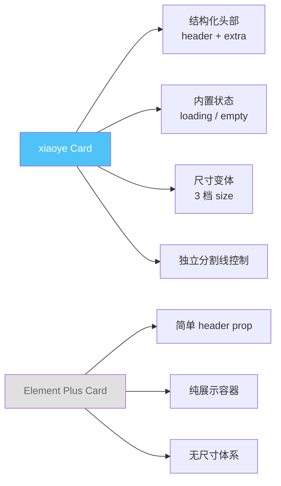
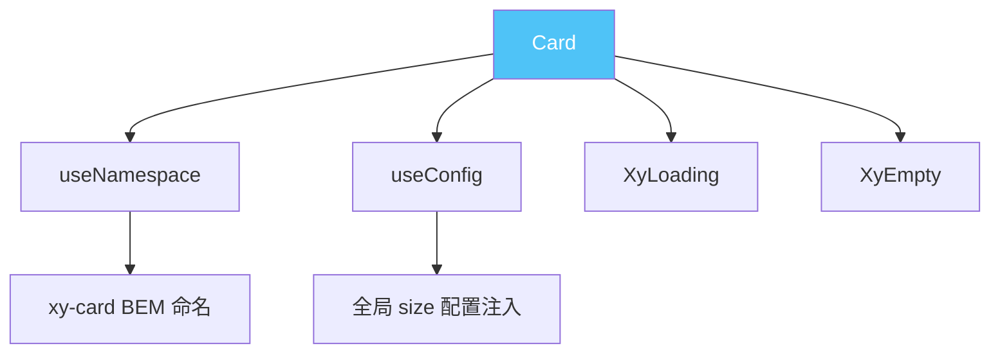
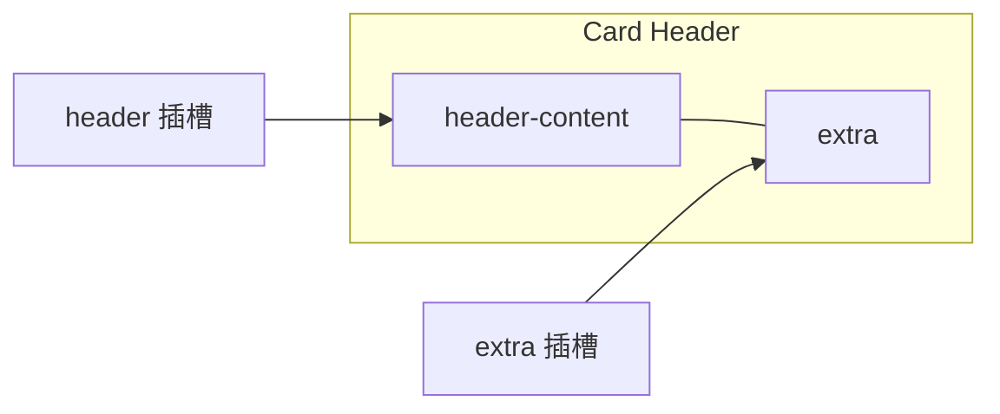
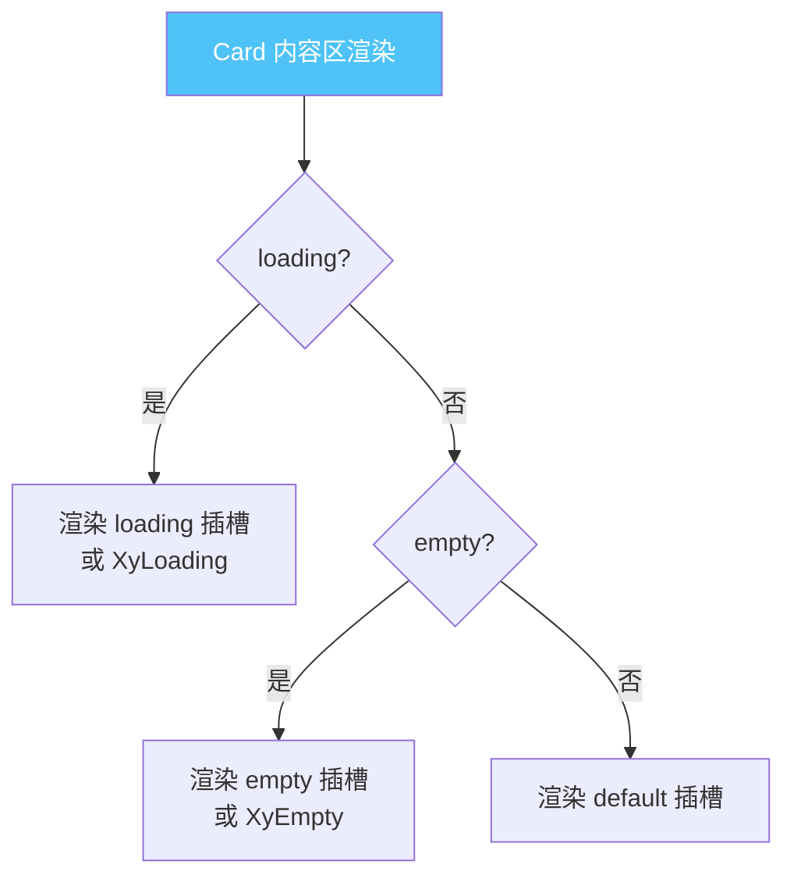

# 18 Card 卡片

> 导读：Card 是信息容器的基石组件，通过结构化插槽分区与可控的交互状态，将离散内容组织为视觉一致的卡片单元。

## 设计哲学

### 组件存在的理由

在现代 UI 中，卡片是信息呈现的基本单元。Card 解决的核心问题是：**如何用一个统一的容器模式，承载标题、正文、操作区三种语义不同的内容，同时保持视觉一致性与布局灵活性。**

没有 Card，开发者需要为每个内容块重复编写边框、圆角、阴影、内间距——这不仅是重复劳动，更会导致视觉不一致。

### 设计决策

| 决策点 | 选择 | 理由 |
|--------|------|------|
| 内容分区方式 | 插槽（header / default / footer / extra） | 比属性驱动更灵活，支持任意 VNode |
| 尺寸体系 | large / default / small 三档 | 与全局 size 配置联动，保持一致性 |
| 分割线 | headerDivider / footerDivider 独立控制 | 不同场景对分割线需求不同，应可按需开关 |
| 空状态与加载 | 内置 loading / empty 状态 | 减少开发者自行处理中间态的负担 |
| 可交互性 | 支持 shadow hover 变化 | 卡片本身可能是可点击的入口 |

### 与同类组件库的差异化



xiaoye-components 的 Card 在 Element Plus 基础上增加了 **结构化头部（header + extra 双区）**、**内置 loading/empty 状态**、**三档尺寸** 和 **独立分割线控制**，使其不仅是静态容器，也能承载更丰富的交互语义。

## 源码架构

### 文件结构

```
packages/components/card/
├── src/
│   ├── card.vue          # 主组件模板与逻辑
│   └── card.ts           # 类型定义与 props 声明
└── index.ts              # 模块导出
```

### 组件关系图



### 核心 type 定义

```ts
export const cardProps = buildProps({
  size:           { type: StringProp, values: sizePropValues, default: 'default' },
  variant:        { type: StringProp, values: variantPropValues, default: 'elevated' },
  bordered:       { type: BooleanProp, default: true },
  header:         { type: StringProp },
  footer:         { type: StringProp },
  extra:          { type: StringProp },
  bodyStyle:      { type: ObjectProp },
  headerClass:    { type: StringProp },
  bodyClass:      { type: StringProp },
  footerClass:    { type: StringProp },
  headerDivider:  { type: BooleanProp, default: true },
  footerDivider:  { type: BooleanProp, default: true },
  shadow:         { type: StringProp, values: shadowPropValues, default: 'always' },
  loading:        { type: BooleanProp, default: false },
  loadingText:    { type: StringProp, default: '' },
  empty:          { type: BooleanProp, default: false },
  emptyTitle:     { type: StringProp, default: '' },
  emptyDescription:{ type: StringProp, default: '' },
} as const)
```

Props 设计体现了"合理默认 + 细粒度可控"的思路：`bordered` 默认开、`headerDivider` 默认开，覆盖了 80% 的常规场景；同时每个区域都有独立的 class 和 divider 控制，满足定制需求。

## 核心实现

### 1. 结构化头部：header + extra 双区布局

```vue
<div v-if="hasStructuredHeader" :class="[ns.e('header'), ns.is('divided', headerDivider)]">
  <div :class="ns.e('header-content')">
    <slot name="header">{{ header }}</slot>
  </div>
  <div v-if="$slots.extra || extra" :class="ns.e('extra')">
    <slot name="extra">{{ extra }}</slot>
  </div>
</div>
```



**WHY**：`hasStructuredHeader` 是一个 computed，当 header 插槽/header prop/extra 插槽/extra prop 任一存在时为 true。这避免了空 header div 的渲染。extra 区域支持"标题 + 操作按钮"这种极高频的卡片布局模式，无需用户自行实现 flex 布局。

### 2. 内容状态：loading / empty / normal 三态切换

```vue
<div v-if="loading" :class="ns.e('loading')">
  <slot name="loading">
    <XyLoading :text="loadingText" />
  </slot>
</div>
<div v-else-if="empty" :class="ns.e('empty')">
  <slot name="empty">
    <XyEmpty :title="emptyTitle" :description="emptyDescription" />
  </slot>
</div>
<div v-else :class="[ns.e('body'), bodyClass]" :style="bodyStyle">
  <slot />
</div>
```



**WHY**：将 loading 和 empty 内置进 Card 而非让用户在外层包裹，有三个好处——(1) 状态切换时卡片尺寸稳定不跳动；(2) header/footer 在 loading 时仍然可见，提供上下文；(3) 减少 template 嵌套层级。

### 3. 尺寸与变体的 BEM 联动

```ts
const ns = useNamespace('card')
const config = useConfig()

const mergedSize = computed(() => props.size || config.size)
```

模板中通过 `ns.is(mergedSize.value)` 和 `ns.is(props.variant)` 生成尺寸和变体修饰符类名，CSS 层面通过这些修饰符控制 padding、font-size 等属性。

**WHY**：尺寸从全局配置注入 + prop 覆盖，是组件库的标准模式。variant（elevated / outlined / filled）则控制卡片的视觉风格——elevated 用阴影，outlined 用边框，filled 用背景色，覆盖了 Material Design 的三种卡片风格。

## API 参考

### Props

| 属性名 | 类型 | 默认值 | 说明 |
|--------|------|--------|------|
| size | `'large' \| 'default' \| 'small'` | `'default'` | 卡片尺寸，可由全局配置注入 |
| variant | `'elevated' \| 'outlined' \| 'filled'` | `'elevated'` | 卡片视觉变体 |
| bordered | `boolean` | `true` | 是否显示边框 |
| header | `string` | — | 卡片标题文本 |
| footer | `string` | — | 卡片底部文本 |
| extra | `string` | — | 头部右侧附加区域文本 |
| body-style | `object` | — | body 区域的自定义样式 |
| header-class | `string` | — | header 区域的自定义类名 |
| body-class | `string` | — | body 区域的自定义类名 |
| footer-class | `string` | — | footer 区域的自定义类名 |
| header-divider | `boolean` | `true` | 是否显示 header 分割线 |
| footer-divider | `boolean` | `true` | 是否显示 footer 分割线 |
| shadow | `'always' \| 'hover' \| 'never'` | `'always'` | 阴影显示时机 |
| loading | `boolean` | `false` | 是否显示加载状态 |
| loading-text | `string` | `''` | 加载状态提示文本 |
| empty | `boolean` | `false` | 是否显示空状态 |
| empty-title | `string` | `''` | 空状态标题 |
| empty-description | `string` | `''` | 空状态描述 |

### Slots

| 插槽名 | 说明 |
|--------|------|
| default | 卡片主体内容 |
| header | 卡片标题区域，替代 `header` prop |
| footer | 卡片底部区域，替代 `footer` prop |
| extra | 头部右侧附加区域，替代 `extra` prop |
| loading | 自定义加载状态内容 |
| empty | 自定义空状态内容 |

### Exposes

无。Card 是纯展示组件，不暴露命令式接口。

## 样式系统

### BEM 类名

| 类名 | 说明 |
|------|------|
| `xy-card` | 根元素 |
| `xy-card__header` | 头部区域 |
| `xy-card__header-content` | 头部左侧内容 |
| `xy-card__extra` | 头部右侧附加区域 |
| `xy-card__body` | 主体区域 |
| `xy-card__footer` | 底部区域 |
| `xy-card__loading` | 加载状态区域 |
| `xy-card__empty` | 空状态区域 |
| `xy-card--shadow-always` | 常驻阴影 |
| `xy-card--shadow-hover` | 悬停阴影 |
| `xy-card--shadow-never` | 无阴影 |
| `xy-card--large` | 大尺寸修饰符 |
| `xy-card--default` | 默认尺寸修饰符 |
| `xy-card--small` | 小尺寸修饰符 |
| `xy-card--elevated` | 浮起变体 |
| `xy-card--outlined` | 描边变体 |
| `xy-card--filled` | 填充变体 |
| `xy-card--divided` | 分割线修饰符 |

### CSS 变量

```css
/* 尺寸 */
--xy-card-padding: 20px;
--xy-card-border-radius: var(--xy-border-radius-base);

/* 颜色 */
--xy-card-border-color: var(--xy-border-color-lighter);
--xy-card-bg-color: var(--xy-bg-color);
--xy-card-text-color: var(--xy-text-color-primary);

/* 阴影 */
--xy-card-shadow: 0px 0px 12px rgba(0, 0, 0, 0.12);
--xy-card-hover-shadow: 0px 0px 12px rgba(0, 0, 0, 0.3);
```

### 主题定制方式

通过覆盖 CSS 变量实现主题定制：

```css
:root {
  --xy-card-border-radius: 12px;
  --xy-card-shadow: 0 4px 24px rgba(0, 0, 0, 0.08);
  --xy-card-hover-shadow: 0 8px 32px rgba(0, 0, 0, 0.16);
  --xy-card-padding: 24px;
}
```

也可在 `XyConfigProvider` 的 `namespace` 属性下作用域定制，实现局部主题。

## 小结

1. **结构化头部双区布局**：header-content + extra 的 flex 布局，原生支持"标题+操作"高频模式，零额外样式。
2. **三态内容切换**：loading / empty / normal 内置于 Card 内部，状态切换时卡片尺寸稳定，header 始终可见提供上下文。
3. **细粒度可控**：headerDivider / footerDivider / bodyStyle / headerClass 等独立控制，覆盖定制需求而不失默认体验。
