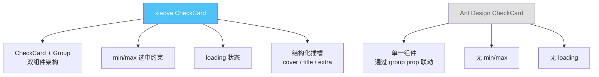
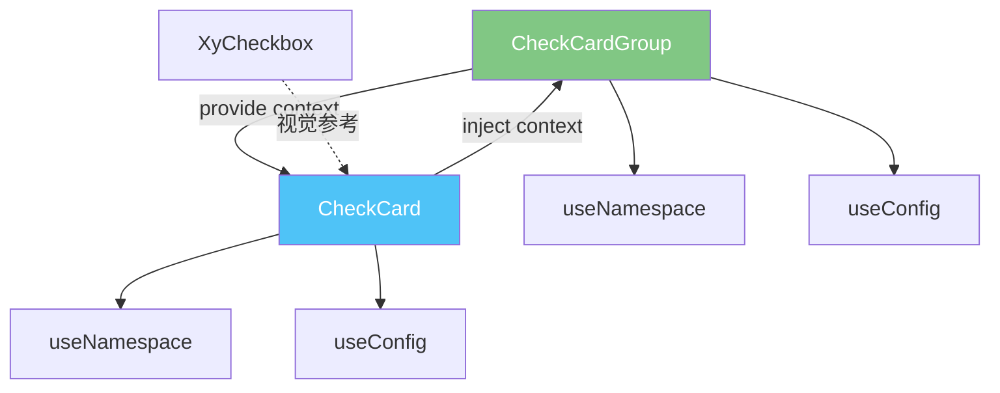
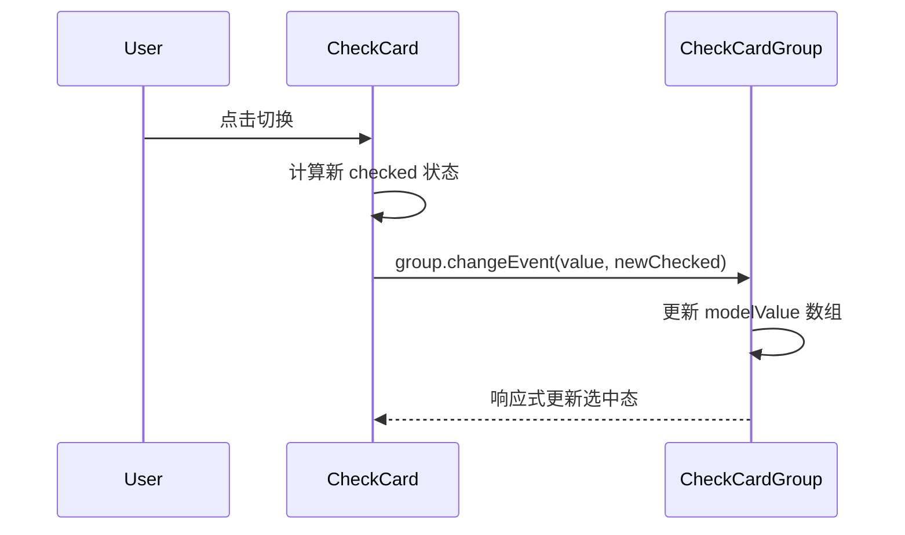
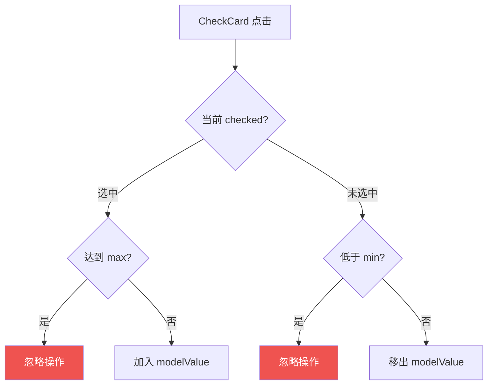

# 19 CheckCard 选择卡片

> 导读：CheckCard 将"选择"语义注入卡片容器，让卡片从纯展示升级为可选中、可分组的交互单元，适用于配置面板、权限选择等多选场景。

## 设计哲学

### 组件存在的理由

在很多业务场景中，选择操作不是通过下拉框或 Checkbox 完成的，而是直接在卡片上完成——比如选择云服务器规格、选择权限模板、选择数据源类型。CheckCard 解决的核心问题是：**如何让卡片天然具备选中态，同时支持单选与多选分组。**

如果用普通 Card + Checkbox 组合实现，需要手动管理选中样式、aria 属性、分组联动——这正是 CheckCard 封装的复杂度。

### 设计决策

| 决策点 | 选择 | 理由 |
|--------|------|------|
| 选中态表达 | checked prop + v-model | 双向绑定是 Vue 交互组件的标准模式 |
| 分组模式 | CheckCardGroup 独立组件 | 职责分离：Group 管理联动，CheckCard 管理自身 |
| 多选限制 | min / max | 防止零选或全选的业务约束 |
| 禁用态 | disabled prop | 与选中态正交，可独立控制 |
| 选中反馈 | 边框高亮 + 勾选图标 | 双重视觉反馈，符合 WAI-ARIA 规范 |

### 与同类组件库的差异化



xiaoye-components 的 CheckCard 参考了 Ant Design 的概念，但在架构上选择了 **双组件分离**（CheckCard + CheckCardGroup），并增加了 **min/max 约束** 和 **loading 状态**，更贴合企业级表单场景。

## 源码架构

### 文件结构

```
packages/components/check-card/
├── src/
│   ├── check-card.vue         # 单个选择卡片
│   ├── check-card.ts          # CheckCard 类型定义
│   ├── check-card-group.vue   # 选择卡片组
│   └── check-card-group.ts    # CheckCardGroup 类型定义
└── index.ts                   # 模块导出
```

### 组件关系图



CheckCardGroup 通过 provide/inject 向子 CheckCard 注入分组上下文（multiple、disabled、min/max），CheckCard 在状态变更时向上通知 Group 重新计算选中列表。

### 核心 type 定义

```ts
// CheckCard
export const checkCardProps = buildProps({
  checked:       { type: BooleanProp, default: false },
  disabled:      { type: BooleanProp, default: false },
  loading:       { type: BooleanProp, default: false },
  title:         { type: StringProp },
  extra:         { type: StringProp },
  cover:         { type: StringProp },
  value:         { type: [String, Number, Boolean] as PropType<string | number | boolean> },
} as const)

// CheckCardGroup
export const checkCardGroupProps = buildProps({
  modelValue:    { type: ArrayProp, default: () => [] },
  multiple:      { type: BooleanProp, default: true },
  disabled:      { type: BooleanProp, default: false },
  min:           { type: NumberProp },
  max:           { type: NumberProp },
} as const)
```

`value` 是 CheckCard 在 Group 中的标识，Group 通过它来管理 `modelValue` 数组。`multiple` 控制单选/多选模式——单选时 modelValue 仍为数组，但长度限制为 1。

## 核心实现

### 1. provide/inject 分组联动

```ts
// CheckCardGroup - provide
provide(CHECK_CARD_GROUP_KEY, {
  name: 'XyCheckCardGroup',
  modelValue: computed(() => props.modelValue),
  disabled: computed(() => props.disabled),
  multiple: computed(() => props.multiple),
  min: computed(() => props.min),
  max: computed(() => props.max),
  changeEvent: handleChange,
})

// CheckCard - inject
const group = inject(CHECK_CARD_GROUP_KEY, undefined)
```



**WHY**：provide/inject 是 Vue 跨层级通信的标准方案，避免了逐层 props 传递。Group 向下注入的是 computed 引用，当 Group 的 props 变化时子组件自动响应，无需额外事件监听。

### 2. min/max 约束与禁用联动

```ts
// CheckCardGroup
const handleChange = (value: CheckCardValue, checked: boolean) => {
  const newValue = [...props.modelValue]
  if (checked) {
    if (props.max != null && newValue.length >= props.max) return
    newValue.push(value)
  } else {
    if (props.min != null && newValue.length <= props.min) return
    newValue.splice(newValue.indexOf(value), 1)
  }
  emit(UPDATE_MODEL_EVENT, newValue)
  emit('change', newValue)
}
```



**WHY**：min/max 约束在 Group 层统一拦截，CheckCard 自身不需要感知这个逻辑。这样做的好处是——独立使用的 CheckCard 不受 min/max 影响，只有处于 Group 中时才生效。

### 3. CheckCard 选中态计算

```ts
// CheckCard
const computedChecked = computed(() => {
  if (group) {
    return group.modelValue.value.includes(props.value)
  }
  return props.checked
})

const computedDisabled = computed(() => {
  if (group?.disabled.value) return true
  // min/max 导致的隐式禁用
  if (group && !computedChecked.value && group.max.value != null
      && group.modelValue.value.length >= group.max.value) return true
  if (group && computedChecked.value && group.min.value != null
      && group.modelValue.value.length <= group.min.value) return true
  return props.disabled
})
```

**WHY**：`computedDisabled` 不仅考虑了 `disabled` prop 和 Group 的 `disabled`，还考虑了 min/max 导致的隐式禁用——当已选数量达到 max 时，未选中的卡片自动变为禁用态；同理 min。这种隐式禁用提供了比"操作无效"更好的用户体验，因为用户能直观看到为什么不能选择。

## API 参考

### CheckCard Props

| 属性名 | 类型 | 默认值 | 说明 |
|--------|------|--------|------|
| checked | `boolean` | `false` | 是否选中（非 Group 模式下使用） |
| disabled | `boolean` | `false` | 是否禁用 |
| loading | `boolean` | `false` | 是否加载中 |
| title | `string` | — | 卡片标题 |
| extra | `string` | — | 卡片附加信息 |
| cover | `string` | — | 封面图片 URL |
| value | `string \| number \| boolean` | — | 在 Group 中的唯一标识值 |

### CheckCard Slots

| 插槽名 | 说明 |
|--------|------|
| default | 卡片主体内容 |
| title | 自定义标题区域 |
| extra | 自定义附加信息区域 |
| cover | 自定义封面区域 |
| loading | 自定义加载状态 |

### CheckCard Emits

| 事件名 | 参数 | 说明 |
|--------|------|------|
| change | `(checked: boolean)` | 选中状态变化时触发 |
| update:checked | `(checked: boolean)` | v-model:checked 绑定 |

### CheckCardGroup Props

| 属性名 | 类型 | 默认值 | 说明 |
|--------|------|--------|------|
| model-value | `array` | `[]` | 选中值数组，v-model 绑定 |
| multiple | `boolean` | `true` | 是否多选 |
| disabled | `boolean` | `false` | 是否全部禁用 |
| min | `number` | — | 最少选中数 |
| max | `number` | — | 最多选中数 |

### CheckCardGroup Emits

| 事件名 | 参数 | 说明 |
|--------|------|------|
| change | `(value: array)` | 选中值变化时触发 |
| update:model-value | `(value: array)` | v-model 绑定 |

## 样式系统

### BEM 类名

| 类名 | 说明 |
|------|------|
| `xy-check-card` | 根元素 |
| `xy-check-card__cover` | 封面区域 |
| `xy-check-card__content` | 内容区域 |
| `xy-check-card__title` | 标题 |
| `xy-check-card__extra` | 附加信息 |
| `xy-check-card__body` | 主体内容 |
| `xy-check-card__loading` | 加载状态 |
| `xy-check-card--checked` | 选中态修饰符 |
| `xy-check-card--disabled` | 禁用态修饰符 |
| `xy-check-card-group` | Group 根元素 |

### CSS 变量

```css
/* 尺寸 */
--xy-check-card-padding: 16px;
--xy-check-card-border-radius: var(--xy-border-radius-base);

/* 颜色 */
--xy-check-card-border-color: var(--xy-border-color);
--xy-check-card-bg-color: var(--xy-bg-color);
--xy-check-card-text-color: var(--xy-text-color-primary);

/* 选中态 */
--xy-check-card-checked-border-color: var(--xy-color-primary);
--xy-check-card-checked-bg-color: var(--xy-color-primary-light-9);
--xy-check-card-checked-shadow: 0 0 0 1px var(--xy-color-primary);

/* 禁用态 */
--xy-check-card-disabled-border-color: var(--xy-border-color-light);
--xy-check-card-disabled-bg-color: var(--xy-bg-color);
```

### 主题定制方式

```css
:root {
  --xy-check-card-checked-border-color: #1890ff;
  --xy-check-card-checked-bg-color: #e6f7ff;
  --xy-check-card-padding: 20px;
  --xy-check-card-border-radius: 8px;
}
```

## 小结

1. **双组件架构**：CheckCard + CheckCardGroup 职责分离，Group 管理 provide/inject 联动，Card 管理自身渲染与交互，独立使用和分组使用均自然。
2. **min/max 隐式禁用**：超出约束的卡片自动进入 disabled 态，比"点击无效"提供更明确的视觉反馈。
3. **选中态双重反馈**：边框高亮 + 勾选图标同时呈现，符合 WAI-ARIA 对选中态的可见性要求。
