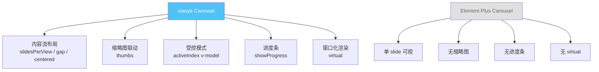
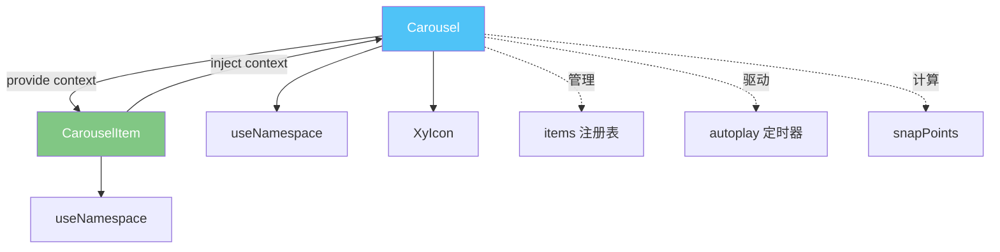
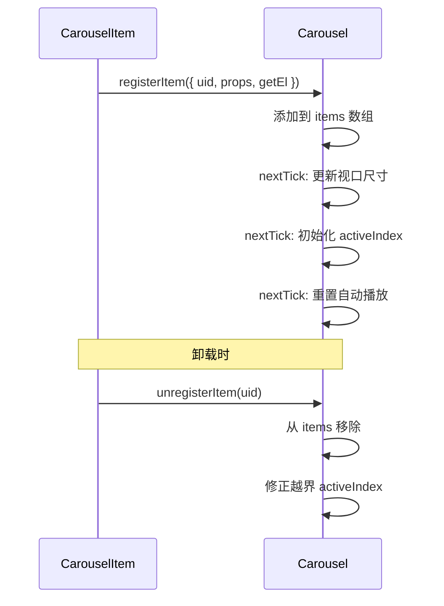
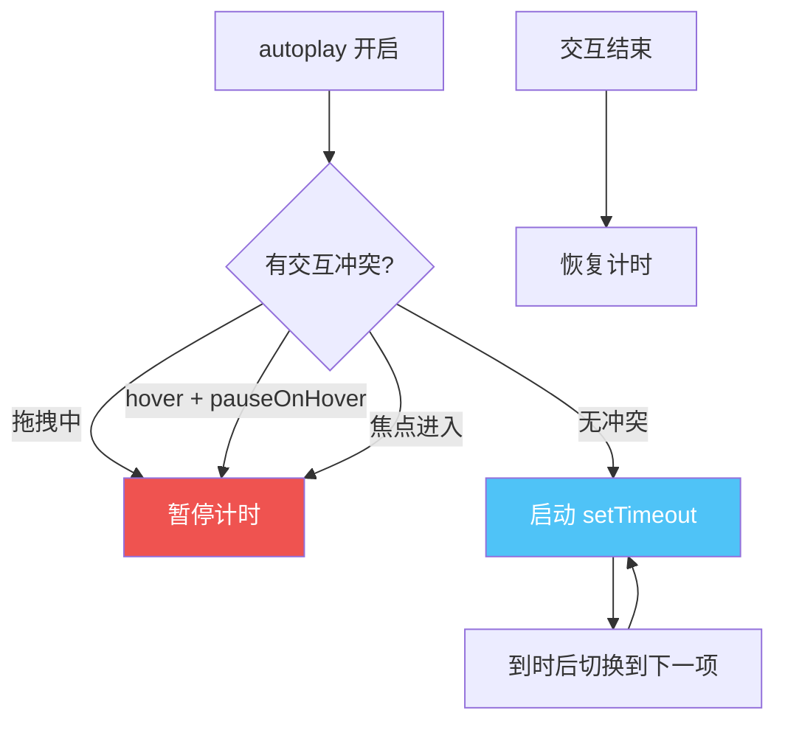
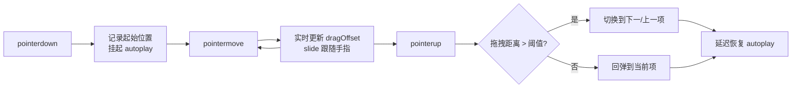
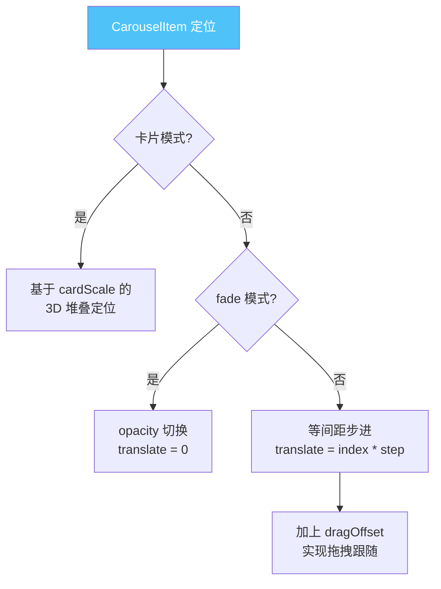

# 20 Carousel 走马灯

> 导读：Carousel 是内容轮播的完整解决方案，从基础自动播放到卡片模式、内容流布局、拖拽切换、缩略图联动，覆盖运营位与图库场景的全部需求。

## 设计哲学

### 组件存在的理由

轮播组件看似简单，但完整实现需要处理大量边界：循环首尾衔接、自动播放与交互冲突、多 slide 可视布局、拖拽手势、键盘导航、自适应高度……Carousel 解决的核心问题是：**将轮播的所有交互模式与布局能力收敛到一个声明式 API 中，让开发者用 props 组合而非自行拼装。**

### 设计决策

| 决策点 | 选择 | 理由 |
|--------|------|------|
| 子项注册 | provide/inject + onMounted 注册 | 支持动态增减子项，无需手动传递 count |
| 循环策略 | 索引回绕 + processIndex 重排 | 首尾切换无跳跃，视觉连续 |
| 两项循环 | 自动补位为 4 个物理 slide | 2 项时循环切换需要前后各有一个"替身" |
| 拖拽实现 | Pointer Events | 统一鼠标和触摸，比分别监听 mouse/touch 更简洁 |
| 内容流 | slidesPerView + slidesPerGroup + gap | 类 Swiper 的多 slide 可视布局 |
| 懒渲染 | lazy + lazyRange | 邻近 N 项渲染，适合图片较多但总量可控 |
| 虚拟滚动 | virtual + virtualBuffer | 窗口化渲染，适合大量 slide |

### 与同类组件库的差异化



## 源码架构

### 文件结构

```
packages/components/carousel/
├── src/
│   ├── carousel.vue         # 主容器组件（~1350 行）
│   ├── carousel.ts          # Carousel 类型定义（~95 行）
│   ├── carousel-item.vue    # 子项组件
│   ├── carousel-item.ts     # CarouselItem 类型定义
│   └── context.ts           # provide/inject 上下文定义
└── index.ts                 # 模块导出
```

### 组件关系图



### 核心 type 定义

```ts
// context.ts - 父子通信协议
export interface CarouselContext {
  root: Ref<HTMLElement | null>
  items: Ref<CarouselItemRegistration[]>
  resolvedActiveIndex: Ref<number>
  isCardType: ComputedRef<boolean>
  isVertical: ComputedRef<boolean>
  isFadeEffect: ComputedRef<boolean>
  loop: ComputedRef<boolean>
  slidesPerView: ComputedRef<number>
  gapPx: ComputedRef<number>
  dragging: Ref<boolean>
  dragOffset: Ref<number>
  registerItem: (item: CarouselItemRegistration) => void
  unregisterItem: (uid: number) => void
  setActiveItem: (index: number | string) => void
}

export const carouselContextKey: InjectionKey<CarouselContext> = Symbol('xy-carousel')
```

`CarouselContext` 是父子组件间的完整通信协议——CarouselItem 通过 inject 获取父容器的状态与方法，而非通过 props 逐层传递。这使得 CarouselItem 可以在任何嵌套深度工作。

## 核心实现

### 1. 子项注册与生命周期

```ts
// CarouselItem - onMounted
onMounted(() => {
  carousel?.registerItem({ uid, props, getEl: () => itemRef.value })
})

// CarouselItem - onBeforeUnmount
onBeforeUnmount(() => {
  carousel?.unregisterItem(uid)
})

// Carousel - registerItem
function registerItem(item: CarouselItemRegistration) {
  if (items.value.some(current => current.uid === item.uid)) return
  items.value = [...items.value, item]
  nextTick(() => {
    updateViewportSize()
    if (initialized.value && !isControlled.value
        && internalActiveIndex.value < 0 && items.value.length) {
      internalActiveIndex.value = resolveTargetIndex(props.initialIndex)
    }
    updateAutoHeight()
    resetTimer()
  })
}
```



**WHY**：通过 `registerItem` / `unregisterItem` 模式，Carousel 可以感知子项的动态增减。比"通过 slot 扫描 VNode"更可靠——因为 VNode 扫描无法获取 DOM 引用，而 `getEl()` 返回的是真实 DOM 节点，用于测量高度和位置。

### 2. 自动播放与交互冲突处理

```ts
function startTimer() {
  if (!props.autoplay || items.value.length <= 1
      || timer || dragging.value || autoplaySuspended.value) return
  const delay = toLeadDuration(resolvedActiveIndex.value)
  timer = setTimeout(() => {
    timer = null
    if (dragging.value) return
    const target = getNextAutoplayIndex()
    if (target !== resolvedActiveIndex.value) setActiveItem(target)
    else resetTimer()
  }, delay)
}

function handleMouseEnter() {
  hover.value = true
  if (props.pauseOnHover) pauseTimer()
}
```



**WHY**：自动播放与交互的冲突是轮播组件最易出 bug 的地方。xiaoye 的方案是——(1) 拖拽时 `autoplaySuspended = true`，完全挂起；(2) hover 时仅暂停，离开后恢复；(3) 焦点进入时暂停，焦点离开后恢复；(4) 拖拽结束后通过 `scheduleAutoplayResume` 延迟恢复，避免拖拽刚结束就触发自动切换。

### 3. 拖拽切换（Pointer Events）

```ts
function handlePointerDown(event: PointerEvent) {
  if (!shouldStartDrag(event)) return
  dragging.value = true
  autoplaySuspended.value = true
  dragPointerId.value = event.pointerId
  dragStart.value = getAxisValue(event)
  dragOffset.value = 0
  pauseTimer()
  window.addEventListener('pointermove', handlePointerMove)
  window.addEventListener('pointerup', finishDrag)
  window.addEventListener('pointercancel', finishDrag)
}

function finishDrag(event: PointerEvent) {
  const delta = dragOffset.value
  const threshold = Math.max(24, viewportSize.value * 0.1)
  dragging.value = false
  dragOffset.value = 0
  if (Math.abs(delta) >= threshold) {
    delta < 0 ? next() : prev()
  }
  scheduleAutoplayResume(props.duration)
}
```



**WHY**：使用 Pointer Events 而非分别监听 mouse/touch，是因为 Pointer Events 统一了两种输入源，且 `pointerId` 可以区分多点触控。`threshold` 取 `max(24, viewportSize * 0.1)`，确保在小容器上也有合理的触发阈值。

### 4. CarouselItem 定位计算

```ts
// CarouselItem - translate 计算（slide 模式核心）
const translate = computed(() => {
  if (carousel?.isCardType.value) {
    // 卡片模式：基于 delta 和 cardScale 计算
    const delta = processedIndex.value - carousel.resolvedActiveIndex.value
    if (inStage.value) {
      return (parentSize * ((2 - cardScale) * delta + 1)) / 4 + dragOffset
    }
    // 不在舞台上的卡片堆到两侧
    return processedIndex < resolvedActiveIndex
      ? -(parentSize / 2 + 24) + dragOffset
      : parentSize + 24 + dragOffset
  }
  // 普通 slide 模式：等间距步进
  const step = (viewportSize - gapPx * (slidesPerView - 1)) / slidesPerView + gapPx
  return baseOffset + (logicalIndex - baseIndex) * step + dragOffset
})
```



**WHY**：三种模式（slide / fade / card）的定位逻辑完全不同，通过 computed 分支处理。slide 模式的 `step` 计算考虑了 `slidesPerView` 和 `gap`，使得多 slide 可视布局下间距精确。`dragOffset` 的叠加让拖拽时 slide 实时跟随手指。

### 5. snapPoints 与边界计算

```ts
const snapPoints = computed(() => {
  const total = items.value.length
  const points: number[] = []
  // 按 slidesPerGroup 步进生成吸附点
  for (let index = 0; index <= maxIndex.value; index += slidesPerGroupValue.value) {
    points.push(index)
  }
  // 确保最后一项是吸附点
  if (points[points.length - 1] !== maxIndex.value) {
    points.push(maxIndex.value)
  }
  return points
})
```

**WHY**：当 `slidesPerGroup > 1` 时，不是每个 index 都能作为停留点。snapPoints 定义了合法的停留位置，指示器数量 = snapPoints.length，自动播放也按 snapPoints 步进。这避免了"翻页翻到半个 slide"的问题。

## API 参考

### Carousel Props

| 属性名 | 类型 | 默认值 | 说明 |
|--------|------|--------|------|
| initial-index | `number` | `0` | 初始激活项索引 |
| active-index | `number` | — | 受控模式下的当前索引 |
| height | `string` | `''` | 容器高度，`'auto'` 为自适应 |
| trigger | `'hover' \| 'click'` | `'hover'` | 指示器触发方式 |
| autoplay | `boolean` | `true` | 是否自动播放 |
| interval | `number` | `3000` | 自动播放间隔（ms） |
| indicator-position | `'' \| 'none' \| 'outside'` | `''` | 指示器位置 |
| arrow | `'always' \| 'hover' \| 'never'` | `'hover'` | 箭头显示时机 |
| type | `'' \| 'card'` | `''` | 轮播类型 |
| card-scale | `number` | `0.83` | 卡片模式缩放比 |
| loop | `boolean` | `true` | 是否循环 |
| direction | `'horizontal' \| 'vertical'` | `'horizontal'` | 方向 |
| pause-on-hover | `boolean` | `true` | hover 时暂停 |
| draggable | `boolean` | `true` | 是否可拖拽 |
| effect | `'slide' \| 'fade'` | `'slide'` | 动画效果 |
| duration | `number` | `400` | 动画时长（ms） |
| easing | `string` | `'cubic-bezier(0.22,0.61,0.36,1)'` | 缓动函数 |
| slides-per-view | `number` | `1` | 可视 slide 数 |
| slides-per-group | `number` | `1` | 每次翻页数 |
| gap | `number \| string` | `0` | slide 间距 |
| centered | `boolean` | `false` | 当前 slide 居中 |
| indicator-type | `'line' \| 'dot'` | `'line'` | 指示器样式 |
| thumbs | `boolean` | `false` | 是否显示缩略图 |
| thumbs-placement | `'bottom' \| 'top' \| 'left' \| 'right'` | `'bottom'` | 缩略图位置 |
| thumbs-per-view | `number` | `5` | 缩略图每屏数量 |
| thumbs-gap | `number \| string` | `8` | 缩略图间距 |
| thumbs-indicator-type | `'thumbnail' \| 'line' \| 'dot'` | `'thumbnail'` | 缩略图样式 |
| show-progress | `boolean` | `false` | 是否显示进度条 |
| progress-placement | `'bottom' \| 'top' \| 'indicator'` | `'bottom'` | 进度条位置 |
| progress-color | `string` | `''` | 进度条颜色 |
| align | `'start' \| 'center' \| 'end'` | `'start'` | 内容流对齐 |
| contain-scroll | `'trim' \| 'keep'` | `'trim'` | 边界策略 |
| peek | `number \| string` | `0` | 边缘露出尺寸 |
| lazy | `boolean` | `false` | 邻近懒渲染 |
| lazy-range | `number` | `1` | 懒渲染范围 |
| virtual | `boolean` | `false` | 窗口化渲染 |
| virtual-buffer | `number` | `1` | 窗口化缓冲 |
| keyboard | `boolean` | `true` | 键盘导航 |

### Carousel Emits

| 事件名 | 参数 | 说明 |
|--------|------|------|
| change | `(current: number, previous: number)` | 激活项切换 |
| update:active-index | `(index: number)` | 受控模式索引更新 |

### Carousel Slots

| 插槽名 | 作用域参数 | 说明 |
|--------|-----------|------|
| default | — | 轮播项列表 |
| indicator | `{ index, active, total }` | 自定义指示器 |
| arrow-prev | `{ disabled }` | 自定义上一页箭头 |
| arrow-next | `{ disabled }` | 自定义下一页箭头 |
| progress | `{ percent, activeIndex }` | 自定义进度条 |
| thumb | `{ index, active, total, item }` | 自定义缩略图项 |

### Carousel Exposes

| 暴露项 | 类型 | 说明 |
|--------|------|------|
| activeIndex | `ComputedRef<number>` | 当前激活索引 |
| setActiveItem | `(index: number \| string) => void` | 切换到指定项 |
| prev | `() => void` | 上一项 |
| next | `() => void` | 下一项 |

### CarouselItem Props

| 属性名 | 类型 | 默认值 | 说明 |
|--------|------|--------|------|
| name | `string` | `''` | 项目名称，用于 setActiveItem |
| label | `string \| number` | `''` | 指示器文案 |
| duration | `number` | — | 单项播放时长，覆盖全局 interval |
| autoplay-disabled | `boolean` | `false` | 跳过自动播放序列 |

## 样式系统

### BEM 类名

| 类名 | 说明 |
|------|------|
| `xy-carousel` | 根元素 |
| `xy-carousel__container` | 视口容器 |
| `xy-carousel__item` | 轮播项 |
| `xy-carousel__arrow` | 箭头按钮 |
| `xy-carousel__indicators` | 指示器列表 |
| `xy-carousel__indicator` | 单个指示器 |
| `xy-carousel__button` | 指示器按钮 |
| `xy-carousel__thumbs` | 缩略图条 |
| `xy-carousel__thumb` | 单个缩略图 |
| `xy-carousel__progress` | 进度条 |
| `xy-carousel__progress-bar` | 进度条填充 |
| `xy-carousel__mask` | 卡片模式遮罩 |
| `xy-carousel--horizontal` | 横向修饰符 |
| `xy-carousel--vertical` | 纵向修饰符 |
| `xy-carousel--card` | 卡片模式修饰符 |
| `xy-carousel--fade` | 淡入淡出修饰符 |
| `xy-carousel--indicator-dot` | 圆点指示器修饰符 |
| `is-active` | 当前激活项 |
| `is-in-stage` | 卡片模式舞台内 |
| `is-animating` | 动画进行中 |
| `is-dragging` | 拖拽进行中 |

### CSS 变量

```css
/* 容器 */
--xy-carousel-radius: var(--xy-radius-lg);

/* 进度条 */
--xy-carousel-progress-percent: 0%;
--xy-carousel-progress-color: var(--xy-brand);

/* 缩略图 */
--xy-carousel-thumbs-gap: 8px;
--xy-carousel-thumbs-basis: 20%;
```

### 主题定制方式

```css
:root {
  --xy-carousel-radius: 8px;
  --xy-carousel-progress-color: #ff6b00;
  --xy-carousel-thumbs-gap: 12px;
}
```

## 小结

1. **provide/inject 子项注册**：CarouselItem 通过 onMounted 自注册，Carousel 感知动态增减，无需手动传递 count 或扫描 slot。
2. **交互冲突四重守卫**：拖拽挂起、hover 暂停、焦点暂停、拖拽后延迟恢复——自动播放与交互互不干扰。
3. **snapPoints 吸附模型**：slidesPerGroup > 1 时，只有 snapPoints 中的索引是合法停留位置，指示器和自动播放均按此步进，杜绝"半个 slide"问题。
