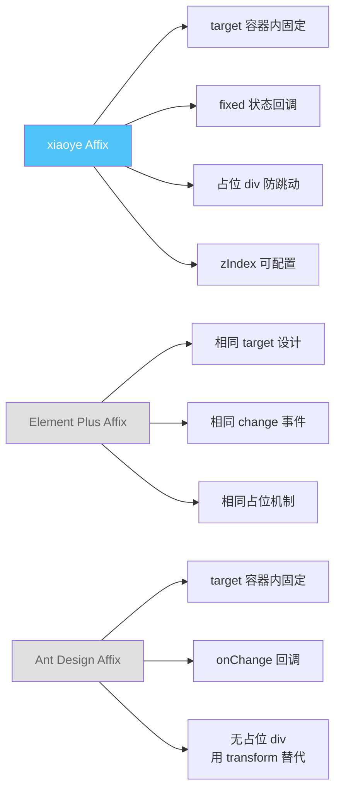
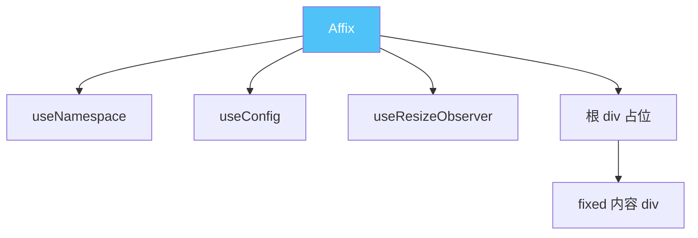
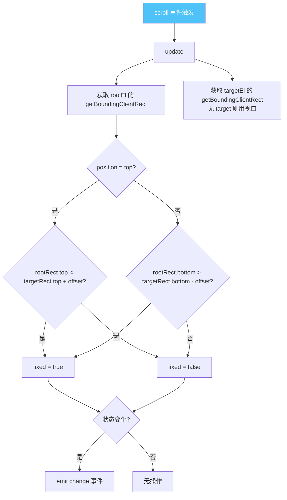
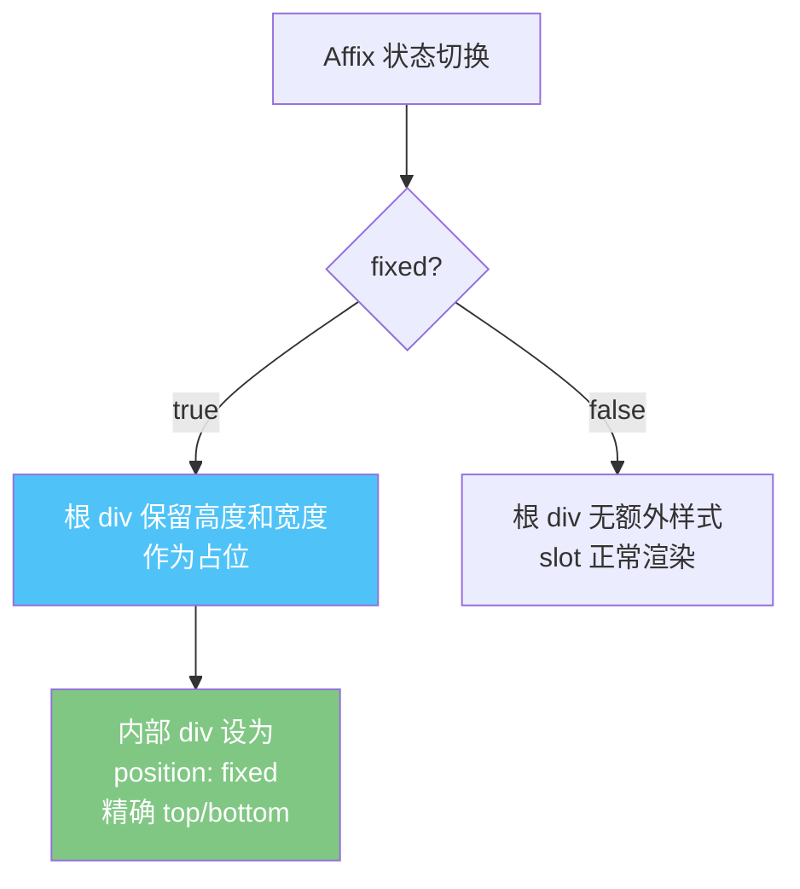
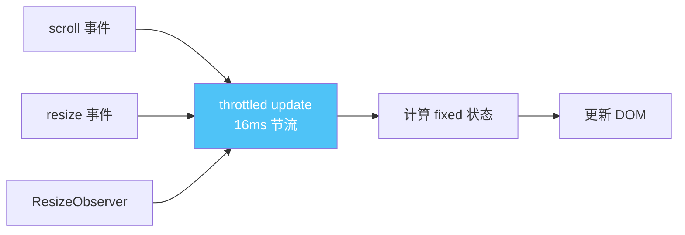

# 21 Affix 固钉

> 导读：Affix 将页面元素固定在视口指定位置，在滚动过程中保持可见，是导航栏、操作按钮等"始终在视野内"场景的基础设施。

## 设计哲学

### 组件存在的理由

页面滚动时，某些元素需要始终可见——导航栏、回到顶部按钮、悬浮操作面板。CSS `position: sticky` 虽然能解决部分场景，但无法处理 **目标容器内固定** 和 **固定状态变化回调** 等需求。Affix 解决的核心问题是：**将"视口固定"和"容器内固定"两种模式统一到一个声明式 API 中，并在状态切换时提供回调与事件。**

### 设计决策

| 决策点 | 选择 | 理由 |
|--------|------|------|
| 定位策略 | `position: fixed` + 占位 `div` | 比 `sticky` 更可控，支持容器内固定 |
| 占位机制 | 渲染等高占位 div | fixed 脱离文档流后，后续内容不会跳动 |
| 容器限制 | `target` prop 指定容器 | 支持在滚动容器内固定，而非仅相对视口 |
| 位置参数 | offsetTop / offsetBottom | 上下两个方向独立控制，互斥 |
| 状态回调 | change 事件 + fixed 状态 | 便于外部响应固定状态变化，如添加阴影 |

### 与同类组件库的差异化



xiaoye-components 的 Affix 设计与 Element Plus 基本一致——采用 `position: fixed` + 占位 div 的经典方案，这是最稳定、跨浏览器兼容性最好的实现路径。

## 源码架构

### 文件结构

```
packages/components/affix/
├── src/
│   ├── affix.vue          # 主组件模板与逻辑
│   └── affix.ts           # 类型定义与 props 声明
└── index.ts               # 模块导出
```

### 组件关系图



### 核心 type 定义

```ts
export type AffixPosition = 'top' | 'bottom'

export const affixProps = buildProps({
  zIndex:      { type: NumberProp, default: 100 },
  target:      { type: StringProp, default: '' },
  offsetTop:   { type: NumberProp, default: 0 },
  offsetBottom: { type: NumberProp },
  position:    { type: StringProp as PropType<AffixPosition>, default: 'top' },
} as const)

export type AffixProps = ExtractPropTypes<typeof affixProps>
```

`offsetTop` 和 `offsetBottom` 互斥——当 `position='top'` 时用 `offsetTop`，当 `position='bottom'` 时用 `offsetBottom`。`target` 为空时固钉相对视口，指定选择器时相对目标容器。

## 核心实现

### 1. 固定状态检测与更新

```ts
const update = () => {
  if (!rootEl.value) return

  const rootRect = rootEl.value.getBoundingClientRect()
  const targetRect = targetEl.value
    ? targetEl.value.getBoundingClientRect()
    : { top: 0, bottom: window.innerHeight }

  const isFixed = position.value === 'top'
    ? rootRect.top < targetRect.top + offsetTop.value
    : rootRect.bottom > targetRect.bottom - offsetBottom.value

  if (isFixed !== fixed.value) {
    fixed.value = isFixed
    emit('change', isFixed)
  }
}
```



**WHY**：使用 `getBoundingClientRect` 而非 `scrollTop` 计算，是因为前者返回的是相对视口的精确位置，不受滚动容器嵌套影响。当 `target` 为空时，用 `{ top: 0, bottom: window.innerHeight }` 模拟视口边界，统一了"视口固定"和"容器内固定"两种模式的判断逻辑。

### 2. 占位 div 与 fixed 定位切换

```vue
<div ref="rootEl" :class="[ns.b(), { [ns.is('fixed')]: fixed }]"
     :style="rootStyle">
  <div v-if="fixed" :style="affixStyle">
    <slot />
  </div>
  <slot v-else />
</div>
```

```ts
const rootStyle = computed<StyleValue>(() => {
  if (!fixed.value) return {}
  return {
    height: `${height.value}px`,
    width: `${width.value}px`,
  }
})

const affixStyle = computed<StyleValue>(() => {
  if (!fixed.value) return {}
  return {
    height: `${height.value}px`,
    width: `${width.value}px`,
    top: position.value === 'top' ? `${offsetTop.value}px` : 'auto',
    bottom: position.value === 'bottom' ? `${offsetBottom.value}px` : 'auto',
    position: 'fixed',
    zIndex: props.zIndex,
  }
})
```



**WHY**：为什么用"占位 div + 内部 fixed div"而不是直接让根元素 fixed？因为如果根元素直接 fixed，它会脱离文档流，后续内容会跳上来。保留根元素的高度和宽度作为占位，内部的 fixed div 覆盖在页面上方，既实现了固定效果又防止了内容跳动。

### 3. 监听策略：scroll + resize

```ts
onMounted(() => {
  // 解析 target 元素
  if (props.target) {
    targetEl.value = document.querySelector(props.target)
    if (!targetEl.value) throw new Error('[XyAffix] Target is not found')
  }

  // 使用 throttled update 监听 scroll
  const throttledUpdate = throttle(update, 16)
  const scrollContainer = getScrollContainer(rootEl.value)
  useEventListener(scrollContainer, 'scroll', throttledUpdate)
  useEventListener(window, 'resize', throttledUpdate)

  // 监听自身尺寸变化
  useResizeObserver(rootEl, () => {
    update()
  })

  // 初始化
  nextTick(update)
})
```



**WHY**：scroll 事件触发频率极高（60fps+ 滚动时每秒 60+ 次），16ms 节流约等于一帧一次，既保证流畅又不浪费计算。resize 监听处理窗口尺寸变化——视口大小变化可能影响 `targetRect.bottom` 的值。`ResizeObserver` 监听自身内容尺寸变化——如果 slot 内容高度改变，需要重新计算占位高度。

### 4. 目标容器滚动监听

```ts
function getScrollContainer(el: HTMLElement): HTMLElement | Window {
  let parent: HTMLElement | null = el.parentElement
  while (parent) {
    const { overflow, overflowY } = getComputedStyle(parent)
    if (/(auto|scroll)/.test(overflow + overflowY)) return parent
    parent = parent.parentElement
  }
  return window
}
```

**WHY**：当页面使用自定义滚动容器（而非 body 滚动）时，scroll 事件不在 window 上触发。`getScrollContainer` 向上遍历 DOM 树，找到第一个 `overflow: auto/scroll` 的祖先元素作为滚动监听目标。这确保了 Affix 在任何滚动架构下都能正常工作。

## API 参考

### Props

| 属性名 | 类型 | 默认值 | 说明 |
|--------|------|--------|------|
| z-index | `number` | `100` | 固定时的 z-index |
| target | `string` | `''` | 目标容器的 CSS 选择器，为空则相对视口 |
| offset-top | `number` | `0` | 距离顶部偏移量（position='top' 时生效） |
| offset-bottom | `number` | — | 距离底部偏移量（position='bottom' 时生效） |
| position | `'top' \| 'bottom'` | `'top'` | 固定方向 |

### Emits

| 事件名 | 参数 | 说明 |
|--------|------|------|
| change | `(fixed: boolean)` | 固定状态变化时触发 |
| scroll | `{ scrollTop: number, fixed: boolean }` | 滚动时触发，提供当前 scrollTop 和固定状态 |

### Slots

| 插槽名 | 说明 |
|--------|------|
| default | 需要固定的内容 |

### Exposes

| 暴露项 | 类型 | 说明 |
|--------|------|------|
| update | `() => void` | 手动触发状态更新 |

## 样式系统

### BEM 类名

| 类名 | 说明 |
|------|------|
| `xy-affix` | 根元素 |
| `xy-affix--fixed` | 固定态修饰符 |

### CSS 变量

```css
/* 无专属 CSS 变量，Affix 定位完全由 JS 内联样式控制 */
/* z-index 通过 prop 传入 */
/* 尺寸通过占位 div 内联样式保证 */
```

Affix 是纯定位组件，不涉及视觉样式（颜色、字体、阴影等），因此没有 CSS 变量。所有定位相关的样式（position、top、bottom、width、height）通过 computed 内联样式精确控制。

### 主题定制方式

由于 Affix 无视觉样式，主题定制主要体现在使用层面：

```vue
<!-- 通过 offset 控制固定位置 -->
<XYAffix :offset-top="64">
  <div class="my-sticky-nav" :class="{ 'has-shadow': isFixed }">
    导航内容
  </div>
</XYAffix>

<!-- 通过 change 事件添加视觉反馈 -->
<script setup>
const isFixed = ref(false)
const onChange = (fixed) => { isFixed.value = fixed }
</script>
```

## 小结

1. **占位 div 防跳动**：fixed 时根元素保留原始高度作为占位，内部 div 承载 fixed 定位，内容跳动问题从根源消除。
2. **getBoundingClientRect 精确检测**：相对视口和相对容器的判断逻辑统一用 rect 坐标计算，不受滚动嵌套影响。
3. **三重监听保活**：scroll 节流 + resize + ResizeObserver，无论窗口变化、容器滚动还是自身尺寸改变，状态始终准确。
