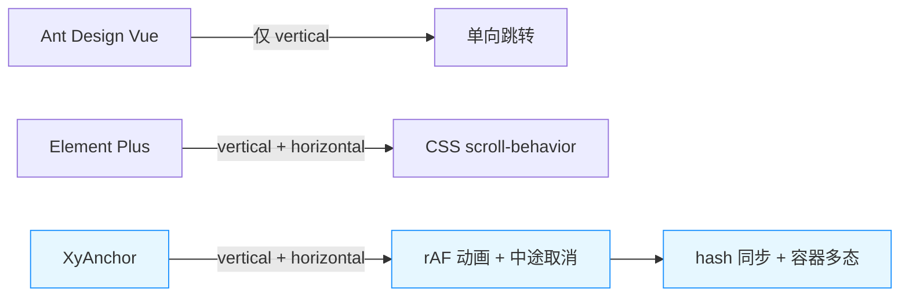
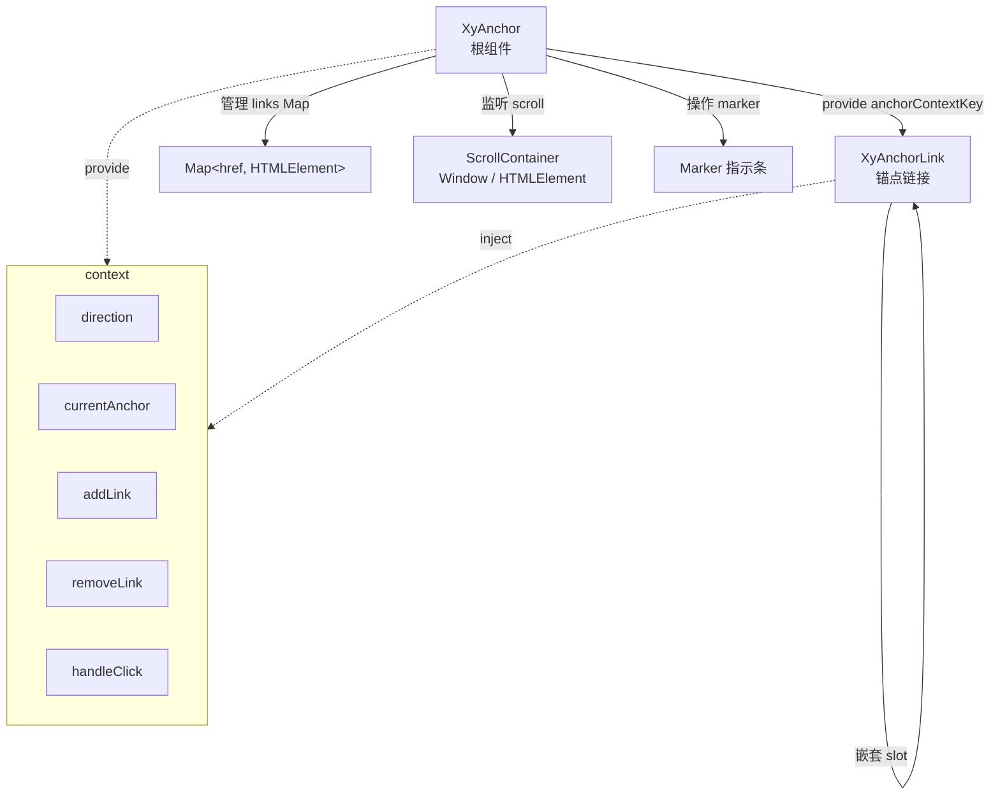
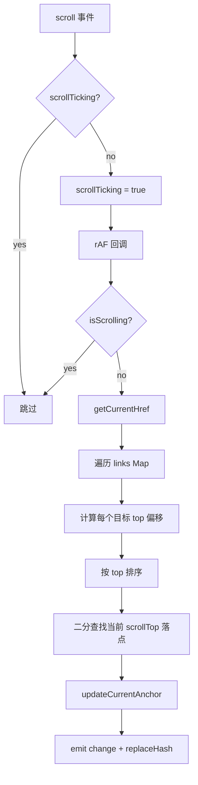
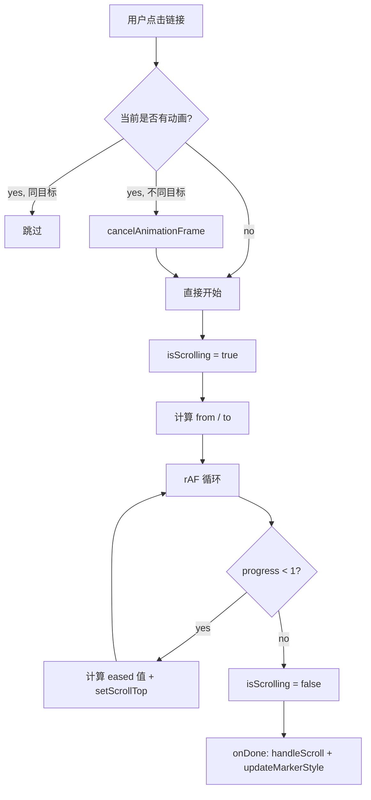

# 22 Anchor 锚点

> 导读：Anchor 是长内容页的章节导航基础设施，通过滚动监听与平滑定位的双向联动，让用户在任意滚动位置都能感知当前所在章节并一键跳转。

## 设计哲学

### 组件存在的理由

长内容页（文档站、配置中心、发布清单）的痛点是：用户滚动到中段后，失去了对"我在哪"的感知。传统做法是手写锚点链接，但这带来三个问题：

1. **单向跳转**：点击能跳，但滚动回来后目录不会自动高亮
2. **容器绑定困难**：局部滚动面板（如 Dialog 内嵌内容）无法用 `window.scrollTo`
3. **URL hash 不同步**：跳转后地址栏不更新，分享链接丢失定位上下文

Anchor 组件把这些能力收口：滚动监听自动高亮、`requestAnimationFrame` 平滑滚动、容器多态解析、URL hash 同步。

### 设计决策

| 决策点 | 选择 | WHY |
| --- | --- | --- |
| 滚动监听方式 | `passive: true` + rAF 节流 | 避免阻塞主线程，`passive` 声明不阻止默认行为 |
| 滚动动画 | 自实现 `easeOutCubic` 而非 CSS `scroll-behavior` | 需要中途取消（用户快速连点）和完成回调 |
| 容器解析 | `string \| HTMLElement \| Window \| null` 四态 | 兼容选择器字符串、直接引用、默认 window、显式 null |
| 方向支持 | `vertical` / `horizontal` 双模式 | 侧边目录 + 顶部页内导航两种高频场景 |
| 状态通信 | `provide/inject` 而非 props 逐层传递 | 嵌套层级不确定，依赖注入更松耦合 |

### 与同类组件库的差异化



XyAnchor 在三个维度上做了增强：滚动动画可中断、容器支持局部面板、`syncHash` 开关让 URL 同步变成可选而非强制。

## 源码架构

### 文件结构

```
packages/components/anchor/
├── index.ts              # 导出入口，withInstall + 子组件挂载
├── src/
│   ├── anchor.vue        # 根组件：滚动监听、动画、marker
│   ├── anchor.ts          # 类型定义 & props 声明
│   ├── anchor-link.vue    # 锚点链接：注册/注销、active 计算
│   ├── anchor-link.ts     # AnchorLinkProps
│   └── context.ts         # InjectionKey & AnchorContext 接口
```

### 组件关系图



### 核心 type 定义

```ts
// anchor.ts
export type AnchorDirection = "vertical" | "horizontal";
export type AnchorContainer = string | HTMLElement | Window | null;
export type AnchorChangeHandler = (href: string) => void;
export type AnchorClickHandler = (event: MouseEvent, href?: string) => void;

export interface AnchorProps {
  container?: AnchorContainer;
  offset?: number;
  bound?: number;
  duration?: number;
  marker?: boolean;
  direction?: AnchorDirection;
  syncHash?: boolean;
}
```

```ts
// context.ts
export interface AnchorContext {
  direction: ComputedRef<AnchorDirection>;
  currentAnchor: Ref<string>;
  addLink: (state: AnchorLinkState) => void;
  removeLink: (href: string) => void;
  handleClick: (event: MouseEvent, href?: string) => void;
}
```

## 核心实现

### 滚动监听与 active 计算

滚动监听的核心挑战是：不能阻塞主线程，又要在用户快速滚动时及时响应。

```ts
function handleScroll() {
  if (scrollTicking) return;       // 防止同一帧内重复处理
  scrollTicking = true;

  window.requestAnimationFrame(() => {
    scrollTicking = false;
    if (isScrolling) return;        // 正在执行 scrollTo 时忽略

    const nextHref = getCurrentHref();
    if (nextHref) updateCurrentAnchor(nextHref);
  });
}
```

**WHY rAF 节流而非 debounce**：debounce 会等到滚动停止后才计算，用户在滚动过程中看到的高亮是过期的；rAF 节流保证每帧最多计算一次，既不丢帧又不阻塞。

`getCurrentHref` 的命中逻辑：收集所有注册链接的目标元素，计算其到容器顶部的偏移距离，排序后找到当前 `scrollTop` 落在哪两个锚点之间：

```ts
function getCurrentHref() {
  const anchors: Array<{ top: number; href: string }> = [];

  for (const href of links.keys()) {
    const target = getElementByHref(href);
    if (!target) continue;
    anchors.push({
      href,
      top: getOffsetTopDistance(target, container) - props.offset - props.bound
    });
  }

  anchors.sort((left, right) => left.top - right.top);

  for (let index = 0; index < anchors.length; index++) {
    const current = anchors[index];
    const next = anchors[index + 1];
    if (current && current.top <= scrollTop && (!next || next.top > scrollTop)) {
      return current.href;
    }
  }

  return anchors.at(-1)?.href ?? "";
}
```

流程图：



### 平滑滚动动画

自实现 `animateScrollTo` 而非依赖 CSS `scroll-behavior: smooth`，原因是需要支持**中途取消**和**完成回调**：

```ts
function animateScrollTo(
  container: ScrollContainer,
  from: number, to: number,
  duration: number, onDone?: () => void
) {
  if (clearAnimate) clearAnimate();  // 取消上一次未完成的动画
  if (duration <= 0 || Math.abs(to - from) < 1) {
    setScrollTop(container, to);
    isScrolling = false;
    onDone?.();
    return;
  }

  const startTime = performance.now();
  let frameId = 0;

  const step = (timestamp: number) => {
    const progress = Math.min((timestamp - startTime) / duration, 1);
    const eased = 1 - Math.pow(1 - progress, 3); // easeOutCubic
    setScrollTop(container, from + (to - from) * eased);

    if (progress < 1) {
      frameId = requestAnimationFrame(step);
      return;
    }

    isScrolling = false;
    clearAnimate = null;
    onDone?.();
  };

  frameId = requestAnimationFrame(step);
  clearAnimate = () => cancelAnimationFrame(frameId);
}
```

**WHY easeOutCubic**：`1 - (1 - t)^3` 的减速曲线让滚动在末段明显放缓，用户感知到的"停住"更自然，而非匀速戛然而止。



### Marker 指示条定位

Marker 是一个绝对定位的 `div`，根据当前 active 链接的位置动态计算 `top`（纵向）或 `left`（横向）：

```ts
function updateMarkerStyle() {
  nextTick(() => {
    const activeLink = links.get(currentAnchor.value);
    if (!activeLink) { markerStyle.value = {}; return; }

    const anchorRect = anchorRef.value.getBoundingClientRect();
    const linkRect = activeLink.getBoundingClientRect();

    if (props.direction === "horizontal") {
      markerStyle.value = {
        left: `${linkRect.left - anchorRect.left}px`,
        width: `${linkRect.width}px`,
        opacity: 1
      };
    } else {
      const markerRect = markerRef.value.getBoundingClientRect();
      markerStyle.value = {
        top: `${linkRect.top - anchorRect.top + (linkRect.height - markerRect.height) / 2}px`,
        opacity: 1
      };
    }
  });
}
```

**WHY `nextTick` 而非同步计算**：active 切换会触发 DOM 类名变更（`is-active`），样式计算需要等浏览器完成渲染后再取 `getBoundingClientRect`，否则拿到的是旧布局。

### 容器多态解析

`container` prop 支持 4 种输入形态，统一解析为 `Window` 或 `HTMLElement`：

```ts
function resolveContainer(value: AnchorContainer | undefined) {
  if (!value) return window;
  if (typeof value === "string") return resolveElement(value) ?? window;
  if (isWindowContainer(value) || isElementContainer(value)) return value;
  return window;
}
```

**WHY 兜底到 `window`**：开发者传了无效选择器或运行在 SSR 环境时，组件不会崩溃，而是降级到全局滚动。

### Hash 同步

```ts
function replaceHash(href: string) {
  if (!props.syncHash) return;
  const url = new URL(window.location.href);
  url.hash = href.startsWith("#") ? href : `#${href}`;
  const nextUrl = `${url.pathname}${url.search}${url.hash}`;
  if (window.location.href.endsWith(url.hash)) return; // 去重
  window.history.replaceState(window.history.state, "", nextUrl);
}
```

**WHY `replaceState` 而非 `pushState`**：锚点跳转不应产生浏览器历史记录，否则用户点"后退"会在同一页面的不同章节间循环，而非回到上一页。

## API 参考

### Anchor Props

| 属性 | 说明 | 类型 | 默认值 |
| --- | --- | --- | --- |
| `container` | 滚动容器，可传选择器、`HTMLElement`、`window` 或 `null` | `AnchorContainer` | `null` |
| `offset` | 滚动定位的额外偏移距离 | `number` | `0` |
| `bound` | 提前触发 active 切换的边界偏移 | `number` | `15` |
| `duration` | 平滑滚动时长（ms） | `number` | `300` |
| `marker` | 是否显示 marker 指示条 | `boolean` | `true` |
| `direction` | 导航方向 | `'vertical' \| 'horizontal'` | `'vertical'` |
| `sync-hash` | 是否同步 URL hash | `boolean` | `true` |

### Anchor Emits

| 事件 | 说明 | 参数 |
| --- | --- | --- |
| `change` | 当前高亮锚点变化时触发 | `(href: string)` |
| `click` | 点击锚点链接时触发 | `(event: MouseEvent, href?: string)` |

### Anchor Slots

| 插槽 | 说明 |
| --- | --- |
| `default` | `xy-anchor-link` 组件列表 |

### Anchor Exposes

| 暴露项 | 说明 | 类型 |
| --- | --- | --- |
| `scrollTo` | 手动滚动到指定锚点 | `(href?: string) => void` |

### AnchorLink Props

| 属性 | 说明 | 类型 | 默认值 |
| --- | --- | --- | --- |
| `title` | 锚点标题 | `string` | `''` |
| `href` | 锚点地址，推荐 `#section-id` 形式 | `string` | `''` |

### AnchorLink Slots

| 插槽 | 说明 |
| --- | --- |
| `default` | 嵌套的 `xy-anchor-link` 子组件 |

## 样式系统

### BEM 类名

| 类名 | 说明 |
| --- | --- |
| `.xy-anchor` | 根容器 |
| `.xy-anchor--vertical` | 纵向模式 |
| `.xy-anchor--horizontal` | 横向模式 |
| `.xy-anchor__marker` | 滑动指示条 |
| `.xy-anchor__list` | 链接列表容器 |
| `.xy-anchor__list--nested` | 嵌套子列表 |
| `.xy-anchor__item` | 单个链接项 |
| `.xy-anchor__item--vertical` | 纵向链接项 |
| `.xy-anchor__item--horizontal` | 横向链接项 |
| `.xy-anchor__link` | 链接 `<a>` 元素 |
| `.xy-anchor__link.is-active` | 当前激活链接 |

### CSS 变量

| 变量 | 说明 | 默认值 |
| --- | --- | --- |
| `--xy-anchor-marker-size` | Marker 高度（纵向）/宽度未限定 | `14px` |
| `--xy-anchor-marker-thickness` | Marker 粗细 | `2px` |
| `--xy-anchor-brand-color` | 品牌色/激活色 | `var(--xy-color-primary)` |
| `--xy-anchor-brand-color-hover` | 品牌色 hover 态 | `var(--xy-color-primary-hover)` |
| `--xy-anchor-text-muted` | 默认文字色 | `var(--xy-text-color-subtle)` |
| `--xy-anchor-text-strong` | hover 文字色 | `var(--xy-text-color-heading)` |
| `--xy-anchor-divider-color` | 分割线颜色 | `var(--xy-border-color-subtle)` |

### 主题定制方式

通过覆写 CSS 变量即可定制主题，推荐在业务层外壳类上操作：

```css
.my-anchor {
  --xy-anchor-brand-color: #e6533c;
  --xy-anchor-marker-size: 18px;
  --xy-anchor-text-muted: #888;
}
```

## 小结

1. **rAF 节流 + 中途取消**：滚动监听每帧最多执行一次，`animateScrollTo` 通过 `cancelAnimationFrame` 支持用户快速连点时中断上一次动画，保证交互的即时响应。
2. **容器多态解析**：`string | HTMLElement | Window | null` 四态统一收敛到 `resolveContainer`，让组件能同时工作在整页滚动和局部面板滚动两种场景，不依赖上层传 props 来区分。
3. **provide/inject 解耦嵌套**：AnchorLink 通过注入 `anchorContextKey` 获取 direction、currentAnchor 和操作方法，无需逐层 props 传递，天然支持任意嵌套深度。