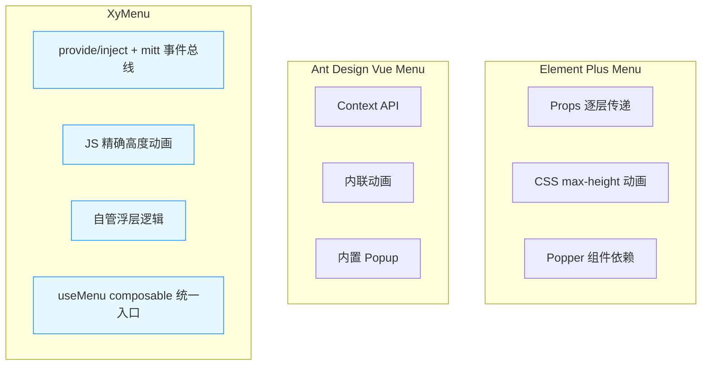
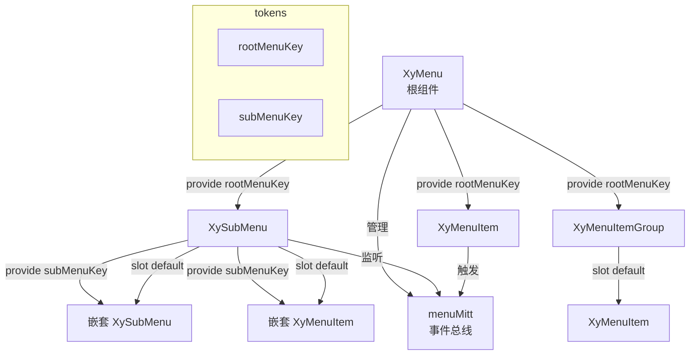
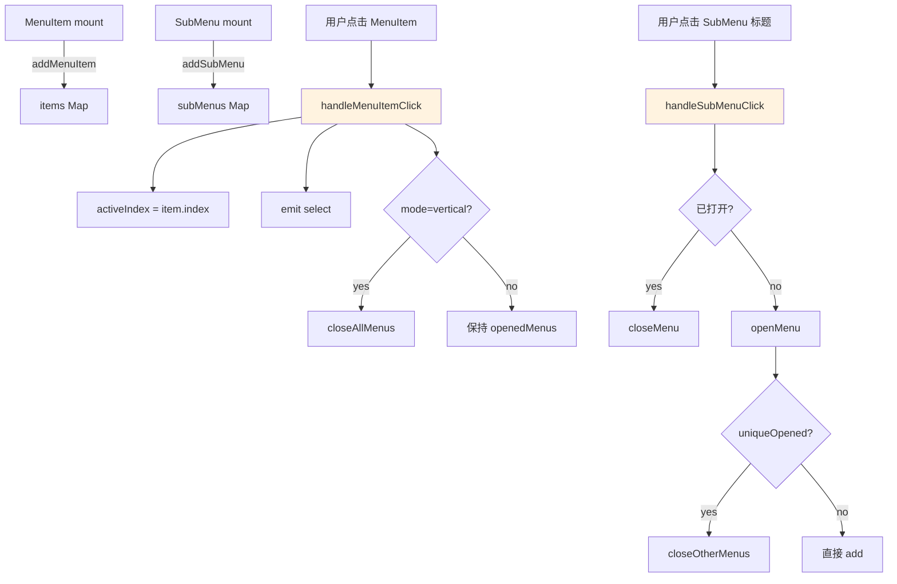
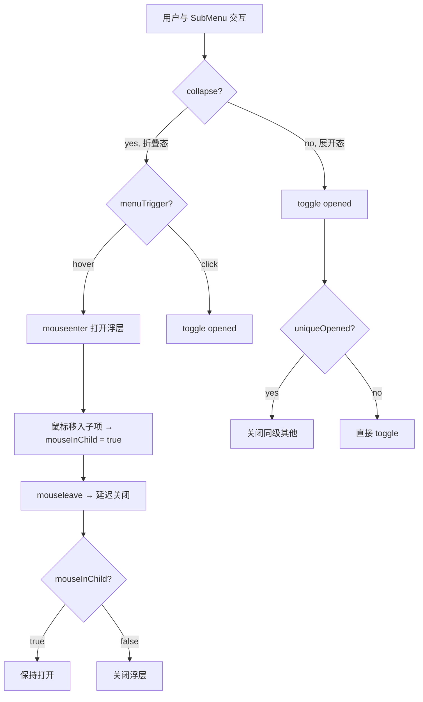
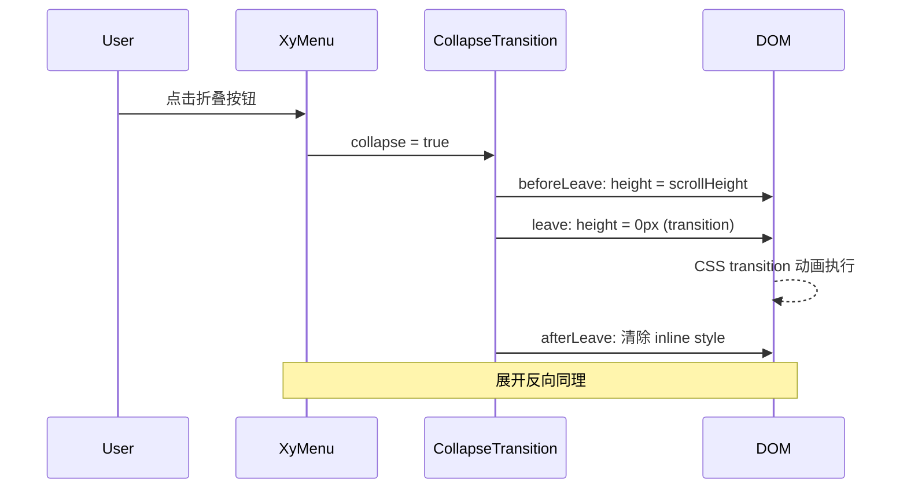

# 23 Menu 菜单

> 导读：Menu 是导航体系的核心骨架，通过递归的 SubMenu 嵌套、折叠/展开状态机、provide/inject 逐层注入，为任意深度的导航结构提供统一的状态管理和交互范式。

## 设计哲学

### 组件存在的理由

中后台应用的导航有三个核心矛盾：

1. **深度与可见性**：三级以上菜单全展开则溢出，全折叠则无全局感知
2. **状态一致性**：折叠态用 Popover 浮层，展开态用行内嵌套，两种模式共享选中/展开状态
3. **性能与灵活性**：上百个菜单项的递归渲染需要精确控制更新范围

Menu 组件通过一套**三层状态机**（Menu -> SubMenu -> MenuItem）加**递归 provide/inject** 来解决这些矛盾。

### 设计决策

| 决策点 | 选择 | WHY |
| --- | --- | --- |
| 状态通信 | provide/inject 逐层注入 | 菜单深度不可预知，props 逐层传递不可维护 |
| 折叠实现 | 独立 `XyMenuCollapseTransition` 组件 | 用 JS 计算高度而非 CSS `max-height` hack，避免动画不精确 |
| 子菜单浮层 | 自管 Popover 而非依赖 xy-popper | 折叠态的子菜单浮层逻辑特殊（鼠标移入触发、多级级联），定制化程度高 |
| 实例注册 | `menuMitt` 事件总线 + `useMenu` composable | 跨组件通信解耦，SubMenu 和 MenuItem 无需直接引用 Menu 实例 |
| 类型安全 | `MenuItemRegistered` 接口统一注册信息 | 选中、展开、搜索都依赖 index，统一类型避免 index vs value 混淆 |

### 与同类组件库的差异化



XyMenu 的核心差异在于**自管浮层 + 事件总线**：SubMenu 在折叠态下自行管理浮层的显示/隐藏/定位，无需依赖 Popper 组件，这让多级级联浮层的交互逻辑更可控；`menuMitt` 事件总线让子组件可以向上发事件而无需反向 props 回调。

## 源码架构

### 文件结构

```
packages/components/menu/
├── index.ts                          # 导出入口
├── src/
│   ├── menu.vue                      # 根组件：状态管理、provide 注入
│   ├── menu.ts                       # MenuProps & 类型声明
│   ├── sub-menu.vue                  # 子菜单：展开/折叠、浮层管理
│   ├── sub-menu.ts                   # SubMenuProps
│   ├── menu-item.vue                 # 菜单项：选中态、点击处理
│   ├── menu-item.ts                  # MenuItemProps
│   ├── menu-item-group.vue           # 菜单分组：标题 + 列表
│   ├── menu-item-group.ts            # MenuItemGroupProps
│   ├── menu-collapse-transition.vue  # 折叠过渡动画组件
│   ├── tokens.ts                     # InjectionKey 定义
│   ├── types.ts                      # 共享类型（MenuItemRegistered 等）
│   ├── use-menu.ts                   # 核心逻辑 composable
│   └── instance.ts                   # 组件实例类型
```

### 组件关系图



### 核心 type 定义

```ts
// types.ts — 注册信息
export interface MenuItemRegistered {
  index: string;
  indexPath: ComputedRef<string[]>;
  active: ComputedRef<boolean>;
}

// MenuProvider — 根菜单注入接口（核心方法）
export interface MenuProvider {
  props: MenuProps;
  openedMenus: Set<string>;
  items: Map<string, MenuItemRegistered>;
  subMenus: Map<string, MenuItemRegistered>;
  activeIndex: Ref<string>;
  addMenuItem: (item: MenuItemRegistered) => void;
  removeMenuItem: (item: MenuItemRegistered) => void;
  addSubMenu: (subMenu: MenuItemRegistered) => void;
  removeSubMenu: (subMenu: MenuItemRegistered) => void;
  openMenu: (index: string, indexPath: string[]) => void;
  closeMenu: (index: string) => void;
  handleMenuItemClick: (item: MenuItemRegistered) => void;
  handleSubMenuClick: (subMenu: MenuItemRegistered) => void;
}

// SubMenuProvider — 父级 SubMenu 注入接口
export interface SubMenuProvider {
  addSubMenu: (item: MenuItemRegistered) => void;
  removeSubMenu: (item: MenuItemRegistered) => void;
  handleMouseleave?: (dispatch: boolean) => void;
  mouseInChild: Ref<boolean>;
}
```

```ts
// menu.ts — 核心属性
export interface MenuProps {
  mode?: "vertical" | "horizontal";
  collapse?: boolean;
  defaultActive?: string;
  defaultOpeneds?: string[];
  active?: string;        // v-model
  openeds?: string[];     // v-model
  uniqueOpened?: boolean;
  router?: boolean;
  menuTrigger?: "hover" | "click";
}
```

## 核心实现

### useMenu：状态管理中枢

`useMenu` 是 Menu 的核心 composable，管理着 `items`、`subMenus`、`openedMenus`、`activeIndex` 四组状态，并通过 `menuMitt` 事件总线与子组件通信。

```ts
export function useMenu() {
  const items = ref<Map<string, MenuItemRegistered>>(new Map());
  const subMenus = ref<Map<string, MenuItemRegistered>>(new Map());
  const openedMenus = ref<Set<string>>(new Set());
  const activeIndex = ref<string>("");

  // ── 注册/注销 ──
  const addMenuItem = (item: MenuItemRegistered) => {
    items.value.set(item.index, item);
  };
  const removeMenuItem = (item: MenuItemRegistered) => {
    items.value.delete(item.index);
  };
  const addSubMenu = (subMenu: MenuItemRegistered) => {
    subMenus.value.set(subMenu.index, subMenu);
  };
  const removeSubMenu = (subMenu: MenuItemRegistered) => {
    subMenus.value.delete(subMenu.index);
  };

  // ── 打开/关闭子菜单 ──
  const openMenu = (index: string, indexPath: string[]) => {
    if (openedMenus.value.has(index)) return;
    if (props.uniqueOpened) {
      // 关闭同层级所有已打开子菜单
      closeOtherMenus(index, indexPath);
    }
    openedMenus.value.add(index);
  };

  const closeMenu = (index: string) => {
    openedMenus.value.delete(index);
  };

  // ── 选中逻辑 ──
  const handleMenuItemClick = (item: MenuItemRegistered) => {
    activeIndex.value = item.index;
    emit("select", item.index, item.indexPath.value, item);
    // vertical 模式下点击菜单项关闭所有已打开子菜单
    if (props.mode === "vertical" && !props.collapse) {
      closeAllMenus();
    }
  };

  return {
    items, subMenus, openedMenus, activeIndex,
    addMenuItem, removeMenuItem, addSubMenu, removeSubMenu,
    openMenu, closeMenu, handleMenuItemClick,
  };
}
```

**WHY Map/Set 而非数组**：`Map` 按 key 查找是 O(1)，`Set` 的 `has` 也是 O(1)。菜单项可能有上百个，用数组 `find` 会在每次选中/展开时线性扫描，列表越长卡顿越明显。

状态流转图：



### SubMenu 的双模渲染

SubMenu 是 Menu 体系中最复杂的组件，它需要根据 `collapse` 状态切换两种完全不同的渲染模式：

```ts
// sub-menu.vue setup
const rootMenu = inject<MenuProvider>(rootMenuKey)!;
const parentSubMenu = inject<SubMenuProvider | null>(subMenuKey, null);

const opened = computed(() => rootMenu.openedMenus.has(props.index));
const isActive = computed(() =>
  rootMenu.subMenus.get(props.index)?.active.value
);
const subMenu = ref<HTMLElement>();
const nestMode = computed(() =>
  rootMenu.props.collapse && rootMenu.props.mode === "vertical"
    ? "vertical" : rootMenu.props.mode
);
```

模板中的条件渲染：

```html
<!-- 折叠态：浮层 -->
<xy-transition v-if="rootMenu.props.collapse">
  <div v-show="opened" class="xy-menu--popup-container">
    <!-- 第一级标题 -->
    <div class="xy-menu--popup-title">{{ title }}</div>
    <!-- 子菜单内容 -->
    <slot />
  </div>
</xy-transition>

<!-- 展开态：行内嵌套 -->
<xy-transition v-else>
  <div v-show="opened" class="xy-sub-menu__content">
    <slot />
  </div>
</xy-transition>
```

**WHY 两种渲染而非 `v-show` 切换**：折叠态的子菜单是一个浮层（跟随鼠标位置，点击外部关闭），展开态是行内嵌套（占据侧边栏空间），两者的 DOM 结构、定位方式、事件处理完全不同，用同一套 DOM 切换会导致大量条件分支和样式冲突。

双模交互流程：



### 折叠过渡动画

`XyMenuCollapseTransition` 使用 JS 精确计算高度，而非 CSS `max-height` 的 hack 方案：

```ts
// menu-collapse-transition.vue
function beforeEnter(el: HTMLElement) {
  el.style.height = "0px";
  el.style.overflow = "hidden";
}

function enter(el: HTMLElement) {
  el.style.height = `${el.scrollHeight}px`;
}

function afterEnter(el: HTMLElement) {
  el.style.height = "";
  el.style.overflow = "";
}

function beforeLeave(el: HTMLElement) {
  el.style.height = `${el.scrollHeight}px`;
  el.style.overflow = "hidden";
}

function leave(el: HTMLElement) {
  // 强制浏览器重排，确保起始高度已应用
  void el.offsetHeight;
  el.style.height = "0px";
}

function afterLeave(el: HTMLElement) {
  el.style.height = "";
  el.style.overflow = "";
}
```

**WHY JS 高度动画**：CSS `max-height` 方案需设一个"足够大"的值（如 `999px`），导致动画时长与实际展开高度不匹配，且无法实现缓入缓出。JS `scrollHeight` 方案精确获取内容高度，配合 CSS `transition: height` 实现自然动画。



### provide/inject 逐层注入

Menu 使用两层 InjectionKey 实现逐层通信：

```ts
// tokens.ts
export const rootMenuKey: InjectionKey<MenuProvider> = Symbol("rootMenu");
export const subMenuKey: InjectionKey<SubMenuProvider> = Symbol("subMenu");
```

注入链路：

```
XyMenu  ──── provide(rootMenuKey, menuProvider)
  │
  ├── XySubMenu  ──── inject(rootMenuKey) → 获取根状态
  │                 ──── provide(subMenuKey, subMenuProvider) → 供子级使用
  │     │
  │     ├── XySubMenu  ──── inject(rootMenuKey) → 仍可访问根
  │     │               ──── inject(subMenuKey) → 获取父级 SubMenu
  │     │               ──── provide(subMenuKey, ownProvider)
  │     │
  │     └── XyMenuItem  ──── inject(rootMenuKey) → 调用 handleMenuItemClick
  │                       ──── inject(subMenuKey) → 感知鼠标是否在父级浮层内
  │
  └── XyMenuItem  ──── inject(rootMenuKey)
```

**WHY 双层注入**：`rootMenuKey` 让任何层级的子组件都能直接访问根状态，无需逐层转发；`subMenuKey` 让子组件感知父级 SubMenu 的 `mouseInChild` 状态，这对折叠态浮层的鼠标交互至关重要——鼠标从浮层移出时需判断是否移入了子级浮层。

### indexPath 递归收集

每个 MenuItem/SubMenu 在注册时构建 `indexPath`（从根到当前项的路径），用于 `uniqueOpened` 模式下关闭无关子菜单。`useMenu` composable 通过 `inject(subMenuKey)` 逐层向上收集父级 index：

```ts
const indexPath = computed(() => {
  const path: string[] = [];
  let parent = parentSubMenu;
  while (parent) {
    path.unshift(parent.index!);
    parent = parent.parentSubMenu;
  }
  return path;
});
```

使用 `computed` 保证父级动态增减时路径自动更新。

## API 参考

### Menu Props

| 属性 | 说明 | 类型 | 默认值 |
| --- | --- | --- | --- |
| `mode` | 展示模式 | `'vertical' \| 'horizontal'` | `'vertical'` |
| `collapse` | 是否折叠 | `boolean` | `false` |
| `ellipsis` | 水平模式下超出是否省略 | `boolean` | `true` |
| `default-active` | 默认激活项的 index | `string` | `''` |
| `default-openeds` | 默认展开的 SubMenu index 数组 | `string[]` | `[]` |
| `active` (v-model) | 当前激活项的 index | `string` | `—` |
| `openeds` (v-model) | 当前展开的 SubMenu index 数组 | `string[]` | `—` |
| `unique-opened` | 是否只保持一个子菜单展开 | `boolean` | `false` |
| `router` | 是否使用 vue-router 进行路由跳转 | `boolean` | `false` |
| `menu-trigger` | 子菜单触发方式 | `'hover' \| 'click'` | `'hover'` |

### Menu Emits

| 事件 | 说明 | 参数 |
| --- | --- | --- |
| `select` | 菜单项被选中时触发 | `(index: string, indexPath: string[], item: MenuItemRegistered)` |
| `open` | 子菜单展开时触发 | `(index: string, indexPath: string[])` |
| `close` | 子菜单收起时触发 | `(index: string, indexPath: string[])` |

### Menu Slots

| 插槽 | 说明 |
| --- | --- |
| `default` | `xy-sub-menu`、`xy-menu-item`、`xy-menu-item-group` |

### SubMenu Props

| 属性 | 说明 | 类型 | 默认值 |
| --- | --- | --- | --- |
| `index` | 唯一标识（必填） | `string` | `—` |
| `title` | 子菜单标题 | `string` | `''` |
| `show-timeout` | 折叠态下浮层显示延迟(ms) | `number` | `300` |
| `hide-timeout` | 折叠态下浮层隐藏延迟(ms) | `number` | `300` |
| `popper-class` | 浮层自定义 class | `string` | `''` |
| `disabled` | 是否禁用 | `boolean` | `false` |

### SubMenu Slots

| 插槽 | 说明 |
| --- | --- |
| `title` | 自定义标题内容 |
| `default` | `xy-menu-item`、`xy-sub-menu` 等 |

### MenuItem Props

| 属性 | 说明 | 类型 | 默认值 |
| --- | --- | --- | --- |
| `index` | 唯一标识 | `string` | `—` |
| `route` | Vue Router 路径对象 | `object` | `—` |
| `disabled` | 是否禁用 | `boolean` | `false` |

### MenuItemGroup

| 属性 | 说明 | 类型 | 默认值 |
| --- | --- | --- | --- |
| `title` | 分组标题 | `string` | `''` |

| 插槽 | 说明 |
| --- | --- |
| `default` | 分组内的 `xy-menu-item` |

## 样式系统

### BEM 类名

| 类名 | 说明 |
| --- | --- |
| `.xy-menu` | 根容器 |
| `.xy-menu--vertical / --horizontal / --collapse` | 模式修饰 |
| `.xy-sub-menu` | 子菜单 |
| `.xy-sub-menu__title / --active` | 子菜单标题 |
| `.xy-sub-menu__content` | 子菜单内容容器 |
| `.xy-sub-menu__arrow` | 展开箭头图标 |
| `.xy-menu-item` | 菜单项 |
| `.xy-menu-item.is-active / .is-disabled` | 激活 / 禁用态 |
| `.xy-menu-item-group` | 菜单分组 |
| `.xy-menu-item-group__title` | 分组标题 |
| `.xy-menu--popup-container` | 折叠态浮层容器 |

### CSS 变量

| 变量 | 说明 | 默认值 |
| --- | --- | --- |
| `--xy-menu-item-height` | 菜单项高度 | `56px` |
| `--xy-menu-collapse-width` | 折叠态宽度 | `64px` |
| `--xy-menu-active-color` | 激活态文字颜色 | `var(--xy-color-primary)` |
| `--xy-menu-active-bg` | 激活态背景色 | `var(--xy-color-primary-light-9)` |
| `--xy-menu-hover-bg` | hover 态背景色 | `var(--xy-fill-color-light)` |
| `--xy-menu-bg-color` | 菜单背景色 | `var(--xy-fill-color-blank)` |
| `--xy-menu-text-color` | 默认文字颜色 | `var(--xy-text-color-primary)` |
| `--xy-menu-sub-item-height` | 子菜单项高度 | `50px` |
| `--xy-menu-item-group-title-color` | 分组标题文字颜色 | `var(--xy-text-color-secondary)` |

### 主题定制方式

```css
.my-sidebar {
  --xy-menu-item-height: 48px;
  --xy-menu-active-color: #e6533c;
  --xy-menu-active-bg: #fef0ed;
  --xy-menu-bg-color: #1d1e1f;
  --xy-menu-text-color: #ffffffd9;
}
```

## 小结

1. **Map/Set + 事件总线**：用 `Map<string, MenuItemRegistered>` 管理注册项，O(1) 查找保证百级菜单的性能；`menuMitt` 事件总线让子组件无需反向 props 回调即可与根通信，解耦层级依赖。
2. **双模渲染的 SubMenu**：折叠态（浮层 + mouseenter/mouseleave）与展开态（行内嵌套 + click toggle）使用条件渲染分支，而非同一 DOM 上条件样式，避免逻辑纠缠和样式冲突。
3. **双层 provide/inject**：`rootMenuKey` 提供全局状态访问，`subMenuKey` 提供父级感知能力，两者配合实现了任意嵌套深度下的状态一致性和浮层交互正确性。