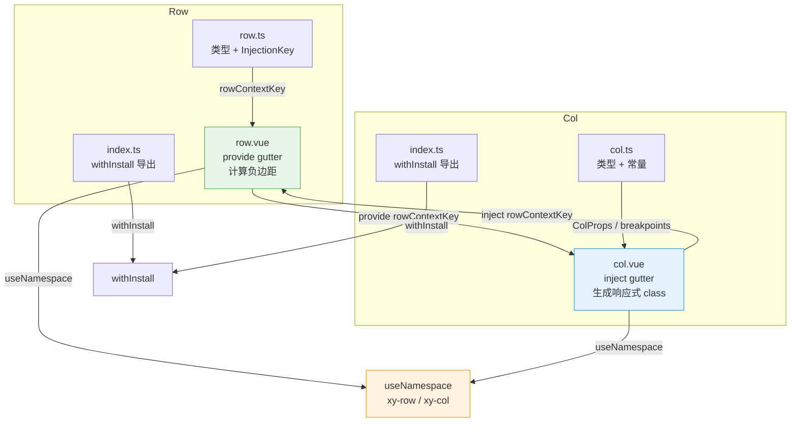

# 24 Row 栅格-行

基于 24 等分列与 Flexbox 的经典栅格布局方案，Row 负责容器级对齐与间距，Col 负责列宽、偏移与响应式断点，二者通过 provide/inject 通信，实现 gutter 的自动传递。

---

## 设计哲学

1. **24 等分约定**：沿用业界主流的 24 列栅格，能被 2、3、4、6、8、12 整除，覆盖绝大多数等分场景。
2. **Flexbox 优先**：Row 本质是 `display: flex; flex-wrap: wrap`，justify / align 直接映射 Flex 主轴与交叉轴，零抽象损耗。
3. **负边距补偿**：gutter 通过 Row 的负 margin 与 Col 的等分 padding 实现视觉等距，无需额外嵌套。
4. **响应式断点**：Col 支持 xs / sm / md / lg / xl 五档断点，值可为数字或对象，以一套声明覆盖全视口。
5. **provide/inject 解耦**：Row 将 gutter 注入上下文，Col 自动消费，无需手动传参。

---

## 源码架构



---

## 核心 Props / Emits / Slots 类型定义

### RowProps

```typescript
// packages/components/row/src/row.ts

export const rowJustifies = [
  "start", "center", "end",
  "space-around", "space-between", "space-evenly"
] as const;

export const rowAligns = ["top", "middle", "bottom"] as const;

export type RowJustify = (typeof rowJustifies)[number];
export type RowAlign   = (typeof rowAligns)[number];

export interface RowProps {
  tag?: string;       // 自定义根标签，默认 "div"
  gutter?: number;    // 列间距（px），默认 0
  justify?: RowJustify; // 主轴排列，默认 "start"
  align?: RowAlign;     // 交叉轴对齐，默认不设置
}
```

### RowContext（provide/inject 协议）

```typescript
export interface RowContext {
  gutter: ComputedRef<number>;
}

export const rowContextKey: InjectionKey<RowContext> = Symbol("xiaoye-row");
```

### ColProps

```typescript
// packages/components/col/src/col.ts

export const colPositionProps = ["span", "offset", "pull", "push"] as const;
export const colBreakpoints   = ["xs", "sm", "md", "lg", "xl"] as const;

export type ColPositionProp = (typeof colPositionProps)[number];
export type ColBreakpoint   = (typeof colBreakpoints)[number];

export interface ColSizeObject {
  span?: number;
  offset?: number;
  pull?: number;
  push?: number;
}

export type ColSize = number | ColSizeObject;

export interface ColProps {
  tag?: string;        // 自定义根标签，默认 "div"
  span?: number;       // 栅格占位格数，默认 24
  offset?: number;     // 左侧偏移格数，默认 0
  pull?: number;       // 右移格数，默认 0
  push?: number;       // 左移格数，默认 0
  xs?: ColSize;        // <768px  断点
  sm?: ColSize;        // >=768px 断点
  md?: ColSize;        // >=992px 断点
  lg?: ColSize;        // >=1200px 断点
  xl?: ColSize;        // >=1920px 断点
}
```

### Slots

| 组件  | 插槽名   | 说明         |
|-------|----------|-------------|
| Row   | default  | 放置 Col 子节点 |
| Col   | default  | 列内容       |

两个组件均无自定义 Emits。

---

## 核心实现

### Row：provide gutter + 负边距

```typescript
// row.vue — 核心逻辑
const props = withDefaults(defineProps<RowProps>(), {
  tag: "div",
  gutter: 0,
  justify: "start"
});

const ns = useNamespace("row");
const gutter = computed(() => props.gutter);

// 将 gutter 注入上下文，供 Col 消费
provide(rowContextKey, { gutter });

// 负边距：让左右两侧各缩进 gutter/2，为 Col 的 padding 留出空间
const style = computed<CSSProperties>(() => {
  if (!props.gutter) return {};
  const halfGutter = props.gutter / 2;
  return {
    marginLeft: `-${halfGutter}px`,
    marginRight: `-${halfGutter}px`
  };
});

// BEM 状态类
const rowClasses = computed(() => [
  ns.base.value,                                          // xy-row
  props.justify !== "start" ? ns.is(`justify-${props.justify}`, true) : "",
  props.align ? ns.is(`align-${props.align}`, true) : ""
]);
```

**模板**：

```html
<component :is="props.tag" :class="rowClasses" :style="style">
  <slot />
</component>
```

### Col：inject gutter + 响应式 class 生成

```typescript
// col.vue — 核心逻辑
const props = withDefaults(defineProps<ColProps>(), {
  tag: "div", span: 24, offset: 0, pull: 0, push: 0
});

const ns = useNamespace("col");

// 从 Row 上下文获取 gutter
const { gutter } = inject(rowContextKey, {
  gutter: computed(() => 0)
});

// 类型守卫：判断断点值是否为对象形式
function isColSizeObject(value: ColSize | undefined): value is ColSizeObject {
  return value !== null && typeof value === "object";
}

// 基础 class：xy-col-{n} / xy-col-offset-{n} / xy-col-pull-{n} / xy-col-push-{n}
function appendBaseClass(classes: string[], prop: ColPositionProp, value: number) {
  if (prop === "span") {
    classes.push(`${ns.base.value}-${value}`);
    return;
  }
  if (value > 0) {
    classes.push(`${ns.base.value}-${prop}-${value}`);
  }
}

// 响应式 class：xy-col-{bp}-{n} / xy-col-{bp}-offset-{n} 等
function appendResponsiveClass(
  classes: string[],
  breakpoint: ColBreakpoint,
  size: ColSize | undefined
) {
  if (typeof size === "number") {
    classes.push(`${ns.base.value}-${breakpoint}-${size}`);
    return;
  }
  if (!isColSizeObject(size)) return;
  colPositionProps.forEach((prop) => {
    const value = size[prop];
    if (typeof value === "number") {
      classes.push(
        prop === "span"
          ? `${ns.base.value}-${breakpoint}-${value}`
          : `${ns.base.value}-${breakpoint}-${prop}-${value}`
      );
    }
  });
}

// 汇总所有 class
const colClasses = computed(() => {
  const classes = [ns.base.value]; // xy-col
  appendBaseClass(classes, "span", props.span);
  appendBaseClass(classes, "offset", props.offset);
  appendBaseClass(classes, "pull", props.pull);
  appendBaseClass(classes, "push", props.push);

  colBreakpoints.forEach((breakpoint) => {
    appendResponsiveClass(classes, breakpoint, props[breakpoint]);
  });

  if (gutter.value) {
    classes.push(ns.is("guttered", true)); // is-guttered
  }
  return classes;
});

// gutter 产生的左右 padding
const style = computed<CSSProperties>(() => {
  const nextStyle: CSSProperties = {};
  if (gutter.value) {
    nextStyle.paddingLeft  = `${gutter.value / 2}px`;
    nextStyle.paddingRight = `${gutter.value / 2}px`;
  }
  return nextStyle;
});
```

**模板**：

```html
<component :is="props.tag" :class="colClasses" :style="style">
  <slot />
</component>
```

---

## 样式系统

### Row 样式（`packages/theme/src/components/row.css`）

```css
.xy-row {
  display: flex;
  flex-wrap: wrap;
  position: relative;
  box-sizing: border-box;
  min-width: 0;
}

/* justify 映射 */
.xy-row.is-justify-center        { justify-content: center; }
.xy-row.is-justify-end           { justify-content: flex-end; }
.xy-row.is-justify-space-between { justify-content: space-between; }
.xy-row.is-justify-space-around  { justify-content: space-around; }
.xy-row.is-justify-space-evenly  { justify-content: space-evenly; }

/* align 映射 */
.xy-row.is-align-top    { align-items: flex-start; }
.xy-row.is-align-middle { align-items: center; }
.xy-row.is-align-bottom { align-items: flex-end; }
```

### Col 样式（`packages/theme/src/components/col.css`）

Col 样式采用 **预生成** 策略：0~24 每个格数对应 4 组 class（span / offset / pull / push），共 100 条基础规则 + 5 档断点媒体查询。

核心模式（以 `n` 为格数，`p = n / 24 * 100%`）：

```css
.xy-col        { position: relative; box-sizing: border-box; min-width: 0; max-width: 100%; }
.xy-col.is-guttered { min-height: 1px; }

.xy-col-n      { display: block; flex: 0 0 p%; max-width: p%; }
.xy-col-offset-n { margin-left: p%; }
.xy-col-pull-n { position: relative; right: p%; }
.xy-col-push-n { position: relative; left: p%; }

/* 响应式断点 */
@media (max-width: 767px)  { .xy-col-xs-n  { ... } }
@media (min-width: 768px)  { .xy-col-sm-n  { ... } }
@media (min-width: 992px)  { .xy-col-md-n  { ... } }
@media (min-width: 1200px) { .xy-col-lg-n  { ... } }
@media (min-width: 1920px) { .xy-col-xl-n  { ... } }
```

### gutter 补偿原理

```
┌─ Row (margin-left: -g/2, margin-right: -g/2) ──────────────────┐
│ ┌─ Col (padding-left: g/2, padding-right: g/2) ─┐ ┌─ Col ─┐   │
│ │  内容区域                                      │ │ 内容  │   │
│ └────────────────────────────────────────────────┘ └────────┘   │
└──────────────────────────────────────────────────────────────────┘
```

Row 负边距抵消最外侧 Col 的半 gutter，使内容区与容器边缘对齐；相邻 Col 的半 gutter 之和恰好等于完整 gutter。

---

## 与其他组件的联动

| 联动场景 | 说明 |
|----------|------|
| **Row + Col** | 核心搭档，Row provide gutter，Col inject 并应用 padding |
| **Form + Row + Col** | 表单水平布局：`<xy-form><xy-row><xy-col :span="12">...` |
| **Space + Row** | Space 管理行内元素间距，Row/Col 管理栅格比例，二者可嵌套使用 |
| **Divider + Row** | Divider 可置于 Row 之间做区域分隔，vertical 模式适合 Col 内列分隔 |
| **ConfigProvider** | Row/Col 暂不消费全局 size，但 namespace 可通过 ConfigProvider 切换前缀 |

---

## 扩展与定制

### 1. 自定义 namespace

通过 `XyConfigProvider` 的 `namespace` 属性可全局替换前缀（默认 `xy`），使 class 变为 `custom-row` / `custom-col`。

### 2. 自定义 tag

Row 和 Col 均支持 `tag` prop，可渲染为 `<section>`、`<article>`、`<ul>/<li>` 等语义标签。

### 3. 响应式对象写法

断点 prop 接受对象，一次性声明 span / offset / pull / push：

```html
<xy-col :xs="{ span: 24, offset: 0 }" :md="{ span: 12 }" :lg="{ span: 8 }">
  响应式列
</xy-col>
```

### 4. pull / push 栅格排序

利用 `pull` 和 `push` 可在不改变 DOM 顺序的前提下视觉重排列：

```html
<xy-row>
  <xy-col :span="12" :push="12">左侧（DOM 在前）</xy-col>
  <xy-col :span="12" :pull="12">右侧（DOM 在后）</xy-col>
</xy-row>
```

### 5. 扩展断点

当前断点硬编码为 xs / sm / md / lg / xl 五档。若需自定义断点（如 2xl），需同时修改 `colBreakpoints` 常量与 `col.css` 中的媒体查询，属于破坏性变更，建议通过 fork 或 theme override 实现。
