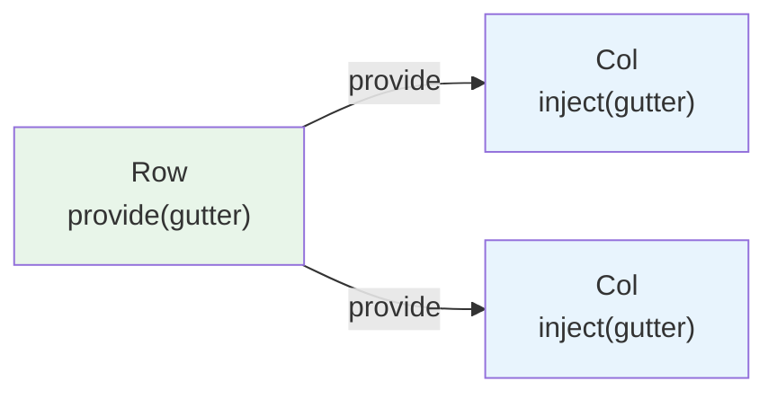
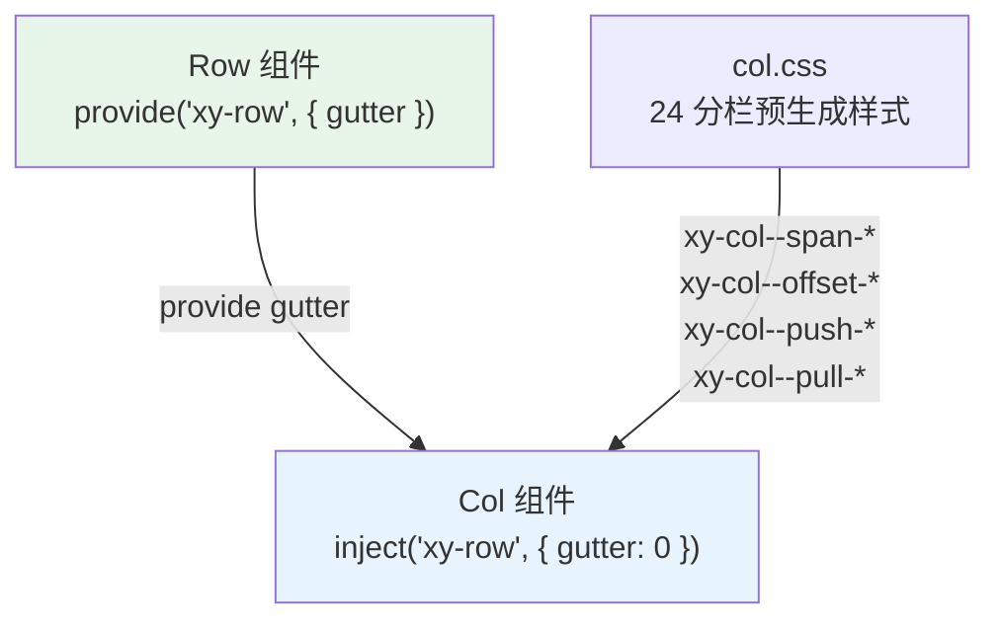
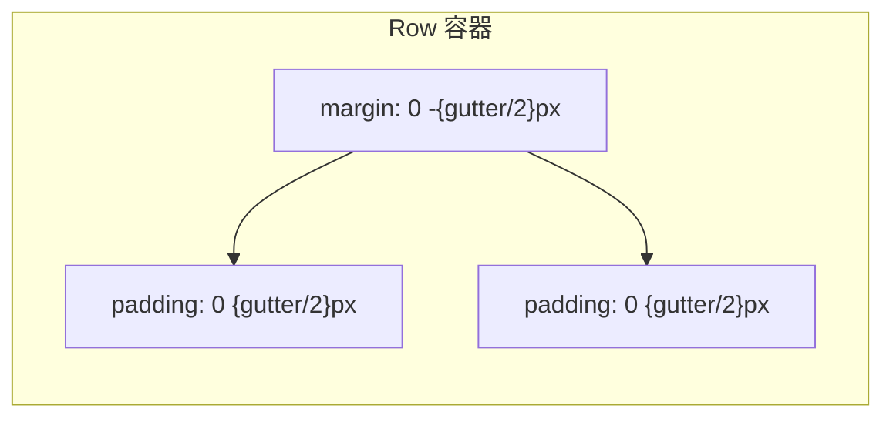
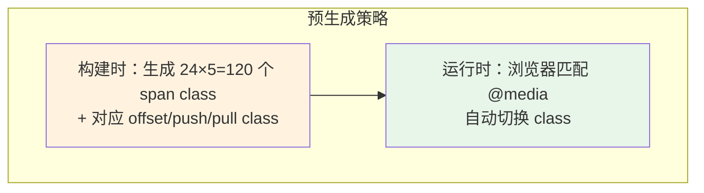

# 25 Col 栅格-列

> 导读：Col 是栅格系统的列组件，通过 flex 布局和 24 分栏规则，实现精确的响应式页面布局。它与 Row 配合，通过 provide/inject 共享 gutter 间距信息，是 xiaoye-components 布局体系的基础。

## 设计哲学

Col 的核心设计问题只有一个：**如何让列知道"行"的间距？**



传统方案是在每个 Col 上手动设置 `margin-left` / `margin-right`，但这会导致两端多出半个 gutter 的空白。xiaoye-components 的方案是 Row 通过 `provide` 向下传递 gutter 值，Col 通过 `inject` 接收后用 `padding` 补偿——这样 Row 可以用负 margin 抵消两端的 padding，保持视觉对齐。

### 设计决策

| 决策 | 选择 | 理由 |
|------|------|------|
| 分栏数 | 24 | Ant Design / Element Plus 生态约定，开发者心智负担最低 |
| 响应式方案 | CSS 预生成 + Props 覆盖 | 预生成避免运行时计算，Props 支持动态切换 |
| Gutter 传递 | provide/inject | 比 props 层层传递更简洁，且支持嵌套 Row |
| 列偏移 | offset prop | 独立于 span，语义清晰 |

## 源码架构

### 文件结构

```
col/
├── src/
│   ├── col.vue        # 组件实现
│   └── col.ts         # 类型定义
└── index.ts           # withInstall 导出
```

### 组件关系图



### 核心 type 定义

```ts
// 列定位属性（push / pull）
export const colPositionProps = {
  push: Number,   // 向右移动格数
  pull: Number,   // 向左移动格数
} as const;

// 列尺寸对象（响应式断点配置）
export interface ColSize {
  span?: number;
  offset?: number;
  push?: number;
  pull?: number;
}

// 响应式断点常量
export const colBreakpoints = ["xs", "sm", "md", "lg", "xl"] as const;

// Col Props
export const colProps = {
  span: Number,           // 占据格数（1-24）
  offset: Number,         // 左侧偏移格数
  push: Number,           // 右移格数
  pull: Number,           // 左移格数
  xs: [Number, Object] as PropType<number | ColSize>,  // <576px
  sm: [Number, Object] as PropType<number | ColSize>,  // ≥576px
  md: [Number, Object] as PropType<number | ColSize>,  // ≥768px
  lg: [Number, Object] as PropType<number | ColSize>,  // ≥992px
  xl: [Number, Object] as PropType<number | ColSize>,  // ≥1200px
  tag: { type: String, default: "div" },  // 渲染标签
} as const;
```

**ColSize 的双重用法**：响应式断点（xs/sm/md/lg/xl）既接受数字（简写 span），也接受对象（完整配置）。这种设计减少了简单场景的模板代码量：

```vue
<!-- 简写：xs 只设 span -->
<xy-col :xs="24" :sm="12" :md="8" />

<!-- 完整：xs 同时设 span + offset -->
<xy-col :xs="{ span: 24, offset: 0 }" :sm="{ span: 12, offset: 2 }" />
```

## 核心实现

### 1. Gutter 的 inject 与 padding 补偿

```ts
// col.vue
const rowContext = inject("xy-row", { gutter: 0 });

const style = computed(() => {
  const gutter = rowContext.gutter;
  if (!gutter) return {};
  const padding = `${gutter / 2}px`;
  return { paddingLeft: padding, paddingRight: padding };
});
```



**WHY padding 而非 margin？** 使用 padding 时，Col 的 `box-sizing: border-box` 确保内容区域正确缩小；而 margin 会增加 Col 的总宽度，可能导致最后一列换行。

### 2. Class 生成策略

```ts
const classes = computed(() => {
  const cls: string[] = ["xy-col"];

  if (props.span) cls.push(`xy-col--span-${props.span}`);
  if (props.offset) cls.push(`xy-col--offset-${props.offset}`);
  if (props.push) cls.push(`xy-col--push-${props.push}`);
  if (props.pull) cls.push(`xy-col--pull-${props.pull}`);

  // 响应式断点 class
  colBreakpoints.forEach((bp) => {
    const size = props[bp];
    if (!size) return;
    if (typeof size === "number") {
      cls.push(`xy-col--${bp}-span-${size}`);
    } else {
      if (size.span) cls.push(`xy-col--${bp}-span-${size.span}`);
      if (size.offset) cls.push(`xy-col--${bp}-offset-${size.offset}`);
      if (size.push) cls.push(`xy-col--${bp}-push-${size.push}`);
      if (size.pull) cls.push(`xy-col--${bp}-pull-${size.pull}`);
    }
  });

  return cls;
});
```

**WHY 预生成 CSS class？** 如果用内联样式（`width: ${span/24*100}%`），响应式断点需要运行时 `matchMedia` 监听，增加运行时开销。预生成 CSS class 让浏览器原生处理媒体查询，性能最优。

### 3. 响应式断点的 CSS 预生成

CSS 中为每个断点预生成了所有 span/offset/push/pull 的样式：

```css
/* 默认 span */
.xy-col--span-12 { flex: 0 0 50%; max-width: 50%; }
.xy-col--span-6  { flex: 0 0 25%; max-width: 25%; }

/* 响应式：sm 断点 */
@media (min-width: 576px) {
  .xy-col--sm-span-24 { flex: 0 0 100%; max-width: 100%; }
  .xy-col--sm-span-12 { flex: 0 0 50%; max-width: 50%; }
}

/* offset */
.xy-col--offset-6 { margin-left: 25%; }

/* push / pull：用 relative + left/right 实现 */
.xy-col--push-6  { left: 25%; }
.xy-col--pull-6  { right: 25%; }
```



**WHY push/pull 用 relative + left/right？** 因为 `push` 和 `pull` 是视觉偏移，不影响文档流中其他列的位置。`position: relative` + `left/right` 只移动当前列的视觉位置，不占据/释放空间。

### 4. 动态标签渲染

```ts
const tag = computed(() => props.tag || "div");
```

```vue
<template>
  <component :is="tag" :class="classes" :style="style">
    <slot />
  </component>
</template>
```

允许用户用语义化标签替代默认的 `<div>`，如 `<xy-col tag="section">` 或 `<xy-col tag="aside">`。

## API 参考

### Props

| Property | Type | Default | Description |
|----------|------|---------|-------------|
| span | `number` | - | 栅格占据的列数（1-24） |
| offset | `number` | - | 栅格左侧的间隔格数 |
| push | `number` | - | 栅格向右移动格数 |
| pull | `number` | - | 栅格向左移动格数 |
| xs | `number \| ColSize` | - | `<576px` 响应式配置 |
| sm | `number \| ColSize` | - | `≥576px` 响应式配置 |
| md | `number \| ColSize` | - | `≥768px` 响应式配置 |
| lg | `number \| ColSize` | - | `≥992px` 响应式配置 |
| xl | `number \| ColSize` | - | `≥1200px` 响应式配置 |
| tag | `string` | `"div"` | 自定义元素标签 |

### Slots

| Slot | Description |
|------|-------------|
| default | 列内容 |

## 样式系统

### BEM 类名

| 类名 | 说明 |
|------|------|
| `.xy-col` | 列基础类 |
| `.xy-col--span-{n}` | 占据 n/24 宽度 |
| `.xy-col--offset-{n}` | 左偏移 n/24 |
| `.xy-col--push-{n}` | 右移 n/24 |
| `.xy-col--pull-{n}` | 左移 n/24 |
| `.xy-col--{bp}-span-{n}` | 响应式断点下占据 n/24 |
| `.xy-col--{bp}-offset-{n}` | 响应式断点下左偏移 n/24 |

### CSS 变量引用

Col 的样式主要依赖预生成的百分比规则，不直接引用设计令牌变量。唯一与令牌相关的是 gutter 补偿（通过 Row 的 provide 传递）。

### 主题定制

Col 本身无需要覆盖的 CSS 变量。定制主要通过 Row 的 `gutter` prop 控制。

## 小结

1. **provide/inject 传递 gutter**：Row 通过 provide 向下传递间距，Col 通过 inject 接收后用 padding 补偿，Row 用负 margin 抵消两端空白
2. **CSS 预生成 + Props 覆盖**：24 分栏的所有 span/offset/push/pull 样式在构建时预生成，运行时由浏览器媒体查询自动匹配
3. **响应式断点的双重语法**：xs/sm/md/lg/xl 既支持数字简写（span），也支持对象完整配置（span + offset + push + pull）
