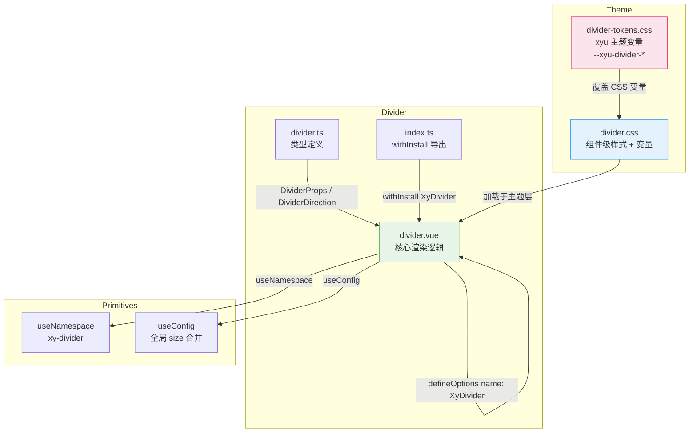

# 26 Divider 分割线

Divider 以视觉分割线划分内容区域，支持水平/垂直方向、文字嵌入、多尺寸与语义状态色，并通过 CSS 自定义属性与 `color-mix()` 实现精细化配色。

---

## 设计哲学

1. **语义优先**：`role="separator"` + `aria-orientation` 保证无障碍语义，屏幕阅读器可正确识别分隔角色。
2. **状态色融合**：通过 CSS `color-mix()` 将主题色（primary/success/warning/danger）与中性边框色按比例混合，避免纯色分隔线过于突兀。
3. **文字悬浮居中**：分隔文字使用 `position: absolute` + `transform` 定位，背景用 `color-mix` 半透明叠加，视觉上"悬浮"于分隔线之上。
4. **尺寸体系化**：sm / md / lg 三档尺寸覆盖间距、字号、内边距等全部变量，且可通过 `XyConfigProvider` 全局继承。
5. **CSS 变量驱动**：所有视觉参数均通过 `--xy-divider-*` 变量定义，一处修改全局生效。

---

## 源码架构



---

## 核心 Props / Emits / Slots 类型定义

### DividerProps

```typescript
// packages/components/divider/src/divider.ts

export const dividerDirections     = ["horizontal", "vertical"] as const;
export const dividerContentPositions = ["left", "center", "right"] as const;

export type DividerDirection       = (typeof dividerDirections)[number];
export type DividerContentPosition = (typeof dividerContentPositions)[number];
export type DividerBorderStyle     = CSSStyleDeclaration["borderStyle"];

export interface DividerProps {
  direction?: DividerDirection;        // 分割方向，默认 "horizontal"
  contentPosition?: DividerContentPosition; // 文字位置，默认 "center"
  borderStyle?: DividerBorderStyle;    // 边框线型，默认 "solid"
  size?: ComponentSize;                // 尺寸："xs"|"sm"|"md"|"lg"|"xl"
  status?: ComponentStatus;            // 语义状态："neutral"|"primary"|"success"|"warning"|"danger"
}

// ComponentSize = "" | "xs" | "sm" | "md" | "lg" | "xl"
// ComponentStatus = "neutral" | "primary" | "success" | "warning" | "danger"
```

### Slots

| 插槽名  | 说明 | 条件 |
|--------|------|------|
| default | 分隔文字内容 | 仅 `direction === "horizontal"` 时渲染 |

Divider 无自定义 Emits。

### 无障碍属性

| 属性 | 值 | 说明 |
|------|----|------|
| `role` | `"separator"` | WAI-ARIA 分隔角色 |
| `aria-orientation` | `direction` prop 值 | 声明方向 |

---

## 核心实现

```typescript
// divider.vue
defineOptions({ name: "XyDivider" });

const props = withDefaults(defineProps<DividerProps>(), {
  direction: "horizontal",
  contentPosition: "center",
  borderStyle: "solid",
  size: undefined,
  status: "neutral"
});

const slots = defineSlots<{ default?: () => unknown }>();

// 全局尺寸继承：props.size > ConfigProvider.size > "md"
const { size: globalSize } = useConfig();
const ns = useNamespace("divider");

const mergedSize = computed<ComponentSize>(
  () => props.size ?? globalSize.value
);

// 仅水平方向且有插槽内容时渲染文字区域
const hasContent = computed(
  () => props.direction === "horizontal" && Boolean(slots.default)
);

// BEM + 状态 class
const dividerClasses = computed(() => [
  ns.base.value,                        // xy-divider
  `${ns.base.value}--${props.direction}`, // xy-divider--horizontal / --vertical
  `${ns.base.value}--${mergedSize.value}`, // xy-divider--sm / --md / --lg
  ns.is(props.status, true)              // is-neutral / is-primary / ...
]);

// 将 borderStyle 写入 CSS 变量，由样式层消费
const dividerStyle = computed<CSSProperties>(
  () => ({
    [ns.cssVarBlock("border-style")]: props.borderStyle
  }) as CSSProperties
);
```

**模板**：

```html
<div
  :class="dividerClasses"
  :style="dividerStyle"
  role="separator"
  :aria-orientation="props.direction"
>
  <div
    v-if="hasContent"
    :class="[`${ns.base.value}__text`, ns.is(props.contentPosition, true)]"
  >
    <slot />
  </div>
</div>
```

关键设计点：
- `borderStyle` 通过 `ns.cssVarBlock("border-style")` 生成 `--xy-divider-border-style` CSS 变量，而非直接写 `border-style`，使得主题层可以统一控制。
- `hasContent` 将 `direction` 与 `slots.default` 双重判断，确保垂直模式不会误渲染文字。

---

## 样式系统

### 组件级 CSS 变量（`packages/theme/src/components/divider.css`）

```css
.xy-divider {
  /* 分隔线本体 */
  --xy-divider-border-style: solid;
  --xy-divider-thickness: 1px;
  --xy-divider-spacing: 24px;
  --xy-divider-color: color-mix(in srgb, var(--xy-border-color-subtle) 78%, transparent);
  --xy-divider-text-color: var(--xy-text-color-subtle);
  --xy-divider-font-size: var(--xy-font-size-md);
  --xy-divider-text-padding: 18px;
  --xy-divider-content-offset: 24px;
  --xy-divider-vertical-gap: 12px;
  --xy-divider-vertical-height: 1em;

  position: relative;
  box-sizing: border-box;
}
```

**水平方向**：

```css
.xy-divider--horizontal {
  display: block;
  width: 100%;
  height: var(--xy-divider-thickness);          /* 线厚 */
  margin: var(--xy-divider-spacing) 0;          /* 上下间距 */
  border-top: var(--xy-divider-thickness)        /* 线 */
              var(--xy-divider-border-style)      /* 线型（由 JS 写入 CSS 变量） */
              var(--xy-divider-color);            /* 颜色 */
}
```

**垂直方向**：

```css
.xy-divider--vertical {
  display: inline-block;
  width: var(--xy-divider-thickness);
  height: var(--xy-divider-vertical-height);    /* 默认 1em */
  margin: 0 var(--xy-divider-vertical-gap);
  vertical-align: middle;
  border-left: ... var(--xy-divider-color);
}
```

**文字悬浮层**：

```css
.xy-divider__text {
  position: absolute;
  top: 0;
  transform: translateY(-50%);
  display: inline-flex;
  align-items: center;
  min-height: 28px;
  padding: 0 var(--xy-divider-text-padding);
  border: 1px solid transparent;
  border-radius: var(--xy-radius-pill);
  background: color-mix(in srgb,
    var(--xy-bg-color-subtle) 50%,
    var(--xy-bg-color-floating)
  ); /* 半透明背景，让文字"浮"在线上 */
}

.xy-divider__text.is-left   { left: var(--xy-divider-content-offset); }
.xy-divider__text.is-center { left: 50%; transform: translate(-50%, -50%); }
.xy-divider__text.is-right  { right: var(--xy-divider-content-offset); }
```

**尺寸变体**：

```css
.xy-divider--sm {
  --xy-divider-spacing: 16px;
  --xy-divider-font-size: var(--xy-font-size-sm);
  --xy-divider-text-padding: 12px;
  --xy-divider-content-offset: 16px;
  --xy-divider-vertical-gap: 8px;
}
.xy-divider--lg {
  --xy-divider-spacing: 32px;
  --xy-divider-font-size: var(--xy-font-size-lg);
  --xy-divider-text-padding: 24px;
  --xy-divider-content-offset: 28px;
  --xy-divider-vertical-gap: 16px;
}
```

**状态色（`color-mix` 混合）**：

```css
.xy-divider.is-neutral {
  --xy-divider-color: color-mix(in srgb, var(--xy-border-color-subtle) 78%, transparent);
  --xy-divider-text-color: var(--xy-text-color-subtle);
}
.xy-divider.is-primary {
  --xy-divider-color: color-mix(in srgb, var(--xy-color-primary) 12%, var(--xy-border-color-subtle));
  --xy-divider-text-color: var(--xy-color-primary);
}
.xy-divider.is-success {
  --xy-divider-color: color-mix(in srgb, var(--xy-color-success) 12%, var(--xy-border-color-subtle));
  --xy-divider-text-color: var(--xy-color-success);
}
.xy-divider.is-warning {
  --xy-divider-color: color-mix(in srgb, var(--xy-color-warning) 14%, var(--xy-border-color-subtle));
  --xy-divider-text-color: var(--xy-color-warning);
}
.xy-divider.is-danger {
  --xy-divider-color: color-mix(in srgb, var(--xy-color-danger) 12%, var(--xy-border-color-subtle));
  --xy-divider-text-color: var(--xy-color-danger);
}
```

`color-mix()` 的比例值（12%/14%/78%）经过视觉调优，确保状态色分隔线既可辨识又不喧宾夺主。

### xyu 主题变量（`packages/theme/src/front/themes/divider-tokens.css`）

```css
.xyu-divider {
  --xyu-divider-border-color: var(--xyu-border-color);
  --xyu-divider-border-style: solid;
  --xyu-divider-border-width: 1px;
  --xyu-divider-text-color: var(--xyu-text-secondary);
  --xyu-divider-text-size: var(--xyu-text-sm);
}
```

xyu 前缀的变量用于另一个主题体系（`xyu` 前缀），与组件级 `xy` 前缀变量共存，通过 `ConfigProvider.namespace` 切换。

---

## 与其他组件的联动

| 联动场景 | 说明 |
|----------|------|
| **ConfigProvider** | Divider 通过 `useConfig` 继承全局 `size`，可一键切换所有 Divider 尺寸 |
| **Row + Divider** | 水平 Divider 可在 Row 之间划分区域；vertical Divider 可在 Col 内做列分隔 |
| **Space + Divider** | Space 内嵌 Divider（vertical）可做行内元素分隔，比纯间距更具语义 |
| **Card + Divider** | Card header/body/footer 之间常用 Divider 做分隔 |
| **Descriptions + Divider** | 描述列表分组间插入 Divider 增强层次感 |

---

## 扩展与定制

### 1. 覆盖 CSS 变量

最轻量的定制方式，直接在父级元素覆盖变量：

```css
.my-section .xy-divider {
  --xy-divider-spacing: 16px;
  --xy-divider-color: #e0e0e0;
  --xy-divider-text-color: #666;
}
```

### 2. borderStyle 动态切换

通过 prop 控制，支持所有 CSS `border-style` 值（solid / dashed / dotted / double / groove 等）：

```html
<xy-divider border-style="dashed">流程节点</xy-divider>
```

### 3. 状态色定制

如需自定义状态色混合比例，覆盖对应状态 class 的变量：

```css
.xy-divider.is-primary {
  --xy-divider-color: color-mix(in srgb, var(--xy-color-primary) 20%, var(--xy-border-color-subtle));
}
```

### 4. 垂直方向高度

垂直 Divider 默认高度为 `1em`（跟随字号），可通过覆盖 `--xy-divider-vertical-height` 调整：

```css
.xy-divider--vertical-tall {
  --xy-divider-vertical-height: 2em;
}
```

### 5. 全局尺寸继承

利用 `XyConfigProvider` 的 `size` 属性，可统一控制所有 Divider 的尺寸档位：

```html
<xy-config-provider size="sm">
  <xy-divider>全局 sm 尺寸</xy-divider>
</xy-config-provider>
```

单个 Divider 可通过 `size` prop 覆盖全局设定，优先级为 `props.size > ConfigProvider.size > 默认值 "md"`。