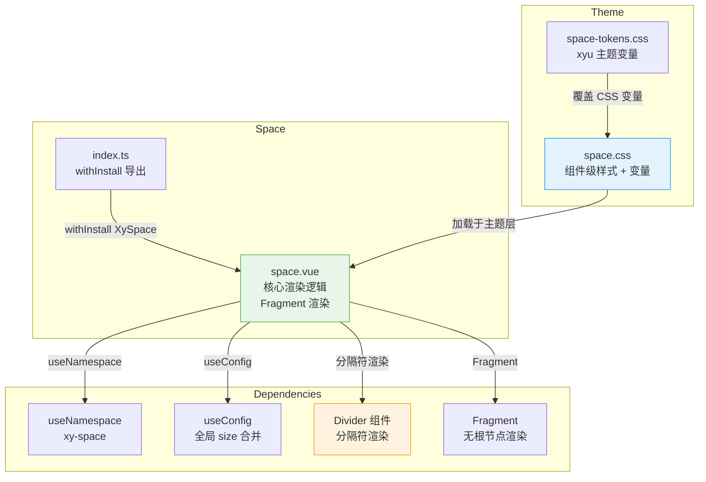

# 27 Space 间距

Space 是一个纯布局组件，以统一间距排列子节点，支持水平/垂直方向、间距尺寸、对齐方式、换行与分隔符插入，基于 Fragment 渲染避免多余 DOM 层级。

---

## 设计哲学

1. **Fragment 渲染**：Space 根节点自身不生成 DOM 元素（类似 React Fragment），仅注入间距样式到子节点，不污染 DOM 结构与 CSS 继承链。
2. **间距一致性**：通过预设尺寸（mini / small / medium / large）与数字间距两种方式，消除手动写 `margin` 的随意性，保证设计系统间距变量的一致。
3. **分隔符注入**：支持在子节点之间插入 Divider 或自定义元素，无需手动编排，Divider 自动感知 Space 方向切换 horizontal/vertical。
4. **方向感知**：`direction` prop 同时影响间距轴（gap-row/gap-column）与 Divider 方向，一处声明全局联动。
5. **wrap 支持**：水平模式下支持 `wrap`，使 Space 兼容弹性换行布局。

---

## 源码架构



---

## 核心 Props / Emits / Slots 类型定义

### SpaceProps

```typescript
// space.vue — 通过 withDefaults 定义

export type SpaceDirection    = "vertical" | "horizontal";
export type SpaceAlignment    = "center" | "start" | "end" | "baseline" | "stretch";

export interface SpaceProps {
  direction?: SpaceDirection;     // 排列方向，默认 "horizontal"
  alignment?: SpaceAlignment;     // 交叉轴对齐，默认 "center"
  size?: ComponentSize | number;  // 间距尺寸，默认 "small"
  wrap?: boolean;                 // 是否换行，默认 false
  spacer?: VNode | string;        // 自定义分隔符，默认 undefined
  fill?: boolean;                 // 子节点是否撑满容器宽度，默认 false
  fillRatio?: number;             // 撑满比例，默认 100
}
```

**size 映射表**：

| size 值 | 间距 (px) |
|---------|-----------|
| `"mini"` | 4 |
| `"small"` | 8 |
| `"medium"` | 12 |
| `"large"` | 16 |
| `number` | 自定义值 |

### Slots

| 插槽名  | 说明 |
|--------|------|
| default | 需要排列的子节点 |

Space 无自定义 Emits。

---

## 核心实现

### Fragment 渲染策略

Space 是组件库中少数使用 Fragment 渲染的组件。模板中没有根节点包裹，而是通过 `render()` 函数返回 `Fragment`：

```typescript
// space.vue
defineOptions({ name: "XySpace" });

const props = withDefaults(defineProps<SpaceProps>(), {
  direction: "horizontal",
  alignment: "center",
  size: "small",
  wrap: false,
  fill: false,
  fillRatio: 100
});

const slots = defineSlots<{ default?: () => unknown }>();
const ns = useNamespace("space");

// 全局 size 继承
const { size: globalSize } = useConfig();
const mergedSize = computed(() => props.size ?? globalSize.value);
```

### 间距计算

```typescript
// 预设尺寸映射
const SIZE_MAP: Record<string, number> = {
  mini: 4,
  small: 8,
  medium: 12,
  large: 16
};

// 将 size prop 解析为像素值
const spaceSize = computed<number>(() => {
  if (typeof mergedSize.value === "number") return mergedSize.value;
  return SIZE_MAP[mergedSize.value] ?? 8;
});
```

### 子节点编排 + 分隔符注入

核心渲染逻辑在 `render` 函数中：

```typescript
function render() {
  const children = slots.default?.() ?? [];
  const flattened = flattedChildren(children); // 递归展平 Fragment

  if (flattened.length === 0) return null;

  // 为每个子节点包裹样式容器
  const items = flattened.map((child, index) => {
    const isLast = index === flattened.length - 1;

    // 子节点容器样式
    const itemStyle: CSSProperties = {};
    if (props.direction === "horizontal") {
      itemStyle.marginRight = isLast ? undefined : `${spaceSize.value}px`;
    } else {
      itemStyle.marginBottom = isLast ? undefined : `${spaceSize.value}px`;
    }
    if (props.fill) {
      itemStyle.flexGrow = "1";
      itemStyle.flexBasis = `${props.fillRatio}%`;
    }

    const wrappedChild = h("div", { class: `${ns.base.value}__item`, style: itemStyle }, child);

    // 分隔符：最后一个子节点后不插入
    if (isLast) return wrappedChild;

    // 默认分隔符：Divider 组件，方向跟随 Space
    if (props.spacer === undefined) {
      // 无自定义分隔符时，仅靠 margin 间距
      return wrappedChild;
    }

    // 自定义分隔符渲染
    const spacerNode = typeof props.spacer === "string"
      ? h("span", { class: `${ns.base.value}__spacer` }, props.spacer)
      : props.spacer;

    return [wrappedChild, spacerNode];
  });

  // 容器样式
  const containerStyle: CSSProperties = {
    display: "flex",
    flexDirection: props.direction === "vertical" ? "column" : "row",
    flexWrap: props.wrap ? "wrap" : "nowrap",
    alignItems: props.alignment === "center" ? "center" : props.alignment,
  };

  return h("div", { class: ns.base.value, style: containerStyle }, flattedItems(items));
}
```

**渲染结构**：

```
<div class="xy-space" style="display:flex; ...">
  <div class="xy-space__item" style="margin-right: 8px;">子节点1</div>
  [<div class="xy-space__spacer">|</div>]  <!-- 仅当 spacer 存在 -->
  <div class="xy-space__item" style="margin-right: 8px;">子节点2</div>
  ...
  <div class="xy-space__item">最后子节点</div>  <!-- 无 margin -->
</div>
```

### flattedChildren 工具函数

递归展平 Fragment 与 Template 节点，确保 `v-for`、`<template>` 等结构不会产生空节点或嵌套：

```typescript
function flattedChildren(children: VNode[]): VNode[] {
  return children.reduce((acc, child) => {
    if (isFragment(child)) {
      acc.push(...flattedChildren(child.children as VNode[]));
    } else if (child.type === Comment) {
      // 过滤注释节点
    } else {
      acc.push(child);
    }
    return acc;
  }, [] as VNode[]);
}
```

---

## 样式系统

### 组件级 CSS 变量（`packages/theme/src/components/space.css`）

```css
.xy-space {
  --xy-space-gap: 8px;        /* 默认间距 */
  --xy-space-item-align: center; /* 子节点对齐 */

  display: inline-flex;
  flex-direction: row;
  align-items: var(--xy-space-item-align);
  gap: var(--xy-space-gap);
}

.xy-space--vertical {
  flex-direction: column;
}

.xy-space--wrap {
  flex-wrap: wrap;
}

.xy-space__item {
  max-width: 100%;
}

.xy-space__spacer {
  flex-shrink: 0;
  display: inline-flex;
  align-items: center;
  justify-content: center;
}

/* fill 模式 */
.xy-space--fill .xy-space__item {
  flex-grow: 1;
  flex-basis: var(--xy-space-fill-ratio, 100%);
}
```

### xyu 主题变量（`packages/theme/src/front/themes/space-tokens.css`）

```css
.xyu-space {
  --xyu-space-gap: var(--xyu-gap-base);
  --xyu-space-item-align: center;
}
```

### 间距实际生效机制

Space 存在两种间距机制：

1. **CSS `gap`**：通过 `--xy-space-gap` 变量设置，在容器级生效，所有子节点均匀间距。
2. **`margin` 内联样式**：在渲染函数中直接写 `margin-right` / `margin-bottom`，用于精确定位最后一个子节点不产生间距。

当前实现以渲染函数的 `margin` 方式为主，确保对分隔符场景的精确控制。

---

## 与其他组件的联动

| 联动场景 | 说明 |
|----------|------|
| **Space + Divider** | `spacer` prop 可传入 Divider VNode，Space 自动在子节点间插入，Divider 方向跟随 Space direction |
| **Space + Button** | 最典型用法：`<xy-space><xy-button>取消</xy-button><xy-button type="primary">确认</xy-button></xy-space>` |
| **Space + Form** | 表单内多个字段并排，Space 管理间距 |
| **Space + Row/Col** | Space 管理元素级间距，Row/Col 管理栅格级比例，可嵌套使用 |
| **Space + ConfigProvider** | 通过 `useConfig` 继承全局 size，所有 Space 默认尺寸统一 |

### Divider 作为分隔符

```html
<xy-space :spacer="h(XyDivider, { direction: 'vertical' })">
  <span>操作一</span>
  <span>操作二</span>
  <span>操作三</span>
</xy-space>
```

Space 渲染时自动在每个子节点之间插入传入的 Divider，Divider 方向根据 Space 的 `direction` 自动调整。

---

## 扩展与定制

### 1. 自定义间距值

除预设尺寸外，可直接传入数字（单位 px）：

```html
<xy-space :size="24">
  <xy-button>确定</xy-button>
  <xy-button>取消</xy-button>
</xy-space>
```

### 2. fill 模式

设置 `fill` 后，子节点会按 `fillRatio` 等比撑满容器宽度，适合按钮组、标签栏等场景：

```html
<xy-space fill :fill-ratio="50">
  <xy-button>均分按钮1</xy-button>
  <xy-button>均分按钮2</xy-button>
</xy-space>
```

`fillRatio` 控制每个子节点的 `flex-basis`，值越小，子节点越紧凑，多余空间由 `flex-grow: 1` 填充。

### 3. 自定义分隔符

`spacer` 接受 VNode 或字符串：

```html
<!-- 字符串分隔符 -->
<xy-space spacer="|">
  <span>A</span><span>B</span>
</xy-space>

<!-- 组件分隔符 -->
<xy-space :spacer="h(XyDivider, { direction: 'vertical' })">
  <span>A</span><span>B</span>
</xy-space>

<!-- 任意 VNode -->
<xy-space :spacer="h('span', { style: 'color: red;' }, '·')">
  <span>A</span><span>B</span>
</xy-space>
```

### 4. 覆盖 CSS 变量

```css
.my-space .xy-space {
  --xy-space-gap: 20px;
  --xy-space-item-align: baseline;
}
```

### 5. 全局尺寸继承

```html
<xy-config-provider size="medium">
  <!-- 所有 Space 默认使用 medium 间距 -->
  <xy-space>
    <xy-button>操作1</xy-button>
    <xy-button>操作2</xy-button>
  </xy-space>
</xy-config-provider>
```

单个 Space 可通过 `size` prop 覆盖，优先级：`props.size > ConfigProvider.size > 默认值 "small"`。