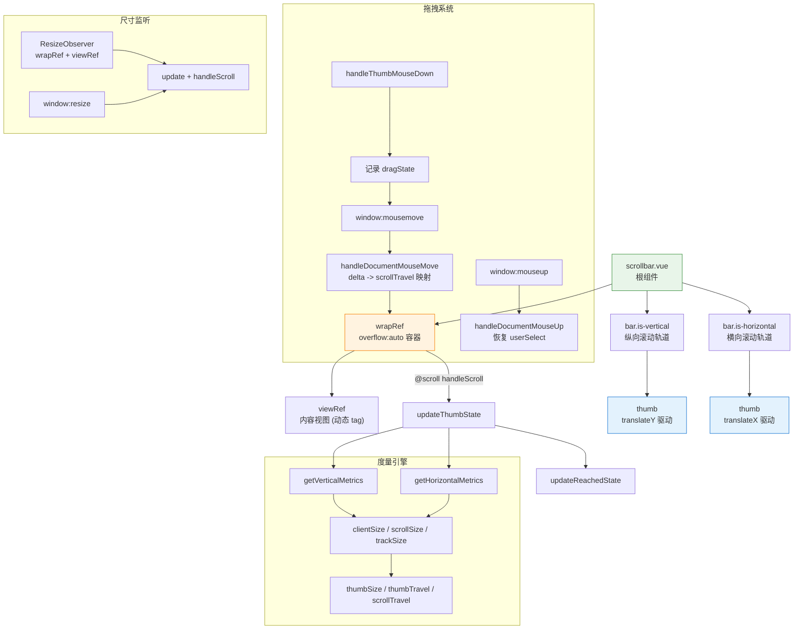

# 28 Scrollbar 滚动条

自定义滚动容器组件，在保留原生滚动行为的同时提供一致的滚动条外观、方法化滚动控制与触底检测能力。

## 设计哲学

Scrollbar 不重新发明滚动——它以原生 `overflow: auto` 为底座，通过隐藏原生滚动条并在其上叠加自定义 thumb 来实现视觉一致。这种"透传原生、替换皮肤"的策略，保证了滚动手感、惯性、键盘操作和辅助技术支持与浏览器原生行为完全一致，开发者无需处理 touch-action、virtual scroll 等底层问题。

组件的核心思路是 **度量-映射-驱动**：持续度量容器与内容的尺寸关系，将滚动位移映射为 thumb 的平移量，再通过拖拽 thumb 将用户意图反向驱动到容器的 scrollTop / scrollLeft。触底检测则是在滚动回调中比较当前偏移与可滚动行程的差值，配合 `distance` 阈值实现边界感知。

## 源码架构



## 核心 Props / Emits / Slots 类型定义

```ts
// scrollbar.ts
export interface ScrollbarProps {
  distance?: number                    // 触底距离阈值 (px)
  height?: number | string             // 固定高度
  maxHeight?: number | string          // 最大高度
  native?: boolean                     // 使用原生滚动条
  wrapStyle?: StyleValue               // 滚动容器样式
  wrapClass?: string | string[]        // 滚动容器类名
  viewClass?: string | string[]        // 视图容器类名
  viewStyle?: StyleValue               // 视图容器样式
  noresize?: boolean                   // 跳过尺寸监听
  tag?: string                         // 视图容器标签，默认 'div'
  always?: boolean                     // 始终显示自定义滚动条
  minSize?: number                     // thumb 最小尺寸 (px)
  tabindex?: number | string           // 滚动容器 tabindex
  id?: string                          // 视图容器 id
  role?: string                        // 视图容器 role
  ariaLabel?: string                   // 视图容器 aria-label
  ariaOrientation?: 'horizontal' | 'vertical' | 'undefined'
}

export interface ScrollbarScrollPayload {
  scrollTop: number
  scrollLeft: number
}

export type ScrollbarDirection = 'top' | 'bottom' | 'left' | 'right'
export type ScrollbarInstance = InstanceType<typeof Scrollbar>
```

**Emits:**

```ts
defineEmits<{
  scroll: [payload: ScrollbarScrollPayload]
  endReached: [direction: ScrollbarDirection]
}>()
```

**Slots:**

| 名称 | 说明 |
| --- | --- |
| `default` | 滚动区域的内容 |

## 核心实现

### 度量与映射算法

度量函数 `getVerticalMetrics` / `getHorizontalMetrics` 是整个组件的数学基础。以纵向为例：

```
trackSize   = clientSize - BAR_GAP           // 轨道可用长度
thumbSize   = (trackSize ^ 2) / scrollSize   // 按面积比缩放
thumbSize   = clamp(thumbSize, minSize, trackSize)  // 保障最小可拖拽区域
thumbTravel = trackSize - thumbSize          // thumb 最大可移动距离
scrollTravel = scrollSize - clientSize        // 内容最大可滚动距离
```

thumb 位移与滚动偏移的一一映射关系为：

```
thumbMove = (scrollTop / scrollTravel) * thumbTravel
```

### 拖拽反向驱动

用户拖拽 thumb 时，鼠标位移 `delta` 需要反向映射为滚动偏移：

```
nextScroll = startScroll + (delta * scrollTravel) / thumbTravel
```

`clamp` 确保结果在 `[0, scrollTravel]` 范围内。拖拽期间会临时设置 `document.body.style.userSelect = 'none'` 以避免文本选中干扰，松手后恢复。

### 轨道点击

点击轨道空白处时，以点击位置减去 thumbSize / 2 作为 thumb 中心偏移量，再映射为滚动位置：

```
nextThumbOffset = clamp(offset - thumbSize / 2, 0, thumbTravel)
nextScroll      = (nextThumbOffset / thumbTravel) * scrollTravel
```

### 触底检测

`handleScroll` 在每次滚动时比较 `scrollTop` / `scrollLeft` 与可滚动行程的差值，当差值小于等于 `distance` 时标记为已到达边界。只有从"未到达"变为"到达"时才触发 `endReached` 事件，避免重复触发。

### 尺寸响应

通过 `ResizeObserver` 同时观测 `wrapRef` 和 `viewRef`，并在 `window.resize` 上挂载兜底监听。`noresize` 为 true 时跳过所有监听。组件在 `onMounted`、`onUpdated` 以及关键 props 变化时都会重新初始化监听器。

### 方法暴露

组件通过 `defineExpose` 暴露以下方法，支持外部程序化控制：

| 方法 | 说明 |
| --- | --- |
| `wrapRef` | 滚动容器 DOM 引用 |
| `update()` | 手动重新计算 thumb 状态 |
| `scrollTo(x, y?)` | 滚动到指定位置，兼容 `ScrollToOptions` |
| `setScrollTop(value)` | 设置纵向滚动位置 |
| `setScrollLeft(value)` | 设置横向滚动位置 |
| `handleScroll()` | 手动触发滚动事件同步 |

## 样式系统

组件样式由 `packages/theme/src/components/scrollbar.css` 提供，BEM 结构如下：

| 选择器 | 作用 |
| --- | --- |
| `.xy-scrollbar` | 根容器，`position: relative; overflow: hidden` |
| `.xy-scrollbar__wrap` | 滚动容器，`overflow: auto`，非 native 模式下隐藏原生滚动条 |
| `.xy-scrollbar__wrap--hidden-default` | 隐藏 WebKit / Firefox / IE 原生滚动条 |
| `.xy-scrollbar__view` | 内容视图，`min-width/min-height: 100%` |
| `.xy-scrollbar__bar` | 轨道，`position: absolute`，半透明背景 |
| `.xy-scrollbar__bar.is-vertical` | 纵向轨道，宽 8px，距边 2px |
| `.xy-scrollbar__bar.is-horizontal` | 横向轨道，高 8px，距边 2px |
| `.xy-scrollbar__thumb` | 滑块，圆角胶囊形，`color-mix` 生成柔和半透明色 |

关键设计要点：

- 轨道默认透明（`scrollbar-color: transparent transparent`），hover / focus-within 时显示半透明底色
- thumb 使用 `color-mix(in srgb, var(--xy-text-color-muted) 30%, transparent)` 实现与主题联动
- hover / active 状态通过提高颜色浓度实现视觉反馈
- 滚动条仅在 `always=true` 或容器 hover / 拖拽时可见

## 与其他组件的联动

| 联动场景 | 说明 |
| --- | --- |
| Table + Scrollbar | 表格列数过多时，将 Table 放入 Scrollbar 容器实现横向滚动 |
| Select 下拉面板 | 下拉菜单内部使用 Scrollbar 替代原生滚动条 |
| Tree 虚拟列表 | 大数据量树组件的滚动区域由 Scrollbar 接管 |
| Dialog / Drawer | 内容区超长时，Dialog / Drawer 内嵌 Scrollbar 控制滚动 |
| 筛选面板 (Filter Panel) | 侧边筛选条件过多时用 Scrollbar 局部化滚动 |

## 扩展与定制

- **自定义滚动条颜色**：覆盖 `.xy-scrollbar__thumb` 的 `background` 即可，主题变量 `--xy-text-color-muted` 影响默认色
- **轨道宽度**：修改 `.xy-scrollbar__bar.is-vertical` 的 `width` 和 `.xy-scrollbar__bar.is-horizontal` 的 `height`
- **最小 thumb 尺寸**：通过 `minSize` prop 控制，避免内容极多时 thumb 缩为不可点击的细线
- **跳过尺寸监听**：当内容尺寸完全由外部控制（如虚拟列表自行管理）时，设置 `noresize` 避免冗余观测
- **原生模式回退**：在需要浏览器原生滚动行为（如精确的触控板惯性）的场景，设置 `native=true`
- **触底加载**：配合 `endReached` 事件和 `distance` 阈值，实现无限滚动列表