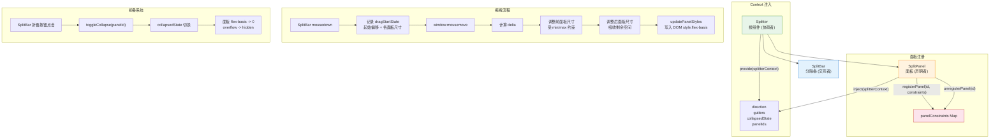

# 29 Splitter 分割面板

可拖拽的分割面板容器，支持嵌套布局、面板折叠与最小/最大尺寸约束，适用于侧边栏、编辑器多栏等复杂布局场景。

## 设计哲学

Splitter 遵循 **声明式布局、命令式调整** 的设计原则。开发者通过 `<SplitPanel>` 声明面板的弹性策略（size / min / max / grow / shrink），运行时由 `<Splitter>` 统一协调面板尺寸与拖拽行为。面板间的分隔条（SplitBar）承担交互职责，但尺寸计算完全收归根组件，子面板仅通过 context 消费结果——这种单向数据流避免了子组件间的状态耦合。

嵌套布局通过递归组合实现：一个 `<Splitter>` 的某个面板内部再放置另一个 `<Splitter>`，内外层各自独立维护自己的 context，互不干扰。

## 源码架构



## 核心 Props / Emits / Slots 类型定义

```ts
// splitter.ts
export type SplitterDirection = 'horizontal' | 'vertical'

export interface SplitterProps {
  direction?: SplitterDirection    // 分割方向，默认 'horizontal'
  gutters?: number                 // 分隔条宽度 (px)，默认 8
}

export interface SplitPanelProps {
  size?: number | string           // 初始/固定尺寸 (px 或 %)
  min?: number | string            // 最小尺寸
  max?: number | string            // 最大尺寸
  grow?: number                    // 弹性增长因子，默认 1
  shrink?: number                  // 弹性收缩因子，默认 1
  collapsible?: boolean            // 是否可折叠
  defaultCollapsed?: boolean       // 默认折叠状态
  tag?: string                     // 面板容器标签，默认 'div'
}

export interface SplitBarProps {
  index: number                    // 分隔条在面板间的位置索引
}

// Context
export interface SplitterContext {
  direction: SplitterDirection
  gutters: number
  collapsedState: Record<string, boolean>
  panelIds: string[]
}

export type SplitterInstance = InstanceType<typeof Splitter>
export type SplitPanelInstance = InstanceType<typeof SplitPanel>
```

**Emits:**

```ts
// Splitter
defineEmits<{
  resize: [sizes: Record<string, number>]
  collapsed: [panelId: string, collapsed: boolean]
}>()

// SplitPanel
defineEmits<{
  resize: [size: number]
  collapse: [collapsed: boolean]
}>()
```

**Slots:**

| 组件 | 名称 | 说明 |
| --- | --- | --- |
| Splitter | `default` | 放置 SplitPanel 和 SplitBar |
| SplitPanel | `default` | 面板内容 |
| SplitBar | `default` | 分隔条自定义内容 |
| SplitBar | `collapse-icon` | 折叠按钮图标 |

## 核心实现

### 面板注册与约束收集

`SplitPanel` 在 `onMounted` 时通过 `registerPanel(id, constraints)` 将自身约束注册到根组件，在 `onBeforeUnmount` 时通过 `unregisterPanel(id)` 注销。约束包含 size、min、max、grow、shrink、collapsible 等信息。根组件维护 `panelConstraints: Map<string, PanelConstraints>` 作为所有计算的输入。

### 拖拽尺寸调整

拖拽流程的核心在 `SplitBar` 的 mousedown 回调中启动：

1. **记录起始状态**：保存鼠标起始偏移、拖拽方向上所有面板的当前尺寸
2. **计算 delta**：根据 `direction` 取鼠标在主轴方向的位移 `delta`
3. **调整前面板**：按 delta 缩小/放大前面板，受 `min` / `max` 约束裁剪
4. **调整后面板**：吸收前面板调整后的剩余空间，同样受约束裁剪
5. **写入 DOM**：将计算结果通过 `style.flex-basis` 写入各面板 DOM

### 折叠系统

面板折叠通过 `collapsedState` 字典管理。折叠时将面板的 `flex-basis` 设为 0、`overflow` 设为 `hidden`，展开时恢复为尺寸约束决定的值。折叠按钮位于 `SplitBar` 上，图标方向随折叠状态和分割方向动态变化。

### 尺寸单位归一化

`SplitPanel` 的 size / min / max 支持数字（px）和百分比字符串。内部通过 `parseSize` 工具函数将百分比转换为像素值（基于容器可用空间），统一计算单位。当面板同时设置了 min 和 max 且 min > max 时，min 优先。

## 样式系统

组件样式由 `packages/theme/src/components/splitter.css` 提供，BEM 结构如下：

| 选择器 | 作用 |
| --- | --- |
| `.xy-splitter` | 根容器，Flex 布局 |
| `.xy-splitter--horizontal` | 横向排列，`flex-direction: row` |
| `.xy-splitter--vertical` | 纵向排列，`flex-direction: column` |
| `.xy-split-panel` | 面板容器，`overflow: auto; position: relative` |
| `.xy-split-panel--collapsed` | 折叠态，`flex-basis: 0; overflow: hidden` |
| `.xy-split-bar` | 分隔条，`flex-shrink: 0; user-select: none` |
| `.xy-split-bar--horizontal` | 横向分隔条，垂直分割线 + `cursor: col-resize` |
| `.xy-split-bar--vertical` | 纵向分隔条，水平分割线 + `cursor: row-resize` |
| `.xy-split-bar__handle` | 拖拽把手，hover 时高亮 |
| `.xy-split-bar__collapse-btn` | 折叠按钮，居中定位 |

关键设计要点：

- 分隔条使用 `background: color-mix(in srgb, var(--xy-border-color) 60%, transparent)` 实现柔和分割线
- hover / active 时把手背景加深，提供操作反馈
- 拖拽期间全局设置 `user-select: none` 防止文字选中
- 折叠按钮使用圆形设计，hover 时出现背景色

## 与其他组件的联动

| 联动场景 | 说明 |
| --- | --- |
| Splitter + Scrollbar | 面板内容超长时，面板内部嵌套 Scrollbar 实现局部滚动 |
| Splitter + Tabs | 编辑器布局中，侧边栏用 Splitter 分割，主区域用 Tabs 切换文档 |
| Splitter + Tree | 侧边文件树放在 SplitPanel 中，可拖拽调整宽度 |
| Splitter + Table | 数据面板与详情面板左右分割，拖拽调整比例 |
| 嵌套 Splitter | 水平 Splitter 内部嵌套垂直 Splitter，实现三栏/四宫格布局 |

## 扩展与定制

- **自定义分隔条样式**：覆盖 `.xy-split-bar__handle` 的背景色和尺寸
- **自定义折叠图标**：通过 SplitBar 的 `collapse-icon` 插槽替换默认图标
- **面板固定/弹性混排**：设置 `size` 为固定像素值且 `grow=0, shrink=0` 实现固定侧边栏，其余面板自动填充剩余空间
- **嵌套布局**：在 SplitPanel 内部嵌套另一个 Splitter，内外层方向可不同，实现任意复杂的网格布局
- **编程式折叠**：通过 Splitter 暴露的 `toggleCollapse(panelId)` 方法从外部控制面板折叠
- **持久化布局**：监听 `resize` 事件保存面板尺寸到 localStorage，下次加载时通过 `size` prop 恢复