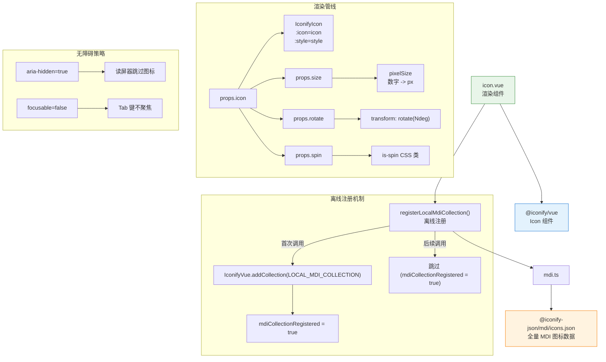

# 30 Icon 图标

基于 Iconify 的图标渲染组件，内置 MDI 图标集离线包，支持尺寸、旋转与旋转动画，是组件库中最基础的视觉原子。

## 设计哲学

Icon 的设计围绕一个核心原则：**图标是语义符号，不是装饰**。组件强制设置 `aria-hidden="true"` 和 `focusable="false"`，明确告知辅助技术图标不承载可交互信息——语义表达由相邻文本或 `aria-label` 完成。这一选择将 Icon 定位为纯粹的视觉辅助，避免读屏软件重复播报图标与文字。

技术选型上，Icon 选择了 Iconify 作为渲染引擎而非 SVG Sprite 方案。Iconify 支持超过 15 万个图标集、运行时按需加载 SVG 数据，而组件通过 `registerLocalMdiCollection()` 在应用启动时一次性注册 MDI 全量图标集的离线 JSON，消除线上请求延迟，保障内网与离线环境的可用性。

## 源码架构



## 核心 Props / Emits / Slots 类型定义

```ts
// icon.vue 内联定义
export interface IconProps {
  icon: string             // Iconify 图标标识，如 'mdi:close'
  size?: number | string   // 图标尺寸，数字自动加 px，默认 16
  rotate?: number          // 旋转角度 (deg)，默认 0
  spin?: boolean           // 是否启用旋转动画，默认 false
}
```

组件不定义 Emits 和 Slots——它是纯渲染组件，不输出事件也不接受内容分发。

## 核心实现

### 离线图标集注册

`mdi.ts` 封装了离线注册逻辑：

```ts
import * as IconifyVue from "@iconify/vue"
import mdiCollection from "@iconify-json/mdi/icons.json"

let mdiCollectionRegistered = false

export function registerLocalMdiCollection() {
  if (mdiCollectionRegistered || typeof IconifyVue.addCollection !== "function") {
    return
  }
  IconifyVue.addCollection(LOCAL_MDI_COLLECTION)
  mdiCollectionRegistered = true
}
```

- 通过模块级变量 `mdiCollectionRegistered` 保证只注册一次，即使 `registerLocalMdiCollection()` 被多个组件实例重复调用
- 注册后，所有 `mdi:*` 前缀的图标请求直接命中本地缓存，无需发起网络请求
- 其他图标集（如 `carbon:*`、`ph:*`）仍走 Iconify 默认的按需加载策略

### 尺寸归一化

```ts
const pixelSize = computed(() =>
  typeof props.size === "number" ? `${props.size}px` : props.size
)
```

数字类型的 size 自动追加 `px` 后缀，字符串类型原样传递，支持 `1em`、`1.2rem` 等相对单位。

### 样式组合

组件通过 computed 将 size、rotate 组合为内联样式对象，传递给 IconifyIcon 组件：

```ts
const style = computed(() => ({
  width: pixelSize.value,
  height: pixelSize.value,
  transform: `rotate(${props.rotate}deg)`
}))
```

spin 动画通过 CSS 类 `is-spin` 控制，在样式表中定义 `@keyframes xy-spin` 实现匀速旋转。

### 无障碍设计

模板中 `<span>` 根元素设置 `aria-hidden="true"`，IconifyIcon 内部 SVG 设置 `focusable="false"`，双重确保辅助技术忽略图标元素。这是 WAI-ARIA 推荐的装饰性图标处理方式。

## 样式系统

组件样式由 `packages/theme/src/components/icon.css` 提供，BEM 结构如下：

| 选择器 | 作用 |
| --- | --- |
| `.xy-icon` | 根容器，`inline-flex; align-items: center; justify-content: center` |
| `.xy-icon > *` | IconifyIcon SVG，`display: block` 消除内联 SVG 底部间隙 |
| `.xy-icon.is-spin > *` | 旋转动画，`animation: xy-spin 0.9s linear infinite` |

关键设计要点：

- `color: currentColor` 让图标继承父元素文本色，无需单独设置颜色
- `vertical-align: -0.125em` 微调基线对齐，使图标与文字视觉居中
- `flex-shrink: 0` 防止图标在 Flex 容器中被压缩
- transition 覆盖 `color`、`opacity`、`transform` 三个属性，支持 hover 色变和旋转过渡

## 与其他组件的联动

Icon 是组件库中使用最广泛的原子组件，几乎所有交互组件内部都依赖它：

| 联动场景 | 说明 |
| --- | --- |
| Button | 纯图标按钮（`circle` 模式）和带前缀图标的按钮 |
| Tag | 前缀图标和关闭按钮图标 |
| Tabs | 关闭页签图标和新增页签图标 |
| Select | 下拉箭头和清除图标 |
| Input | 前缀/后缀图标、密码可见切换、清除按钮 |
| Dialog / Drawer | 标题栏关闭按钮 |
| Message / Notification | 状态类型图标（success / warning / error / info） |
| Pagination | 上一页/下一页箭头图标 |
| Backtop | 回到顶部箭头图标 |
| Breadcrumb | 分隔符图标 |

## 扩展与定制

- **使用其他图标集**：除 MDI 外，直接传入 `carbon:close`、`ph:warning` 等 Iconify 支持的任意图标集前缀即可，运行时 Iconify 会按需加载对应 SVG 数据
- **自定义颜色**：通过父元素 `color` 样式控制，或直接在 `:style` 中覆盖 `color` 属性
- **自定义尺寸**：`size` prop 支持数字（px）和字符串（em / rem / %），可根据上下文字号自适应
- **添加离线图标集**：参考 `mdi.ts` 模式，导入 `@iconify-json/<prefix>/icons.json` 并在应用入口调用 `IconifyVue.addCollection()` 注册
- **自定义旋转动画**：覆盖 `.xy-icon.is-spin > *` 的 `animation` 属性，可调整动画速度和缓动函数
- **替代 Icon 渲染器**：如需完全脱离 Iconify 依赖，可在项目层通过 `app.component` 注册同名 `xy-icon` 组件替换默认实现