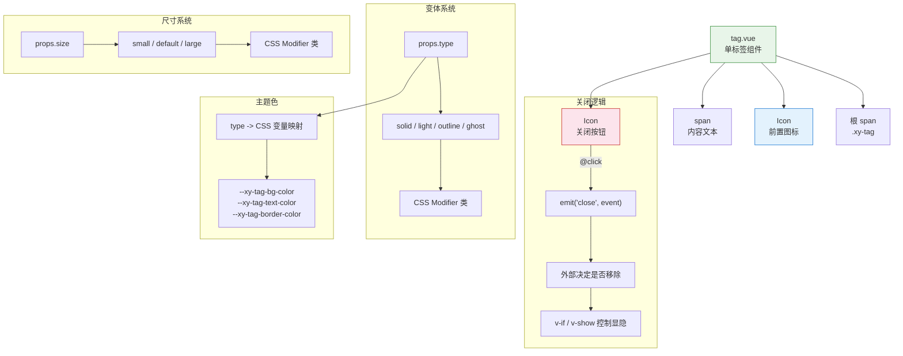

# 31 Tag 标签

轻量标记组件，支持图标、主题色、尺寸、可关闭与多种变体，用于分类、筛选和状态标注。

## 设计哲学

Tag 的设计遵循 **标记即边界** 原则。标签在 UI 中划出一小块视觉区域，让用户一眼识别内容的归属和状态。组件将"标记"与"操作"解耦：默认行为是纯粹的视觉呈现，只有显式设置 `closable` 时才引入关闭能力，避免误操作。关闭按钮的点击区域刻意做大（通过 padding 补偿），确保在移动端也能可靠点击。

变体系统（`solid` / `light` / `outline` / `ghost`）覆盖了从强调到弱化的完整视觉梯度。`solid` 用作高亮分类，`light` 用作常规标注，`outline` 用作辅助信息，`ghost` 用作占位提示——每种变体对应不同的信息层级。

## 源码架构



## 核心 Props / Emits / Slots 类型定义

```ts
// tag.vue 内联定义（引用公共类型）
export type TagType = 'solid' | 'light' | 'outline' | 'ghost'
export type TagSize = 'small' | 'default' | 'large'
export type TagTheme = 'primary' | 'success' | 'warning' | 'danger' | 'info'

export interface TagProps {
  type?: TagType               // 变体，默认 'light'
  size?: TagSize               // 尺寸，默认 'default'
  theme?: TagTheme             // 主题色，默认 'primary'
  closable?: boolean           // 是否可关闭，默认 false
  icon?: string                // Iconify 图标标识
  disabled?: boolean           // 禁用态
  round?: boolean              // 圆角胶囊形
  effect?: boolean             // 动效开关（关闭按钮 hover 效果）
}

export type TagInstance = InstanceType<typeof Tag>
```

**Emits:**

```ts
defineEmits<{
  close: [event: MouseEvent]    // 关闭按钮点击，由外部决定移除逻辑
  click: [event: MouseEvent]    // 标签点击
}>()
```

**Slots:**

| 名称 | 说明 |
| --- | --- |
| `default` | 标签文本内容 |
| `icon` | 自定义前置图标（优先于 `icon` prop） |
| `close-icon` | 自定义关闭图标 |

## 核心实现

### 变体与主题色映射

组件通过 `type` 和 `theme` 两个维度组合出最终的视觉效果。`theme` 决定语义色系（primary / success / warning / danger / info），`type` 决定该色系的呈现方式：

| type | 背景 | 文字 | 边框 |
| --- | --- | --- | --- |
| `solid` | 主题色填充 | 白色 | 主题色 |
| `light` | 主题色 10% 淡色 | 主题色 | 透明 |
| `outline` | 透明 | 主题色 | 主题色 |
| `ghost` | 透明 | 主题色 | 透明 |

CSS 层通过 BEM modifier 类 `.xy-tag--{type}.xy-tag--{theme}` 组合实现，每个组合对应一组 `background-color` / `color` / `border-color` 声明。

### 尺寸系统

三个尺寸通过 modifier 类控制内间距和字号：

| 尺寸 | padding | font-size | height (approx) |
| --- | --- | --- | --- |
| `small` | 0 6px | 12px | 22px |
| `default` | 2px 8px | 13px | 26px |
| `large` | 4px 12px | 14px | 32px |

### 关闭按钮

关闭按钮仅在 `closable` 为 true 时渲染，默认使用 `mdi:close` 图标。点击时 emit `close` 事件，**不自行移除 DOM**——这遵循了 Vue 单向数据流原则，由父组件决定标签的生命周期：

```vue
<!-- 使用方式 -->
<xy-tag v-if="visible" closable @close="visible = false">标签</xy-tag>
```

### 禁用态

`disabled` 状态下，标签添加 `.is-disabled` 类，降低整体透明度并设置 `cursor: not-allowed`，关闭按钮点击不触发事件。

### 圆角胶囊

`round` prop 添加 `.is-round` 类，将 `border-radius` 设为极大值（如 9999px），实现胶囊形态。此模式下左右 padding 略微增大以保持视觉平衡。

## 样式系统

组件样式由 `packages/theme/src/components/tag.css` 提供，BEM 结构如下：

| 选择器 | 作用 |
| --- | --- |
| `.xy-tag` | 根容器，`inline-flex; align-items: center; gap` |
| `.xy-tag--{size}` | 尺寸变体 |
| `.xy-tag--{type}` | 变体类型 |
| `.xy-tag--{theme}` | 主题色 |
| `.xy-tag.is-round` | 胶囊形 |
| `.xy-tag.is-disabled` | 禁用态 |
| `.xy-tag__icon` | 前置图标容器 |
| `.xy-tag__close` | 关闭按钮容器 |
| `.xy-tag__content` | 文本内容 |

关键设计要点：

- 使用 `color-mix(in srgb, var(--xy-color-{theme}) 10%, transparent)` 生成 light 变体的淡色背景，自动跟随主题色变化
- 关闭按钮通过 `margin-left` 和负 `margin-right` 实现紧凑排列，点击区域通过 padding 扩大到 20px 以上
- `transition` 覆盖 `background-color`、`border-color`、`color`、`box-shadow`，确保主题切换和 hover 状态的平滑过渡
- 禁用态使用 `opacity: 0.5` 而非灰度化，保持语义色的可识别性

## 与其他组件的联动

| 联动场景 | 说明 |
| --- | --- |
| Tag + Select | 多选模式下，已选项以 Tag 形式展示在输入框内 |
| Tag + Table | 表格列头筛选条件以 Tag 展示，closable 支持逐个移除 |
| Tag + Tabs | 可编辑页签本质上就是可关闭的 Tag 变体 |
| Tag + Input | 标签输入框（Tag Input）组合 Input 与 Tag 实现自由输入+标签化展示 |
| Tag + Icon | Tag 的前置图标和关闭图标均由 Icon 组件渲染 |
| Tag + Space | 多个 Tag 排列在 Space 组件中实现等间距标签组 |

## 扩展与定制

- **自定义主题色**：覆盖 `.xy-tag--{type}.xy-tag--{theme}` 下的 `background-color`、`color`、`border-color`
- **自定义关闭图标**：通过 `close-icon` 插槽替换默认的 `mdi:close`
- **自定义前置内容**：通过 `icon` 插槽放置自定义 SVG 或其他内容，不限于 Iconify 图标
- **动画移除**：结合 Vue `<Transition>` 组件包裹 Tag，在 `close` 事件中先触发离开动画再移除 DOM
- **可选中标签**：在 Tag 上添加 `@click` 事件处理，配合 `:type` 动态切换 solid/outline 实现选中态
- **标签组**：多个 Tag 配合 Space 组件排列，外部维护选中/移除状态数组