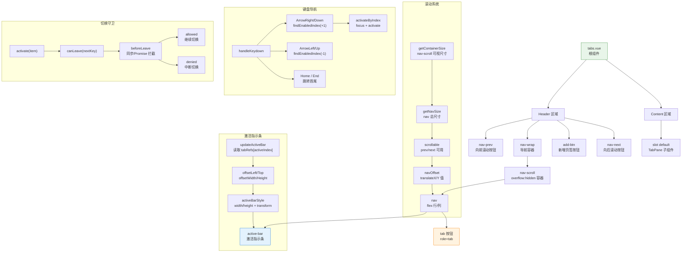

# 32 Tabs 标签页

多视图切换容器组件，支持声明式数据驱动、键盘导航、滚动溢出处理、切换守卫与可编辑页签。

## 设计哲学

Tabs 的设计基于 **数据驱动渲染** 原则：页签配置通过 `items` prop 或 `TabPane` 子组件声明，组件自身不维护页签列表的增删逻辑，只负责渲染和交互反馈。增删操作通过 `edit` / `tabRemove` / `tabAdd` 事件通知外部，由父组件更新 `items` 数组——这保证了 Tabs 对数据的零所有权，避免了内部状态与外部状态的不一致。

键盘可达性是另一条核心设计线。组件遵循 WAI-ARIA Tabs 模式规范：激活项 `tabindex=0`，非激活项 `tabindex=-1`；方向键在页签间循环移动焦点，Home/End 键跳转到首尾可用项；禁用项在键盘导航中被自动跳过。这种设计确保了读屏用户和键盘用户都能高效操作。

## 源码架构



## 核心 Props / Emits / Slots 类型定义

```ts
// tabs.ts
export interface TabItem {
  key: string                      // 唯一标识
  label: string                    // 展示文案
  disabled?: boolean               // 是否禁用
  closable?: boolean               // 是否可关闭（覆盖全局 closable）
}

export type TabsType = '' | 'card' | 'border-card'
export type TabsPosition = 'top' | 'right' | 'bottom' | 'left'
export type TabsBeforeLeave = (
  newKey: string,
  oldKey: string
) => boolean | void | Promise<boolean | void>

export interface TabsProps {
  modelValue?: string              // 受控激活项
  defaultValue?: string            // 非受控初始激活项
  items: TabItem[]                 // 页签数据源
  type?: TabsType                  // 页签风格
  tabPosition?: TabsPosition       // 页签位置
  closable?: boolean               // 全局可关闭
  addable?: boolean                // 显示新增按钮
  editable?: boolean               // 同时开启新增+关闭
  stretch?: boolean                // 拉伸平铺
  beforeLeave?: TabsBeforeLeave    // 切换守卫
  tabindex?: string | number       // 激活项 tabindex
}

export interface TabsDefaultSlotProps {
  activeKey: string
  activeItem?: TabItem
}

export interface TabsInstance {
  currentName: Ref<string>
  scrollToActiveTab: () => Promise<void>
}
```

**Emits:**

```ts
defineEmits<{
  'update:modelValue': [value: string]
  change: [value: string]
  tabClick: [key: string, event: MouseEvent | KeyboardEvent]
  edit: [key: string | undefined, action: 'remove' | 'add']
  tabRemove: [key: string]
  tabAdd: []
}>()
```

**Slots:**

| 名称 | 说明 |
| --- | --- |
| `default` | 面板内容区域 |
| `add-icon` | 自定义新增按钮图标 |

## 核心实现

### 双数据源融合

Tabs 支持两种页签数据来源：`items` prop（数据驱动）和 `TabPane` 子组件（声明式）。内部通过 `computed` 合并：

```ts
const allItems = computed(() => {
  if (props.items.length > 0) {
    return props.items          // items prop 优先
  }
  return childrenTabPanes.value  // 否则使用 TabPane 注册的数据
})
```

TabPane 通过 inject 获取 tabsContext，在挂载时 `registerTab` 注册自身信息（key / label / disabled / closable），卸载时 `unregisterTab` 注销。

### 激活指示条（Active Bar）

Active Bar 是一个绝对定位的 `<span>` 元素，位于 `.xy-tabs__nav` 内。它的尺寸和位置通过 `updateActiveBar()` 计算：

- **横向模式**：读取激活 tab 的 `offsetWidth` 和 `offsetLeft`，设置 `width + translateX`
- **纵向模式**：读取 `offsetHeight` 和 `offsetTop`，设置固定 indicatorSize (14px) 的 `height + translateY`

Active Bar 在每次激活项变化、tabPosition 变化、窗口 resize 时通过 ResizeObserver 触发重新计算，确保位置始终精确。

### 滚动溢出处理

当页签总宽度超过容器可视区域时，组件自动进入滚动模式：

1. **计算溢出**：`getContainerSize()` 与 `getNavSize()` 比较，判断是否需要滚动
2. **设置 navOffset**：通过 `transform: translateX(-Npx)` 或 `translateY(-Npx)` 平移导航条
3. **显示滚动按钮**：`nav-prev` 和 `nav-next` 按钮仅在 `scrollable.prev / scrollable.next` 为 true 时渲染
4. **滚轮支持**：`handleWheel` 将 wheel 事件的 deltaX/deltaY 映射到 navOffset 增减
5. **自动定位**：`scrollToActiveTab()` 在激活项不在可视区域时自动调整 navOffset

### 键盘导航

`handleKeydown` 严格遵循 WAI-ARIA Tabs 模式：

| 按键 | 行为 |
| --- | --- |
| ArrowRight / ArrowDown | 移到下一个非禁用项 |
| ArrowLeft / ArrowUp | 移到上一个非禁用项 |
| Home | 移到第一个非禁用项 |
| End | 移到最后一个非禁用项 |

`findEnabledIndex` 实现循环遍历，跳过禁用项，确保焦点永远落在可用页签上。

### 切换守卫

`beforeLeave` 支持同步和异步拦截：

```ts
async function canLeave(nextKey: string) {
  const result = props.beforeLeave(nextKey, current.value)
  if (typeof result === 'boolean' || result === undefined) {
    return result !== false
  }
  try {
    const resolved = await result      // 支持 Promise
    return resolved !== false
  } catch {
    return false                        // Promise reject 视为拦截
  }
}
```

这使得 `beforeLeave` 可以用于"未保存变更确认"等需要异步交互的场景。

### 可关闭性判定

单个 tab 的可关闭性由三层条件组合决定：

```
isClosable(item) = item.disabled === false
  AND (item.closable === true OR (item.closable === undefined AND (props.closable OR props.editable)))
```

- `item.closable === true`：强制可关闭，无论全局设置
- `item.closable === false`：强制不可关闭，无论全局设置
- `item.closable === undefined`：跟随全局 `closable` 或 `editable`

## 样式系统

组件样式由 `packages/theme/src/components/tabs.css` 提供，BEM 结构如下：

| 选择器 | 作用 |
| --- | --- |
| `.xy-tabs` | 根容器，Flex 布局 |
| `.xy-tabs--{position}` | 位置变体（top / bottom / left / right） |
| `.xy-tabs--card` | 卡片风格 |
| `.xy-tabs--border-card` | 边框卡片风格 |
| `.xy-tabs__header` | 页签导航头部 |
| `.xy-tabs__nav-wrap` | 导航区域，底部/侧边有分割线 |
| `.xy-tabs__nav-scroll` | 滚动容器，`overflow: hidden` |
| `.xy-tabs__nav` | 页签列表，`inline-flex; min-width: max-content` |
| `.xy-tabs__nav.is-stretch` | 拉伸模式，`width: 100%` |
| `.xy-tabs__tab` | 单个页签按钮，`role=tab` |
| `.xy-tabs__tab.is-active` | 激活态，主题色背景 |
| `.xy-tabs__tab.is-disabled` | 禁用态，`opacity: 0.45` |
| `.xy-tabs__tab.is-closable` | 可关闭态，右侧缩小 padding 为关闭按钮留空间 |
| `.xy-tabs__active-bar` | 激活指示条，绝对定位 |
| `.xy-tabs__tab-close` | 关闭按钮 |
| `.xy-tabs__nav-prev / nav-next` | 滚动按钮 |
| `.xy-tabs__add` | 新增页签按钮 |
| `.xy-tabs__content` | 面板内容区域 |

关键设计要点：

- Active Bar 使用 `background: var(--xy-color-primary)` 和 `border-radius: 999px` 实现胶囊形指示条
- 卡片风格通过 `box-shadow: inset 0 -1px 0` 代替分割线，激活项通过 `border + background` 实现立体感
- 边框卡片风格在外层容器加 `border + border-radius + overflow: hidden`，面板区域取消独立边框
- 纵向模式下导航宽度固定 112px，tab 使用全宽 `justify-content: flex-start` 排列
- 滚动按钮使用圆形设计（`border-radius: 999px`），hover 时主题色边框和背景
- Tab hover 使用 `color-mix(in srgb, var(--xy-bg-color-subtle) 76%, var(--xy-bg-color-floating))` 实现柔和背景反馈

## 与其他组件的联动

| 聑动场景 | 说明 |
| --- | --- |
| Tabs + TabPane | TabPane 子组件通过 inject 注册自身信息，实现声明式用法 |
| Tabs + Icon | 关闭按钮和滚动按钮使用 Icon 组件渲染图标 |
| Tabs + Scrollbar | 页签数量过多时，导航区域可嵌套 Scrollbar 替代原生滚动 |
| Tabs + Dialog | 详情弹窗中使用 Tabs 分区展示基本信息 / 操作日志 / 关联数据 |
| Tabs + Splitter | 编辑器布局中，主区域用 Tabs 切换多文档，侧边栏用 Splitter 分割 |
| Tabs + Form | 复合表单中使用 Tabs 分组展示不同类别的字段 |

## 扩展与定制

- **自定义页签图标**：在 TabItem 中扩展自定义字段，通过模板条件渲染 Icon
- **自定义新增按钮**：通过 `add-icon` 插槽替换默认的 `mdi:plus` 图标
- **自定义 Active Bar 样式**：覆盖 `.xy-tabs__active-bar` 的 `background`、`height`、`border-radius`
- **自定义页签间距**：修改 `.xy-tabs__nav` 的 `gap` 值
- **纵向模式宽度**：修改 `.xy-tabs--left .xy-tabs__header` 和 `.xy-tabs--right .xy-tabs__header` 的 `width`
- **滚动按钮可见条件**：组件内置了自动显示/隐藏逻辑，如需始终显示可通过 CSS 强制 `.xy-tabs__nav-prev { display: inline-flex }`
- **TabPane 混用**：当 `items` prop 非空时 TabPane 注册的数据会被忽略，确保数据源唯一性
- **异步守卫**：`beforeLeave` 返回 Promise 时组件会在切换期间冻结交互，适合"未保存确认弹窗"等场景