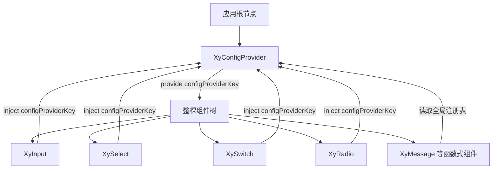
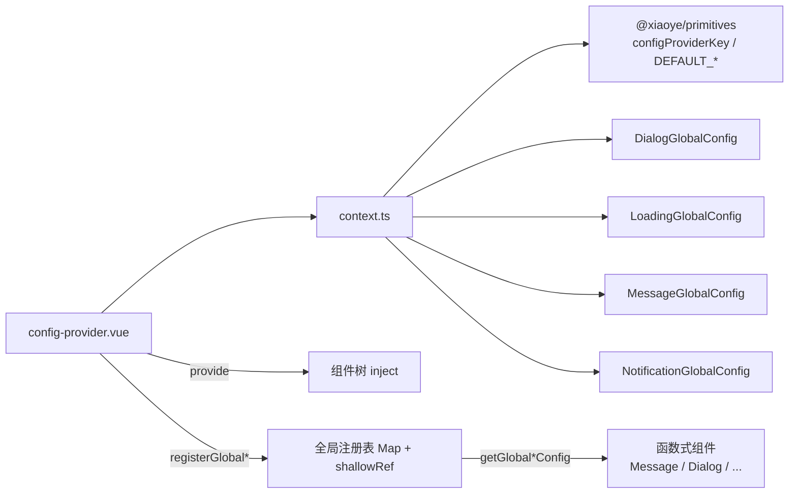
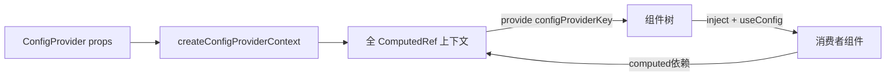
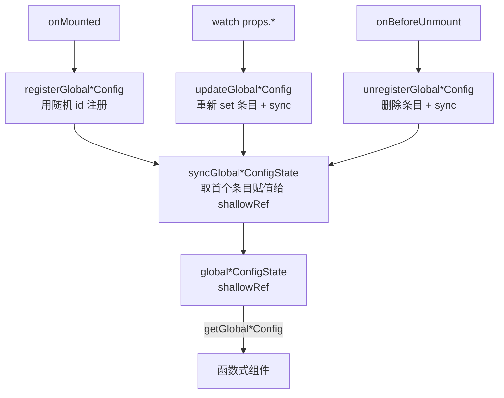

# 33 ConfigProvider 全局配置

> 导读：ConfigProvider 是 xiaoye-components 的全局上下文入口，负责在应用根部统一注入默认尺寸、命名空间、z-index 起始值和函数式组件的默认配置，让整套组件体系在无需逐个传参的情况下获得一致的基线行为。

## 设计哲学

ConfigProvider 解决的核心问题是**跨组件的默认行为统一**。在一个企业级应用中，表单组件的默认尺寸、弹层的 z-index 起始值、Message 的出现位置等偏好，如果每个组件都靠 props 传递，会产生大量重复代码和遗漏风险。ConfigProvider 通过 Vue 的 provide/inject 机制，将这些偏好一次性注入到整棵组件树中。



**设计决策 WHY**

1. **为什么用 provide/inject 而不是全局变量？** Vue 的 provide/inject 天然支持嵌套覆盖——局部 ConfigProvider 可以重写全局配置，而全局变量无法做到区域性覆盖。这在微前端和多主题场景下尤其关键。

2. **为什么 Dialog/Loading/Message/Notification 用全局注册表而不是 inject？** 这些组件通过函数式调用（`XyMessage()`）创建，不在组件树内，无法通过 inject 读取。因此 ConfigProvider 采用 Map 注册表 + shallowRef 方案，让函数式组件也能读到最近的配置。

3. **为什么全局注册表取第一个条目而非合并？** 函数式组件的实例不在树内，无法确定"最近的祖先"。采用"首个注册者生效"策略，与 Vue 的 provide 最近祖先覆盖语义保持一致，同时避免多个 ConfigProvider 的配置冲突。

## 源码架构

### 文件结构

```
packages/components/config-provider/
  index.ts              # 导出入口，withInstall 注册
  src/
    config-provider.vue # 主组件，provide + 注册表 + watch 同步
    context.ts          # 类型定义 + 上下文工厂 + 全局注册表
```

### 组件关系图



### 核心 type 定义

```ts
interface ConfigProviderProps {
  namespace?: string;         // 命名空间前缀，默认 'xy'
  locale?: Record<string, string>;  // 国际化文案
  zIndex?: number;            // 弹层基础层级，默认 2000
  size?: ComponentSize;       // 默认尺寸，默认 'md'
  dialog?: DialogGlobalConfig;
  loading?: LoadingGlobalConfig;
  message?: MessageGlobalConfig;
  notification?: NotificationGlobalConfig;
}

interface ConfigProviderContext {
  namespace: ComputedRef<string>;
  locale: ComputedRef<Record<string, string>>;
  zIndex: ComputedRef<number>;
  size: ComputedRef<ComponentSize>;
  dialog: ComputedRef<DialogGlobalConfig>;
  loading: ComputedRef<LoadingGlobalConfig>;
  message: ComputedRef<MessageGlobalConfig>;
  notification: ComputedRef<NotificationGlobalConfig>;
}
```

## 核心实现

### 1. 上下文注入——provide/inject 模式

ConfigProvider 在 setup 阶段调用 `createConfigProviderContext` 将 props 转为全 ComputedRef 的上下文对象，再通过 `provide(configProviderKey, ...)` 注入。

```ts
// config-provider.vue
const props = withDefaults(defineProps<ConfigProviderProps>(), {
  namespace: "xy", locale: () => ({}), zIndex: 2000, size: "md",
  dialog: () => ({}), loading: () => ({}),
  message: () => ({}), notification: () => ({})
});

provide(configProviderKey, createConfigProviderContext(props));
```

```ts
// context.ts — createConfigProviderContext
function createConfigProviderContext(options: ConfigProviderProps = {}): ConfigProviderContext {
  return {
    namespace: computed(() => options.namespace ?? DEFAULT_NAMESPACE),
    locale: computed(() => options.locale ?? {}),
    zIndex: computed(() => options.zIndex ?? DEFAULT_Z_INDEX),
    size: computed(() => options.size ?? DEFAULT_SIZE),
    dialog: computed(() => options.dialog ?? {}),
    loading: computed(() => options.loading ?? {}),
    message: computed(() => options.message ?? {}),
    notification: computed(() => options.notification ?? {})
  };
}
```

**WHY：全 ComputedRef 的好处**——消费者通过 `useConfig()` 获取的是 ComputedRef，而非原始值。这使得消费者组件能在 ConfigProvider props 变化时自动响应，实现配置的热更新。



### 2. 函数式组件的全局注册表

Dialog/Message 等函数式组件不在组件树内，无法 inject。ConfigProvider 采用 Map 注册表 + shallowRef 的方案。

```ts
// context.ts — 注册表核心机制
const globalMessageConfigRegistry = new Map<string, MessageGlobalConfig>();
const globalMessageConfigState = shallowRef<MessageGlobalConfig>({});

function syncGlobalMessageConfigState() {
  const firstEntry = globalMessageConfigRegistry.entries().next();
  globalMessageConfigState.value = firstEntry.done ? {} : firstEntry.value[1];
}

export function registerGlobalMessageConfig(id: string, value: MessageGlobalConfig) {
  globalMessageConfigRegistry.set(id, value);
  syncGlobalMessageConfigState();
}
```

**WHY：为什么用 shallowRef 而不是 ref？** 注册表的内容是对象配置，深层变化不会触发 shallowRef 更新——但 ConfigProvider 通过 watch + `updateGlobal*Config` 在 props 变化时手动重新 set 整个条目，从而触发 sync 刷新 shallowRef。这样既避免了深层响应式的性能开销，又保证了配置更新的准确性。



### 3. 命名空间与 size 的消费者侧

每个组件通过 `useNamespace()` 和 `useConfig()` 获取命名空间和 size：

```ts
// useNamespace — 基于 namespace 生成 BEM 类名
function useNamespace(block: string) {
  const { namespace } = useConfig();
  const base = computed(() => `${namespace.value}-${block}`);
  const cssVarBlock = (name: string) => `--${namespace.value}-${block}-${name}`;
  return { namespace, base, is, cssVarBlock };
}
```

这意味着切换 `namespace` 会影响所有组件的 CSS 类名和 CSS 变量前缀，支持多套样式并存。

## API 参考

### ConfigProvider Props

| 属性           | 说明                             | 类型                       | 默认值 |
| -------------- | -------------------------------- | -------------------------- | ------ |
| `namespace`    | 全局命名空间前缀，影响 BEM 类名和 CSS 变量 | `string`                   | `'xy'` |
| `locale`       | 国际化文案对象                   | `Record<string, string>`   | `{}`   |
| `z-index`      | 弹层类组件的基础层级             | `number`                   | `2000` |
| `size`         | 默认尺寸，会被所有表单组件继承   | `'sm' \| 'md' \| 'lg'`    | `'md'` |
| `dialog`       | Dialog 服务和组件的全局默认配置  | `DialogGlobalConfig`       | `{}`   |
| `loading`      | Loading 的全局默认配置           | `LoadingGlobalConfig`      | `{}`   |
| `message`      | Message 的全局默认配置           | `MessageGlobalConfig`      | `{}`   |
| `notification` | Notification 的全局默认配置      | `NotificationGlobalConfig` | `{}`   |

### ConfigProvider Slots

| 插槽      | 说明           |
| --------- | -------------- |
| `default` | 包裹的应用内容 |

### ConfigProvider Exposes

ConfigProvider 不暴露任何方法。它是一个纯 provide 组件，消费者通过 `useConfig()` 或 inject 获取上下文。

### 导出的上下文函数

| 函数                        | 说明                                    |
| --------------------------- | --------------------------------------- |
| `createConfigProviderContext` | 从 props 创建全 ComputedRef 上下文    |
| `registerGlobalDialogConfig` | 注册 Dialog 全局配置条目               |
| `updateGlobalDialogConfig`   | 更新 Dialog 全局配置条目               |
| `unregisterGlobalDialogConfig` | 移除 Dialog 全局配置条目             |
| `getGlobalDialogConfig`      | 获取 Dialog 全局配置 shallowRef        |
| 同名函数对应 Loading / Message / Notification | 同上模式               |

## 样式系统

ConfigProvider 本身没有复杂样式，仅渲染一个带 namespace 前缀的容器 div：

- **BEM 类名**：`xy-provider`（namespace 可配置）
- **CSS 变量引用**：无组件级变量，ConfigProvider 消费的是 `@xiaoye/primitives` 中的 `DEFAULT_NAMESPACE`、`DEFAULT_SIZE`、`DEFAULT_Z_INDEX`
- **主题定制方式**：通过 `namespace` prop 改变所有子组件的类名前缀，从而切换整套样式

## 小结

1. **provide/inject + 全 ComputedRef**——组件树内的配置通过 Vue 的依赖注入传播，消费者零成本接入，配置变化自动响应。
2. **全局注册表 + shallowRef**——函数式组件不在树内，通过 Map 注册表实现"首个 ConfigProvider 生效"策略，shallowRef 保证读取低开销。
3. **命名空间前缀**——`namespace` 从根注入到每个 `useNamespace()`，一次切换即可让整棵组件树的 BEM 类名和 CSS 变量前缀同步变化，支持多套样式并存。