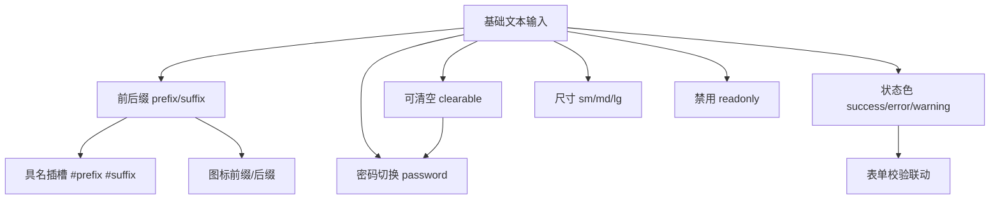
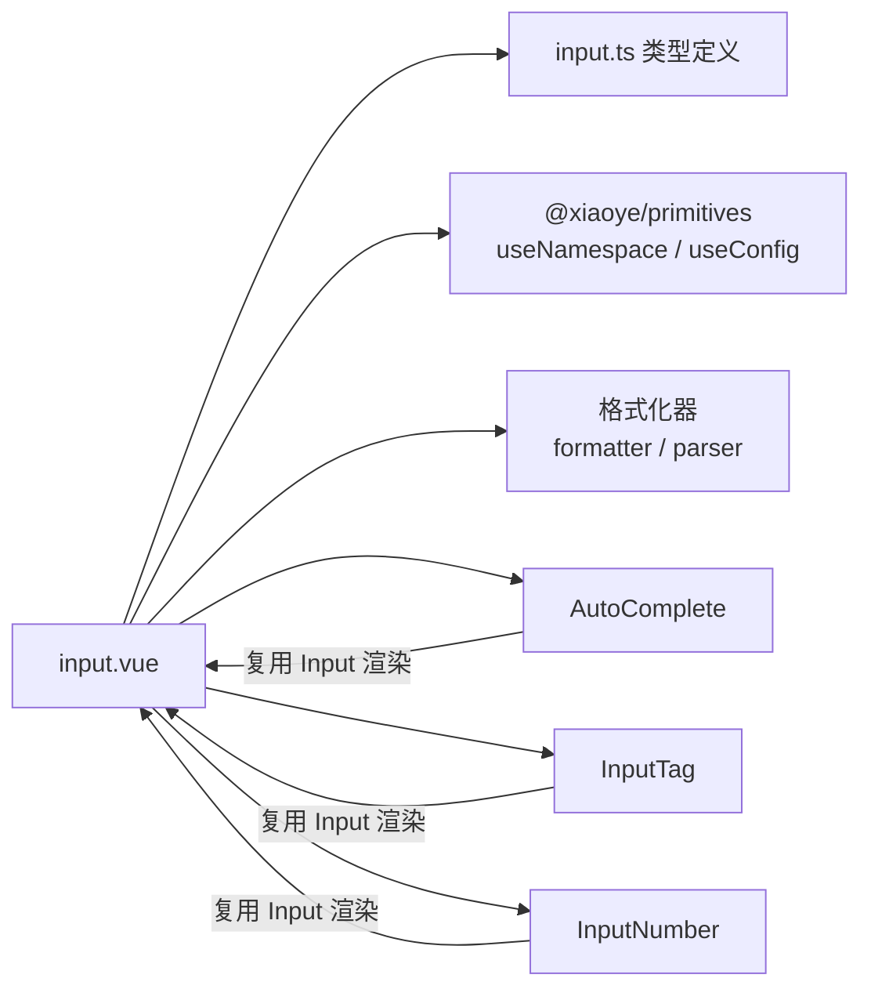
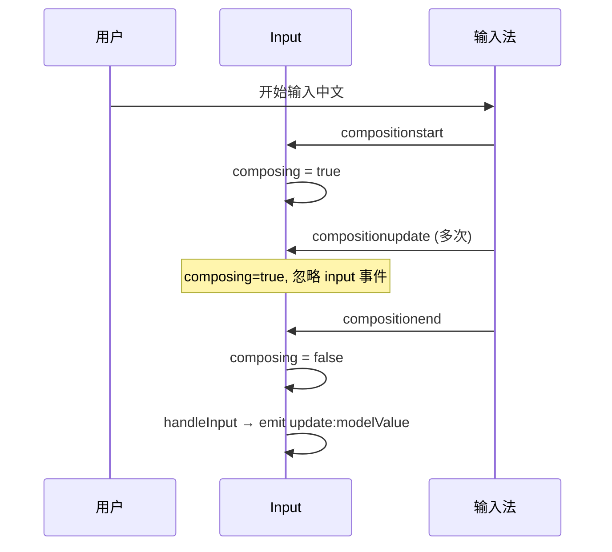
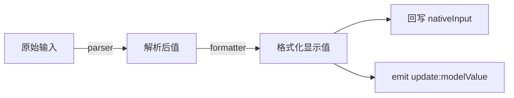

# 34 Input 输入框

> 导读：Input 是表单体系的数据输入基石，承担了文本采集、状态反馈、前后缀组合、密码切换等核心交互，同时作为 AutoComplete、InputTag、InputNumber 等复合组件的底层基础。

## 设计哲学

Input 要解决的核心问题是**在统一 API 下覆盖从简单文本到复杂组合输入的全部场景**。企业级表单中，输入框往往不是孤立的——它需要与校验联动、展示状态色、承载前后缀插槽、支持可清空、密码可见切换等。如果每个场景都拆成独立组件，API 割裂且难以组合。



**设计决策 WHY**

1. **为什么 Input 不拆成 Input 和 InputPassword？** 密码切换只是 suffix 区域一个图标的条件渲染，拆成两个组件会让用户在密码和非密码场景之间切换时需要替换整个组件。用 `type="password"` + `showPassword` 的组合方式，一个组件覆盖两种场景，状态迁移零成本。

2. **为什么用 nativeInputRef 直接操作 DOM 而不是纯数据驱动？** 光标位置、选区、compositionend 时机等浏览器原生行为无法通过 v-model 精确控制。在输入法组合（IME）场景下，`composing` 标志位必须在 compositionstart/compositionend 之间维持，否则中文输入法会产生重复触发。

3. **为什么前后缀同时支持 prop 和 slot？** prop（`prefix` / `suffix`）适合简单图标场景，slot 适合复杂自定义内容（如单位文字、按钮）。两者共存时 slot 优先，保证扩展性不破坏简洁性。

## 源码架构

### 文件结构

```
packages/components/input/
  index.ts           # withInstall + 导出
  src/
    input.vue        # 主组件模板 + 逻辑
    input.ts         # Props / Emits 类型定义
```

### 组件关系图



### 核心 type 定义

```ts
type InputType = 'text' | 'password' | 'textarea' | ...;

interface InputProps {
  modelValue?: string | number;
  type?: InputType;
  size?: ComponentSize;
  disabled?: boolean;
  readonly?: boolean;
  clearable?: boolean;
  showPassword?: boolean;
  placeholder?: string;
  maxlength?: number;
  minlength?: number;
  showWordLimit?: boolean;
  formatter?: (value: string | number) => string;
  parser?: (value: string) => string;
  prefix?: string;          // 图标名
  suffix?: string;          // 图标名
  rows?: number;            // textarea 行数
  autosize?: boolean | { minRows?: number; maxRows?: number };
  validateEvent?: boolean;  // 是否触发表单校验
}

interface InputEmits {
  'update:modelValue': (value: string | number) => void;
  input: (value: string | number) => void;
  change: (value: string | number) => void;
  blur: (event: FocusEvent) => void;
  focus: (event: FocusEvent) => void;
  clear: () => void;
  compositionstart: (event: CompositionEvent) => void;
  compositionupdate: (event: CompositionEvent) => void;
  compositionend: (event: CompositionEvent) => void;
}
```

## 核心实现

### 1. 双向绑定 + 输入法组合处理

Input 使用 `nativeInputRef` 直接操作原生 input，在 `handleInput` 中维护 `composing` 标志位以正确处理中文 IME。

```ts
const nativeInputRef = ref<HTMLInputElement | HTMLTextAreaElement>();
const composing = ref(false);

function handleInput(event: Event) {
  if (composing.value) return; // IME 组合中不触发 update
  const { value } = event.target as HTMLInputElement;
  const formatted = formatter ? formatter(value) : value;
  emit("update:modelValue", formatted);
  emit("input", formatted);
}

function handleCompositionStart() { composing.value = true; }
function handleCompositionEnd(event: CompositionEvent) {
  composing.value = false;
  handleInput(event); // 组合结束后触发一次
}
```



**WHY：为什么不在 watch(modelValue) 里同步 nativeInput？** 因为在 compositionend 后主动触发 handleInput 已经能同步值，额外 watch 会产生冗余更新。但当 `formatter` 导致格式化后值与原始值不同时，需要通过 `setNativeInputValue` 将格式化结果回写到原生 input。

### 2. 可清空 + 密码切换

两者都渲染在 suffix 区域，通过条件判断控制显隐：

```ts
const showClear = computed(() =>
  clearable && !disabled && !readonly &&
  (isFocused.value || hovering.value) &&
  String(nativeInputValue.value).length > 0
);

const passwordVisible = ref(false);
const showPwdSwitch = computed(() =>
  showPassword && !disabled && !readonly &&
  String(nativeInputValue.value).length > 0
);
```

**WHY：showClear 为什么依赖 isFocused || hovering？** 清空按钮始终可见会干扰视觉。仅在聚焦或悬浮时显示，是主流组件库的共识行为（Ant Design、Element Plus 均如此）。但输入内容为空时无论什么状态都不需要显示清空按钮。

### 3. Textarea 自动高度

当 `type="textarea"` 且 `autosize` 开启时，通过 `calcTextareaHeight` 动态计算高度：

```ts
function resizeTextarea() {
  if (type.value !== "textarea") return;
  if (!autosize.value) { nativeInputRef.value.style.height = ""; return; }
  const { minRows, maxRows } =
    typeof autosize.value === "object" ? autosize.value : {};
  const height = calcTextareaHeight(nativeInputRef.value, minRows, maxRows);
  nativeInputRef.value.style.height = `${height}px`;
}
```

`calcTextareaHeight` 的核心逻辑：创建一个隐藏的 textarea 副本，设置相同样式和内容，读取 `scrollHeight`，减去 padding 差值得到精确高度。

### 4. formatter / parser 双向格式化

```ts
// 输入时格式化
function handleInput(event: Event) {
  const { value } = event.target as HTMLInputElement;
  const parsed = parser ? parser(value) : value;
  const formatted = formatter ? formatter(parsed) : parsed;
  setNativeInputValue(formatted);       // 回写原生 input
  emit("update:modelValue", formatted); // 通知父组件
}

// 外部值写入时也需要格式化
watch(modelValue, (val) => {
  if (composing.value) return;
  const formatted = formatter ? formatter(val as string) : val;
  setNativeInputValue(String(formatted));
});
```



**WHY：为什么 parser 在 formatter 之前？** parser 的职责是将用户输入的显示文本解析为逻辑值（如去千分位分隔符），formatter 则将逻辑值格式化为显示文本（如加千分位）。两者组合使用时，数据流始终是：用户输入 → parser → formatter → 显示 + emit。

## API 参考

### Input Props

| 属性             | 说明                     | 类型                                         | 默认值    |
| ---------------- | ----------------------- | -------------------------------------------- | --------- |
| `modelValue`     | 绑定值                  | `string \| number`                           | `''`      |
| `type`           | 输入类型                | `'text' \| 'password' \| 'textarea' \| ...` | `'text'`  |
| `size`           | 尺寸                    | `'sm' \| 'md' \| 'lg'`                      | `'md'`    |
| `disabled`       | 是否禁用                | `boolean`                                    | `false`   |
| `readonly`       | 是否只读                | `boolean`                                    | `false`   |
| `clearable`      | 是否可清空              | `boolean`                                    | `false`   |
| `showPassword`   | 是否显示密码切换按钮    | `boolean`                                    | `false`   |
| `placeholder`    | 占位文本                | `string`                                     | `''`      |
| `maxlength`      | 最大输入长度            | `number`                                     | —         |
| `minlength`      | 最小输入长度            | `number`                                     | —         |
| `showWordLimit`  | 是否显示字数统计        | `boolean`                                    | `false`   |
| `formatter`      | 格式化显示值函数        | `(value: string \| number) => string`        | —         |
| `parser`         | 解析显示值函数          | `(value: string) => string`                  | —         |
| `prefix`         | 前缀图标名              | `string`                                     | —         |
| `suffix`         | 后缀图标名              | `string`                                     | —         |
| `rows`           | textarea 行数           | `number`                                     | `2`       |
| `autosize`       | textarea 自适应高度     | `boolean \| { minRows?: number; maxRows?: number }` | `false` |
| `validateEvent`  | 是否触发表单校验        | `boolean`                                    | `true`    |

### Input Emits

| 事件                 | 说明               | 参数                            |
| -------------------- | ------------------ | ------------------------------- |
| `update:modelValue`  | 值变化时触发       | `(value: string \| number)`     |
| `input`              | 输入时触发         | `(value: string \| number)`     |
| `change`             | 值变化且失焦后触发 | `(value: string \| number)`     |
| `blur`               | 失焦时触发         | `(event: FocusEvent)`           |
| `focus`              | 聚焦时触发         | `(event: FocusEvent)`           |
| `clear`              | 清空时触发         | —                               |
| `compositionstart`   | 输入法组合开始     | `(event: CompositionEvent)`     |
| `compositionupdate`  | 输入法组合更新     | `(event: CompositionEvent)`     |
| `compositionend`     | 输入法组合结束     | `(event: CompositionEvent)`     |

### Input Slots

| 插槽      | 说明             |
| --------- | ---------------- |
| `prefix`  | 前缀内容         |
| `suffix`  | 后缀内容         |
| `prepend` | 前置内容（外挂） |
| `append`  | 后置内容（外挂） |

### Input Exposes

| 方法          | 说明                |
| ------------- | ------------------- |
| `focus()`     | 聚焦输入框         |
| `blur()`      | 失焦输入框         |
| `select()`    | 选中输入框内容     |
| `clear()`     | 清空输入框内容     |
| `textarea`    | 原生 textarea 引用 |
| `input`       | 原生 input 引用    |

## 样式系统

### BEM 类名

| 类名                       | 说明               |
| -------------------------- | ------------------ |
| `xy-input`                 | 根容器             |
| `xy-input__wrapper`        | 输入框外层包裹     |
| `xy-input__inner`          | 原生 input 元素    |
| `xy-input__prefix`         | 前缀区域           |
| `xy-input__suffix`         | 后缀区域           |
| `xy-input__clear`          | 清空按钮           |
| `xy-input__password`       | 密码切换按钮       |
| `xy-input__word-limit`     | 字数统计           |
| `xy-input--prefix`         | 有前缀时的修饰符   |
| `xy-input--suffix`         | 有后缀时的修饰符   |
| `xy-input--disabled`       | 禁用状态           |
| `xy-input--{size}`         | 尺寸修饰符         |
| `xy-textarea`              | textarea 根容器    |
| `xy-textarea__inner`       | 原生 textarea 元素 |

### CSS 变量

| 变量名                            | 说明             | 默认值   |
| --------------------------------- | ---------------- | -------- |
| `--xy-input-text-color`           | 文本颜色         | —        |
| `--xy-input-border-color`         | 边框颜色         | —        |
| `--xy-input-hover-border-color`   | 悬浮边框颜色     | —        |
| `--xy-input-focus-border-color`   | 聚焦边框颜色     | —        |
| `--xy-input-bg-color`             | 背景颜色         | —        |
| `--xy-input-placeholder-color`    | 占位符颜色       | —        |
| `--xy-input-height`               | 输入框高度       | 尺寸相关 |
| `--xy-input-font-size`            | 字体大小         | 尺寸相关 |
| `--xy-input-padding-horizontal`   | 水平内边距       | 尺寸相关 |

### 主题定制方式

通过覆盖 CSS 变量实现主题定制，建议在 `:root` 或 `.xy-input` 选择器上设置：

```css
:root {
  --xy-input-focus-border-color: var(--xy-color-primary);
  --xy-input-height: 36px;
}
```

## 小结

1. **IME 组合感知**——`composing` 标志位精确控制 input 事件触发时机，确保中文输入法场景下不会产生重复触发或丢失值。
2. **前后缀双通道**——prop 传图标名用于简单场景，slot 传自定义内容用于复杂场景，两者共存时 slot 优先，兼顾简洁性与扩展性。
3. **格式化双函数**——`formatter` 控制"逻辑值如何显示"，`parser` 控制"显示值如何还原为逻辑值"，两者组合覆盖了千分位、单位换算等业务格式化场景。