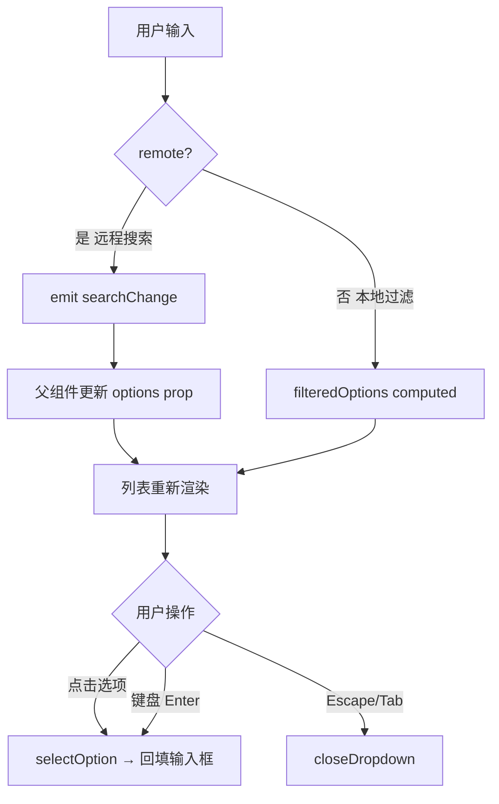
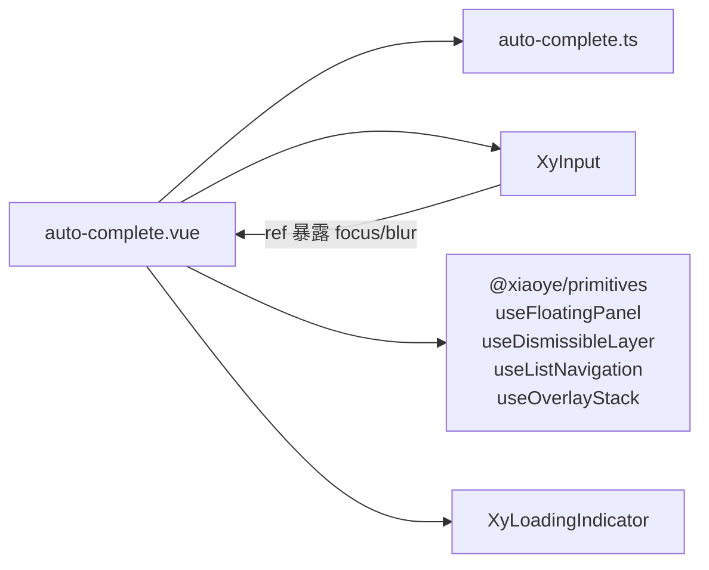
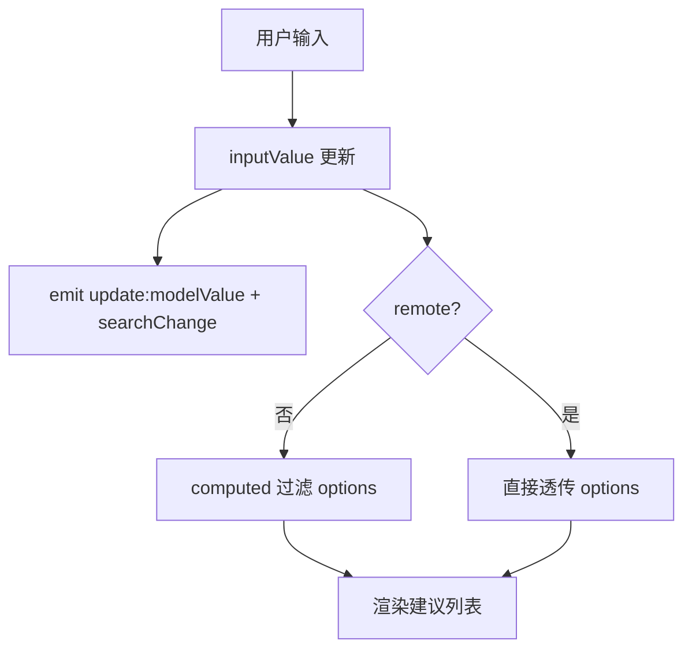
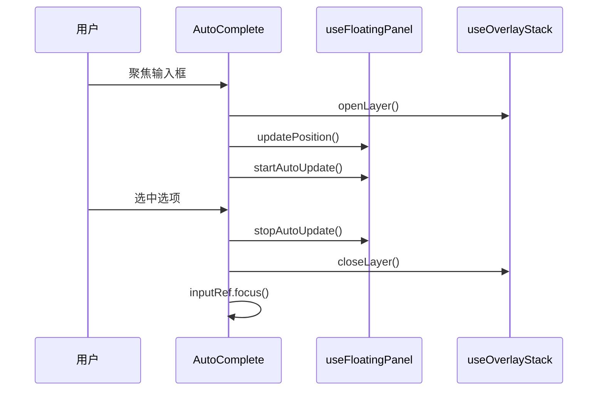

# 35 AutoComplete 自动完成

> 导读：AutoComplete 是 Input 的搜索增强形态，在用户输入时动态展示匹配的建议列表，本质是"输入框 + 浮层列表"的组合体，适用于模糊搜索、历史记录补全和远程联想等场景。

## 设计哲学

AutoComplete 解决的核心问题是**将搜索建议与输入行为无缝衔接**。用户在输入框中键入内容时，系统实时过滤并展示匹配项，用户点击建议即可完成输入，省去了完整输入的负担。

与 Select 组件的关键差异：Select 是"先展选项再选值"，AutoComplete 是"先输入再展匹配"。这意味着 AutoComplete 的数据源通常是动态的，需要远程搜索或本地过滤。



**设计决策 WHY**

1. **为什么 remote 模式不做本地过滤？** 远程搜索场景下，options 由服务端返回，已经是过滤结果。如果组件再做一次本地过滤，会导致服务端返回的结果被二次截断，产生不符合预期的行为。因此 `remote=true` 时直接透传 options。

2. **为什么选中后回填 label 而非 value？** AutoComplete 的 modelValue 是 string（输入文本），不是 Select 的结构化值。用户在输入框里看到的是 label，选中后输入框应该显示 label，modelValue 也应该是 label——这保持了"输入框内容 = modelValue"的一致性。

3. **为什么用 useFloatingPanel + useDismissibleLayer 而非 Popper 组件？** AutoComplete 需要精确控制弹层的打开/关闭时机（输入时打开、选中后关闭、Escape 关闭），以及弹层位置更新（选项数量变化时）。composable 比组件更灵活，可以在逻辑层精确控制生命周期。

## 源码架构

### 文件结构

```
packages/components/auto-complete/
  index.ts                # withInstall + 导出
  src/
    auto-complete.vue     # 主组件：Input + 浮层 + 键盘导航
    auto-complete.ts      # Props / Emits / 类型定义
```

### 组件关系图



### 核心 type 定义

```ts
interface AutoCompleteOption<T = string | number> extends SelectOption<T> {
  disabled?: boolean;
}

interface AutoCompleteProps<T = string | number> {
  modelValue?: string;
  options: AutoCompleteOption<T>[];
  placeholder?: string;
  disabled?: boolean;
  clearable?: boolean;
  remote?: boolean;
  loading?: boolean;
  loadingText?: string;
  size?: ComponentSize;
  prefixIcon?: string;
  suffixIcon?: string;
  teleported?: boolean;
  appendTo?: string | HTMLElement;
  placement?: Placement;
  offset?: number;
  popperClass?: string;
  popperStyle?: StyleValue;
  dropdownMinWidth?: string | number;
  dropdownMaxWidth?: string | number;
}
```

## 核心实现

### 1. 本地过滤 vs 远程模式

```ts
const filteredOptions = computed(() => {
  if (props.remote) return props.options; // 远程模式直接透传
  const keyword = inputValue.value.trim().toLowerCase();
  if (!keyword) return props.options;     // 空关键词展示全部
  return props.options.filter(option =>
    option.label.toLowerCase().includes(keyword)
  );
});
```



**WHY：为什么空关键词时也展示全部选项？** 这是 `triggerOnFocus` 语义——用户聚焦输入框时，即使还没输入，也展示所有建议作为参考。这比"聚焦后必须输入才能看到建议"更友好，尤其在选项数量不多时。

### 2. 键盘导航——useListNavigation

AutoComplete 通过 `useListNavigation` composable 实现键盘导航，支持循环遍历：

```ts
const navigation = useListNavigation(() => filteredOptions.value, {
  loop: true  // 到达末尾后回到开头
});

// 键盘事件处理
async function handleKeydown(event: KeyboardEvent) {
  switch (event.key) {
    case "ArrowDown": navigation.moveNext(); break;
    case "ArrowUp":   navigation.movePrev(); break;
    case "Enter":
      if (navigation.activeItem.value) await selectOption(navigation.activeItem.value);
      break;
    case "Escape": await closeDropdown(true, true); break;
    case "Tab":    await closeDropdown(true); break;
  }
}
```

**WHY：为什么 loop 为 true？** 在有限选项列表中，循环导航让用户无需反向操作即可回到起点。但循环只在键盘导航时生效，不影响视觉滚动位置。

### 3. 浮层生命周期管理

```ts
async function openDropdown() {
  if (mergedDisabled.value || open.value) return;
  open.value = true;
  emit("visibleChange", true);
  openLayer();              // 注册到 overlay 栈
  syncActiveIndex();        // 高亮首项
  await nextTick();
  await updatePosition();   // 计算浮层位置
  startAutoUpdate();        // 开始自动位置更新
}

async function closeDropdown(shouldValidate, restoreFocus) {
  open.value = false;
  emit("visibleChange", false);
  stopAutoUpdate();
  closeLayer();
  navigation.clearActiveIndex();
  if (restoreFocus) inputRef.value?.focus();
  if (shouldValidate) await formItem?.validate("blur");
}
```



### 4. 可关闭层——useDismissibleLayer

```ts
useDismissibleLayer({
  enabled: open,
  refs: [triggerRef, dropdownRef],  // 点击这两个元素之外的区域关闭
  closeOnEscape: true,
  closeOnOutside: true,
  isTopMost: () => isTopMost(),     // 只有最顶层浮层响应 Escape
  onDismiss: async (reason) => {
    await closeDropdown(reason === "outside", reason === "escape");
  }
});
```

**WHY：为什么需要 isTopMost 检查？** 当存在多个浮层（如 AutoComplete 的下拉 + Dialog）时，Escape 应该只关闭最顶层的浮层，而不是从底层开始关闭。`useOverlayStack` 维护了一个 z-index 栈，`isTopMost()` 判断当前浮层是否在栈顶。

## API 参考

### AutoComplete Props

| 属性                | 说明                       | 类型                          | 默认值          |
| ------------------- | ------------------------- | ----------------------------- | --------------- |
| `modelValue`        | 当前输入值                | `string`                      | `''`            |
| `options`           | 建议项列表                | `AutoCompleteOption<T>[]`     | —               |
| `placeholder`       | 输入占位提示              | `string`                      | `'请输入关键词'`|
| `disabled`          | 是否禁用                  | `boolean`                     | `false`         |
| `clearable`         | 是否允许清空              | `boolean`                     | `false`         |
| `remote`            | 是否启用远程建议模式      | `boolean`                     | `false`         |
| `loading`           | 是否展示加载态            | `boolean`                     | `false`         |
| `loadingText`       | 加载态文案                | `string`                      | `'加载中'`      |
| `size`              | 组件尺寸                  | `ComponentSize`               | 跟随全局配置    |
| `prefixIcon`        | 输入框前缀图标            | `string`                      | `''`            |
| `suffixIcon`        | 输入框后缀图标            | `string`                      | `''`            |
| `teleported`        | 是否把下拉面板传送到 body | `boolean`                     | `true`          |
| `appendTo`          | 下拉面板挂载目标          | `string \| HTMLElement`       | `'body'`        |
| `placement`         | 下拉面板弹出位置          | `Placement`                   | `'bottom-start'`|
| `offset`            | 下拉面板偏移量            | `number`                      | `8`             |
| `popperClass`       | 下拉面板自定义类名        | `string`                      | `''`            |
| `popperStyle`       | 下拉面板自定义样式        | `StyleValue`                  | `''`            |
| `dropdownMinWidth`  | 下拉面板最小宽度          | `string \| number`            | —               |
| `dropdownMaxWidth`  | 下拉面板最大宽度          | `string \| number`            | —               |

### AutoComplete Emits

| 事件               | 说明                 | 参数                            |
| ------------------ | -------------------- | ------------------------------- |
| `update:modelValue`| 输入值变化时触发     | `(value: string)`               |
| `change`           | 选择建议项或清空后触发 | `(value: string)`             |
| `clear`            | 点击清空按钮时触发   | —                               |
| `visibleChange`    | 下拉打开或关闭时触发 | `(value: boolean)`              |
| `focus`            | 打开下拉面板时触发   | —                               |
| `blur`             | 关闭下拉面板时触发   | —                               |
| `searchChange`     | 搜索关键词变化时触发 | `(value: string)`               |
| `select`           | 选择某个建议项时触发 | `(option: AutoCompleteOption<T>)`|

### AutoComplete Slots

| 插槽      | 说明                           |
| --------- | ------------------------------ |
| `prefix`  | 输入框前缀内容                 |
| `suffix`  | 输入框后缀内容                 |
| `loading` | 自定义加载态内容               |
| `empty`   | 自定义空态内容                 |
| `option`  | 自定义建议项内容，接收 `{ option, active }` |

### AutoComplete Exposes

| 方法        | 说明                     |
| ----------- | ------------------------ |
| `focus()`   | 聚焦输入框               |
| `blur()`    | 关闭下拉并让输入框失焦   |
| `open()`    | 打开下拉面板             |
| `close()`   | 关闭下拉面板             |

## 样式系统

### BEM 类名

| 类名                              | 说明               |
| --------------------------------- | ------------------ |
| `xy-auto-complete`                | 根容器             |
| `xy-auto-complete__trigger`       | 输入框触发区域     |
| `xy-auto-complete__dropdown`      | 下拉面板           |
| `xy-auto-complete__list`          | 建议列表           |
| `xy-auto-complete__option`        | 建议项             |
| `xy-auto-complete__loading`       | 加载态             |
| `xy-auto-complete__empty`         | 空态               |
| `xy-auto-complete--sm/md/lg`      | 尺寸修饰符         |
| `is-open`                         | 打开状态           |
| `is-active`                       | 高亮项             |
| `is-disabled`                     | 禁用项             |

### CSS 变量

| 变量名                                    | 说明           | 默认值 |
| ----------------------------------------- | -------------- | ------ |
| `--xy-auto-complete-dropdown-bg`          | 下拉面板背景   | —      |
| `--xy-auto-complete-dropdown-border`      | 下拉面板边框   | —      |
| `--xy-auto-complete-dropdown-shadow`      | 下拉面板阴影   | —      |

### 主题定制方式

通过 `popperClass` / `popperStyle` 或覆盖 CSS 变量：

```css
.xy-auto-complete__dropdown {
  --xy-auto-complete-dropdown-bg: var(--xy-bg-color);
}
```

## 小结

1. **本地/远程双模式**——`remote=false` 时组件自动过滤 options，`remote=true` 时透传 options 并通过 `searchChange` 事件通知外部搜索，两种模式职责清晰分离。
2. **composable 驱动的浮层**——`useFloatingPanel` + `useDismissibleLayer` + `useListNavigation` + `useOverlayStack` 四个 composable 协同管理浮层的定位、关闭、导航和层级，AutoComplete 自身只负责业务逻辑。
3. **选中后回填 + 重聚焦**——选中建议项后将 label 回填输入框并重新聚焦，保持用户可以继续输入的连贯操作流。