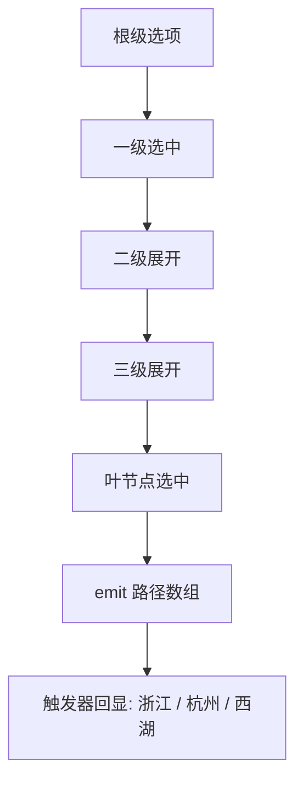
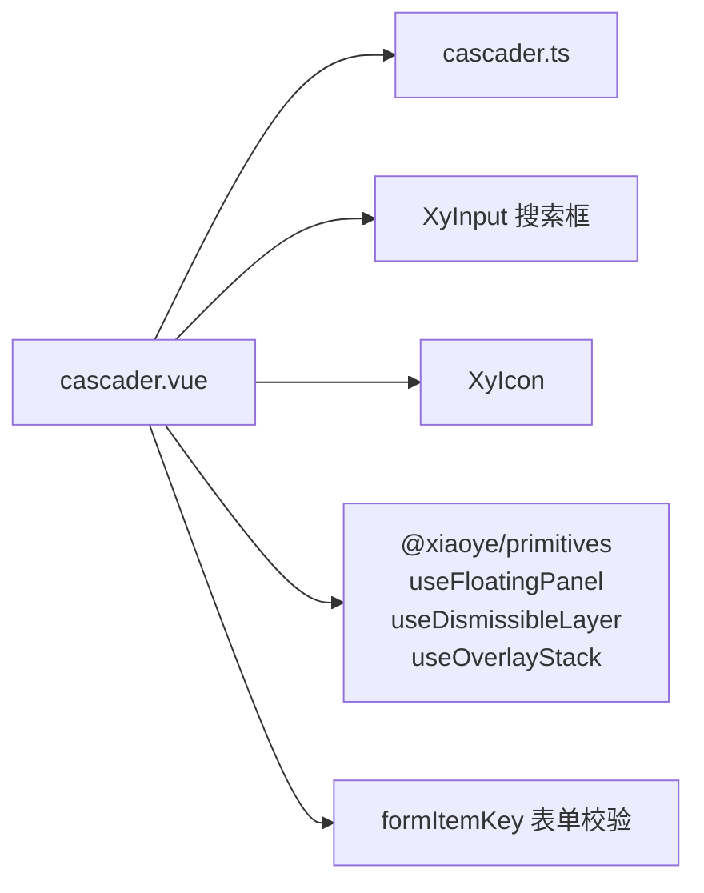
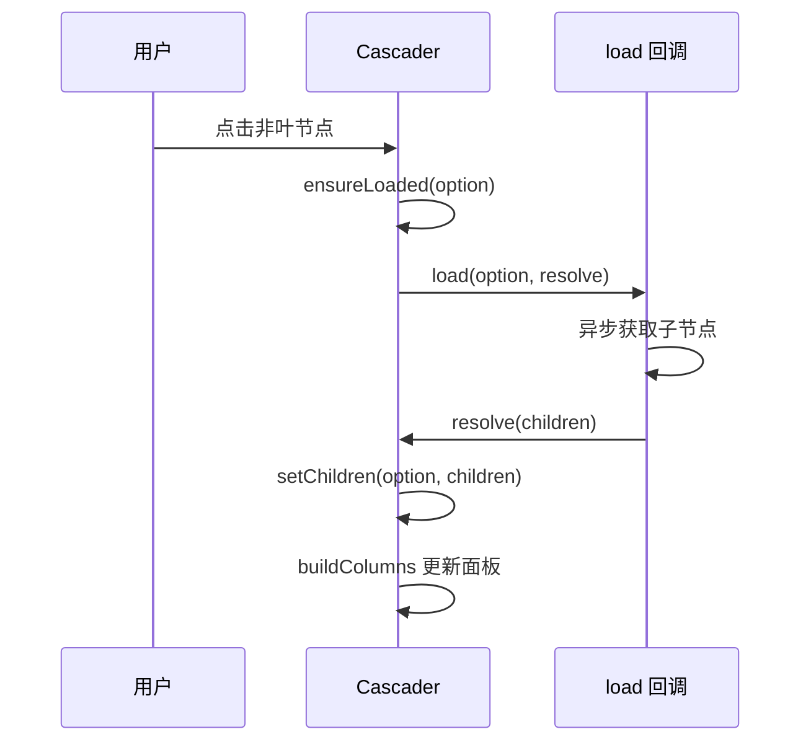

# 36 Cascader 级联选择

> 导读：Cascader 用于地区选择、目录导航和路径式分类选择，核心是"逐级展开 + 路径回显"，输出值为从根到叶的完整路径数组，与 Select（扁平枚举）和 TreeSelect（单节点值）形成场景互补。

## 设计哲学

Cascader 解决的核心问题是**层级数据的路径选择**。当数据天然具有层级结构（省/市/区、一级/二级/三级分类），用户需要从根到叶逐级选择时，Cascader 提供了"逐级展开列 + 路径回显"的交互模式。



**设计决策 WHY**

1. **为什么值是路径数组而非单节点 key？** Cascader 的语义是"路径选择"——用户选择的是一条从根到叶的完整路径，而非某个孤立的节点。路径数组 `['zhejiang', 'hangzhou', 'xihu']` 携带了完整的层级信息，可以直接用于级联回显和后端提交。如果只需要单节点 key，应该用 TreeSelect。

2. **为什么用 columns 数组而非递归渲染？** Cascader 的面板是 N 列平铺结构，每列对应一个层级。用 `columns: CascaderOptionData[][]` 数组比递归组件更直观——每列就是数组的一个元素，选中某项后 push 其 children 作为下一列。这种"扁平数组 + 索引"的结构比递归树更容易理解和调试。

3. **为什么支持懒加载（lazy + load）？** 大型分类体系（如地区数据）可能有上万节点，一次性加载全部数据既慢又浪费内存。懒加载让组件只在用户展开某一级时才请求子节点，通过 `load(option, resolve)` 回调实现按需加载。

## 源码架构

### 文件结构

```
packages/components/cascader/
  index.ts            # withInstall + 导出
  src/
    cascader.vue      # 主组件：触发器 + 浮层面板
    cascader.ts       # Props / Emits / 类型定义
```

### 组件关系图



### 核心 type 定义

```ts
type CascaderKey = string | number;
type CascaderValue = CascaderKey[] | null;
type CascaderOptionData = Record<string, any>;

interface CascaderFieldNames {
  label?: string;     // 默认 'label'
  value?: string;     // 默认 'value'
  children?: string;  // 默认 'children'
  disabled?: string;  // 默认 'disabled'
  leaf?: string;      // 默认 'leaf'
}

type CascaderLoadFunction = (
  option: CascaderOptionData,
  resolve: (children: CascaderOptionData[]) => void
) => void;

interface CascaderProps {
  modelValue?: CascaderValue;
  options: CascaderOptionData[];
  props?: CascaderFieldNames;
  placeholder?: string;
  disabled?: boolean;
  clearable?: boolean;
  filterable?: boolean;
  lazy?: boolean;
  load?: CascaderLoadFunction;
  size?: ComponentSize;
  searchPlaceholder?: string;
  teleported?: boolean;
  appendTo?: string | HTMLElement;
  placement?: Placement;
  offset?: number;
  popperClass?: string;
  popperStyle?: StyleValue;
}
```

## 核心实现

### 1. 列构建——buildColumns

Cascader 的面板由 columns 数组驱动，每列是一组同级选项。选中某项后，其 children 成为下一列。

```ts
const columns = ref<CascaderOptionData[][]>([props.options]);

function buildColumns(values: CascaderKey[] | null) {
  const nextColumns: CascaderOptionData[][] = [props.options];
  const path = findPath(values); // 根据 values 找到完整路径
  path.forEach((option) => {
    const children = getChildren(option);
    if (children.length) nextColumns.push(children);
  });
  columns.value = nextColumns;
}
```

```mermaid
flowchart TD
  VAL[selectedValue] --> FP[findPath]
  FP --> PATH[路径节点数组]
  PATH --> BC[buildColumns]
  BC --> C0[columns[0] = options]
  BC --> C1[columns[1] = path[0].children]
  BC --> C2[columns[2] = path[1].children]
  C0 --> RENDER[面板渲染 N 列]
  C1 --> RENDER
  C2 --> RENDER
```

**WHY：为什么每次选中都重建 columns？** 选中操作可能跨越多级——比如从"浙江/杭州/西湖"直接点击"江苏"（第一列），此时需要清空后续所有列，只保留第一列和"江苏"的 children。重建 columns 比增量修改更简单且不易出错。

### 2. 路径查找——findPath

```ts
function findPath(values: CascaderKey[] | null, options = props.options): CascaderOptionData[] {
  if (!values?.length) return [];
  const path: CascaderOptionData[] = [];
  let currentOptions = options;
  for (const value of values) {
    const matched = currentOptions.find(option => getValue(option) === value);
    if (!matched) break;
    path.push(matched);
    currentOptions = getChildren(matched);
  }
  return path;
}
```

findPath 从根级开始逐级匹配 values 中的每个 key，构建出完整的节点路径。如果中间某个 key 找不到匹配（数据被删除或懒加载未完成），则截断路径。

### 3. 懒加载——ensureLoaded

```ts
async function ensureLoaded(option: CascaderOptionData) {
  if (!props.lazy || !props.load || isLeaf(option) || getChildren(option).length) return;
  loadingKey.value = getValue(option);
  await new Promise<void>((resolve) => {
    props.load?.(option, (children) => {
      setChildren(option, children); // 将子节点写入 option
      resolve();
    });
  });
  loadingKey.value = null;
}
```



**WHY：为什么用 Promise 包装 load 回调？** load 回调是 CPS（续延传递）风格——用户调用 `resolve(children)` 才算完成。用 Promise 包装后，`ensureLoaded` 可以 await 等待加载完成，确保后续的 `buildColumns` 和 `updatePosition` 在子节点就绪后执行。

### 4. 搜索过滤——flattenOptions + searchResults

```ts
function flattenOptions(options, parentValues = [], parentLabels = []): SearchResult[] {
  return options.flatMap((option) => {
    const currentValues = parentValues.concat(getValue(option));
    const currentLabels = parentLabels.concat(getLabel(option));
    const current = { option, values: currentValues, labels: currentLabels };
    const children = getChildren(option);
    return [current, ...flattenOptions(children, currentValues, currentLabels)];
  });
}

const searchResults = computed(() => {
  const keyword = searchValue.value.trim().toLowerCase();
  if (!props.filterable || !keyword) return [];
  return flattenOptions(props.options).filter(item =>
    item.labels.join(" / ").toLowerCase().includes(keyword)
  );
});
```

**WHY：为什么搜索用扁平化而非树遍历？** 搜索结果需要展示完整路径（如"浙江 / 杭州 / 西湖"），扁平化时预计算每项的 values 和 labels，搜索时只需做字符串匹配，无需递归遍历树。虽然扁平化有 O(n) 开销，但级联数据通常不超过几千节点，性能可接受。

## API 参考

### Cascader Props

| 属性              | 说明                       | 类型                          | 默认值     |
| ----------------- | ------------------------- | ----------------------------- | ---------- |
| `modelValue`      | 当前选中路径值            | `CascaderKey[] \| null`       | `null`     |
| `options`         | 级联选项树                | `CascaderOptionData[]`        | `[]`       |
| `props`           | 字段映射配置              | `CascaderFieldNames`          | 见上方     |
| `placeholder`     | 未选择时的占位提示        | `string`                      | `'请选择'` |
| `disabled`        | 是否禁用                  | `boolean`                     | `false`    |
| `clearable`       | 是否允许清空              | `boolean`                     | `false`    |
| `filterable`      | 是否启用搜索过滤          | `boolean`                     | `false`    |
| `lazy`            | 是否启用懒加载            | `boolean`                     | `false`    |
| `load`            | 懒加载回调                | `CascaderLoadFunction`        | —          |
| `size`            | 组件尺寸                  | `ComponentSize`               | 跟随全局   |
| `searchPlaceholder`| 搜索框占位文案           | `string`                      | `'搜索选项'`|
| `teleported`      | 是否把下拉面板传送到 body | `boolean`                     | `true`     |
| `appendTo`        | 下拉面板挂载目标          | `string \| HTMLElement`       | `'body'`   |
| `placement`       | 下拉面板弹出位置          | `Placement`                   | `'bottom-start'`|
| `offset`          | 下拉面板偏移量            | `number`                      | `8`        |
| `popperClass`     | 下拉面板自定义类名        | `string`                      | `''`       |
| `popperStyle`     | 下拉面板自定义样式        | `StyleValue`                  | `''`       |

### Cascader Emits

| 事件             | 说明                 | 参数                     |
| ---------------- | -------------------- | ------------------------ |
| `update:modelValue` | 选中路径变化时触发 | `(value: CascaderValue)` |
| `change`         | 确认变化或清空后触发 | `(value: CascaderValue)` |
| `clear`          | 点击清空按钮时触发   | —                        |
| `visibleChange`  | 面板打开或关闭时触发 | `(value: boolean)`       |
| `focus`          | 打开面板时触发       | —                        |
| `blur`           | 关闭面板时触发       | —                        |
| `searchChange`   | 搜索关键词变化时触发 | `(value: string)`        |

### Cascader Exposes

| 方法        | 说明           |
| ----------- | -------------- |
| `focus()`   | 聚焦触发器     |
| `blur()`    | 关闭面板并失焦 |
| `open()`    | 打开下拉面板   |
| `close()`   | 关闭下拉面板   |

## 样式系统

### BEM 类名

| 类名                        | 说明               |
| --------------------------- | ------------------ |
| `xy-cascader`               | 根容器             |
| `xy-cascader__trigger`      | 触发器区域         |
| `xy-cascader__label`        | 路径回显文本       |
| `xy-cascader__dropdown`     | 下拉面板           |
| `xy-cascader__columns`      | 列容器（CSS Grid） |
| `xy-cascader__column`       | 单列               |
| `xy-cascader__option`       | 选项               |
| `xy-cascader__search`       | 搜索框区域         |
| `xy-cascader__search-results`| 搜索结果列表      |
| `xy-cascader__search-item`  | 搜索结果项         |
| `is-active`                 | 当前级选中项       |
| `is-disabled`               | 禁用项             |
| `is-open`                   | 打开状态           |

### CSS 变量

| 变量名                                  | 说明           | 默认值 |
| --------------------------------------- | -------------- | ------ |
| `--xy-cascader-dropdown-bg`             | 下拉面板背景   | —      |
| `--xy-cascader-dropdown-border`         | 下拉面板边框   | —      |
| `--xy-cascader-dropdown-shadow`         | 下拉面板阴影   | —      |
| `--xy-cascader-dropdown-section-background`| 列区背景    | —      |

### 主题定制方式

通过 `popperClass` / `popperStyle` 或覆盖 CSS 变量：

```css
.xy-cascader__dropdown {
  --xy-cascader-dropdown-bg: var(--xy-bg-color);
}
```

## 小结

1. **columns 数组驱动面板**——每列是同级选项数组，选中后 push children 形成新列，重建 columns 比增量修改更简单可靠。
2. **懒加载的 Promise 包装**——将 CPS 风格的 `load(option, resolve)` 包装为 async/await，确保子节点就绪后才更新面板布局。
3. **扁平化搜索**——搜索时预计算每项的完整路径 labels，做字符串匹配而非树遍历，在千级节点规模下性能可接受。