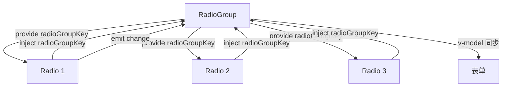
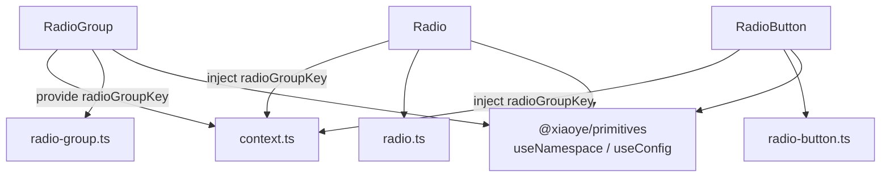
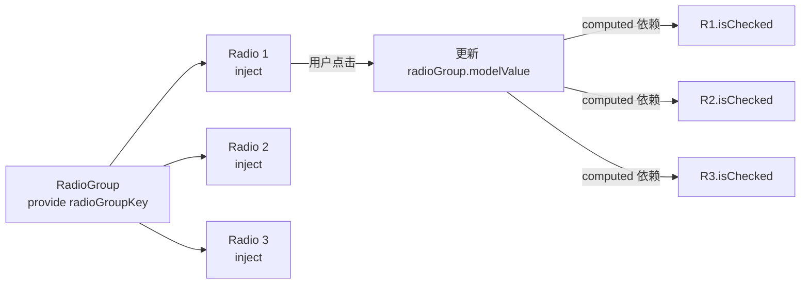

# 37 Radio 单选

> 导读：Radio 用于在互斥选项中选一，核心是"排他性选择"——同一组内永远只有一个选项处于激活态，适用于选项数量较少且需要强制单选的场景。

## 设计哲学

Radio 解决的核心问题是**互斥选择**。与 Checkbox 的多选不同，Radio 一旦选中就不可取消（除非选同组其他项）。这种"选中即锁定"的语义适用于性别选择、支付方式选择等必须选且只选一个的场景。



**设计决策 WHY**

1. **为什么 Radio 和 RadioGroup 分开？** 单独的 Radio 可以在非互斥场景下使用（虽然不推荐）。RadioGroup 通过 provide/inject 将多个 Radio 关联成互斥组，统一管理 v-model。分离后 API 更灵活——简单场景用 Radio + v-model，组场景用 RadioGroup 包裹。

2. **为什么 RadioButton 存在？** Button 风格的 Radio 适用于紧凑型表单和工具栏场景，视觉效果类似 SegmentedControl。它不是独立组件，而是 RadioGroup 的 `type="button"` 变体——共享同一套互斥逻辑，只改变视觉呈现。

3. **为什么 Radio 选中后不可取消？** 这是 WAI-ARIA radio 角色的语义要求——radio 是"从一组选项中选择一个"，不是 toggle。如果需要可取消的单选，应该用 Select 或 Switch 代替。

## 源码架构

### 文件结构

```
packages/components/radio/
  index.ts              # withInstall + 导出 Radio / RadioGroup / RadioButton
  src/
    radio.vue           # 基础单选按钮
    radio.ts            # Radio Props / Emits 类型
    radio-group.vue     # 单选组容器
    radio-group.ts      # RadioGroup Props / Emits 类型
    radio-button.vue    # 按钮风格单选
    radio-button.ts     # RadioButton Props 类型
    context.ts          # radioGroupKey + 上下文类型定义
```

### 组件关系图



### 核心 type 定义

```ts
// context.ts
interface RadioGroupContext {
  name: string;
  modelValue: WritableComputedRef<string | number | boolean>;
  size: ComputedRef<ComponentSize>;
  disabled: ComputedRef<boolean>;
  type: ComputedRef<'default' | 'button'>;
  fill: ComputedRef<string>;
  textColor: ComputedRef<string>;
  addToGroup: (radio: RadioInstance) => void;
  removeFromGroup: (radio: RadioInstance) => void;
}

// radio.ts
interface RadioProps {
  modelValue?: string | number | boolean;
  label: string | number | boolean;
  value?: string | number | boolean;  // 兼容写法
  disabled?: boolean;
  size?: ComponentSize;
  name?: string;
  border?: boolean;  // 带边框样式
}

// radio-group.ts
interface RadioGroupProps {
  modelValue?: string | number | boolean;
  size?: ComponentSize;
  disabled?: boolean;
  type?: 'default' | 'button';
  fill?: string;       // button 类型激活态背景色
  textColor?: string;  // button 类型激活态文字色
}
```

## 核心实现

### 1. RadioGroup 的 provide/inject 机制

RadioGroup 通过 provide 向子 Radio 注入上下文，子 Radio 通过 inject 获取组信息，实现互斥选择。

```ts
// radio-group.vue
const modelValue = computed({
  get: () => props.modelValue,
  set: (val) => { emit("update:modelValue", val); emit("change", val); }
});

provide(radioGroupKey, {
  name: props.name,
  modelValue,
  size: computed(() => props.size ?? globalSize.value),
  disabled: computed(() => props.disabled),
  type: computed(() => props.type),
  fill: computed(() => props.fill ?? ""),
  textColor: computed(() => props.textColor ?? ""),
  addToGroup, removeFromGroup
});
```

```ts
// radio.vue
const radioGroup = inject(radioGroupKey, undefined);

const isGrouped = computed(() => !!radioGroup);
const isChecked = computed(() =>
  isGrouped.value
    ? radioGroup!.modelValue.value === props.label
    : localValue.value === props.label
);
```



**WHY：为什么 modelValue 用 WritableComputedRef？** 子 Radio 需要读取 modelValue 判断自己是否选中，也需要写入 modelValue 实现互斥。WritableComputedRef 的 get/set 模式让子 Radio 可以直接赋值 `radioGroup.modelValue = label`，同时触发 Group 的 change 事件——比 emit + props 链路更简洁。

### 2. 独立 Radio vs 组内 Radio 的双模式

Radio 组件需要同时支持独立使用和组内使用两种模式：

```ts
// radio.vue
function handleChange(event: Event) {
  if (isGrouped.value) {
    radioGroup!.modelValue.value = props.label; // 组模式：写入 Group 的 modelValue
  } else {
    localValue.value = props.label;              // 独立模式：更新本地值
    emit("update:modelValue", props.label);
    emit("change", props.label);
  }
}
```

**WHY：为什么不强制必须用 RadioGroup？** 在极简场景下（如"是否同意协议"的单选项），用户可能不想包裹 RadioGroup。双模式让 Radio 既可独立使用也可组内使用，降低使用门槛。

### 3. RadioButton 的 fill/textColor 定制

Button 风格的 Radio 激活态支持自定义背景色和文字色：

```ts
// radio-button.vue
const activeStyle = computed(() => ({
  backgroundColor: radioGroup?.fill.value ?? "",
  borderColor: radioGroup?.fill.value ?? "",
  color: radioGroup?.textColor.value ?? "",
  boxShadow: `-1px 0 0 0 ${radioGroup?.fill.value ?? ""}`
}));
```

**WHY：为什么 fill/textColor 在 Group 而非 Button 上？** 互斥组内所有 Button 的激活色应该一致。如果每个 Button 独立设置，容易产生不一致。将 fill/textColor 放在 Group 上，确保整组风格统一。

### 4. 无障碍——键盘导航

RadioGroup 内的 Radio 支持方向键导航：

```ts
// radio.vue
function handleKeydown(event: KeyboardEvent) {
  if (!isGrouped.value) return;
  const radios = Array.from(radioGroupRef.value?.querySelectorAll('[role="radio"]') ?? []);
  const currentIndex = radios.indexOf(event.target as HTMLElement);
  let nextIndex: number | undefined;

  if (["ArrowRight", "ArrowDown"].includes(event.key)) {
    nextIndex = (currentIndex + 1) % radios.length;
  } else if (["ArrowLeft", "ArrowUp"].includes(event.key)) {
    nextIndex = (currentIndex - 1 + radios.length) % radios.length;
  }

  if (nextIndex !== undefined) {
    event.preventDefault();
    (radios[nextIndex] as HTMLElement).click();
    (radios[nextIndex] as HTMLElement).focus();
  }
}
```

## API 参考

### Radio Props

| 属性           | 说明                   | 类型                              | 默认值  |
| -------------- | ---------------------- | --------------------------------- | ------- |
| `modelValue`   | 绑定值（独立模式）     | `string \| number \| boolean`     | —       |
| `label`        | Radio 的值             | `string \| number \| boolean`     | —       |
| `value`        | Radio 的值（兼容写法） | `string \| number \| boolean`     | —       |
| `disabled`     | 是否禁用               | `boolean`                         | `false` |
| `size`         | 尺寸                   | `ComponentSize`                   | —       |
| `name`         | 原生 name 属性         | `string`                          | —       |
| `border`       | 是否显示边框           | `boolean`                         | `false` |

### Radio Emits

| 事件                 | 说明           | 参数                              |
| -------------------- | -------------- | --------------------------------- |
| `update:modelValue`  | 值变化时触发   | `(value: string \| number \| boolean)` |
| `change`             | 选中时触发     | `(value: string \| number \| boolean)` |

### RadioGroup Props

| 属性           | 说明                       | 类型                          | 默认值     |
| -------------- | -------------------------- | ----------------------------- | ---------- |
| `modelValue`   | 绑定值                     | `string \| number \| boolean` | —          |
| `size`         | 组内 Radio 尺寸            | `ComponentSize`               | 跟随全局   |
| `disabled`     | 是否禁用整组               | `boolean`                     | `false`    |
| `type`         | 风格类型                   | `'default' \| 'button'`       | `'default'`|
| `fill`         | button 类型激活态背景色    | `string`                      | —          |
| `textColor`    | button 类型激活态文字色    | `string`                      | —          |
| `name`         | 原生 name 属性             | `string`                      | —          |

### RadioGroup Emits

| 事件                 | 说明         | 参数                              |
| -------------------- | ------------ | --------------------------------- |
| `update:modelValue`  | 值变化时触发 | `(value: string \| number \| boolean)` |
| `change`             | 值变化时触发 | `(value: string \| number \| boolean)` |

### RadioGroup Slots

| 插槽      | 说明                       |
| --------- | -------------------------- |
| `default` | Radio / RadioButton 子组件 |

### RadioButton Props

| 属性       | 说明               | 类型                              | 默认值  |
| ---------- | ------------------ | --------------------------------- | ------- |
| `label`    | Radio 的值         | `string \| number \| boolean`     | —       |
| `value`    | 兼容写法           | `string \| number \| boolean`     | —       |
| `disabled` | 是否禁用           | `boolean`                         | `false` |
| `name`     | 原生 name 属性     | `string`                          | —       |

## 样式系统

### BEM 类名

| 类名                          | 说明               |
| ----------------------------- | ------------------ |
| `xy-radio`                    | Radio 根容器       |
| `xy-radio__input`             | 原生 input 区域    |
| `xy-radio__inner`             | 自定义圆圈指示器   |
| `xy-radio__label`             | 文本标签           |
| `xy-radio--checked`           | 选中状态           |
| `xy-radio--disabled`          | 禁用状态           |
| `xy-radio--bordered`          | 带边框样式         |
| `xy-radio--sm/md/lg`          | 尺寸修饰符         |
| `xy-radio-group`              | RadioGroup 容器    |
| `xy-radio-group--button`      | Button 风格        |
| `xy-radio-button`             | RadioButton 根容器 |
| `xy-radio-button--active`     | 激活态             |
| `xy-radio-button--disabled`   | 禁用态             |
| `xy-radio-button--sm/md/lg`   | 尺寸修饰符         |

### CSS 变量

| 变量名                            | 说明               | 默认值 |
| --------------------------------- | ------------------ | ------ |
| `--xy-radio-text-color`           | 文字颜色           | —      |
| `--xy-radio-input-height`         | 圆圈高度           | `16px` |
| `--xy-radio-input-width`          | 圆圈宽度           | `16px` |
| `--xy-radio-input-border-color`   | 圆圈边框颜色       | —      |
| `--xy-radio-input-bg-color`       | 圆圈背景色         | —      |
| `--xy-radio-input-border-color-hover`| 悬浮边框色     | —      |
| `--xy-radio-button-bg-color`      | Button 默认背景    | —      |
| `--xy-radio-button-text-color`    | Button 默认文字    | —      |
| `--xy-radio-button-active-bg-color`| Button 激活背景  | —      |
| `--xy-radio-button-active-text-color`| Button 激活文字| —      |
| `--xy-radio-button-active-border-color`| Button 激活边框| —   |

### 主题定制方式

通过覆盖 CSS 变量：

```css
:root {
  --xy-radio-input-border-color-hover: var(--xy-color-primary);
  --xy-radio-button-active-bg-color: var(--xy-color-primary);
}
```

## 小结

1. **provide/inject 驱动的互斥组**——RadioGroup 通过 provide 注入 WritableComputedRef，子 Radio 通过 inject 直接读写，互斥逻辑无需事件冒泡链。
2. **独立/组内双模式**——Radio 通过 `isGrouped` 自动判断运行模式，既可独立使用也可组内使用，降低使用门槛。
3. **fill/textColor 集中管控**——Button 风格的激活色由 Group 统一配置，避免子项风格不一致的问题。