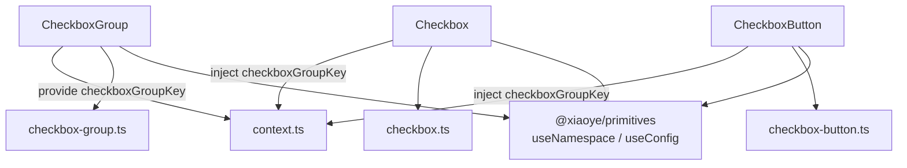
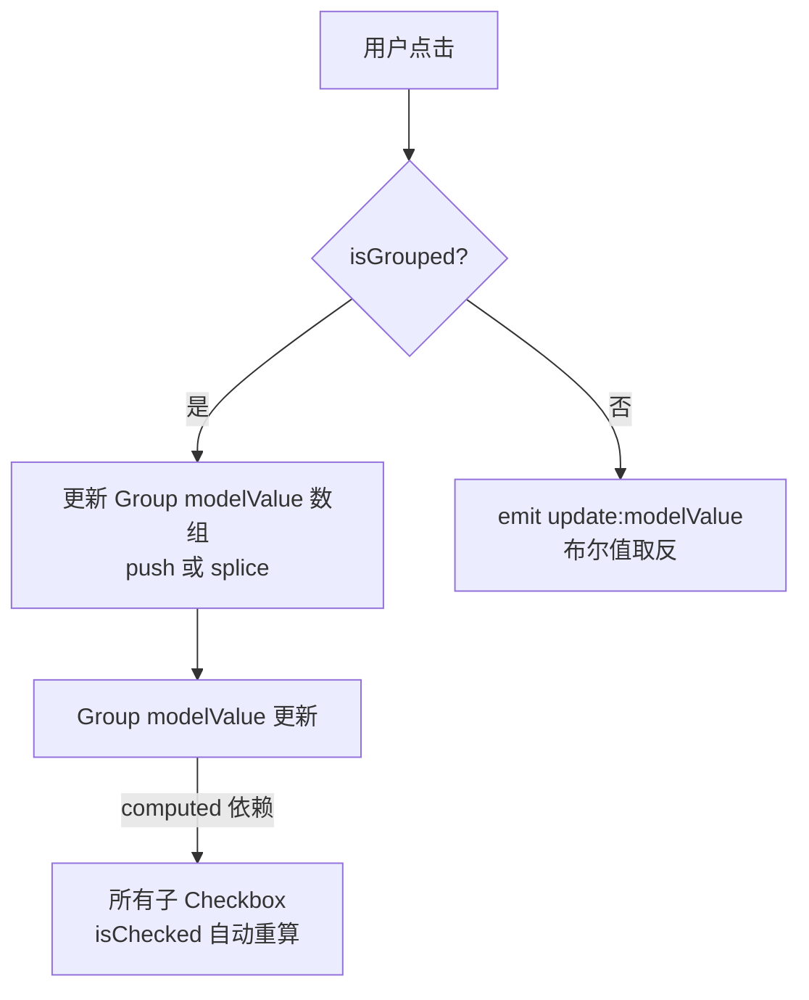
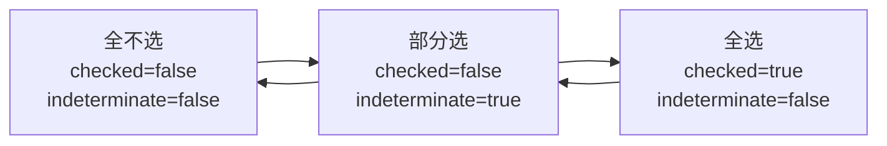

# 38 Checkbox 复选

> 导读：Checkbox 用于多选场景，核心是"独立切换 + 组内聚合"——单个 Checkbox 是布尔开关，CheckboxGroup 是多值聚合器，两者通过 provide/inject 自动关联，实现从"全不选"到"全选"的完整交互闭环。

## 设计哲学

Checkbox 解决的核心问题是**多项选择**。与 Radio 的互斥不同，Checkbox 的每一项都是独立的布尔状态，多个 Checkbox 可以同时选中。当需要收集一组值时，CheckboxGroup 提供了 v-model 数组绑定，选中项的 label 自动聚合到数组中。

```mermaid
graph TD
  CG[CheckboxGroup<br>v-model: string[]] -->|provide checkboxGroupKey| C1[Checkbox A]
  CG -->|provide checkboxGroupKey| C2[Checkbox B]
  CG -->|provide checkboxGroupKey| C3[Checkbox C]
  C1 -->|inject + isChecked| CG
  C2 -->|inject + isChecked| CG
  C3 -->|inject + isChecked| CG
  C1 -->|checked → push label| ARR[modelValue 数组]
  C2 -->|unchecked → remove label| ARR
```

**设计决策 WHY**

1. **为什么 Checkbox 的 modelValue 是 boolean 而 CheckboxGroup 的是数组？** 独立 Checkbox 是布尔开关（同意协议、记住密码），CheckboxGroup 是多值选择器（选择权限、选择标签）。两者的数据结构不同，不能用同一个类型。通过 provide/inject，子 Checkbox 根据是否在 Group 内自动选择数据模式。

2. **为什么 indeterminate 状态存在？** 在"全选/半选/全不选"场景中，当部分子项选中时，全选 Checkbox 既不是 checked 也不是 unchecked，需要第三种视觉状态（横线）表示"部分选中"。`indeterminate` 是纯视觉属性，不参与 v-model——它由业务逻辑计算后传入。

3. **为什么 checked 抛 computed 而非 watch？** 在 CheckboxGroup 中，子 Checkbox 的选中状态由 `group.modelValue.includes(label)` 决定，这是一个 computed 依赖——Group 的 modelValue 变化时，所有子 Checkbox 自动更新。如果用 watch，需要遍历所有子项手动同步，既慢又容易遗漏。

## 源码架构

### 文件结构

```
packages/components/checkbox/
  index.ts               # withInstall + 导出 Checkbox / CheckboxGroup / CheckboxButton
  src/
    checkbox.vue         # 基础复选框
    checkbox.ts          # Checkbox Props / Emits 类型
    checkbox-group.vue   # 复选组容器
    checkbox-group.ts    # CheckboxGroup Props / Emits 类型
    checkbox-button.vue  # 按钮风格复选
    checkbox-button.ts   # CheckboxButton Props 类型
    context.ts           # checkboxGroupKey + 上下文类型定义
```

### 组件关系图



### 核心 type 定义

```ts
// context.ts
interface CheckboxGroupContext {
  modelValue: WritableComputedRef<(string | number | boolean)[]>;
  size: ComputedRef<ComponentSize>;
  disabled: ComputedRef<boolean>;
  fill: ComputedRef<string>;
  textColor: ComputedRef<string>;
  addToGroup: (checkbox: CheckboxInstance) => void;
  removeFromGroup: (checkbox: CheckboxInstance) => void;
  changeEvent: (value: (string | number | boolean)[]) => void;
}

// checkbox.ts
interface CheckboxProps {
  modelValue?: boolean;  // 独立模式
  label?: string | number | boolean;  // 组模式下的值
  value?: string | number | boolean;  // 兼容写法
  disabled?: boolean;
  indeterminate?: boolean;
  size?: ComponentSize;
  name?: string;
  border?: boolean;
  checked?: boolean;     // 初始选中
}

// checkbox-group.ts
interface CheckboxGroupProps {
  modelValue?: (string | number | boolean)[];
  size?: ComponentSize;
  disabled?: boolean;
  fill?: string;
  textColor?: string;
  min?: number;   // 最少选中数
  max?: number;   // 最多选中数
}
```

## 核心实现

### 1. 双模式——独立 Checkbox vs 组内 Checkbox

```ts
// checkbox.vue
const checkboxGroup = inject(checkboxGroupKey, undefined);
const isGrouped = computed(() => !!checkboxGroup);

const isChecked = computed(() => {
  if (isGrouped.value) {
    return checkboxGroup!.modelValue.value.includes(props.label);
  }
  return props.modelValue ?? props.checked ?? false;
});
```

当用户点击切换时，两种模式走不同路径：

```ts
function handleChange() {
  if (isGrouped.value) {
    const values = [...checkboxGroup!.modelValue.value];
    if (isChecked.value) {
      values.splice(values.indexOf(props.label), 1); // 移除
    } else {
      values.push(props.label); // 追加
    }
    checkboxGroup!.modelValue.value = values;
  } else {
    emit("update:modelValue", !props.modelValue);
    emit("change", !props.modelValue);
  }
}
```



**WHY：为什么组内模式直接修改数组而不是 emit？** 因为 Group 的 modelValue 是 WritableComputedRef，子 Checkbox 直接赋值 `checkboxGroup.modelValue = newValues` 即可触发 Group 的 set，进而 emit Group 的 update:modelValue 和 change。这比"子 Checkbox emit → Group 监听 → 更新 modelValue → 子 Checkbox 响应"的链路更短。

### 2. min/max 限制

CheckboxGroup 支持 `min` 和 `max` 约束选中数量：

```ts
// checkbox.vue
const isLimitDisabled = computed(() => {
  if (!checkboxGroup) return false;
  const { max, min } = checkboxGroup;
  const count = checkboxGroup.modelValue.value.length;
  return (
    (max.value !== undefined && count >= max.value && !isChecked.value) ||
    (min.value !== undefined && count <= min.value && isChecked.value)
  );
});

const isDisabled = computed(() =>
  props.disabled || checkboxGroup?.disabled.value || isLimitDisabled.value
);
```

**WHY：为什么 min/max 约束表现为 disabled 而非阻止点击？** 将超出限制的选项置灰（disabled）比"点了没反应"更直观——用户能立即看到哪些选项不可操作以及原因。阻止点击只拦截了事件，但视觉上选项仍然看起来可操作，会让用户困惑。

### 3. indeterminate 半选状态

```ts
// checkbox.vue template
<span class="xy-checkbox__inner" :class="{ 'is-indeterminate': indeterminate }">
  <!-- indeterminate 时显示横线图标 -->
</span>
```

indeterminate 是纯视觉状态，由外部计算后传入。典型用法：

```ts
const isAllChecked = computed(() =>
  checkedList.value.length === allOptions.length
);
const isIndeterminate = computed(() =>
  checkedList.value.length > 0 &&
  checkedList.value.length < allOptions.length
);
```



### 4. 原生 input 的隐藏与键盘可访问性

Checkbox 隐藏了原生 input，但保留了键盘焦点：

```html
<input
  type="checkbox"
  class="xy-checkbox__input"
  :checked="isChecked"
  :disabled="isDisabled"
  :indeterminate="indeterminate"
  @change="handleChange"
  tabindex="0"
  role="checkbox"
  :aria-checked="indeterminate ? 'mixed' : isChecked"
/>
```

**WHY：为什么保留原生 input 而非纯 div + click？** 原生 input 提供了键盘交互（Space 切换）、ARIA 角色、表单提交等能力。隐藏 input 只隐藏视觉呈现，不隐藏交互能力——这是 WAI-ARIA 推荐的无障碍实现模式。

## API 参考

### Checkbox Props

| 属性             | 说明                   | 类型                              | 默认值  |
| ---------------- | ---------------------- | --------------------------------- | ------- |
| `modelValue`     | 绑定值（独立模式）     | `boolean`                         | `false` |
| `label`          | Checkbox 的值          | `string \| number \| boolean`     | —       |
| `value`          | 兼容写法               | `string \| number \| boolean`     | —       |
| `disabled`       | 是否禁用               | `boolean`                         | `false` |
| `indeterminate`  | 是否半选               | `boolean`                         | `false` |
| `size`           | 尺寸                   | `ComponentSize`                   | —       |
| `name`           | 原生 name 属性         | `string`                          | —       |
| `border`         | 是否显示边框           | `boolean`                         | `false` |
| `checked`        | 初始是否选中           | `boolean`                         | `false` |

### Checkbox Emits

| 事件                 | 说明         | 参数     |
| -------------------- | ------------ | -------- |
| `update:modelValue`  | 值变化时触发 | `(value: boolean)` |
| `change`             | 值变化时触发 | `(value: boolean)` |

### CheckboxGroup Props

| 属性           | 说明                   | 类型                                   | 默认值 |
| -------------- | ---------------------- | -------------------------------------- | ------ |
| `modelValue`   | 绑定值                 | `(string \| number \| boolean)[]`      | `[]`   |
| `size`         | 组内 Checkbox 尺寸     | `ComponentSize`                        | —      |
| `disabled`     | 是否禁用整组           | `boolean`                              | `false`|
| `fill`         | button 类型激活态背景  | `string`                               | —      |
| `textColor`    | button 类型激活态文字  | `string`                               | —      |
| `min`          | 最少选中数             | `number`                               | —      |
| `max`          | 最多选中数             | `number`                               | —      |

### CheckboxGroup Emits

| 事件                 | 说明         | 参数                                   |
| -------------------- | ------------ | -------------------------------------- |
| `update:modelValue`  | 值变化时触发 | `(value: (string \| number \| boolean)[])` |
| `change`             | 值变化时触发 | `(value: (string \| number \| boolean)[])` |

### CheckboxGroup Slots

| 插槽      | 说明                         |
| --------- | ---------------------------- |
| `default` | Checkbox / CheckboxButton 子组件 |

### CheckboxButton Props

| 属性       | 说明       | 类型                              | 默认值  |
| ---------- | ---------- | --------------------------------- | ------- |
| `label`    | Checkbox 的值 | `string \| number \| boolean`  | —       |
| `value`    | 兼容写法   | `string \| number \| boolean`     | —       |
| `disabled` | 是否禁用   | `boolean`                         | `false` |
| `name`     | 原生 name  | `string`                          | —       |
| `checked`  | 初始选中   | `boolean`                         | `false` |

## 样式系统

### BEM 类名

| 类名                             | 说明               |
| -------------------------------- | ------------------ |
| `xy-checkbox`                    | Checkbox 根容器    |
| `xy-checkbox__input`             | 原生 input（隐藏） |
| `xy-checkbox__inner`             | 自定义方框指示器   |
| `xy-checkbox__label`             | 文本标签           |
| `xy-checkbox--checked`           | 选中状态           |
| `xy-checkbox--disabled`          | 禁用状态           |
| `xy-checkbox--indeterminate`     | 半选状态           |
| `xy-checkbox--bordered`          | 带边框样式         |
| `xy-checkbox--sm/md/lg`          | 尺寸修饰符         |
| `xy-checkbox-group`              | CheckboxGroup 容器 |
| `xy-checkbox-group--button`      | Button 风格        |
| `xy-checkbox-button`             | CheckboxButton 根  |
| `xy-checkbox-button--active`     | 激活态             |
| `xy-checkbox-button--disabled`   | 禁用态             |

### CSS 变量

| 变量名                              | 说明             | 默认值 |
| ----------------------------------- | ---------------- | ------ |
| `--xy-checkbox-text-color`          | 文字颜色         | —      |
| `--xy-checkbox-input-height`        | 方框高度         | `16px` |
| `--xy-checkbox-input-width`         | 方框宽度         | `16px` |
| `--xy-checkbox-input-border-color`  | 方框边框颜色     | —      |
| `--xy-checkbox-input-bg-color`      | 方框背景色       | —      |
| `--xy-checkbox-input-border-color-hover`| 悬浮边框色   | —      |
| `--xy-checkbox-button-bg-color`     | Button 默认背景  | —      |
| `--xy-checkbox-button-text-color`   | Button 默认文字  | —      |
| `--xy-checkbox-button-active-bg-color`| Button 激活背景 | —     |
| `--xy-checkbox-button-active-text-color`| Button 激活文字| —    |

### 主题定制方式

通过覆盖 CSS 变量：

```css
:root {
  --xy-checkbox-input-border-color-hover: var(--xy-color-primary);
  --xy-checkbox-button-active-bg-color: var(--xy-color-primary);
}
```

## 小结

1. **双模式自动切换**——Checkbox 通过 inject 判断是否在 Group 内，独立模式绑定 boolean，组内模式读写 Group 的数组 modelValue，用户无需关心内部切换逻辑。
2. **min/max 约束即禁用**——超出选中数量限制的选项自动置灰为 disabled，比阻止点击更直观地传达"不可操作"的语义。
3. **indeterminate 半选态**——纯视觉属性，由外部计算"部分选中"状态后传入，配合全选 Checkbox 实现"全选/半选/全不选"三态交互。