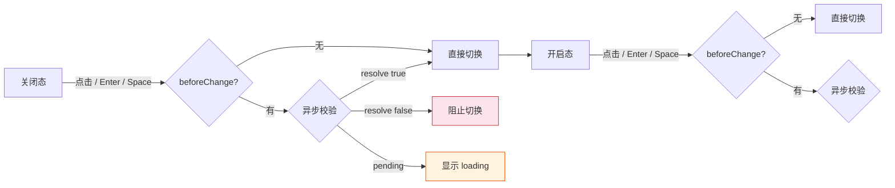
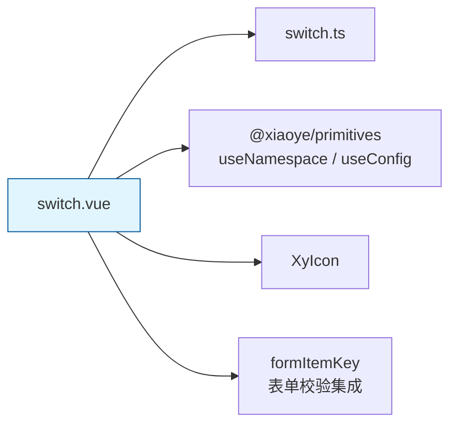
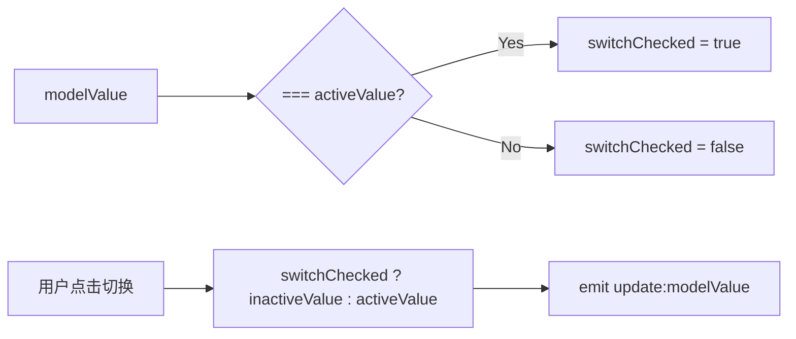
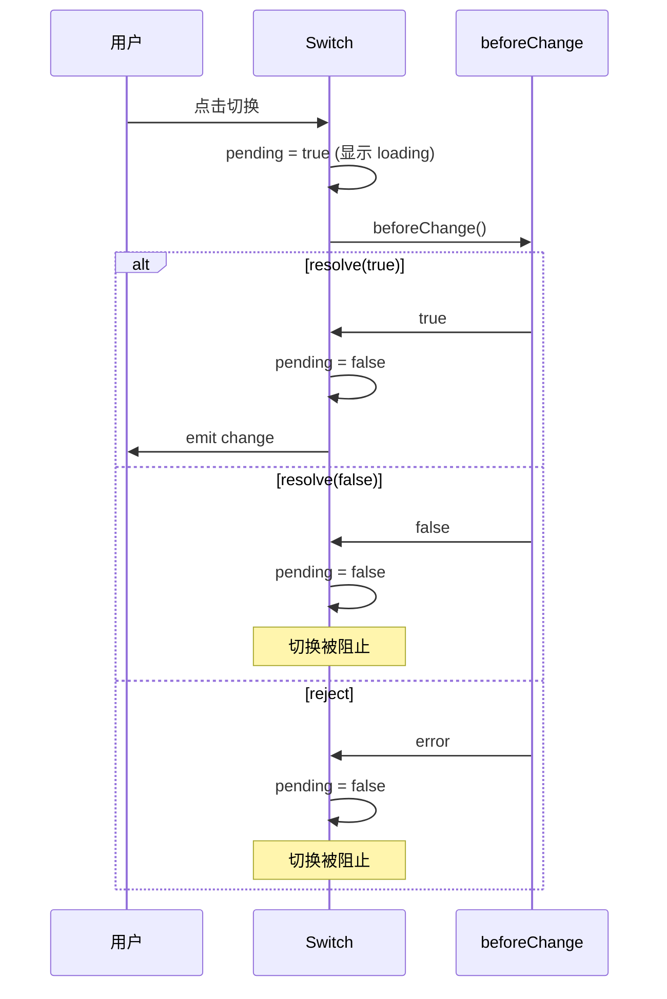
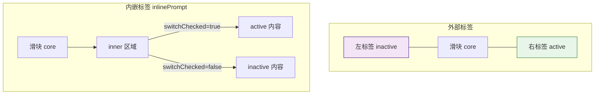

# 39 Switch 开关

> 导读：Switch 是即时生效的布尔状态切换器，与 Checkbox 的"提交时生效"语义不同，Switch 的操作是即时生效的——切换即触发动作，适用于启用/禁用功能、开启/关闭配置等场景。

## 设计哲学

- **解决的问题**：在设置面板、权限管理、功能启停等场景中，需要一种"切换即生效"的交互控件。Checkbox 是表单控件，选中后需要表单提交才生效；Switch 是操作控件，切换立即生效。这种语义差异决定了两者的交互模式和使用场景完全不同。
- **设计决策**：Switch 采用 `activeValue`/`inactiveValue` 的值映射机制——内部用 boolean 逻辑判断开/关态，对外通过自定义值映射为任意值（如 `'on'`/`'off'`、`1`/`0`）。`beforeChange` 支持同步/异步拦截，返回 `Promise<boolean>` 时自动进入 pending 状态并展示 loading 图标，防止重复操作。`inlinePrompt` 模式将文案嵌入滑块轨道内部，适合空间受限的紧凑布局。
- **差异化**：Switch 的 `beforeChange` + 自动 loading 机制是核心差异化——用户只需关注校验逻辑本身，组件自动管理 pending 状态和视觉反馈，无需手动控制 `loading` prop。Form 集成允许通过 `validateEvent` prop 自动触发表单校验。



## 源码架构

### 文件结构

```
packages/components/switch/
├── index.ts         # withInstall + 导出
├── src/
│   ├── switch.vue   # 主组件
│   └── switch.ts    # Props / Emits / 常量
└── __tests__/
```

### 组件关系图



### 核心 type 定义

```ts
type SwitchValue = boolean | string | number

interface SwitchProps {
  modelValue?: SwitchValue
  disabled?: boolean
  loading?: boolean
  size?: ComponentSize
  width?: string | number
  inlinePrompt?: boolean
  inactiveActionIcon?: string
  activeActionIcon?: string
  activeIcon?: string
  inactiveIcon?: string
  activeText?: string
  inactiveText?: string
  activeValue?: SwitchValue
  inactiveValue?: SwitchValue
  name?: string
  validateEvent?: boolean
  beforeChange?: () => Promise<boolean> | boolean
  id?: string
  tabindex?: string | number
  ariaLabel?: string
}

type SwitchEmits = {
  "update:modelValue": [value: SwitchValue]
  change: [value: SwitchValue]
  input: [value: SwitchValue]
  focus: [event: FocusEvent]
  blur: [event: FocusEvent]
}
```

## 核心实现

### 1. 值映射——activeValue / inactiveValue

Switch 内部用 `switchChecked` computed 将 modelValue 映射为布尔态，切换时反向映射回自定义值：

```ts
const switchChecked = computed(() => props.modelValue === props.activeValue)

async function switchValue() {
  if (switchDisabled.value) {
    syncInputChecked()
    return
  }
  const allowed = await canSwitch()
  if (!allowed) { syncInputChecked(); return }
  const value = switchChecked.value ? props.inactiveValue : props.activeValue
  await emitValue(value)
}
```



**WHY**：直接用 modelValue 与 activeValue/inactiveValue 做全等比较，而不引入中间 boolean 状态，是因为这种"比较即映射"的模式天然无歧义——无论 activeValue 是 `true`、`1`、`'on'` 还是任何自定义值，比较结果一定是布尔值，切换逻辑始终正确。

### 2. beforeChange 异步拦截

```ts
async function canSwitch() {
  if (!props.beforeChange) return true
  const result = props.beforeChange()
  if (typeof result === "boolean") return result

  if (!isPromiseLike(result)) {
    console.warn("[XySwitch] beforeChange 必须返回 boolean 或 Promise<boolean>。")
    return false
  }

  pending.value = true
  try {
    return await result
  } catch {
    return false
  } finally {
    pending.value = false
    nextTick(() => syncInputChecked())
  }
}
```



**WHY**：pending 状态由组件内部控制而非要求用户通过 `loading` prop 传入，是因为 beforeChange 的 Promise pending 期间，Switch 必须不可操作——这是组件内部的业务不变量，不应依赖外部正确性。如果由外部控制 loading，用户可能忘记设置，导致 beforeChange 期间 Switch 仍可被点击。同时 `finally` 中调用 `syncInputChecked()` 确保 checkbox 的 checked 属性与视觉状态同步，避免浏览器原生 checkbox 状态与 Vue 状态不一致。

### 3. 文案与图标渲染

Switch 支持滑块两侧的外部标签和滑块内部的内嵌标签两种模式：

```html
<!-- 外部标签模式 -->
<span v-if="hasInactiveLabel" class="xy-switch__label xy-switch__label--left">
  <slot name="inactive">
    <XyIcon v-if="props.inactiveIcon" :icon="props.inactiveIcon" :size="14" />
    <span v-else-if="props.inactiveText">{{ props.inactiveText }}</span>
  </slot>
</span>
<span class="xy-switch__core">
  <!-- 内嵌标签模式 -->
  <span v-if="props.inlinePrompt" class="xy-switch__inner">
    <span class="xy-switch__inner-wrapper">
      <template v-if="switchChecked"><!-- active slot --></template>
      <template v-else><!-- inactive slot --></template>
    </span>
  </span>
  <span class="xy-switch__action">
    <XyIcon v-if="props.loading || pending" :icon="DEFAULT_LOADING_ICON" :size="12" spin />
    <template v-else-if="switchChecked">
      <slot name="active-action">
        <XyIcon v-if="props.activeActionIcon" :icon="props.activeActionIcon" :size="12" />
      </slot>
    </template>
    <template v-else>
      <slot name="inactive-action">
        <XyIcon v-if="props.inactiveActionIcon" :icon="props.inactiveActionIcon" :size="12" />
      </slot>
    </template>
  </span>
</span>
<span v-if="hasActiveLabel" class="xy-switch__label xy-switch__label--right">
  <slot name="active"><!-- ... --></slot>
</span>
```



**WHY**：外部标签放在 core 两侧而非内部，是因为文案长度不确定——放在内部会受滑块宽度限制，长文案溢出；放在两侧让文案不受滑块影响，且视觉上更清晰——左侧是关闭态文案，右侧是开启态文案。`inlinePrompt` 模式适合空间受限场景（如表格内的开关列），文案直接嵌入轨道内部。

### 4. 无障碍实现

```html
<input
  class="xy-switch__input"
  type="checkbox"
  role="switch"
  :aria-checked="switchChecked"
  :aria-disabled="switchDisabled"
  :aria-invalid="validateState === 'error'"
  :aria-label="props.ariaLabel"
  :aria-describedby="messageId"
  :name="props.name"
  :disabled="switchDisabled"
  @click.stop
  @change="handleChange"
  @keydown.enter.prevent="switchValue"
  @focus="handleFocus"
  @blur="handleBlur"
/>
```

**WHY**：使用隐藏的 `<input type="checkbox" role="switch">` 而非纯 div 模拟，是因为：1）原生 checkbox 提供完整的键盘交互（Tab 聚焦、Space/Enter 切换）；2）`role="switch"` 比 `role="checkbox"` 更准确表达"即时切换"的语义；3）`@click.stop` 阻止事件冒泡到外层 div，由外层 div 的 `@click.prevent="switchValue"` 统一控制切换逻辑，避免双重触发；4）`aria-describedby` 关联表单校验信息，让读屏用户能感知校验状态。

### 5. Form 校验集成

```ts
const formItem = inject(formItemKey, null)
const validateState = computed(() => formItem?.validateState.value ?? "idle")

async function emitValue(value: SwitchValue) {
  emit("update:modelValue", value)
  emit("input", value)
  emit("change", value)
  await validateChange()
  await nextTick()
  syncInputChecked()
}

async function validateChange() {
  if (!props.validateEvent) return
  await nextTick()
  await formItem?.validate("change")
}
```

**WHY**：`validateEvent` 默认为 `true`，因为 Switch 的切换通常意味着值的变化需要即时校验（如"关闭此功能需要满足前置条件"）。与 Input 的 `validateEvent` 默认 `false` 不同，因为 Input 的每次输入都触发校验频率太高。

## API 参考

### Props

| 属性 | 类型 | 默认值 | 说明 |
|------|------|--------|------|
| modelValue | `SwitchValue` | `false` | 双向绑定值 |
| disabled | `boolean` | `false` | 是否禁用 |
| loading | `boolean` | `false` | 是否显示加载态 |
| size | `ComponentSize` | — | 尺寸，三级优先：自身 > 全局 |
| width | `string \| number` | — | 轨道宽度（px 或 CSS 值） |
| inlinePrompt | `boolean` | `false` | 文案是否嵌入轨道内部 |
| activeActionIcon | `string` | — | 开启态滑块图标 |
| inactiveActionIcon | `string` | — | 关闭态滑块图标 |
| activeIcon | `string` | — | 开启态外部图标 |
| inactiveIcon | `string` | — | 关闭态外部图标 |
| activeText | `string` | — | 开启态外部文案 |
| inactiveText | `string` | — | 关闭态外部文案 |
| activeValue | `SwitchValue` | `true` | 开启态对应的值 |
| inactiveValue | `SwitchValue` | `false` | 关闭态对应的值 |
| name | `string` | — | 原生 name 属性 |
| validateEvent | `boolean` | `true` | 值变化时是否触发表单校验 |
| beforeChange | `() => boolean \| Promise<boolean>` | — | 切换前拦截钩子 |
| id | `string` | — | 原生 id，默认取 FormItem 的 inputId |
| tabindex | `string \| number` | — | 原生 tabindex |
| ariaLabel | `string` | — | 无障碍标签 |

### Emits

| 事件 | 参数 | 说明 |
|------|------|------|
| update:modelValue | `(value: SwitchValue)` | 值变化时触发 |
| change | `(value: SwitchValue)` | 值变化时触发 |
| input | `(value: SwitchValue)` | 值变化时触发（兼容 v-model） |
| focus | `(event: FocusEvent)` | 获焦时触发 |
| blur | `(event: FocusEvent)` | 失焦时触发 |

### Slots

| 名称 | 说明 |
|------|------|
| active | 开启态外部标签内容 |
| inactive | 关闭态外部标签内容 |
| active-action | 开启态滑块内容 |
| inactive-action | 关闭态滑块内容 |

### Exposes

| 属性/方法 | 类型 | 说明 |
|-----------|------|------|
| focus | `() => void` | 聚焦 |
| checked | `ComputedRef<boolean>` | 当前是否为开启态 |

## 样式系统

### BEM 类名

| 类名 | 说明 |
|------|------|
| `.xy-switch` | 根容器 |
| `.xy-switch--sm` | 小尺寸 |
| `.xy-switch--md` | 中尺寸 |
| `.xy-switch--lg` | 大尺寸 |
| `.xy-switch.is-checked` | 开启态 |
| `.xy-switch.is-disabled` | 禁用态 |
| `.xy-switch.is-loading` | 加载态 |
| `.xy-switch.is-focus` | 聚焦态 |
| `.xy-switch.is-inline-prompt` | 内嵌文案模式 |
| `.xy-switch.is-error` | 校验错误 |
| `.xy-switch.is-success` | 校验成功 |
| `.xy-switch__input` | 隐藏 checkbox |
| `.xy-switch__core` | 滑块轨道 |
| `.xy-switch__inner` | 内嵌文案容器 |
| `.xy-switch__inner-wrapper` | 内嵌文案内容 |
| `.xy-switch__action` | 滑块按钮 |
| `.xy-switch__label` | 外部标签 |
| `.xy-switch__label--left` | 左侧标签（关闭态） |
| `.xy-switch__label--right` | 右侧标签（开启态） |

### CSS 变量

| 变量 | 默认值 | 说明 |
|------|--------|------|
| `--xy-switch-width` | `40px` / 尺寸相关 | 轨道宽度 |
| `--xy-switch-height` | `20px` / 尺寸相关 | 轨道高度 |
| `--xy-switch-action-size` | `16px` / 尺寸相关 | 滑块按钮尺寸 |
| `--xy-switch-padding` | `4px` / 尺寸相关 | 轨道内边距 |
| `--xy-switch-on-color` | `var(--xy-brand)` | 开启态轨道颜色 |
| `--xy-switch-off-color` | `color-mix(...)` | 关闭态轨道颜色 |

### 主题定制方式

通过 CSS 变量覆盖即可全局修改 Switch 主题：

```css
:root {
  --xy-switch-on-color: var(--xy-brand);
  --xy-switch-off-color: #dcdfe6;
}
```

也可以通过 `width` prop 控制单个 Switch 的轨道宽度——这对于长文案的内嵌模式尤其有用。

所有尺寸相关变量（`--xy-switch-width`/`height`/`action-size`/`padding`）均由 size modifier 自动设置，无需手动覆盖。

## 小结

1. **activeValue/inactiveValue 值映射**：Switch 内部用 boolean 逻辑判断开/关态，对外通过 `activeValue`/`inactiveValue` 映射为自定义值——内部简洁，外部灵活。
2. **beforeChange 异步拦截 + 自动 loading**：切换前执行异步校验，pending 期间自动显示 loading 态并禁用交互，校验失败自动回滚，用户无需手动管理 loading 状态。
3. **role="switch" 无障碍**：使用 WAI-ARIA 的 switch 角色，配合 `aria-checked`、`aria-disabled`、`aria-invalid` 和键盘事件，满足"即时切换"的无障碍语义。