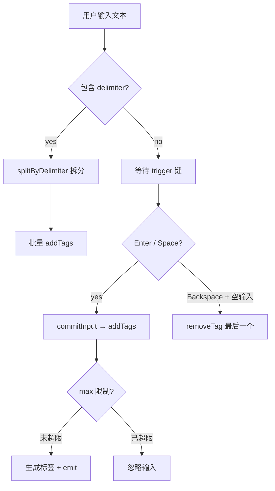
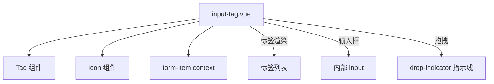
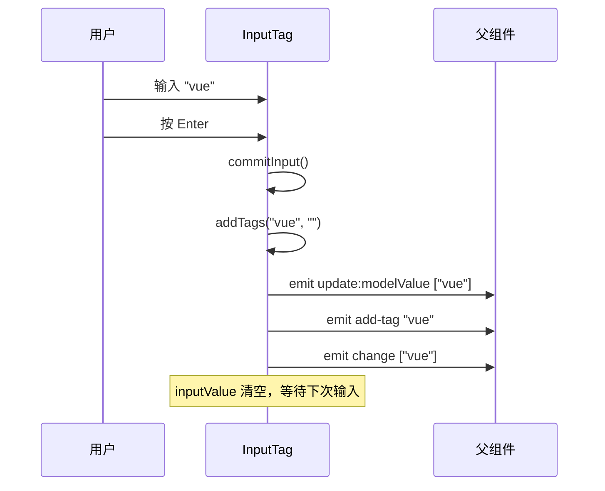
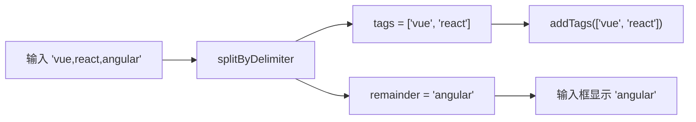
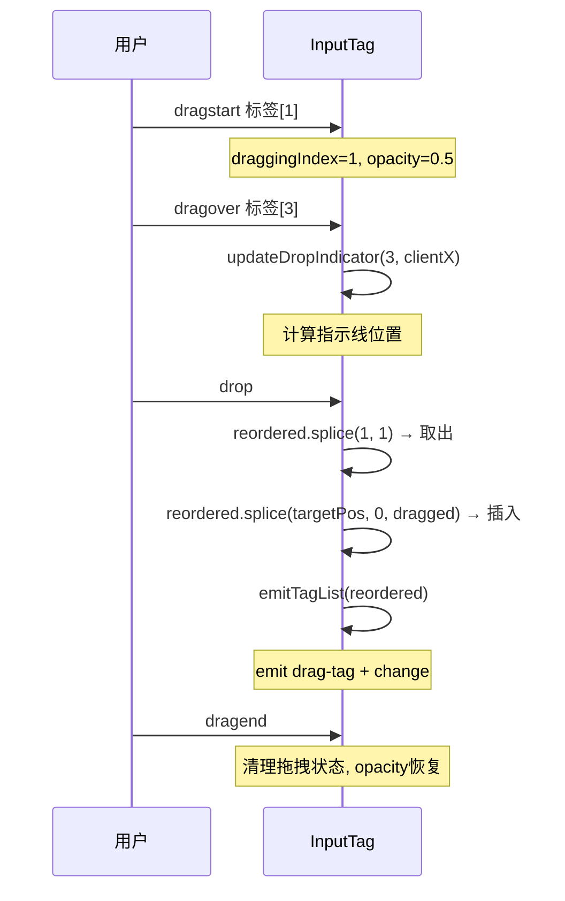

# 40 InputTag 标签输入

> 导读：InputTag 是 Input 的标签化变体，核心是"文本输入 → 标签生成"的连续流，适合关键词、邮箱抄送、规则白名单等需要"多个短字符串"的场景，支持分隔符自动拆分、拖拽排序和失焦自动保存。

## 设计哲学

- **输入即标签**：用户在输入框中键入文本，按触发键（Enter/Space）后文本自动转为标签，输入框清空等待下一次输入。这种"连续流"模式比"逐个添加"对话框更高效。
- **分隔符批量拆分**：当配置 `delimiter` 后，粘贴或输入包含分隔符的文本会自动拆分为多个标签。如 `delimiter=","` 时粘贴 `"a,b,c"` 会生成三个标签，极大提升批量输入效率。
- **拖拽排序**：`draggable` prop 启用标签的原生 HTML5 Drag & Drop 排序，配合视觉指示线（drop indicator）让用户直观感知拖拽目标位置。



## 源码架构

### 文件结构

```
packages/components/input-tag/
├── index.ts             # 导出 XyInputTag + 类型
├── src/
│   ├── input-tag.ts     # 类型定义 + 常量
│   └── input-tag.vue    # 组件实现
└── __tests__/
    └── input-tag.spec.ts
```

### 组件关系图



### 核心 type 定义

```typescript
type InputTagTrigger = "Enter" | "Space"
type InputTagDropType = "before" | "after"
type InputTagValue = string[] | undefined

interface InputTagProps {
  modelValue?: string[] | undefined
  max?: number
  trigger?: InputTagTrigger
  draggable?: boolean
  delimiter?: string | RegExp
  size?: ComponentSize
  disabled?: boolean
  readonly?: boolean
  clearable?: boolean
  clearIcon?: string
  validateEvent?: boolean
  saveOnBlur?: boolean
  tagStatus?: ComponentStatus
  tagRound?: boolean
  inputStyle?: StyleValue
}

interface InputTagSlotProps {
  value: string
  index: number
}
```

## 核心实现

### 输入即标签：commitInput 流程

`commitInput` 是"文本 → 标签"的核心转换函数。当用户按下触发键或失焦时调用，将输入框中的文本 trim 后转为标签。

**WHY：** 标签输入的核心交互是"输入 → 确认 → 生成"。`commitInput` 在确认时机（trigger 键 / blur）统一处理，避免逻辑散落在多个事件处理器中。

```typescript
// input-tag.vue — 核心转换
async function commitInput() {
  const value = inputValue.value.trim()

  if (!value || inputLimitReached.value) {
    inputValue.value = inputLimitReached.value ? "" : inputValue.value.trim()
    nextTick(() => syncInputValue())
    return
  }

  await addTags(value, "")
}
```



### 分隔符批量拆分

`splitByDelimiter` 函数将包含分隔符的字符串拆分为标签数组和剩余输入。当 `delimiter=","` 时，`"a,b,c"` 拆分为 `tags=["a","b"]` + `remainder="c"`。

**WHY：** 批量输入是企业场景的高频需求（如邮件抄送粘贴多个邮箱、关键词批量导入）。分隔符拆分让用户一次粘贴即可生成多个标签，而非逐个输入。`remainder` 保留最后一个未完成的片段在输入框中，让用户可以继续编辑。

```typescript
// input-tag.vue — 分隔符拆分
function splitByDelimiter(value: string) {
  if (!props.delimiter) return { tags: [] as string[], remainder: value }

  const parts = typeof props.delimiter === "string"
    ? value.split(props.delimiter)
    : value.split(props.delimiter)

  if (parts.length <= 1) return { tags: [] as string[], remainder: value }

  const remainder = parts.pop()?.trim() ?? ""
  return {
    tags: parts.map((part) => part.trim()).filter(Boolean),
    remainder
  }
}
```



### 粘贴拆分

`handlePaste` 在粘贴事件中拦截包含分隔符的文本，调用 `splitByDelimiter` 拆分后批量添加标签。

**WHY：** 粘贴是批量输入最常见的方式。如果不拦截粘贴事件，用户粘贴 `"a,b,c"` 会得到一个包含逗号的完整标签，而非三个独立标签。

```typescript
// input-tag.vue — 粘贴拆分
async function handlePaste(event: ClipboardEvent) {
  if (!props.delimiter || !canEdit.value || inputLimitReached.value) return

  const pastedText = event.clipboardData?.getData("text")
  if (!pastedText) return

  const input = event.target as HTMLInputElement
  const start = input.selectionStart ?? input.value.length
  const end = input.selectionEnd ?? input.value.length
  const nextValue = `${input.value.slice(0, start)}${pastedText}${input.value.slice(end)}`
  const { tags: delimitedTags, remainder } = splitByDelimiter(nextValue)

  if (!delimitedTags.length) return
  event.preventDefault()
  await addTags(delimitedTags, remainder)
  emit("input", remainder)
}
```

### 拖拽排序

组件通过 HTML5 Drag & Drop API 实现标签拖拽排序。核心逻辑分为三部分：拖拽开始（设置拖拽数据）、拖拽经过（计算指示线位置）、放下（执行重排）。

**WHY：** 标签排序是优先级调整、顺序重排等场景的刚需。HTML5 原生 DnD 比 Sortable.js 等库更轻量，且组件已通过 `tagDraggable` 计算属性控制是否启用，不会在非拖拽模式下引入额外开销。

```typescript
// input-tag.vue — 拖拽开始
function handleDragStart(event: DragEvent, index: number) {
  if (!tagDraggable.value) { event.preventDefault(); return }
  draggingIndex = index
  draggingElement = event.currentTarget as HTMLElement
  if (draggingElement) draggingElement.style.opacity = "0.5"
  if (event.dataTransfer) {
    event.dataTransfer.effectAllowed = "move"
    event.dataTransfer.setData("text/plain", `${index}`)
  }
}

// 拖拽放下 → 重排
async function handleDrop(event: DragEvent) {
  event.preventDefault()
  if (!dropType || draggingIndex === undefined || dropIndex === undefined) return

  const reordered = currentTags.value.slice()
  const [dragged] = reordered.splice(draggingIndex, 1)
  if (dragged !== undefined) {
    let targetPosition = dropType === "before" ? dropIndex : dropIndex + 1
    if (draggingIndex < targetPosition) targetPosition -= 1
    reordered.splice(targetPosition, 0, dragged)
    emitTagList(reordered, { emitChange: true })
    emit("drag-tag", draggingIndex, targetPosition, dragged)
    await nextTick()
    focus()
  }
}
```



### Drop Indicator 指示线

`updateDropIndicator` 函数根据鼠标位置和目标标签的中点，计算指示线应出现在目标标签的前方（before）还是后方（after），并动态设置指示线 DOM 元素的 left/top/height。

**WHY：** 没有视觉指示的拖拽排序会让用户无法判断放下后的位置。指示线精确地显示在即将插入的位置，提供与 Sortable.js 同等的视觉反馈。

```typescript
// input-tag.vue — 指示线位置计算
function updateDropIndicator(targetIndex: number, clientX: number) {
  const tagElements = innerRef.value!.querySelectorAll<HTMLElement>(".xy-input-tag__tag")
  const targetElement = tagElements[targetIndex]
  const rect = targetElement.getBoundingClientRect()
  const midpoint = rect.left + rect.width / 2

  dropType = clientX <= midpoint ? "before" : "after"
  const left = dropType === "before" ? rect.left - innerRect.left : rect.right - innerRect.left
  dropIndicatorRef.value!.style.left = `${left}px`
  showDropIndicator.value = true
}
```

### Backspace 删除最后一个标签

当输入框为空且用户按下 Backspace 时，自动删除最后一个标签。

**WHY：** 这是标签输入组件的标准交互模式。用户在清空输入框后，直觉上会继续按 Backspace 删除最后一个标签，而非移动鼠标去点击删除按钮。

```typescript
// input-tag.vue — Backspace 删除
async function handleKeydown(event: KeyboardEvent) {
  if (!canEdit.value || isComposing.value) return

  const trigger = getKeyTrigger(event)
  if (trigger && trigger === props.trigger) {
    event.preventDefault()
    await commitInput()
    return
  }

  if (event.key === "Backspace" && !inputValue.value && currentTags.value.length) {
    event.preventDefault()
    await removeTag(currentTags.value.length - 1)
  }
}
```

### IME Composition 处理

组件通过 `isComposing` 标志位跟踪输入法组合状态，在组合过程中不触发标签生成。

**WHY：** CJK 输入法（中文、日文、韩文）在输入过程中会触发多次 keydown/input 事件。如果在组合过程中就触发 commitInput，用户输入"你好"时会在输入"你"时就生成标签。`isComposing` 确保只在组合完成后才处理输入。

```typescript
// input-tag.vue — Composition 处理
function handleCompositionStart() { isComposing.value = true }

function handleCompositionEnd(event: CompositionEvent) {
  if (!isComposing.value) return
  isComposing.value = false
  handleInput(event as unknown as Event)
}
```

### saveOnBlur 失焦保存

当 `saveOnBlur=true`（默认）时，输入框失焦会自动将未确认的输入转为标签。

**WHY：** 用户可能忘记按 Enter 就点击了其他地方。如果失焦不保存，输入的文本会丢失。`saveOnBlur` 确保即使用户没有显式确认，输入也不会丢失。

```typescript
// input-tag.vue — 失焦保存
async function handleBlur(event: FocusEvent) {
  isFocused.value = false
  if (props.saveOnBlur) {
    await commitInput()  // 失焦时自动确认输入
  } else {
    inputValue.value = ""  // 不保存则清空
    nextTick(() => syncInputValue())
  }
  emit("blur", event)
  await triggerBlurValidation()
}
```

## API 参考

### Props

| 属性 | 类型 | 默认值 | 说明 |
|------|------|--------|------|
| modelValue | `string[] \| undefined` | `undefined` | 标签列表（支持 v-model） |
| max | `number` | — | 最大标签数量 |
| trigger | `"Enter" \| "Space"` | `"Enter"` | 触发标签生成的按键 |
| draggable | `boolean` | `false` | 是否支持拖拽排序 |
| delimiter | `string \| RegExp` | `""` | 分隔符（支持批量拆分） |
| size | `ComponentSize` | — | 尺寸 |
| disabled | `boolean` | `false` | 是否禁用 |
| readonly | `boolean` | `false` | 是否只读 |
| clearable | `boolean` | `false` | 是否可清空 |
| clearIcon | `string` | `"mdi:close-circle"` | 清空图标 |
| validateEvent | `boolean` | `true` | 是否触发表单校验 |
| saveOnBlur | `boolean` | `true` | 失焦时是否保存输入 |
| tagStatus | `ComponentStatus` | `"neutral"` | 标签状态样式 |
| tagRound | `boolean` | `false` | 标签是否圆角 |
| placeholder | `string` | `""` | 占位提示 |
| maxlength | `string \| number` | — | 输入最大长度 |
| minlength | `string \| number` | — | 输入最小长度 |
| inputStyle | `StyleValue` | — | 输入框样式 |

### Emits

| 事件 | 参数 | 说明 |
|------|------|------|
| update:modelValue | `(value: string[] \| undefined)` | 标签列表变化时触发 |
| change | `(value: string[] \| undefined)` | 标签列表确认变化时触发 |
| input | `(value: string)` | 输入框内容变化时触发 |
| add-tag | `(value: string \| string[])` | 添加标签时触发 |
| remove-tag | `(value: string, index: number)` | 删除标签时触发 |
| drag-tag | `(oldIndex, newIndex, value)` | 拖拽排序时触发 |
| focus | `(event: FocusEvent)` | 获得焦点时触发 |
| blur | `(event: FocusEvent)` | 失去焦点时触发 |
| clear | `()` | 清空时触发 |

### Slots

| 名称 | 作用域参数 | 说明 |
|------|-----------|------|
| prefix | — | 前缀内容 |
| suffix | — | 后缀内容 |
| tag | `{ value, index }` | 自定义标签渲染 |

### Exposes

| 方法/属性 | 类型 | 说明 |
|-----------|------|------|
| input | `HTMLInputElement` | 内部 input 元素引用 |
| focus | `() => void` | 聚焦 |
| blur | `() => void` | 失焦 |
| clear | `() => void` | 清空所有标签 |

## 样式系统

### BEM 类名

| 类名 | 层级 | 说明 |
|------|------|------|
| `xy-input-tag` | Block | 标签输入根容器 |
| `xy-input-tag--sm/md/lg` | Block modifier | 尺寸变体 |
| `xy-input-tag.is-error` | State | 校验失败 |
| `xy-input-tag.is-success` | State | 校验成功 |
| `xy-input-tag.is-disabled` | State | 禁用状态 |
| `xy-input-tag.is-focus` | State | 聚焦状态 |
| `xy-input-tag.is-draggable` | State | 拖拽模式 |
| `xy-input-tag.has-prefix` | State | 有前缀 |
| `xy-input-tag.has-suffix` | State | 有后缀 |
| `xy-input-tag__wrapper` | Element | 包装器 |
| `xy-input-tag__prefix` | Element | 前缀区域 |
| `xy-input-tag__inner` | Element | 标签 + 输入区域 |
| `xy-input-tag__tag` | Element | 标签项 |
| `xy-input-tag__input-wrap` | Element | 输入框包装 |
| `xy-input-tag__input` | Element | 输入框元素 |
| `xy-input-tag__suffix` | Element | 后缀区域 |
| `xy-input-tag__clear` | Element | 清空按钮 |
| `xy-input-tag__drop-indicator` | Element | 拖拽指示线 |

### CSS 变量

| 变量 | 默认值 | 说明 |
|------|--------|------|
| `--xy-input-tag-min-height` | — | 最小高度 |
| `--xy-input-tag-border-color` | — | 边框色 |
| `--xy-input-tag-focus-border` | — | 聚焦态边框色 |
| `--xy-input-tag-bg-color` | — | 背景色 |
| `--xy-input-tag-tag-gap` | — | 标签间距 |
| `--xy-input-tag-input-min-width` | — | 输入框最小宽度 |

## 小结

1. **输入即标签连续流**：`commitInput` 在触发键/失焦时统一将文本转为标签，配合 `splitByDelimiter` 实现批量拆分，让"逐个输入"和"批量粘贴"共享同一套核心逻辑。
2. **原生拖拽排序 + 指示线**：HTML5 Drag & Drop + `updateDropIndicator` 精确计算指示线位置，提供与专业排序库同等的视觉反馈，无需额外依赖。
3. **IME Composition 安全**：`isComposing` 标志位确保 CJK 输入法组合过程中不触发标签生成，避免中文输入"你好"在"你"阶段就被拆分为标签。