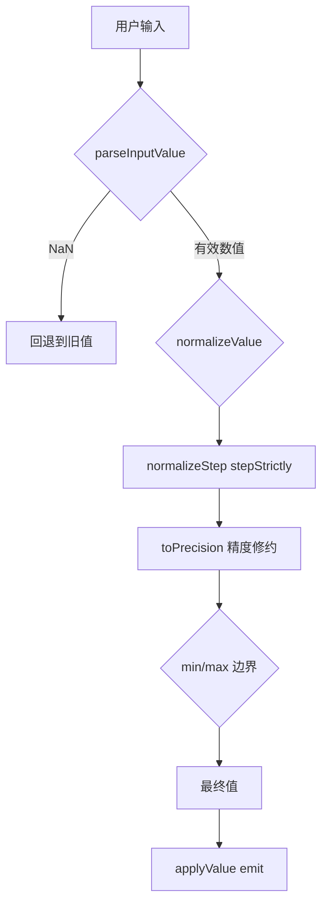
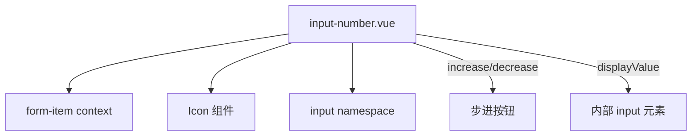
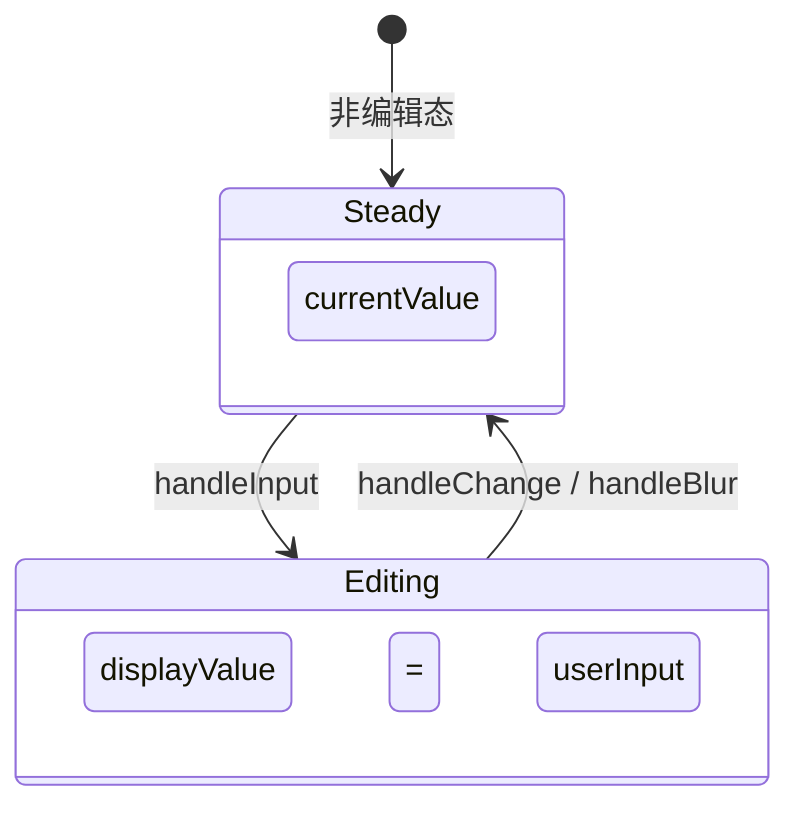
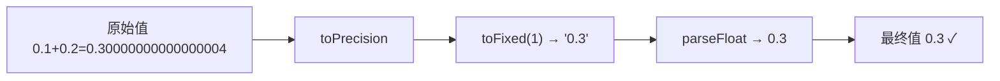
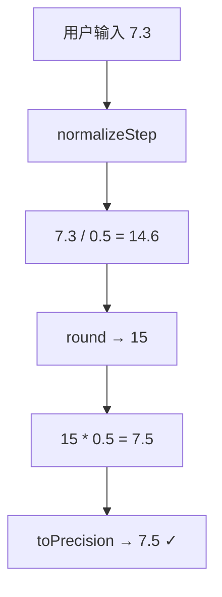
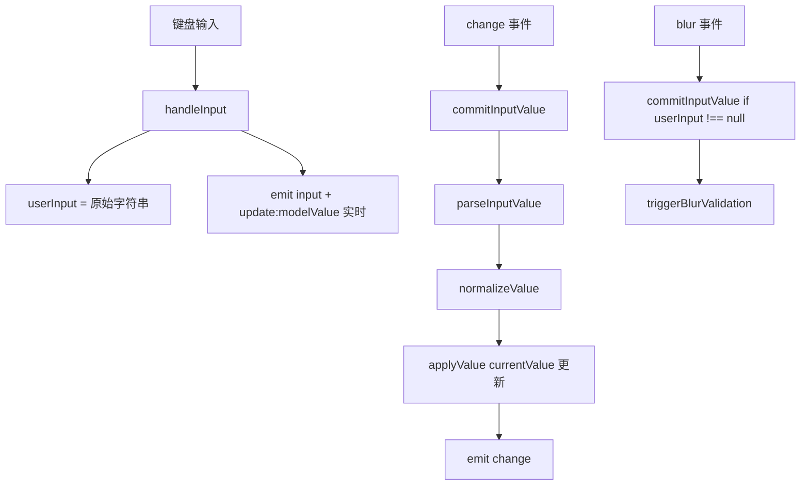

# 41 InputNumber 数字输入

> 导读：InputNumber 是数值输入的精细化工具，核心是"步进控制 + 精度约束 + 范围限制"，在 Input 的文本采集基础上增加了数值校验、精度修约和科学计数法防御，适合数量、金额、阈值等需要精确数值的字段。

## 设计哲学

- **精度优先**：数值输入最棘手的问题是浮点精度——`0.1 + 0.2 !== 0.3`。组件通过 `toPrecision` 函数在每次计算后统一修约，配合 `precision` prop 让开发者声明期望的小数位数，从源头杜绝精度漂移。
- **双值模型**：组件维护 `currentValue`（内部数值）和 `userInput`（用户输入字符串）两个独立状态。输入过程中 `userInput` 允许不完整输入（如 `"-0."`），只有在 change/blur 时才 commit 为 `currentValue`。这避免了"输入 `1.` 时立即被修约为 `1` "的恼人体验。
- **步进严格模式**：`stepStrictly` 让值始终是 `step` 的整数倍。通过 `round(value / step) * step` 实现，配合精度修约确保 `step=0.1` 时值不会出现 `0.30000000000000004`。



## 源码架构

### 文件结构

```
packages/components/input-number/
├── index.ts             # 导出 XyInputNumber + 类型
├── src/
│   ├── input-number.ts  # 类型定义 + 图标常量
│   └── input-number.vue # 组件实现
└── __tests__/
    └── input-number.spec.ts
```

### 组件关系图



### 核心 type 定义

```typescript
interface InputNumberProps {
  modelValue?: number | null
  min?: number
  max?: number
  step?: number
  stepStrictly?: boolean
  precision?: number
  size?: ComponentSize
  disabled?: boolean
  readonly?: boolean
  controls?: boolean
  controlsPosition?: "" | "right"
  valueOnClear?: "min" | "max" | number | null
  placeholder?: string
  align?: "left" | "center" | "right"
  disabledScientific?: boolean
  validateEvent?: boolean
}

const DEFAULT_DECREASE_ICON = "mdi:minus"
const DEFAULT_INCREASE_ICON = "mdi:plus"
const DEFAULT_DECREASE_ICON_RIGHT = "mdi:chevron-down"
const DEFAULT_INCREASE_ICON_RIGHT = "mdi:chevron-up"
```

## 核心实现

### 双值模型：currentValue + userInput

组件维护两个独立状态：`currentValue` 是经过 normalize 的精确数值，`userInput` 是用户当前正在输入的原始字符串。

**WHY：** 用户在输入过程中会产生"不完整"的中间态（如输入 `"-0."` 时还没写完小数位）。如果实时将 `userInput` commit 为数值，输入框显示值会从 `"-0."` 突变为 `"0"`，打断用户输入流。双值模型让 displayValue 在编辑态返回 `userInput`，在稳态返回 `currentValue`。

```typescript
// input-number.vue — 双值模型
const currentValue = ref<number | null>(null)
const userInput = ref<string | null>(null)

const displayValue = computed(() => {
  if (userInput.value !== null) return userInput.value  // 编辑态：保留用户原始输入
  if (currentValue.value === null) return ""
  if (props.precision !== undefined) return currentValue.value.toFixed(props.precision)
  return String(currentValue.value)
})
```



### 精度修约：toPrecision

`toPrecision` 函数是组件数值计算的基石，确保每次增减、校验后的值都经过统一修约。

**WHY：** JavaScript 浮点数运算存在精度问题。`0.1 + 0.2 = 0.30000000000000004` 是经典案例。`toPrecision` 在每次计算后用 `toFixed(precision)` 修约，避免了浮点漂移的累积。

```typescript
// input-number.vue — 精度修约
function toPrecision(value: number, precision = props.precision ?? 0) {
  if (precision === 0) return Math.round(value)

  let stringified = String(value)
  const pointPosition = stringified.indexOf(".")
  if (pointPosition === -1) return value

  const digits = stringified.replace(".", "").split("")
  const guard = digits[pointPosition + precision]
  if (!guard) return value

  // 处理 "5" 结尾的修约问题（banker's rounding 补偿）
  if (stringified.charAt(stringified.length - 1) === "5") {
    stringified = `${stringified.slice(0, Math.max(0, stringified.length - 1))}6`
  }

  return Number.parseFloat(Number(stringified).toFixed(precision))
}
```



### 步进严格模式

当 `stepStrictly=true` 时，所有值必须为 `step` 的整数倍。实现方式是 `round(value / step) * step` + 精度修约。

**WHY：** 某些业务场景要求值必须是固定步进的倍数（如价格只能以 0.5 元为单位调整、时间只能以 15 分钟为单位调整）。`stepStrictly` 确保无论用户怎么输入（直接输入、步进按钮、粘贴），最终值都会被规整到最近的步进倍数。

```typescript
// input-number.vue — 步进严格模式
function normalizeStep(value: number) {
  if (!props.stepStrictly) return value
  return toPrecision(
    Math.round(toPrecision(value / props.step, getPrecision(props.step))) * props.step
  )
}
```



### normalizeValue 全链路

`normalizeValue` 是值的最终出口，依次经过：normalizeStep → toPrecision → min/max 边界裁剪。

**WHY：** 值的处理链路必须是有序的：先步进规整，再精度修约，最后边界裁剪。如果先裁剪边界再步进规整，可能导致裁剪后的值又被步进推回边界之外。

```typescript
// input-number.vue — 全链路值处理
function normalizeValue(value: number | null) {
  if (value === null) return null

  let nextValue = normalizeStep(value)

  if (props.precision !== undefined) {
    nextValue = toPrecision(nextValue, props.precision)
  } else {
    nextValue = toPrecision(
      nextValue,
      Math.max(getPrecision(nextValue), getPrecision(props.step), getPrecision(props.modelValue))
    )
  }

  if (nextValue > props.max) nextValue = props.max
  if (nextValue < props.min) nextValue = props.min

  return nextValue
}
```

### 输入解析与 commit

`handleInput` 只做实时解析和 emit，不改变 `currentValue`。真正的值 commit 发生在 `handleChange`（change 事件）和 `handleBlur`（blur 事件）中。

**WHY：** `input` 事件在每次输入时触发（包括无效输入），如果在这里 commit 值会导致中间态被强制修约。`change` 事件只在输入完成后触发，是 commit 的正确时机。

```typescript
// input-number.vue — 输入解析
function handleInput(event: Event) {
  const value = (event.target as HTMLInputElement).value
  userInput.value = value  // 只更新 userInput

  if (value.trim() === "") {
    emit("input", null)
    emit("update:modelValue", null)
    return
  }

  const parsedValue = parseInputValue(value)
  if (Number.isNaN(parsedValue)) return  // 无效输入不 emit
  emit("input", normalizeValue(parsedValue))
  emit("update:modelValue", normalizeValue(parsedValue))
}

// commit：change 事件时真正确认值
async function commitInputValue(rawValue: string) {
  const previousValue = currentValue.value
  let nextValue: number | null

  if (rawValue.trim() === "") {
    nextValue = normalizeValue(getClearValue())
  } else {
    const parsedValue = parseInputValue(rawValue)
    nextValue = Number.isNaN(parsedValue) ? previousValue : normalizeValue(parsedValue)
  }

  applyValue(nextValue, { emitChange: true })
  await triggerChangeValidation()
}
```



### 科学计数法防御

`disabledScientific` prop 阻止用户输入 `e/E` 字符，防止 `1e3` 被解析为 1000。

**WHY：** 在数字输入框中，`1e3` 是合法的 JavaScript 数值，但大多数业务用户不理解科学计数法。如果不拦截，用户可能无意中输入 `e` 导致值变成一个意料之外的大数。

```typescript
// input-number.vue — 科学计数法防御
function handleKeydown(event: KeyboardEvent) {
  if (props.disabledScientific && (event.key === "e" || event.key === "E")) {
    event.preventDefault()
    return
  }
  if (event.key === "ArrowUp") { event.preventDefault(); increase() }
  if (event.key === "ArrowDown") { event.preventDefault(); decrease() }
}
```

### 步进按钮控制

increase/decrease 方法是步进按钮的核心逻辑，每次增减都经过 `toPrecision` + `normalizeValue` 双重修约。

```typescript
// input-number.vue — 步进增加
function increase() {
  if (props.readonly || inputDisabled.value || maxDisabled.value) return

  const baseValue = currentValue.value ?? 0
  const precision = Math.max(
    getPrecision(baseValue),
    getPrecision(props.step),
    props.precision ?? 0
  )
  const nextValue = normalizeValue(toPrecision(baseValue + props.step, precision))

  applyValue(nextValue, { emitInput: true, emitChange: true })
  void triggerChangeValidation()
}
```

### controlsPosition 模式

`controlsPosition="right"` 将步进按钮从左右两侧改为上下排列在输入框右侧，适合窄表单布局。

```vue
<!-- input-number.vue — controls-right 模式渲染 -->
<button v-if="props.controls" class="xy-input-number__decrease" ...>
  <XyIcon :icon="controlsAtRight ? DEFAULT_DECREASE_ICON_RIGHT : DEFAULT_DECREASE_ICON" />
</button>
<button v-if="props.controls" class="xy-input-number__increase" ...>
  <XyIcon :icon="controlsAtRight ? DEFAULT_INCREASE_ICON_RIGHT : DEFAULT_INCREASE_ICON" />
</button>
```

## API 参考

### Props

| 属性 | 类型 | 默认值 | 说明 |
|------|------|--------|------|
| modelValue | `number \| null` | `null` | 当前值（支持 v-model） |
| min | `number` | `MIN_SAFE_INTEGER` | 最小值 |
| max | `number` | `MAX_SAFE_INTEGER` | 最大值 |
| step | `number` | `1` | 步进值 |
| stepStrictly | `boolean` | `false` | 值必须是 step 的整数倍 |
| precision | `number` | — | 小数精度位数 |
| size | `ComponentSize` | — | 尺寸 |
| disabled | `boolean` | `false` | 是否禁用 |
| readonly | `boolean` | `false` | 是否只读 |
| controls | `boolean` | `true` | 是否显示步进按钮 |
| controlsPosition | `"" \| "right"` | `""` | 步进按钮位置 |
| valueOnClear | `"min" \| "max" \| number \| null` | `null` | 清空时的值 |
| placeholder | `string` | `""` | 占位提示 |
| align | `"left" \| "center" \| "right"` | `"center"` | 文本对齐 |
| disabledScientific | `boolean` | `false` | 禁止科学计数法输入 |
| validateEvent | `boolean` | `true` | 是否触发表单校验 |

### Emits

| 事件 | 参数 | 说明 |
|------|------|------|
| update:modelValue | `(value: number \| null)` | 值变化时触发 |
| input | `(value: number \| null)` | 输入时触发（实时） |
| change | `(value, oldValue)` | 值确认变化时触发 |
| focus | `(event: FocusEvent)` | 获得焦点时触发 |
| blur | `(event: FocusEvent)` | 失去焦点时触发 |

### Slots

| 名称 | 作用域参数 | 说明 |
|------|-----------|------|
| decrease-icon | — | 自定义减少按钮图标 |
| increase-icon | — | 自定义增加按钮图标 |

### Exposes

| 方法/属性 | 类型 | 说明 |
|-----------|------|------|
| input | `HTMLInputElement` | 内部 input 元素引用 |
| focus | `() => void` | 聚焦 |
| blur | `() => void` | 失焦 |
| increase | `() => void` | 增加一步 |
| decrease | `() => void` | 减少一步 |

## 样式系统

### BEM 类名

| 类名 | 层级 | 说明 |
|------|------|------|
| `xy-input-number` | Block | 数字输入根容器 |
| `xy-input-number--sm/md/lg` | Block modifier | 尺寸变体 |
| `xy-input-number.is-disabled` | State | 禁用状态 |
| `xy-input-number.is-without-controls` | State | 无步进按钮 |
| `xy-input-number.is-controls-right` | State | 步进按钮在右侧 |
| `xy-input-number.is-left/center/right` | State modifier | 文本对齐方式 |
| `xy-input-number__decrease` | Element | 减少按钮 |
| `xy-input-number__increase` | Element | 增加按钮 |
| `xy-input__wrapper` | Element | 输入框包装器 |
| `xy-input__inner` | Element | 输入框内部元素 |

### CSS 变量

| 变量 | 默认值 | 说明 |
|------|--------|------|
| `--xy-input-number-width` | — | 输入框宽度 |
| `--xy-input-number-height` | — | 输入框高度 |
| `--xy-input-number-controls-width` | — | 步进按钮宽度 |
| `--xy-input-number-text-align` | `center` | 文本对齐 |

## 小结

1. **双值模型**：`currentValue`（精确数值）和 `userInput`（原始字符串）的分离，确保编辑态保留用户不完整输入、稳态显示修约后的精确值，避免输入被打断。
2. **精度修约全链路**：`normalizeStep → toPrecision → min/max` 三步处理确保每次计算后的值都是精确的、合规的、在边界内的。
3. **科学计数法防御**：`disabledScientific` 在 keydown 阶段拦截 `e/E`，从源头阻止非预期大数输入，比在 commit 阶段再解析更安全。