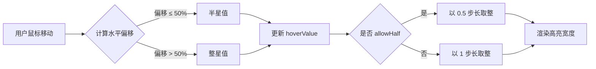
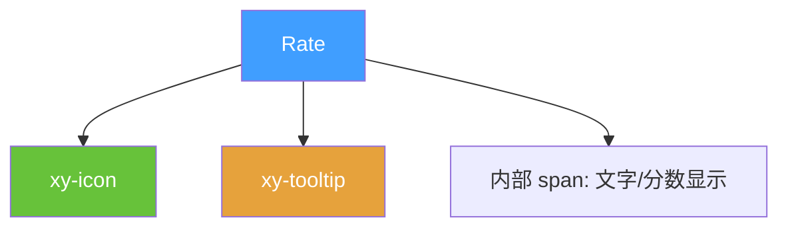
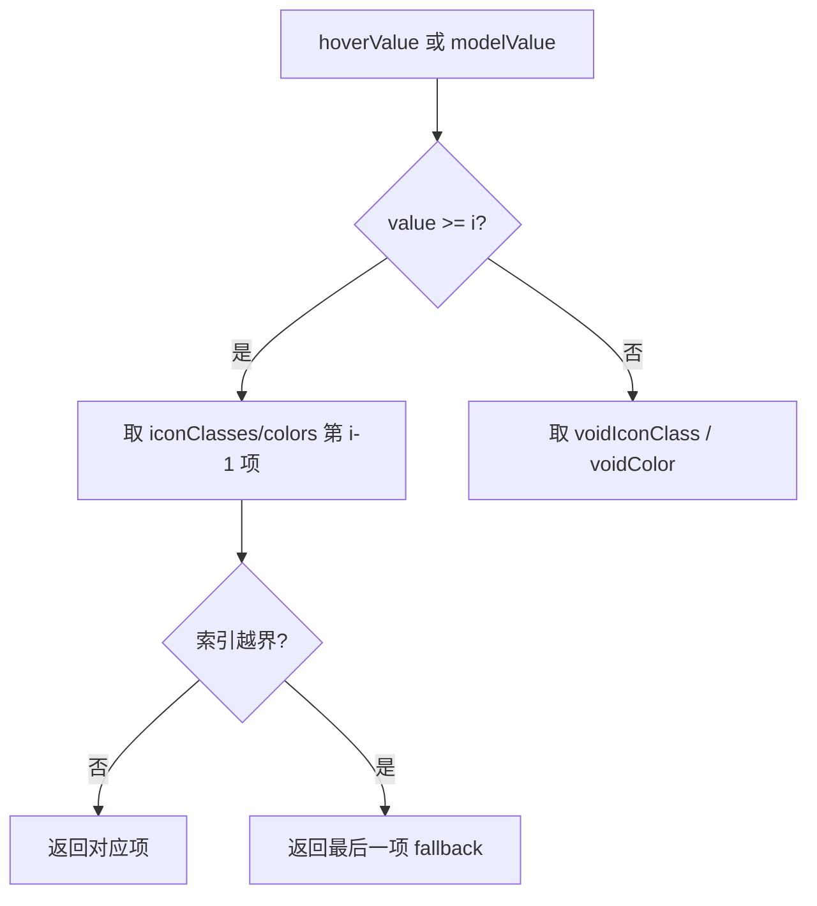

# 42 Rate 评分

> 导读：Rate 评分组件提供直觉化的星级评分交互，支持半星精度、自定义图标与辅助文字，是企业级表单中用户反馈与评价场景的核心控件。

## 设计哲学

### 组件存在的理由

评分是人类认知中最直觉的量化表达方式之一。在电商评价、满意度调查、内容打分等场景中，星级评分比数字输入更具语义亲和力——用户无需思考"3 分还是 4 分"，而是直接在视觉引导下完成选择。Rate 组件将这种直觉交互封装为可复用的 Vue 组件。

### 设计决策

1. **DOM 分割 vs 单元素渲染**：我们选择将每个星级拆分为独立 DOM 节点，而非用 CSS 渐变模拟。这样每个星都可以独立响应鼠标事件，实现半星精度和动态 hover 高亮，且天然支持自定义图标插槽。
2. **半星精度的 hover 追踪**：通过 `getBoundingClientRect` 计算鼠标在星级图标内的水平偏移，左半区为半星、右半区为整星，避免了额外 DOM 节点带来的布局抖动。
3. **值映射策略**：内部始终以数值（0 ~ max）驱动，图标宽度仅用于视觉映射。这使组件与表单验证、数据提交无缝衔接。

### 与同类组件库的差异化

- 相比 Element Plus 的 Rate，我们内置了 `tooltip` 配置，hover 时可实时预览分值描述
- 支持通过 `icon-classes` 对不同分值区间使用不同图标（如低分用空心、高分用实心）
- `show-score` 与 `show-text` 可同时启用，满足"既看数字又看描述"的企业需求



## 源码架构

### 文件结构

```
packages/components/rate/
├── index.ts              # 导出入口，注册 Rate 组件
└── src/
    ├── rate.vue          # 主组件：模板 + 逻辑 + 样式
    └── rate.ts           # 类型定义 & props 声明
```

### 组件关系图



### 核心 type 定义

```ts
export const rateProps = buildProps({
  modelValue:     { type: Number,   default: 0 },
  max:            { type: Number,   default: 5 },
  size:           { type: String,   values: sizeList, default: 'default' },
  allowHalf:      { type: Boolean,  default: false },
  showText:       { type: Boolean,  default: false },
  showScore:      { type: Boolean,  default: false },
  disabled:       { type: Boolean,  default: false },
  icons:          { type: arrayProp },
  voidIcon:       { type: String },
  iconClasses:    { type: arrayProp },
  voidIconClass:  { type: String },
  texts:          { type: arrayProp },
  colors:         { type: arrayProp },
  voidColor:      { type: String },
  disabledVoidColor: { type: String },
  disabledColor:  { type: String },
  gap:            { type: Number,   default: 6 },
  clearable:      { type: Boolean,  default: false },
  tooltip:        { type: Boolean,  default: false },
} as const)

export type RateProps = ExtractPublicPropTypes<typeof rateProps>
```

## 核心实现

### 1. 半星精度的 hover 追踪

核心难点：鼠标在星级图标内移动时，如何判断当前 hover 值是整星还是半星？

```ts
function getCurrentValue(event: MouseEvent, i: number) {
  // 获取当前星级图标的边界矩形
  const target = event.currentTarget as HTMLElement
  const { left, width } = target.getBoundingClientRect()
  const offsetX = event.clientX - left

  if (props.allowHalf) {
    // 左半区 → 半星，右半区 → 整星
    return offsetX <= width / 2 ? i - 0.5 : i
  }
  return i
}
```

**WHY 用 `getBoundingClientRect` 而非 `offsetX`？** `offsetX` 在嵌套元素（如图标内部的 SVG path）上会返回相对于子元素的偏移，导致计算不准。`getBoundingClientRect` 始终基于视口坐标，不受 DOM 嵌套影响。

### 2. 动态图标与颜色映射

不同分值区间可配置不同图标和颜色，通过索引取值实现：

```ts
function getIconClass(i: number) {
  const value = hoverValue.value ?? modelValue.value
  if (value >= i) return props.iconClasses?.[i - 1] ?? props.iconClasses?.at(-1)
  return props.voidIconClass
}

function getColor(i: number) {
  const value = hoverValue.value ?? modelValue.value
  if (value >= i) return props.colors?.[i - 1] ?? props.colors?.at(-1)
  return props.voidColor
}
```



### 3. clearable 点击清空

当用户再次点击已选中的相同分值时，若 `clearable` 为 true，则将值重置为 0：

```ts
function selectValue(value: number) {
  if (props.disabled) return
  if (props.clearable && modelValue.value === value) {
    emit('update:modelValue', 0)
    emit('change', 0)
  } else {
    emit('update:modelValue', value)
    emit('change', value)
  }
}
```

### 4. 模板渲染策略

每个星级由两层 `xy-icon` 叠加实现：底层始终渲染 void 图标，上层通过动态 `width` 裁切实现半星/整星效果：

```html
<span
  v-for="i in max"
  :key="i"
  class="xy-rate__item"
  @mousemove="handleMouseMove($event, i)"
  @mouseleave="handleMouseLeave"
  @click="selectValue(currentValue)"
>
  <!-- 底层：未选中图标 -->
  <xy-icon :icon="voidIcon" :style="{ color: voidColor }" />
  <!-- 上层：选中图标，通过 width 裁切 -->
  <xy-icon
    :icon="activeIcon"
    :style="{
      color: activeColor,
      width: iconWidth(i),
    }"
    class="xy-rate__icon--active"
  />
</span>
```

## API 参考

### Props

| 属性 | 类型 | 默认值 | 说明 |
|------|------|--------|------|
| modelValue | `number` | `0` | 绑定值（v-model） |
| max | `number` | `5` | 最大分值 |
| size | `'large' \| 'default' \| 'small'` | `'default'` | 尺寸 |
| allowHalf | `boolean` | `false` | 是否允许半选 |
| showText | `boolean` | `false` | 是否显示辅助文字 |
| showScore | `boolean` | `false` | 是否显示当前分数 |
| disabled | `boolean` | `false` | 是否禁用 |
| icons | `string[]` | — | 自定义选中图标数组 |
| voidIcon | `string` | — | 未选中图标名 |
| iconClasses | `string[]` | — | 自定义选中图标类名数组 |
| voidIconClass | `string` | — | 未选中图标类名 |
| texts | `string[]` | — | 辅助文字数组 |
| colors | `string[]` | — | 选中颜色数组 |
| voidColor | `string` | — | 未选中颜色 |
| disabledVoidColor | `string` | — | 禁用态未选中颜色 |
| disabledColor | `string` | — | 禁用态选中颜色 |
| gap | `number` | `6` | 星级间距（px） |
| clearable | `boolean` | `false` | 是否可清空 |
| tooltip | `boolean` | `false` | 是否启用 tooltip 预览 |

### Emits

| 事件 | 参数 | 说明 |
|------|------|------|
| update:modelValue | `(value: number)` | v-model 更新 |
| change | `(value: number)` | 分值变化时触发 |

### Slots

| 插槽名 | 参数 | 说明 |
|--------|------|------|
| default | — | 自定义辅助文字区域 |

## 样式系统

### BEM 类名

| 类名 | 说明 |
|------|------|
| `.xy-rate` | 根容器 |
| `.xy-rate__item` | 单个星级容器 |
| `.xy-rate__icon--active` | 选中态图标 |
| `.xy-rate__text` | 辅助文字 |
| `.xy-rate--disabled` | 禁用态修饰 |
| `.xy-rate--small` | 小尺寸修饰 |
| `.xy-rate--large` | 大尺寸修饰 |

### CSS 变量

| 变量 | 默认值 | 说明 |
|------|--------|------|
| `--xy-rate-height` | `20px` | 图标高度 |
| `--xy-rate-font-size` | `18px` | 图标字号 |
| `--xy-rate-icon-size` | `var(--xy-rate-font-size)` | 图标尺寸 |
| `--xy-rate-gap` | `6px` | 星级间距 |
| `--xy-rate-color` | `var(--xy-color-primary)` | 选中颜色 |
| `--xy-rate-void-color` | `var(--xy-color-info-light-5)` | 未选中颜色 |
| `--xy-rate-disabled-color` | `var(--xy-color-info-light-5)` | 禁用选中颜色 |
| `--xy-rate-text-color` | `var(--xy-color-text-primary)` | 辅助文字颜色 |

### 主题定制方式

```css
:root {
  --xy-rate-color: #f7ba2a;       /* 金色评分 */
  --xy-rate-gap: 8px;             /* 更宽间距 */
  --xy-rate-icon-size: 24px;      /* 更大图标 */
}
```

## 小结

1. **半星精度的 DOM 追踪**：通过 `getBoundingClientRect` 计算鼠标水平偏移，避免嵌套元素 `offsetX` 不可靠的问题，实现精准的半星 hover 反馈
2. **双层图标叠加 + width 裁切**：底层渲染 void 图标、上层渲染 active 图标并通过动态 width 控制可见区域，半星与整星共享同一渲染管线
3. **索引式属性映射**：`colors`、`icons`、`texts` 等数组属性通过索引取值 + 末项 fallback 的策略，兼顾区间配置的灵活性与缺省值的健壮性
