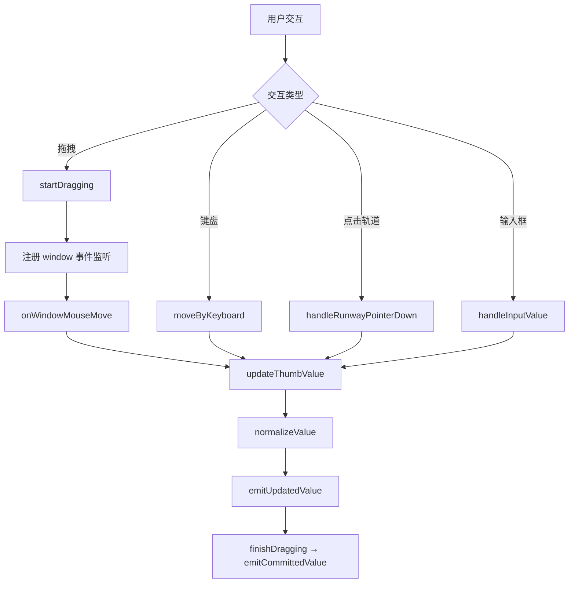
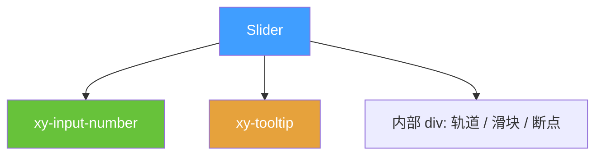
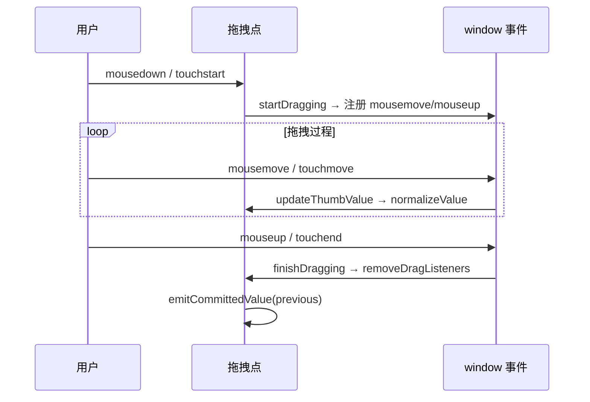

# 43 Slider 滑块

> 导读：Slider 滑块组件提供连续数值与范围选择能力，支持拖拽、键盘、输入框联动三种交互通道，是企业级表单中阈值调节与区间筛选的核心控件。

## 设计哲学

### 组件存在的理由

当用户需要在一个连续区间内选择数值（如音量、价格、权重）时，滑块比数字输入框更直觉——用户"拖动"而非"填写"。对于双值区间（如"50 ~ 200 元的价格范围"），双滑块模式提供一次性交互完成起止值设定，避免了两个独立输入框的对齐困扰。

### 设计决策

1. **单组件双模式**：`range` prop 在同一组件内切换单值 / 范围模式，而非拆为两个组件。内部以 `startValue` + `endValue` 两个 ref 驱动，单值模式下 `endValue` 固定为 max，简化了状态管理。
2. **拖拽生命周期**：采用 window 级别事件监听（而非元素级），拖拽开始时注册 `mousemove/mouseup/touchmove/touchend`，结束时清除。这保证鼠标移出轨道后仍可继续拖拽，直到释放。
3. **精度归一化**：所有值经过 `normalizeValue` → `roundToPrecision` 链路，确保浮点精度不泄漏到用户可见层。

### 与同类组件库的差异化

- 内置 `showInput` 模式直接复用 `xy-input-number`，无需用户手动组合
- 拖拽点自动获取焦点，键盘操作即刻生效，无需额外 tabindex 配置
- `persistent` prop 控制 tooltip 是否常驻 DOM，满足 SSR 和无障碍场景



## 源码架构

### 文件结构

```
packages/components/slider/
├── index.ts              # 导出入口，withInstall 注册
└── src/
    ├── slider.vue        # 主组件：模板 + 全部交互逻辑
    └── slider.ts         # 类型定义
```

### 组件关系图



### 核心 type 定义

```ts
export type SliderValue = number | [number, number]
export type SliderPlacement = 'top' | 'bottom' | 'left' | 'right'

export interface SliderProps {
  modelValue?: SliderValue
  min?: number
  max?: number
  step?: number
  showInput?: boolean
  showInputControls?: boolean
  size?: ComponentSize
  inputSize?: ComponentSize
  showStops?: boolean
  showTooltip?: boolean
  formatTooltip?: (value: number) => number | string
  disabled?: boolean
  range?: boolean
  vertical?: boolean
  height?: string
  rangeStartLabel?: string
  rangeEndLabel?: string
  formatValueText?: (value: number) => string
  tooltipClass?: string
  placement?: SliderPlacement
  validateEvent?: boolean
  persistent?: boolean
  ariaLabel?: string
}
```

## 核心实现

### 1. 拖拽生命周期管理

拖拽的核心挑战：鼠标按下后可能移出轨道区域，需要持续追踪直到释放。

```ts
function startDragging(thumb: ThumbName) {
  dragStartPayload.value = clonePayload(getCurrentPayload())
  draggingThumb.value = thumb
  focusThumb(thumb)
  removeDragListeners()
  window.addEventListener('mousemove', onWindowMouseMove)
  window.addEventListener('mouseup', onWindowMouseUp)
  window.addEventListener('touchmove', onWindowTouchMove, { passive: false })
  window.addEventListener('touchend', onWindowTouchEnd)
  window.addEventListener('touchcancel', onWindowTouchEnd)
}

function finishDragging() {
  if (!draggingThumb.value) return
  const previous = clonePayload(dragStartPayload.value)
  draggingThumb.value = null
  removeDragListeners()
  emitCommittedValue(previous)
}
```

**WHY window 级别监听？** 若仅在轨道元素上监听 mousemove，鼠标移出轨道后拖拽中断。window 监听保证从按下到释放全程追踪，且 `removeDragListeners()` 在结束时精准清理，不会泄漏。



### 2. 轨道点击与最近滑块判断

点击轨道时需要判断哪个滑块更近，以避免"远端滑块跳跃"：

```ts
function getNearestThumb(value: number): ThumbName {
  if (!props.range) return 'start'
  const startDistance = Math.abs(value - startValue.value)
  const endDistance = Math.abs(value - endValue.value)
  return startDistance <= endDistance ? 'start' : 'end'
}
```

### 3. 精度归一化链路

浮点精度是滑块的隐性陷阱（如 `0.1 + 0.2 ≠ 0.3`）。所有用户交互产生的值都经过归一化：

```ts
function normalizeValue(value: number, lower = props.min, upper = props.max) {
  if (props.max <= props.min) return props.min
  const clamped = clampValue(value, lower, upper)
  if (props.step <= 0) return roundToPrecision(clamped)
  const steps = Math.round((clamped - props.min) / props.step)
  const next = props.min + steps * props.step
  return clampValue(roundToPrecision(next), lower, upper)
}
```

**WHY `roundToPrecision`？** `toFixed` + `parseFloat` 消除浮点尾数。精度由 `min`、`max`、`step` 三个属性中最大的小数位数决定。

### 4. 断点可视化

`showStops` 在轨道上标记步长断点，但仅渲染"未被选中区间覆盖"的断点，避免视觉噪声：

```ts
const stopList = computed(() => {
  if (!props.showStops || props.step <= 0) return []
  const result: number[] = []
  let cursor = roundToPrecision(props.min + props.step)
  while (cursor < props.max) {
    const hidden = props.range
      ? cursor > minSelected && cursor < maxSelected
      : cursor <= startValue.value
    if (!hidden) result.push(getPercent(cursor))
    cursor = roundToPrecision(cursor + props.step)
  }
  return result
})
```

## API 参考

### Props

| 属性 | 类型 | 默认值 | 说明 |
|------|------|--------|------|
| modelValue | `SliderValue` | `0` | 绑定值，range 模式为 `[number, number]` |
| min | `number` | `0` | 最小值 |
| max | `number` | `100` | 最大值 |
| step | `number` | `1` | 步长 |
| size | `ComponentSize` | — | 组件尺寸 |
| showInput | `boolean` | `false` | 是否显示输入框 |
| showInputControls | `boolean` | `true` | 输入框是否显示加减按钮 |
| inputSize | `ComponentSize` | — | 输入框尺寸 |
| showStops | `boolean` | `false` | 是否显示断点 |
| showTooltip | `boolean` | `true` | 是否显示 tooltip |
| formatTooltip | `(value: number) => number \| string` | — | tooltip 格式化 |
| disabled | `boolean` | `false` | 是否禁用 |
| range | `boolean` | `false` | 是否启用范围选择 |
| vertical | `boolean` | `false` | 是否垂直模式 |
| height | `string` | `'180px'` | 垂直轨道高度 |
| rangeStartLabel | `string` | `'起始值'` | 范围起点 aria-label |
| rangeEndLabel | `string` | `'结束值'` | 范围终点 aria-label |
| formatValueText | `(value: number) => string` | — | aria-valuetext 格式化 |
| tooltipClass | `string` | `''` | tooltip 自定义类名 |
| placement | `SliderPlacement` | `'top'` | tooltip 位置 |
| validateEvent | `boolean` | `true` | 是否触发表单校验 |
| persistent | `boolean` | `true` | tooltip 是否常驻 DOM |
| ariaLabel | `string` | — | 无障碍标签 |

### Emits

| 事件 | 参数 | 说明 |
|------|------|------|
| update:modelValue | `(value: SliderValue)` | v-model 更新 |
| input | `(value: SliderValue)` | 拖拽过程中实时触发 |
| change | `(value: SliderValue)` | 值提交后触发 |
| focus | `(event: FocusEvent)` | 滑块获得焦点 |
| blur | `(event: FocusEvent)` | 滑块失去焦点 |

### Exposes

| 方法 | 说明 |
|------|------|
| focus() | 聚焦起始滑块 |
| blur() | 让所有滑块失焦 |

## 样式系统

### BEM 类名

| 类名 | 说明 |
|------|------|
| `.xy-slider` | 根容器 |
| `.xy-slider__runway` | 轨道 |
| `.xy-slider__bar` | 已选区间 |
| `.xy-slider__thumb-wrapper` | 滑块外层容器 |
| `.xy-slider__thumb` | 滑块圆形按钮 |
| `.xy-slider__tooltip` | 数值提示 |
| `.xy-slider__stop` | 断点标记 |
| `.xy-slider__input` | 输入框 |

### CSS 变量

| 变量 | 默认值 | 说明 |
|------|--------|------|
| `--xy-slider-runway-bg` | `var(--xy-fill-color-light)` | 轨道背景色 |
| `--xy-slider-main-bg-color` | `var(--xy-color-primary)` | 已选区间颜色 |
| `--xy-slider-height` | `6px` | 轨道高度 |
| `--xy-slider-button-size` | `20px` | 滑块按钮直径 |
| `--xy-slider-button-wrapper-size` | `36px` | 滑块外层容器尺寸 |
| `--xy-slider-button-wrapper-offset` | `-15px` | 滑块偏移修正 |

### 主题定制方式

```css
:root {
  --xy-slider-main-bg-color: #f7ba2a;    /* 金色轨道 */
  --xy-slider-button-size: 16px;         /* 更小滑块 */
  --xy-slider-height: 4px;               /* 更细轨道 */
}
```

## 小结

1. **window 级别拖拽追踪**：拖拽开始注册 window 事件，结束时精准清理，保证鼠标移出轨道后仍可继续操作，无事件泄漏风险
2. **精度归一化链路**：所有交互值经过 `clamp → round → normalize` 链路，确保浮点精度不泄漏到视图层或 API 输出
3. **单组件双模式统一**：`range` prop 在同一组件内切换单值 / 范围，`startValue` + `endValue` 双 ref 驱动，单值模式下 endValue 固定为 max，减少分支逻辑