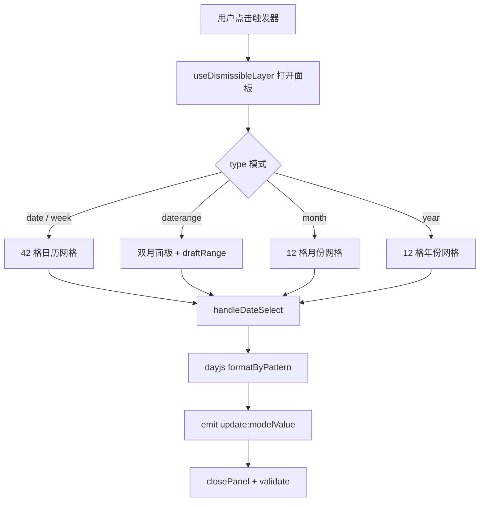
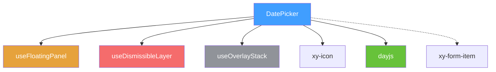
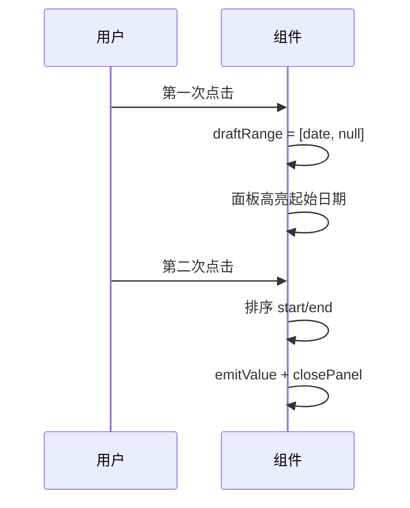

# 44 DatePicker 日期选择

> 导读：DatePicker 日期选择组件封装 dayjs 时间引擎与浮层面板交互，支持日期 / 日期范围 / 月份 / 年份 / 周五种模式，是企业级表单日期录入的标准方案。

## 设计哲学

### 组件存在的理由

日期是人类交互中最常见却最容易出错的输入类型。手写"2024-02-30"等非法日期仅需一秒，而校验和纠错可能需要数分钟。DatePicker 通过可视化日历面板将日期选择约束在合法范围内，从源头消除无效输入。

### 设计决策

1. **dayjs 作为时间引擎**：选择 dayjs 而非 moment 或原生 Date，是因为 dayjs 不可变、链式调用、体积仅 2KB，且插件体系支持自定义格式和 locale。通过 `customParseFormat` 插件实现灵活的格式解析。
2. **单一组件 + type 属性切换模式**：`type="date"` / `"daterange"` / `"month"` / `"year"` / `"week"` 在同一组件内切换。内部通过 `calendarCells` / `monthCells` / `yearCells` 三组 computed 动态渲染对应面板，减少用户心智负担。
3. **内置 Popper 层级托管**：日历面板通过 `useFloatingPanel` + `teleport` 挂载到 body，由 `useOverlayStack` 管理 z-index 和层级冲突，保证面板不被父容器 overflow 裁切。

### 与同类组件库的差异化

- `value-format` 允许 v-model 绑定值为自定义格式字符串（如 `"YYYY/MM/DD"`），而不仅是 Date 对象
- 内置 `validateEvent` 与 Form 组件联动，选择日期后自动触发校验
- `shortcuts` 支持函数式延迟计算，保证"今天"等相对日期始终准确



## 源码架构

### 文件结构

```
packages/components/date-picker/
├── index.ts              # 导出入口，withInstall 注册
└── src/
    ├── date-picker.vue   # 主组件：触发器 + 面板 + 全部逻辑
    └── date-picker.ts    # 类型定义 & props
```

### 组件关系图



### 核心 type 定义

```ts
export type DatePickerType = 'date' | 'daterange' | 'month' | 'year' | 'week'
export type DatePickerValue = string | [string, string] | null

export interface DatePickerShortcut {
  label: string
  value: DatePickerValue | (() => DatePickerValue)
}

export interface DatePickerProps {
  modelValue?: DatePickerValue
  type?: DatePickerType
  placeholder?: string | string[]
  disabled?: boolean
  clearable?: boolean
  size?: ComponentSize
  min?: string
  max?: string
  format?: string
  valueFormat?: string
  shortcuts?: DatePickerShortcut[]
  disabledDate?: (date: Date) => boolean
  teleported?: boolean
  popperClass?: string
  popperStyle?: StyleValue
  appendTo?: string | HTMLElement
  placement?: Placement
  validateEvent?: boolean
}
```

## 核心实现

### 1. 42 格日历网格生成

日历面板始终渲染 42 格（6 行 x 7 列），保证月份切换时布局稳定不跳动：

```ts
const calendarCells = computed<CalendarCell[]>(() => {
  const monthStart = currentPanelDate.value.startOf('month')
  const gridStart = monthStart.startOf('week')

  return Array.from({ length: 42 }, (_, index) => {
    const date = gridStart.add(index, 'day')
    return {
      key: date.format('YYYY-MM-DD'),
      label: date.date(),
      date: date.toDate(),
      inCurrentMonth: date.month() === monthStart.month(),
      disabled: isDateDisabled(date)
    }
  })
})
```

**WHY 42 格？** 一个月最多跨 6 周（如 3 月 1 日是周六），7 列 x 6 行 = 42 格。使用固定网格避免月份切换时的行数跳变。

### 2. 范围模式的 draft 两步选择

`daterange` 模式需要用户依次点击"起始"和"结束"，中间过程由 `draftRange` 草稿状态管理：

```ts
async function handleDateSelect(value: dayjs.Dayjs) {
  if (isDateDisabled(value)) return
  if (!rangeMode.value) {
    await applySingleValue(adaptValueByType(value))
    return
  }
  const [start, end] = draftRange.value
  if (!start || (start && end)) {
    draftRange.value = [value.startOf('day'), null]
    return
  }
  await applyRangeValue(start.startOf('day'), value.startOf('day'))
}
```



**WHY 草稿状态？** 直接修改 v-model 会导致第一次点击就产生半成品值，触发不必要的 watch 和校验。草稿状态将"选择中"和"已完成"解耦。

### 3. format 与 value-format 分离

`format` 控制输入框显示，`value-format` 控制 v-model 绑定值格式：

```ts
const displayFormat = computed(() => props.format ?? getDefaultFormat(props.type))
const modelFormat = computed(() => props.valueFormat ?? getDefaultFormat(props.type))

async function applySingleValue(value: dayjs.Dayjs) {
  const output = formatByPattern(value, modelFormat.value)
  emitValue(output)
  await closePanel(false, true)
}

const displayLabel = computed(() => {
  const [first] = selectedDates.value
  return first ? formatByPattern(first, displayFormat.value) : props.placeholder
})
```

**WHY 分离？** 业务系统通常要求 ISO 格式存储（`YYYY-MM-DD`），但用户可能更习惯 `YYYY/MM/DD` 或 `YYYY年M月D日` 的显示。分离后两端各取所需。

### 4. 不可关闭层与 Popper 生命周期

面板的打开 / 关闭遵循严格的生命周期：

```ts
async function openPanel() {
  if (mergedDisabled.value || open.value) return
  open.value = true
  emit('visibleChange', true)
  emit('focus')
  syncPanelState()
  openLayer()
  await nextTick()
  await updatePosition()
  startAutoUpdate()
  panelRef.value?.focus()
}

async function closePanel(shouldValidate = false, restoreFocus = false) {
  if (!open.value) return
  open.value = false
  emit('visibleChange', false)
  emit('blur')
  stopAutoUpdate()
  closeLayer()
  if (restoreFocus) {
    await nextTick()
    triggerRef.value?.focus()
  }
  if (shouldValidate) await formItem?.validate('blur')
}
```

## API 参考

### Props

| 属性 | 类型 | 默认值 | 说明 |
|------|------|--------|------|
| modelValue | `DatePickerValue` | `null` | 绑定值 |
| type | `DatePickerType` | `'date'` | 选择模式 |
| placeholder | `string \| string[]` | `'请选择日期'` | 占位文本 |
| disabled | `boolean` | `false` | 禁用 |
| clearable | `boolean` | `false` | 可清空 |
| size | `ComponentSize` | — | 尺寸 |
| min | `string` | — | 最小可选日期 |
| max | `string` | — | 最大可选日期 |
| format | `string` | — | 显示格式 |
| valueFormat | `string` | — | 绑定值格式 |
| shortcuts | `DatePickerShortcut[]` | `[]` | 快捷选项 |
| disabledDate | `(date: Date) => boolean` | — | 禁用日期判断 |
| teleported | `boolean` | `true` | 是否 teleport 到 body |
| popperClass | `string` | `''` | 面板自定义类名 |
| popperStyle | `StyleValue` | — | 面板自定义样式 |
| appendTo | `string \| HTMLElement` | `'body'` | 面板挂载目标 |
| placement | `Placement` | `'bottom-start'` | 面板弹出位置 |
| validateEvent | `boolean` | `true` | 是否触发表单校验 |

### Emits

| 事件 | 参数 | 说明 |
|------|------|------|
| update:modelValue | `(value: DatePickerValue)` | v-model 更新 |
| change | `(value: DatePickerValue)` | 值变化 |
| clear | — | 清空时触发 |
| visibleChange | `(visible: boolean)` | 面板显隐变化 |
| focus | — | 获得焦点 |
| blur | — | 失去焦点 |

### Slots

| 插槽名 | 参数 | 说明 |
|--------|------|------|
| default | — | 自定义触发器内容 |

## 样式系统

### BEM 类名

| 类名 | 说明 |
|------|------|
| `.xy-date-picker` | 根容器 |
| `.xy-date-picker__trigger` | 输入框触发器 |
| `.xy-date-picker__selection` | 显示文本 |
| `.xy-date-picker__actions` | 操作区（清除 + 箭头） |
| `.xy-date-picker__panel` | 浮层面板 |
| `.xy-date-picker__header` | 面板头部（翻页控制） |
| `.xy-date-picker__weekdays` | 星期行 |
| `.xy-date-picker__grid` | 日历网格 |
| `.xy-date-picker__cell` | 单元格 |
| `.xy-date-picker__shortcuts` | 快捷选项区 |
| `.xy-date-picker__footer` | 底部操作栏 |

### CSS 变量

| 变量 | 默认值 | 说明 |
|------|--------|------|
| `--xy-date-picker-panel-bg` | `var(--xy-popper-bg)` | 面板背景色 |
| `--xy-date-picker-panel-border` | `var(--xy-popper-border-color)` | 面板边框色 |
| `--xy-date-picker-panel-shadow` | `var(--xy-popper-shadow)` | 面板阴影 |
| `--xy-date-picker-panel-section-background` | 混合色 | 区段背景色 |

### 主题定制方式

```css
:root {
  --xy-date-picker-panel-bg: #fff;
  --xy-date-picker-panel-border: #e4e7ed;
  --xy-date-picker-panel-shadow: 0 2px 12px rgba(0,0,0,.1);
}
```

## 小结

1. **dayjs 不可变引擎 + customParseFormat**：基于 dayjs 的不可变链式调用处理所有日期运算，通过 `customParseFormat` 插件实现灵活的格式解析，保证状态可追踪
2. **42 格固定网格**：日历面板始终渲染 6x7=42 格，避免月份切换时行数跳变导致的布局抖动
3. **draft 草稿状态解耦**：范围模式下使用 `draftRange` 草稿追踪"选择中"状态，与 v-model 的"已完成"值解耦，避免半成品触发校验