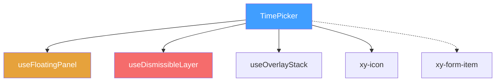
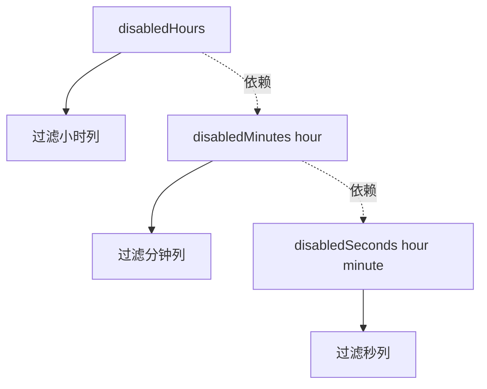

# 45 TimePicker 时间选择

> 导读：TimePicker 时间选择组件提供时/分/秒滚轮式选择交互，支持单值与范围模式，是企业级表单时间录入的精确方案。

## 设计哲学

### 组件存在的理由

时间输入与日期输入面临同样的困境：自由文本输入易产生格式歧义和非法值。TimePicker 通过列式滚轮面板将时间选择约束在合法空间内，同时支持 `isRange` 范围模式覆盖"营业时段"等双端选择场景。

### 设计决策

1. **列式滚轮而非下拉列表**：TimePicker 渲染时/分/秒三列独立滚轮，用户可以在每列独立滚动选择，交互效率高于 TimeSelect 的线性列表浏览。
2. **TimePicker 与 TimeSelect 分离**：两者共享"时间输入"场景但交互模式差异过大——TimePicker 是连续滚轮，TimeSelect 是离散列表。强行合并会导致代码分支爆炸，因此保持独立组件。
3. **format 驱动列数**：`format="HH:mm:ss"` 显示三列，`format="HH:mm"` 只显示两列。format 作为唯一的真相来源，避免配置矛盾。

### 与同类组件库的差异化

- `disabledHours/Minutes/Seconds` 允许细粒度禁用特定时间单位，函数参数传递上下文
- `isRange` 范围模式自动排序起止时间，避免用户填反
- `confirmSelection` 确认按钮防止误操作，与 TimeSelect 的"点击即选"区分

```mermaid
graph TD
    A[用户点击触发器] --> B[openPanel → syncDraftFromModel]
    B --> C{isRange?}
    C -->|是| D[双区域: start + end]
    C -->|否| E[单区域: single]
    D --> F[3列/2列滚轮]
    E --> F
    F --> G[用户滚动选择]
    G --> H[updatePart]
    H --> I[confirmSelection]
    I --> J{isRange?}
    J -->|是| K[排序 start/end → emit [start, end]]
    J -->|否| L[emit string]
    K --> M[closePanel]
    L --> M
```

## 源码架构

### 文件结构

```
packages/components/time-picker/
├── index.ts              # 导出入口
└── src/
    ├── time-picker.vue   # 主组件：触发器 + 面板 + 全部逻辑
    └── time-picker.ts    # 类型定义
```

### 组件关系图



### 核心 type 定义

```ts
export type TimePickerValue = string | [string, string] | null

export interface TimePickerProps {
  modelValue?: TimePickerValue
  placeholder?: string
  startPlaceholder?: string
  endPlaceholder?: string
  disabled?: boolean
  clearable?: boolean
  size?: ComponentSize
  format?: string
  isRange?: boolean
  validateEvent?: boolean
  teleported?: boolean
  appendTo?: string | HTMLElement
  placement?: Placement
  popperClass?: string
  popperStyle?: StyleValue
  disabledHours?: () => number[]
  disabledMinutes?: (hour: number) => number[]
  disabledSeconds?: (hour: number, minute: number) => number[]
}
```

## 核心实现

### 1. TimeParts 结构与草稿管理

内部使用 `TimeParts { hour, minute, second }` 结构管理时间草稿，而非直接操作字符串：

```ts
interface TimeParts {
  hour: number
  minute: number
  second: number
}

const draftSingle = ref<TimeParts>(defaultTime.value)
const draftRangeStart = ref<TimeParts>(defaultTime.value)
const draftRangeEnd = ref<TimeParts>(defaultTime.value)

type SectionKey = 'single' | 'start' | 'end'

function getSectionDraft(section: SectionKey) {
  if (section === 'single') return draftSingle.value
  return section === 'start' ? draftRangeStart.value : draftRangeEnd.value
}
```

**WHY 三份独立草稿？** 范围模式下 start 和 end 独立编辑，互不干扰。用户可以修改 start 的小时而不影响 end 的值。三份草稿通过 `SectionKey` 统一访问。

### 2. 禁用时间级联

分钟和秒的禁用可能依赖于已选的小时：

```ts
function buildColumns(section: SectionKey) {
  const draft = getSectionDraft(section)
  return [
    { key: 'hour', label: '时', values: Array.from({ length: 24 }, (_, v) => ({
      value: v, selected: draft.hour === v, disabled: isHourDisabled(v)
    }))},
    { key: 'minute', label: '分', values: Array.from({ length: 60 }, (_, v) => ({
      value: v, selected: draft.minute === v,
      disabled: isHourDisabled(draft.hour) || isMinuteDisabled(draft.hour, v)
    }))},
    showSeconds.value ? { key: 'second', label: '秒', values: ... } : null
  ].filter(Boolean)
}
```

**WHY 函数式禁用？** 分钟禁用依赖于当前选中小时，秒禁用依赖于小时和分钟。函数参数传递上下文，静态数组无法表达级联关系。



### 3. 范围模式确认与排序

范围模式下确认时自动排序起止时间：

```ts
async function confirmSelection() {
  if (props.isRange) {
    let start = cloneParts(draftRangeStart.value)
    let end = cloneParts(draftRangeEnd.value)
    if (compareParts(start, end) > 0) {
      ;[start, end] = [end, start]
    }
    await emitChangeValue([formatTime(start), formatTime(end)])
    return
  }
  await emitChangeValue(formatTime(draftSingle.value))
}
```

### 4. normalizeParts 防御

每次修改时间部分后都经过归一化，确保不会停留在被禁用的时间上：

```ts
function normalizeParts(parts: TimeParts | null) {
  const candidate = parts ? cloneParts(parts) : cloneParts(defaultTime.value)
  if (isTimeDisabled(candidate)) {
    return cloneParts(getFirstAvailableTime() ?? defaultTime.value)
  }
  if (!showSeconds.value) candidate.second = 0
  return candidate
}
```

## API 参考

### Props

| 属性 | 类型 | 默认值 | 说明 |
|------|------|--------|------|
| modelValue | `TimePickerValue` | `null` | 绑定值 |
| placeholder | `string` | `'请选择时间'` | 占位文本 |
| startPlaceholder | `string` | `'开始时间'` | 范围起始占位 |
| endPlaceholder | `string` | `'结束时间'` | 范围结束占位 |
| disabled | `boolean` | `false` | 禁用 |
| clearable | `boolean` | `false` | 可清空 |
| size | `ComponentSize` | — | 尺寸 |
| format | `string` | `'HH:mm:ss'` | 时间格式 |
| isRange | `boolean` | `false` | 范围模式 |
| validateEvent | `boolean` | `true` | 触发表单校验 |
| disabledHours | `() => number[]` | — | 禁用小时 |
| disabledMinutes | `(hour: number) => number[]` | — | 禁用分钟 |
| disabledSeconds | `(hour: number, minute: number) => number[]` | — | 禁用秒 |
| teleported | `boolean` | `true` | 是否 teleport |
| appendTo | `string \| HTMLElement` | `'body'` | 挂载目标 |
| placement | `Placement` | `'bottom-start'` | 弹出位置 |
| popperClass | `string` | `''` | 面板自定义类名 |
| popperStyle | `StyleValue` | — | 面板自定义样式 |

### Emits

| 事件 | 参数 | 说明 |
|------|------|------|
| update:modelValue | `(value: TimePickerValue)` | v-model 更新 |
| change | `(value: TimePickerValue)` | 值变化 |
| clear | — | 清空 |
| visibleChange | `(visible: boolean)` | 面板显隐 |
| focus | — | 获得焦点 |
| blur | — | 失去焦点 |

## 样式系统

### BEM 类名

| 类名 | 说明 |
|------|------|
| `.xy-time-picker` | 根容器 |
| `.xy-time-picker__trigger` | 输入框触发器 |
| `.xy-time-picker__selection` | 显示文本区 |
| `.xy-time-picker__actions` | 操作区 |
| `.xy-time-picker__panel` | 浮层面板 |
| `.xy-time-picker__body` | 面板主体 |
| `.xy-time-picker__section` | 单/双区域 |
| `.xy-time-picker__columns` | 列容器 |
| `.xy-time-picker__column` | 单列 |
| `.xy-time-picker__option` | 单个时间项 |
| `.xy-time-picker__footer` | 底部操作栏 |

### CSS 变量

| 变量 | 默认值 | 说明 |
|------|--------|------|
| `--xy-time-picker-panel-bg` | `var(--xy-popper-bg)` | 面板背景 |
| `--xy-time-picker-panel-border` | `var(--xy-popper-border-color)` | 面板边框 |
| `--xy-time-picker-panel-shadow` | `var(--xy-popper-shadow)` | 面板阴影 |

### 主题定制方式

```css
:root {
  --xy-time-picker-panel-bg: #fff;
  --xy-time-picker-panel-border: #e4e7ed;
}
```

## 小结

1. **TimeParts 草稿状态**：内部使用结构化的 `TimeParts` 而非字符串管理草稿，三份独立草稿（single / start / end）通过 `SectionKey` 统一访问，避免字符串解析开销
2. **函数式禁用级联**：`disabledMinutes(hour)` / `disabledSeconds(hour, minute)` 通过参数传递上下文，实现分钟依赖小时、秒依赖分小时的级联禁用
3. **确认排序与归一化**：范围模式确认时自动排序 start/end，每次修改后经过 `normalizeParts` 确保不会停留在被禁用的时间上