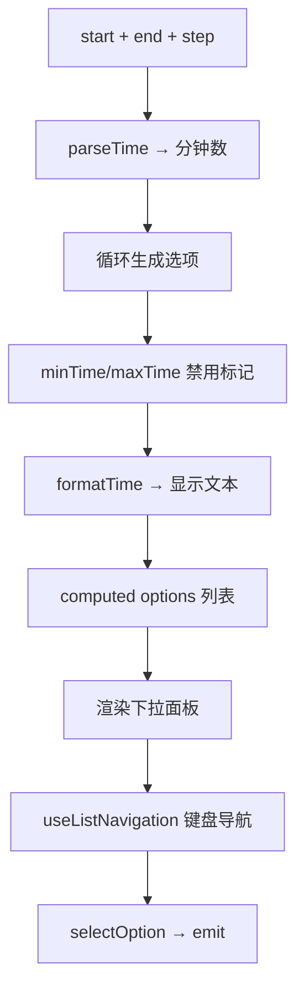
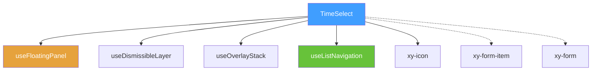
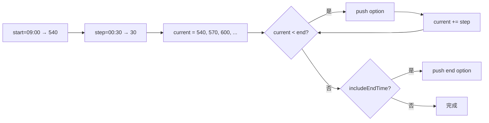

# 46 TimeSelect 时间选择器

> 导读：TimeSelect 时间选择器提供固定步长的离散时间点下拉选择，适合预约时段、营业窗口等"整点或半点"场景，是企业级表单时间录入的便捷方案。

## 设计哲学

### 组件存在的理由

当时间选项是离散的、有规律的（如"09:00、09:30、10:00"），用户不需要精确到秒的滚轮交互——他们只需要快速浏览列表并点选一个时间点。TimeSelect 正是为这种场景设计的：从 start 到 end 按 step 步长生成选项列表，用户一目了然。

### 设计决策

1. **时间转分钟数统一运算**：内部将所有时间统一转换为"自零点起的分钟数"进行运算（如 "09:30" = 570），避免字符串解析的重复开销和格式歧义。
2. **与 Select 共享交互模式**：TimeSelect 的下拉面板交互与 Select 一致（点击触发器打开、键盘导航、ESC 关闭），复用 `useListNavigation` 和 `useDismissibleLayer` 降低用户学习成本。
3. **minTime/maxTime 禁用而非过滤**：不在可选范围内的选项被标记为 disabled 而非隐藏，让用户了解"为什么不能选"，而非困惑"选项为什么少了"。

### 与同类组件库的差异化

- `includeEndTime` 控制是否将截止时间纳入选项，满足"18:00 也是可选的"需求
- `format` 支持 12 小时制（`hh:mm A`），自动转换 AM/PM
- `matchTriggerWidth` 让下拉面板与触发器同宽，避免窄触发器配宽面板的不协调



## 源码架构

### 文件结构

```
packages/components/time-select/
├── index.ts              # 导出入口
└── src/
    ├── time-select.vue   # 主组件：触发器 + 下拉面板 + 全部逻辑
    └── time-select.ts    # 类型定义 & 默认值常量
```

### 组件关系图



### 核心 type 定义

```ts
export interface TimeSelectProps {
  modelValue?: string | null
  placeholder?: string
  disabled?: boolean
  clearable?: boolean
  size?: ComponentSize
  start?: string
  end?: string
  step?: string
  minTime?: string
  maxTime?: string
  includeEndTime?: boolean
  format?: string
  validateEvent?: boolean
  teleported?: boolean
  appendTo?: string | HTMLElement
  placement?: Placement
  popperClass?: string
  popperStyle?: StyleValue
}

export interface TimeSelectOption {
  value: string
  label: string
  disabled: boolean
  totalMinutes: number
}

export const DEFAULT_START = "09:00"
export const DEFAULT_END = "18:00"
export const DEFAULT_STEP = "00:30"
export const DEFAULT_FORMAT = "HH:mm"
```

## 核心实现

### 1. 分钟数统一运算

所有时间统一转为"自零点起的分钟数"：

```ts
function parseTime(value?: string | null) {
  if (!value) return null
  const normalized = value.trim()
  const match = normalized.match(/^(\d{1,2}):(\d{2})(?:\s*([AaPp][Mm]))?$/)
  if (!match) return null
  let hour = Number(match[1])
  const minute = Number(match[2])
  const meridiem = match[3]?.toLowerCase()
  // AM/PM 转换
  if (meridiem === 'pm' && hour !== 12) hour += 12
  if (meridiem === 'am' && hour === 12) hour = 0
  return hour * 60 + minute
}
```

**WHY 分钟数而非字符串？** "09:30" + "00:30" 的字符串运算无法直接加法。转为分钟数后 `570 + 30 = 600` 即 "10:00"，运算简洁无歧义。

### 2. 选项列表生成

```ts
function buildOptions() {
  const startMinutes = parseTime(props.start)
  const endMinutes = parseTime(props.end)
  const stepMinutes = parseTime(props.step)
  // ... 校验合法性
  const options: TimeSelectOption[] = []
  let current = startMinutes
  while (current < endMinutes) {
    options.push({
      value: toValue(current),
      label: toValue(current),
      disabled: (minMinutes !== null && current < minMinutes) ||
                (maxMinutes !== null && current > maxMinutes),
      totalMinutes: current
    })
    current += stepMinutes
  }
  // includeEndTime 处理
  if (props.includeEndTime || current === endMinutes) {
    options.push({ value: toValue(endMinutes), ... })
  }
  return options
}
```



### 3. 12 小时制格式化

```ts
function formatTime(totalMinutes: number, pattern: string) {
  const hour24 = Math.floor(minutes / 60)
  const minute = minutes % 60
  const hour12 = hour24 % 12 || 12
  const tokens = {
    HH: `${hour24}`.padStart(2, '0'),
    hh: `${hour12}`.padStart(2, '0'),
    mm: `${minute}`.padStart(2, '0'),
    A: hour24 < 12 ? 'AM' : 'PM',
    a: hour24 < 12 ? 'am' : 'pm'
  }
  return pattern.replace(/HH|H|hh|h|mm|A|a/g, token => tokens[token] ?? token)
}
```

### 4. Form 集成与 syncFormModel

TimeSelect 主动同步值到 Form 的 model 对象，而非仅通过 emit 传递：

```ts
function syncFormModel(value: string | null) {
  if (!form || !formItem?.prop) return
  setPathValue(form.props.model, formItem.prop, value)
}
```

**WHY 主动同步？** 部分业务场景依赖 Form 的 model 对象而非 v-model 响应。通过 `setPathValue` 直接写入 model，确保两种数据流都正确更新。

## API 参考

### Props

| 属性 | 类型 | 默认值 | 说明 |
|------|------|--------|------|
| modelValue | `string \| null` | `null` | 绑定值 |
| placeholder | `string` | `'请选择时间'` | 占位文本 |
| disabled | `boolean` | `false` | 禁用 |
| clearable | `boolean` | `false` | 可清空 |
| size | `ComponentSize` | — | 尺寸 |
| start | `string` | `'09:00'` | 开始时间 |
| end | `string` | `'18:00'` | 结束时间 |
| step | `string` | `'00:30'` | 步长 |
| minTime | `string` | — | 最小可选时间 |
| maxTime | `string` | — | 最大可选时间 |
| includeEndTime | `boolean` | `false` | 是否包含截止时间 |
| format | `string` | `'HH:mm'` | 显示格式 |
| validateEvent | `boolean` | `true` | 触发表单校验 |
| teleported | `boolean` | `true` | 是否 teleport |
| appendTo | `string \| HTMLElement` | `'body'` | 挂载目标 |
| placement | `Placement` | `'bottom-start'` | 弹出位置 |
| popperClass | `string` | `''` | 面板自定义类名 |
| popperStyle | `StyleValue` | — | 面板自定义样式 |

### Emits

| 事件 | 参数 | 说明 |
|------|------|------|
| update:modelValue | `(value: string \| null)` | v-model 更新 |
| change | `(value: string \| null)` | 值变化 |
| clear | — | 清空 |
| visibleChange | `(visible: boolean)` | 面板显隐 |
| focus | — | 获得焦点 |
| blur | — | 失去焦点 |

### Exposes

| 方法 | 说明 |
|------|------|
| focus() | 聚焦触发器 |
| blur() | 关闭面板并失焦 |
| open() | 打开下拉面板 |
| close() | 关闭下拉面板 |

## 样式系统

### BEM 类名

| 类名 | 说明 |
|------|------|
| `.xy-time-select` | 根容器 |
| `.xy-time-select__trigger` | 输入框触发器 |
| `.xy-time-select__prefix` | 前缀图标区 |
| `.xy-time-select__selection` | 显示文本 |
| `.xy-time-select__actions` | 操作区 |
| `.xy-time-select__dropdown` | 下拉面板 |
| `.xy-time-select__option` | 单个时间选项 |
| `.xy-time-select__empty` | 空态提示 |

### CSS 变量

| 变量 | 默认值 | 说明 |
|------|--------|------|
| `--xy-time-select-dropdown-bg` | `var(--xy-popper-bg)` | 面板背景 |
| `--xy-time-select-dropdown-border` | `var(--xy-popper-border-color)` | 面板边框 |
| `--xy-time-select-dropdown-shadow` | `var(--xy-popper-shadow)` | 面板阴影 |

### 主题定制方式

```css
:root {
  --xy-time-select-dropdown-bg: #fff;
  --xy-time-select-dropdown-border: #e4e7ed;
}
```

## 小结

1. **分钟数统一运算**：所有时间转为"自零点起的分钟数"运算，避免字符串解析重复开销和格式歧义，AM/PM 转换也在 parseTime 中统一处理
2. **禁用而非过滤**：minTime/maxTime 将不在范围的选项标记为 disabled 而非隐藏，让用户理解"为什么不能选"
3. **Form model 主动同步**：通过 `setPathValue` 直接写入 Form 的 model 对象，保证 v-model 和 Form model 两种数据流都正确更新