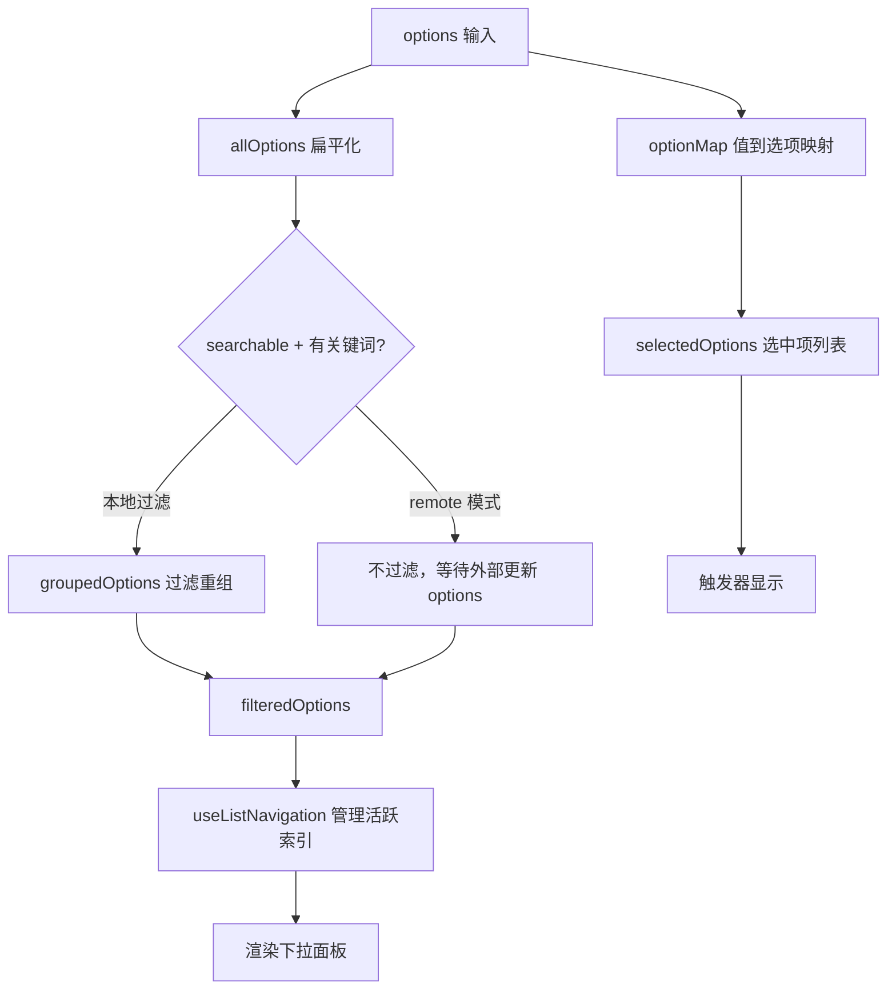
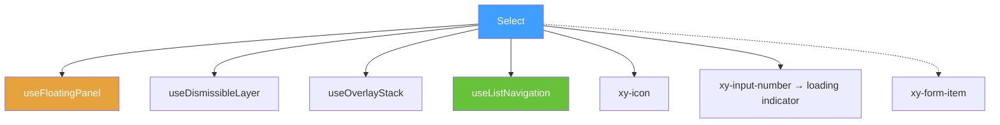

# 47 Select 选择器

> 导读：Select 选择器提供单选/多选/搜索/远程/创建五种模式，是企业级表单枚举值录入和筛选栏的核心控件。

## 设计哲学

### 组件存在的理由

枚举值选择（状态、角色、分类）是后台表单最高频的交互模式。Select 将枚举选择封装为下拉面板交互，同时支持多选、搜索过滤和远程搜索三种增强模式，覆盖从简单下拉到复杂搜索的全场景链路。

### 设计决策

1. **泛型组件设计**：`<script setup lang="ts" generic="T extends string | number">` 使 Select 支持任意值类型，无需为 number / string 分别实现。
2. **扁平化内部数据结构**：传入的 `options` 可能是嵌套分组结构，内部通过 `allOptions` computed 将其扁平化为 `FlatSelectOption[]`，统一索引和查找。
3. **搜索过滤与远程搜索分离**：`searchable` 做本地过滤，`remote` 将搜索完全交给外部。两者互不干扰——remote 模式下组件不做本地过滤，只展示外部传入选项。

### 与同类组件库的差异化

- `allowCreate` 支持按搜索词创建新选项，无需预定义所有枚举
- `collapseTags` + `maxTagCount` 精细控制多选标签密度
- `option.description` 支持二级描述文案，适合状态解释
- `header/footer/loading/empty/option` 五个插槽覆盖面板各区域自定义



## 源码架构

### 文件结构

```
packages/components/select/
├── index.ts              # 导出入口
└── src/
    ├── select.vue        # 主组件：触发器 + 下拉面板 + 全部逻辑
    └── select.ts         # 类型定义
```

### 组件关系图



### 核心 type 定义

```ts
export interface SelectOptionGroup<T = string | number> {
  label: string
  options: SelectOption<T>[]
  disabled?: boolean
}

export type SelectOptionItem<T = string | number> = SelectOption<T> | SelectOptionGroup<T>
export type SelectValue<T = string | number> = T | T[] | null

export interface FlatSelectOption<T = string | number> extends SelectOption<T> {
  flatIndex: number
  groupLabel?: string
  created?: boolean
}

export interface SelectProps<T = string | number> {
  modelValue?: SelectValue<T>
  options: SelectOptionItem<T>[]
  placeholder?: string
  disabled?: boolean
  clearable?: boolean
  searchable?: boolean
  multiple?: boolean
  collapseTags?: boolean
  maxTagCount?: number
  remote?: boolean
  allowCreate?: boolean
  size?: ComponentSize
  // ... 20+ 更多 props
}
```

## 核心实现

### 1. 扁平化与分组重组

传入的 options 可能是嵌套分组结构，内部需要扁平化统一索引，渲染时又需按分组重组：

```ts
const allOptions = computed(() => {
  const flattened: Array<Omit<FlatSelectOption<T>, "flatIndex">> = []
  props.options.forEach((item) => {
    if (isOptionGroup(item)) {
      item.options.forEach((option) => {
        flattened.push({
          ...option,
          disabled: Boolean(item.disabled) || Boolean(option.disabled),
          groupLabel: item.label
        })
      })
      return
    }
    flattened.push(item)
  })
  return flattened
})

const groupedOptions = computed<SelectRenderGroup<T>[]>(() => {
  // 搜索过滤 + 分组重组 + createdOption 插入
  const keyword = searchValue.value.trim().toLowerCase()
  const shouldFilter = !props.remote && showSearchInput.value && keyword.length > 0
  let runningIndex = 0
  const groups: SelectRenderGroup<T>[] = []
  // ...遍历 options 过滤重组
  if (createdOption.value) groups.push({ isGroup: false, options: [{ ...createdOption.value, flatIndex: runningIndex++ }] })
  return groups
})
```

**WHY 扁平化 + 重组？** 扁平化统一了值查找（`optionMap`）和键盘导航（`useListNavigation` 需要线性索引）。渲染时按分组重组保证视觉上的分组标题和分隔。

### 2. allowCreate 动态创建选项

```ts
const createdOption = computed<Omit<FlatSelectOption<T>, "flatIndex"> | null>(() => {
  if (!props.allowCreate) return null
  const keyword = searchValue.value.trim()
  if (!keyword || props.loading) return null
  const matched = allOptions.value.some(
    (option) => option.label === keyword || String(option.value) === keyword
  )
  if (matched) return null  // 已存在则不创建
  return { label: keyword, value: keyword as T, created: true }
})
```

```mermaid
graph TD
    A[搜索关键词] --> B{allowCreate?}
    B -->|否| C[不创建]
    B -->|是| D{已有匹配项?}
    D -->|是| C
    D -->|否| E[生成 createdOption]
    E --> F[追加到 groupedOptions 末尾]
    F --> G[显示 "创建 xxx" 标签]
```

### 3. 多选标签折叠

```ts
const collapsedTagCount = computed(() => {
  if (!props.multiple || !props.collapseTags) return 0
  const limit = props.maxTagCount ?? 1
  return Math.max(0, selectedOptions.value.length - limit)
})

const visibleTags = computed(() => {
  if (!props.multiple) return []
  if (!props.collapseTags) return selectedOptions.value
  return selectedOptions.value.slice(0, props.maxTagCount ?? 1)
})
```

**WHY maxTagCount 默认 1？** 筛选栏空间有限，只展示 1 个标签 + "+N" 是最紧凑的表达。用户可通过 `maxTagCount` 调整。

### 4. 键盘导航

```ts
const navigation = useListNavigation(() => filteredOptions.value, { loop: true })

async function handleKeydown(event: KeyboardEvent) {
  switch (event.key) {
    case 'ArrowDown': event.preventDefault(); open.value ? navigation.moveNext() : await openDropdown(); break
    case 'ArrowUp':   event.preventDefault(); open.value ? navigation.movePrev() : await openDropdown(); break
    case 'Enter':
      if (!open.value) { await openDropdown(); break }
      if (activeOption.value) { await selectOption(activeOption.value); break }
      if (props.allowCreate) { await createOption(); break }
      break
    case 'Escape': await closeDropdown(true, true); break
    case 'Backspace':  // 多选退格删除最后一个标签
      if (props.multiple && !searchValue.value && selectedValues.value.length)
        await emitValue(selectedValues.value.slice(0, -1))
      break
  }
}
```

## API 参考

### Props

| 属性 | 类型 | 默认值 | 说明 |
|------|------|--------|------|
| modelValue | `SelectValue<T>` | `null` | 绑定值 |
| options | `SelectOptionItem<T>[]` | — | 选项列表 |
| placeholder | `string` | `'请选择'` | 占位文本 |
| disabled | `boolean` | `false` | 禁用 |
| clearable | `boolean` | `false` | 可清空 |
| searchable | `boolean` | `false` | 搜索 |
| multiple | `boolean` | `false` | 多选 |
| collapseTags | `boolean` | `false` | 折叠标签 |
| maxTagCount | `number` | `undefined` | 标签上限 |
| remote | `boolean` | `false` | 远程搜索 |
| allowCreate | `boolean` | `false` | 创建选项 |
| size | `ComponentSize` | — | 尺寸 |
| loading | `boolean` | `false` | 加载态 |
| loadingText | `string` | `'加载中'` | 加载文案 |
| noDataText | `string` | `'暂无选项'` | 空数据文案 |
| noMatchText | `string` | `'没有匹配项'` | 无匹配文案 |
| fitInputWidth | `boolean` | `undefined` | 面板跟随触发器宽度 |

### Emits

| 事件 | 参数 | 说明 |
|------|------|------|
| update:modelValue | `(value: T \| T[] \| null)` | v-model 更新 |
| change | `(value: T \| T[] \| null)` | 值变化 |
| clear | — | 清空 |
| visibleChange | `(visible: boolean)` | 面板显隐 |
| focus | — | 获得焦点 |
| blur | — | 失去焦点 |
| searchChange | `(value: string)` | 搜索词变化 |

### Slots

| 插槽名 | 参数 | 说明 |
|--------|------|------|
| prefix | — | 触发器前缀 |
| suffix | — | 触发器后缀 |
| header | — | 面板头部 |
| footer | — | 面板底部 |
| loading | — | 加载态 |
| empty | — | 空态 |
| option | `SelectOptionSlotProps<T>` | 自定义选项 |

### Exposes

| 方法 | 说明 |
|------|------|
| focus() | 聚焦触发器 |
| blur() | 关闭面板并失焦 |
| open() | 打开面板 |
| close() | 关闭面板 |

## 样式系统

### BEM 类名

| 类名 | 说明 |
|------|------|
| `.xy-select` | 根容器 |
| `.xy-select__trigger` | 触发器 |
| `.xy-select__selection` | 单选显示文本 |
| `.xy-select__tags` | 多选标签区 |
| `.xy-select__tag` | 单个标签 |
| `.xy-select__tag-remove` | 标签删除按钮 |
| `.xy-select__actions` | 操作区（清除 + 箭头） |
| `.xy-select__dropdown` | 下拉面板 |
| `.xy-select__search` | 搜索输入框 |
| `.xy-select__content` | 选项列表区 |
| `.xy-select__group` | 分组 |
| `.xy-select__group-label` | 分组标题 |
| `.xy-select__option` | 单个选项 |
| `.xy-select__empty` | 空态 |
| `.xy-select__loading` | 加载态 |

### CSS 变量

| 变量 | 默认值 | 说明 |
|------|--------|------|
| `--xy-select-dropdown-bg` | `var(--xy-popper-bg)` | 面板背景 |
| `--xy-select-dropdown-border` | `var(--xy-popper-border-color)` | 面板边框 |
| `--xy-select-dropdown-shadow` | `var(--xy-popper-shadow)` | 面板阴影 |

### 主题定制方式

```css
:root {
  --xy-select-dropdown-bg: #fff;
  --xy-select-dropdown-border: #e4e7ed;
}
```

## 小结

1. **泛型扁平化 + 分组重组**：传入的嵌套分组 options 通过 `allOptions` 扁平化统一索引和查找，渲染时通过 `groupedOptions` 按分组重组，兼顾查找效率和视觉分组
2. **allowCreate 动态创建**：搜索关键词与已有选项不匹配时生成 `createdOption`，追加到列表末尾并以 "创建 xxx" 标签展示，避免枚举预定义不完备的问题
3. **本地搜索与远程搜索分离**：`searchable` 做本地关键词过滤，`remote` 将搜索完全交给外部通过 `searchChange` 事件驱动，互不干扰