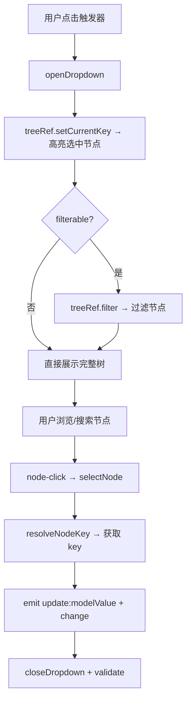
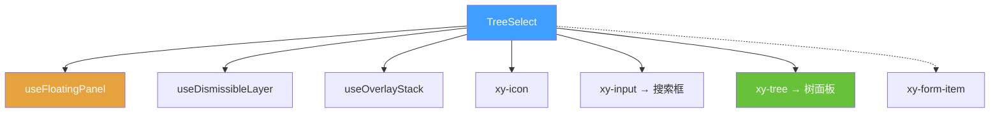

# 48 TreeSelect 树选择

> 导读：TreeSelect 树选择组件提供层级结构的单选交互，复用 xy-tree 的展开/折叠和过滤能力，是组织架构、权限树、菜单配置等"层级选择但只需要节点 key"场景的标准控件。

## 设计哲学

### 组件存在的理由

扁平枚举（Select）无法表达层级关系。当选项存在父子嵌套（如组织架构的部门层级、权限树的功能分组），用户需要在"展开 → 浏览 → 定位 → 选择"的链路中完成选择。TreeSelect 将 Select 的触发器与 Tree 的面板组合为一体化交互。

### 设计决策

1. **Select 触发器 + Tree 面板组合**：触发器复用 Select 的 combobox 模式（点击打开、显示选中标签），面板内嵌 `xy-tree` 组件。两者通过 `selectNode` 回调桥接，而非从头实现树面板。
2. **单选 v1，未来扩展多选**：当前版本 `modelValue` 类型为 `TreeKey | null`（单节点 key），为后续 `multiple` 模式预留扩展空间。
3. **findNode 深度搜索而非 TreeNode 链路**：选中值到显示标签的映射通过 `findNode(data, key)` 深度搜索完成，而非依赖 tree 组件内部节点缓存，保证数据源与显示一致性。

### 与同类组件库的差异化

- 直接复用 `xy-tree` 的 `lazy / load / filterNodeMethod`，无需为 TreeSelect 单独实现懒加载
- `filterable` 搜索框内嵌在面板顶部，使用 `xy-input` 组件
- `defaultFilterNodeMethod` 默认按 label 关键词匹配，无需手动实现



## 源码架构

### 文件结构

```
packages/components/tree-select/
├── index.ts              # 导出入口
└── src/
    ├── tree-select.vue   # 主组件：触发器 + 树面板 + 全部逻辑
    └── tree-select.ts    # 类型定义
```

### 组件关系图



### 核心 type 定义

```ts
export interface TreeSelectProps {
  modelValue?: TreeKey | null
  data?: TreeData
  nodeKey?: string
  props?: TreeOptionProps
  placeholder?: string
  disabled?: boolean
  clearable?: boolean
  filterable?: boolean
  filterNodeMethod?: FilterNodeMethodFunction
  lazy?: boolean
  load?: LoadFunction
  size?: ComponentSize
  emptyText?: string
  searchPlaceholder?: string
  teleported?: boolean
  appendTo?: string | HTMLElement
  placement?: Placement
  offset?: number
  popperClass?: string
  popperStyle?: StyleValue
}
```

## 核心实现

### 1. findNode 深度搜索

选中值到显示标签的映射通过递归深度搜索完成：

```ts
function findNode(data: TreeNodeData[], key: string | number | null): TreeNodeData | null {
  if (key == null) return null
  const childrenField = getChildrenField()
  for (const item of data) {
    if (resolveNodeKey(item) === key) return item
    const children = Array.isArray(item?.[childrenField]) ? item[childrenField] as TreeNodeData[] : []
    const childNode = findNode(children, key)
    if (childNode) return childNode
  }
  return null
}

const selectedNode = computed(() => findNode(props.data, selectedValue.value))
const displayLabel = computed(() =>
  selectedNode.value ? resolveNodeLabel(selectedNode.value) : props.placeholder
)
```

**WHY 深度搜索而非 tree 内部缓存？** tree 组件的内部节点状态可能因懒加载或过滤而变化，直接依赖其缓存可能导致"选了但显示不对"的 bug。`findNode` 始终基于原始 `data` 搜索，保证数据源一致性。

### 2. props 字段映射

`TreeOptionProps` 允许自定义字段名，与 Cascader 的 `fieldNames` 类似：

```ts
function resolveNodeLabel(data: TreeNodeData) {
  const labelProp = props.props.label ?? 'label'
  if (typeof labelProp === 'function') return `${labelProp(data, null) ?? ''}`
  return `${data?.[labelProp] ?? ''}`
}

function resolveNodeDisabled(data: TreeNodeData) {
  const disabledProp = props.props.disabled ?? 'disabled'
  if (typeof disabledProp === 'function') return Boolean(disabledProp(data, null))
  return Boolean(data?.[disabledProp])
}
```

**WHY 支持函数映射？** 业务数据可能不以 `label` / `disabled` 为字段名（如 `name` / `isForbidden`）。函数映射允许根据上下文动态计算，如"父节点禁用时子节点也禁用"。

```mermaid
graph LR
    A[data 节点] --> B{props.label 类型}
    B -->|string| C[data[label]]
    B -->|function| D[labelProp data null]
    C --> E[显示标签]
    D --> E
```

### 3. filterable 搜索与树过滤

搜索框与树组件通过 `filter` 方法桥接：

```ts
const resolvedFilterMethod = computed(() =>
  props.filterNodeMethod ?? ((value, data) => defaultFilterNodeMethod(value, data))
)

function defaultFilterNodeMethod(value: FilterValue, data: TreeNodeData) {
  if (!value) return true
  return resolveNodeLabel(data).toLowerCase().includes(`${value}`.trim().toLowerCase())
}

watch(searchValue, async (value) => {
  if (!props.filterable) return
  treeRef.value?.filter(value)
  await nextTick()
  await updatePosition()  // 过滤后树高度可能变化，需更新面板位置
})
```

**WHY watch searchValue 而非在 input 事件中？** `xy-input` 的 `@update:model-value` 更新 `searchValue`，watch 在下一 tick 调用 `tree.filter()` 并更新面板位置。这保证过滤完成后再重新定位，避免面板跳动。

### 4. 选择节点的完整链路

```ts
async function selectNode(data: TreeNodeData) {
  if (resolveNodeDisabled(data)) return
  const nextValue = resolveNodeKey(data)
  if (nextValue == null) return
  selectedValue.value = nextValue
  emit('update:modelValue', nextValue)
  emit('change', nextValue)
  await closeDropdown(false, true)
  await formItem?.validate('change')
}
```

## API 参考

### Props

| 属性 | 类型 | 默认值 | 说明 |
|------|------|--------|------|
| modelValue | `TreeKey \| null` | `null` | 绑定值（节点 key） |
| data | `TreeData` | `[]` | 树节点数据 |
| nodeKey | `string` | — | 节点唯一标识字段 |
| props | `TreeOptionProps` | `{ children, label, disabled }` | 字段映射 |
| placeholder | `string` | `'请选择节点'` | 占位文本 |
| disabled | `boolean` | `false` | 禁用 |
| clearable | `boolean` | `false` | 可清空 |
| filterable | `boolean` | `false` | 搜索 |
| filterNodeMethod | `FilterNodeMethodFunction` | — | 自定义过滤方法 |
| lazy | `boolean` | `false` | 懒加载 |
| load | `LoadFunction` | — | 懒加载回调 |
| size | `ComponentSize` | — | 尺寸 |
| emptyText | `string` | `'暂无数据'` | 空数据文案 |
| searchPlaceholder | `string` | `'搜索节点'` | 搜索占位文本 |
| teleported | `boolean` | `true` | 是否 teleport |
| appendTo | `string \| HTMLElement` | `'body'` | 挂载目标 |
| placement | `Placement` | `'bottom-start'` | 弹出位置 |
| offset | `number` | `8` | 面板偏移 |
| popperClass | `string` | `''` | 面板自定义类名 |
| popperStyle | `StyleValue` | `''` | 面板自定义样式 |

### Emits

| 事件 | 参数 | 说明 |
|------|------|------|
| update:modelValue | `(value: TreeKey \| null)` | v-model 更新 |
| change | `(value: TreeKey \| null)` | 值变化 |
| clear | — | 清空 |
| visibleChange | `(visible: boolean)` | 面板显隐 |
| focus | — | 获得焦点 |
| blur | — | 失去焦点 |

### Exposes

| 方法 | 说明 |
|------|------|
| focus() | 聚焦触发器 |
| blur() | 关闭面板并失焦 |
| open() | 打开面板 |
| close() | 关闭面板 |
| filter() | 设置搜索关键词 |

## 样式系统

### BEM 类名

| 类名 | 说明 |
|------|------|
| `.xy-tree-select` | 根容器 |
| `.xy-tree-select__trigger` | 触发器 |
| `.xy-tree-select__label` | 显示标签 |
| `.xy-tree-select__actions` | 操作区 |
| `.xy-tree-select__dropdown` | 下拉面板 |
| `.xy-tree-select__search` | 搜索框区 |
| `.xy-tree-select__tree` | 内嵌树组件 |

### CSS 变量

| 变量 | 默认值 | 说明 |
|------|--------|------|
| `--xy-tree-select-dropdown-bg` | `var(--xy-popper-bg)` | 面板背景 |
| `--xy-tree-select-dropdown-border` | `var(--xy-popper-border-color)` | 面板边框 |
| `--xy-tree-select-dropdown-shadow` | `var(--xy-popper-shadow)` | 面板阴影 |

### 主题定制方式

```css
:root {
  --xy-tree-select-dropdown-bg: #fff;
  --xy-tree-select-dropdown-border: #e4e7ed;
}
```

## 小结

1. **Select 触发器 + Tree 面板组合**：触发器复用 combobox 模式，面板直接内嵌 `xy-tree` 组件，通过 `selectNode` 回调桥接，无需从头实现树面板
2. **findNode 深度搜索**：选中值到显示标签的映射基于原始 `data` 递归搜索而非 tree 内部缓存，保证数据源一致性
3. **props 字段映射支持函数**：`label` / `disabled` 等字段映射既支持字符串（直接取属性）也支持函数（动态计算），适配各种业务数据命名