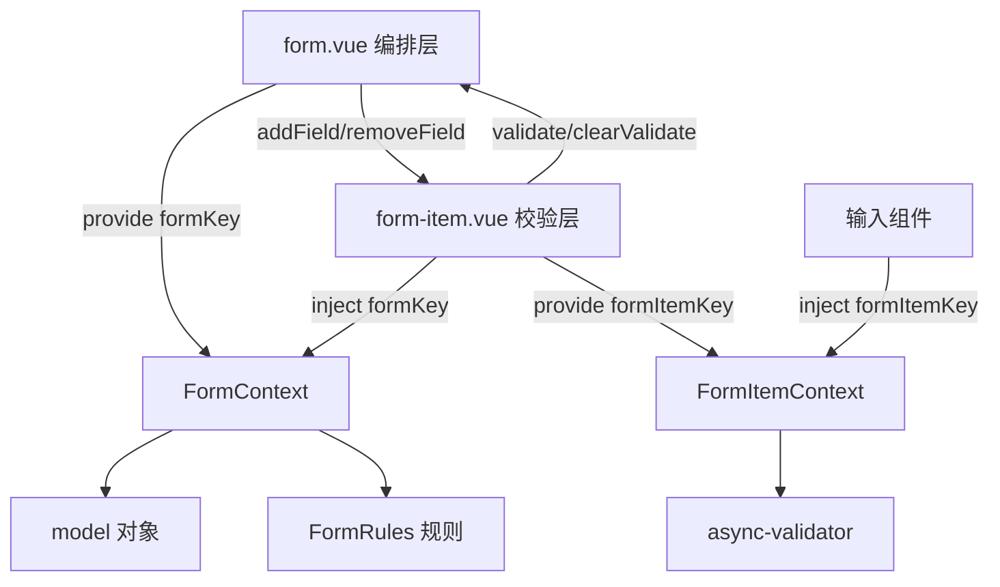
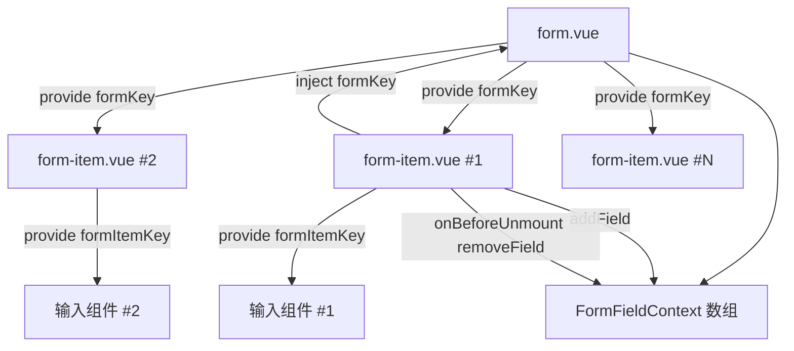
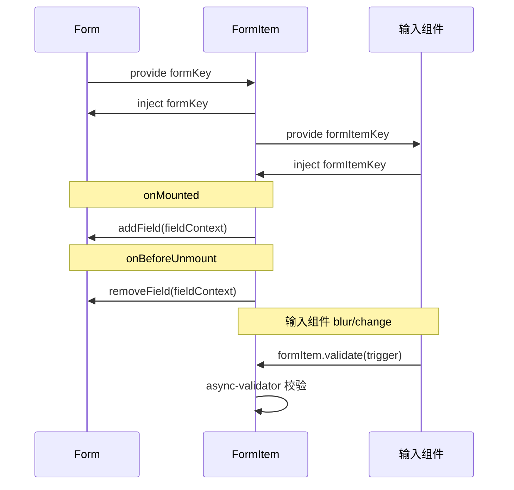
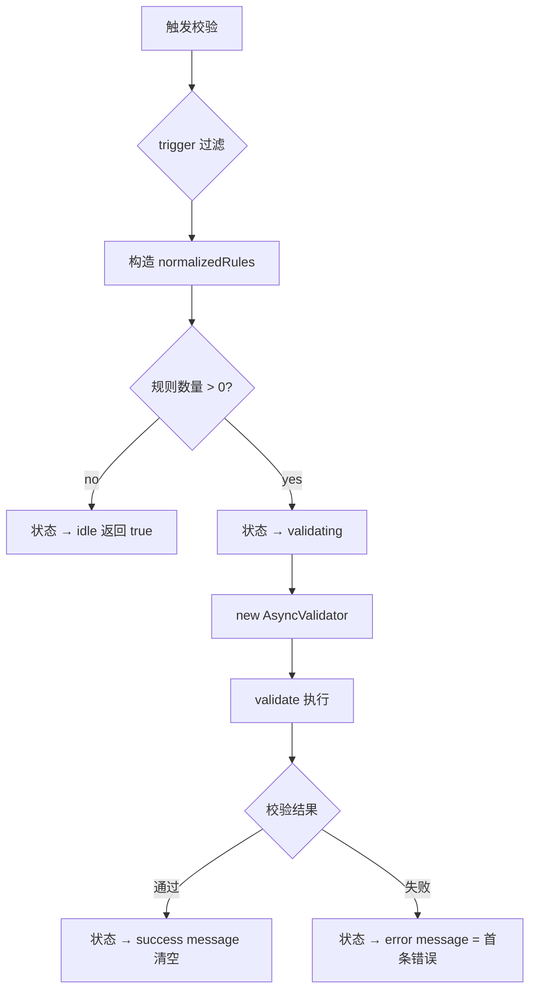
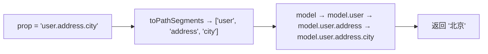

# 49 Form 表单

> 导读：Form 是企业级表单场景的基础编排层，通过 provide/inject 上下文将 Form 与 FormItem 解耦，以 async-validator 驱动声明式校验，支持动态规则切换、嵌套路径取值和滚动定位错误项三大核心能力。

## 设计哲学

- **provide/inject 上下文**：Form 与 FormItem 不通过 Props 逐层传递配置，而是通过 `formKey` / `formItemKey` 两个 InjectionKey 建立双向上下文。FormItem 通过 inject 获取 Form 的 model/rules/disabled 等配置，Form 通过 `addField/removeField` 收集 FormItem 实例，实现松耦合的父子通信。
- **声明式校验**：校验规则以 `FormRules` 对象声明，key 对应 model 的字段路径，value 是 `async-validator` 规则数组。开发者只需描述"什么规则校验什么字段"，不需要手动调用校验方法——FormItem 在 blur/change 时自动触发，Form 在 `validate()` 时批量触发。
- **嵌套路径取值**：model 对象支持任意深度的嵌套结构（如 `{ user: { address: { city } } }`），FormItem 的 `prop` 支持 `"user.address.city"` 和 `["user", "address", "city"]` 两种写法，内部通过 `toPathSegments → reduce` 实现深度取值/赋值。



## 源码架构

### 文件结构

```
packages/components/form/
├── index.ts             # 导出 XyForm + XyFormItem + 类型
├── src/
│   ├── context.ts       # InjectionKey + 类型定义
│   ├── form.vue         # 编排层：字段注册 + 批量校验
│   ├── form-item.vue    # 校验层：单字段校验 + 状态管理
│   └── utils.ts         # 嵌套路径取值/赋值工具
└── __tests__/
    └── form.spec.ts
```

### 组件关系图



### 核心 type 定义

```typescript
type FormTrigger = "blur" | "change"
type ValidateState = "idle" | "validating" | "success" | "error"

interface XyFormRule extends RuleItem {
  required?: boolean
  trigger?: FormTrigger | FormTrigger[]
}

type FormRules = Record<string, XyFormRule[]>

interface FormContext {
  props: FormProps
  addField: (field: FormFieldContext) => void
  removeField: (field: FormFieldContext) => void
  resetFields: (props?: FormProp | FormProp[]) => void
}

interface FormItemContext {
  prop?: FormProp
  inputId: string
  messageId: string
  message: Ref<string>
  validateState: Ref<ValidateState>
  disabled: Ref<boolean>
  required: Ref<boolean>
  validate: (trigger?: FormTrigger) => Promise<boolean>
  clearValidate: () => void
}
```

## 核心实现

### provide/inject 上下文通信

Form 通过 `provide(formKey, context)` 向所有后代注入 FormContext，FormItem 通过 `inject(formKey)` 获取。反过来，FormItem 在 `onMounted` 时调用 `form.addField(fieldContext)` 注册到 Form 的 fields 数组中。

**WHY：** 若通过 Props 层层传递 `model/rules/disabled`，每个 FormItem 都需要声明大量 Props，且无法支持嵌套层级（如 FormItem 嵌套在 Collapse/Tab 中）。provide/inject 让 FormItem 无论嵌套多深都能直接获取 Form 配置。

```typescript
// form.vue — provide 上下文
provide(formKey, {
  props,
  addField,
  removeField,
  resetFields
})

// form-item.vue — inject + 注册
const form = inject(formKey, null)

const fieldContext: FormFieldContext = {
  prop: props.prop,
  propKey: propKey.value,
  element: rootRef.value,
  validate,
  clearValidate,
  resetField
}

onMounted(() => {
  fieldContext.element = rootRef.value
  form?.addField(fieldContext)
})

onBeforeUnmount(() => {
  form?.removeField(fieldContext)
})
```



### async-validator 校验引擎

FormItem 使用 `async-validator` 库执行校验。每次校验时，根据 trigger 过滤规则，构造 validator 实例并异步执行。

**WHY：** `async-validator` 是 Ant Design 的标准校验库，其规则格式已被业界广泛接受。FormItem 在此基础上扩展了 `trigger` 属性，让同一条规则在不同时机触发——`required` 在 change 时检查，`pattern` 在 blur 时检查，避免不必要的校验弹出。

```typescript
// form-item.vue — 校验流程
async function validate(trigger?: FormTrigger) {
  if (!form || !props.prop || !propKey.value) return true

  // 根据 trigger 过滤规则
  const filtered = mergedRules.value.filter((rule) => {
    if (!trigger || !rule.trigger) return true
    return Array.isArray(rule.trigger)
      ? rule.trigger.includes(trigger)
      : rule.trigger === trigger
  })

  const normalizedRules = filtered.map((rule) => {
    const { trigger: _trigger, ...validatorRule } = rule
    return validatorRule
  })

  if (!normalizedRules.length) {
    validateState.value = "idle"
    return true
  }

  validateState.value = "validating"
  const validator = new AsyncValidator({ [propKey.value]: normalizedRules })

  try {
    await validator.validate({ [propKey.value]: getPathValue(form.props.model, props.prop) })
    validateState.value = "success"
    validateMessage.value = ""
    return true
  } catch (error) {
    validateState.value = "error"
    validateMessage.value = error.errors?.[0]?.message ?? "校验失败"
    return false
  }
}
```



### 嵌套路径取值/赋值

model 对象支持任意深度嵌套，FormItem 的 `prop` 支持 `"user.address.city"` 和 `["user", "address", "city"]` 两种写法。内部通过 `toPathSegments` 将 prop 转为路径数组，再用 `reduce` 沿路径取值。

**WHY：** 企业表单模型往往是嵌套结构（如订单包含客户信息，客户包含地址），扁平的 prop 只能支持单层 model。路径取值/赋值让 FormItem 无需知道 model 的层级结构，只需声明自己对应的"路径"即可。

```typescript
// utils.ts — 嵌套路径工具
export function toPathSegments(prop?: FormProp) {
  if (!prop) return []
  if (Array.isArray(prop)) return prop.map((segment) => `${segment}`)
  return prop.split(".").map((s) => s.trim()).filter(Boolean)
}

export function getPathValue(source: Record<string, unknown>, prop?: FormProp) {
  const segments = toPathSegments(prop)
  return segments.reduce<unknown>((current, key) => {
    if (current == null || typeof current !== "object") return undefined
    return (current as Record<string, unknown>)[key]
  }, source)
}

export function setPathValue(source, prop: FormProp, value: unknown) {
  const segments = toPathSegments(prop)
  let current = source
  segments.slice(0, -1).forEach((key) => {
    if (current[key] == null || typeof current[key] !== "object") current[key] = {}
    current = current[key]
  })
  current[segments[segments.length - 1]] = value
}
```



### 规则合并与 required 推断

FormItem 的校验规则由两部分合并：Form 的 `rules[prop]` 和 FormItem 自身的 `rules` prop。当 FormItem 设置 `required=true` 时，若合并后的规则中没有 `required` 规则，自动追加一条。

**WHY：** Form 的 `rules` 是全局声明，FormItem 的 `rules` 是局部声明。合并让开发者既可以在 Form 层面统一声明规则，又可以在 FormItem 层面追加特殊规则。`required` 的自动推断避免了"写了 `required=true` 却忘记写规则"的常见错误。

```typescript
// form-item.vue — 规则合并
const mergedRules = computed(() => {
  const rules = [
    ...(propKey.value && form?.props.rules?.[propKey.value]
      ? form.props.rules[propKey.value] : []),
    ...props.rules
  ]

  if (props.required && !rules.some((rule) => rule.required)) {
    rules.unshift({
      required: true,
      message: props.label ? `请填写${props.label}` : "请填写必填项"
    })
  }

  return rules
})
```

### 批量校验与滚动定位

Form 的 `validate()` 方法对所有字段并行执行校验，收集全部结果后返回 `boolean`。当 `scrollToError=true` 时，校验失败后自动滚动到第一个错误字段。

**WHY：** 长表单中用户可能看不到远处的错误提示。`scrollToError` 让 Form 自动定位到第一个出错的字段，大幅提升表单填写体验。

```typescript
// form.vue — 批量校验
async function validate() {
  const results = await Promise.all(fields.map((field) => field.validate()))
  const valid = results.every(Boolean)

  if (!valid && props.scrollToError) {
    fields.find((field, index) => !results[index])
      ?.element?.scrollIntoView({ behavior: "smooth", block: "center" })
  }

  return valid
}
```

### 动态规则切换校验

当 Form 的 `rules` prop 变化时，若 `validateOnRuleChange=true`，自动触发所有字段的重新校验。

**WHY：** 动态表单中规则经常根据其他字段的值变化（如"选择企业类型后出现对应必填字段"）。如果不自动触发校验，旧的校验结果可能与新规则不一致。

```typescript
// form.vue — 规则变更自动校验
watch(
  () => props.rules,
  async () => {
    if (!props.validateOnRuleChange || fields.length === 0) return
    await validateField()
  },
  { deep: true }
)
```

## API 参考

### Form Props

| 属性 | 类型 | 默认值 | 说明 |
|------|------|--------|------|
| model | `Record<string, unknown>` | — | 表单数据模型（必填） |
| rules | `FormRules` | `{}` | 校验规则 |
| labelWidth | `string \| number` | `"112px"` | 标签宽度 |
| labelPosition | `"left" \| "top"` | `"left"` | 标签位置 |
| size | `ComponentSize` | `"md"` | 尺寸 |
| inline | `boolean` | `false` | 行内模式 |
| disabled | `boolean` | `false` | 全局禁用 |
| scrollToError | `boolean` | `false` | 校验失败时滚动到错误项 |
| validateOnRuleChange | `boolean` | `true` | 规则变化时自动校验 |

### FormItem Props

| 属性 | 类型 | 默认值 | 说明 |
|------|------|--------|------|
| label | `string` | `""` | 标签文案 |
| prop | `FormProp` | `""` | 字段路径 |
| rules | `XyFormRule[]` | `[]` | 局部校验规则 |
| required | `boolean` | `false` | 是否必填 |
| help | `string` | `""` | 帮助提示 |

### Form Emits

Form 无自定义事件，校验结果通过 Exposes 方法返回。

### FormItem Emits

FormItem 无自定义事件，校验状态通过 provide 注入给后代组件。

### Slots

| 名称 | 作用域参数 | 说明 |
|------|-----------|------|
| default（Form） | — | 表单内容区 |
| default（FormItem） | — | 表单项内容区 |

### Form Exposes

| 方法 | 参数 | 说明 |
|------|------|------|
| validate | — | 全量校验，返回 `Promise<boolean>` |
| validateField | `(prop?, trigger?)` | 指定字段校验 |
| resetFields | `(prop?)` | 重置指定字段到初始值 |
| clearValidate | `(prop?)` | 清除指定字段的校验状态 |

### FormItem Exposes

| 方法/属性 | 类型 | 说明 |
|-----------|------|------|
| validate | `(trigger?) => Promise<boolean>` | 校验当前字段 |
| clearValidate | `() => void` | 清除校验状态 |
| resetField | `() => void` | 重置到初始值 |

## 样式系统

### BEM 类名

| 类名 | 层级 | 说明 |
|------|------|------|
| `xy-form` | Block | 表单根容器 |
| `xy-form--left` | Block modifier | 标签左对齐 |
| `xy-form--top` | Block modifier | 标签顶部对齐 |
| `xy-form.is-inline` | State | 行内模式 |
| `xy-form-item` | Block | 表单项容器 |
| `xy-form-item.is-error` | State | 校验失败 |
| `xy-form-item.is-success` | State | 校验成功 |
| `xy-form-item.is-inline` | State | 行内模式 |
| `xy-form-item.is-disabled` | State | 禁用 |
| `xy-form-item__label` | Element | 标签区域 |
| `xy-form-item__required` | Element | 必填标记 `*` |
| `xy-form-item__content` | Element | 内容区域 |
| `xy-form-item__message` | Element | 校验提示文案 |

### CSS 变量

| 变量 | 默认值 | 说明 |
|------|--------|------|
| `--xy-form-label-width` | `112px` | 标签宽度 |
| `--xy-form-label-color` | — | 标签文字色 |
| `--xy-form-error-color` | — | 错误状态色 |
| `--xy-form-success-color` | — | 成功状态色 |
| `--xy-form-item-gap` | — | 表单项间距 |

## 小结

1. **provide/inject 上下文通信**：Form 与 FormItem 通过 InjectionKey 双向绑定，FormItem 无论嵌套多深都能获取 Form 配置，Form 通过字段注册数组实现批量操作。
2. **嵌套路径取值/赋值**：`toPathSegments → reduce` 让 FormItem 的 `prop` 支持任意深度嵌套 model，开发者只需声明路径字符串即可。
3. **声明式校验 + trigger 过滤**：规则以 `FormRules` 对象声明，FormItem 根据 trigger 自动过滤规则并执行校验，实现"同一规则在不同时机触发"的精细控制。