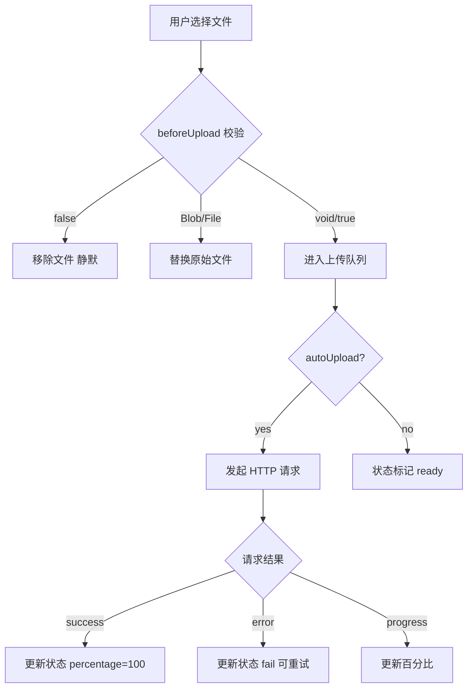
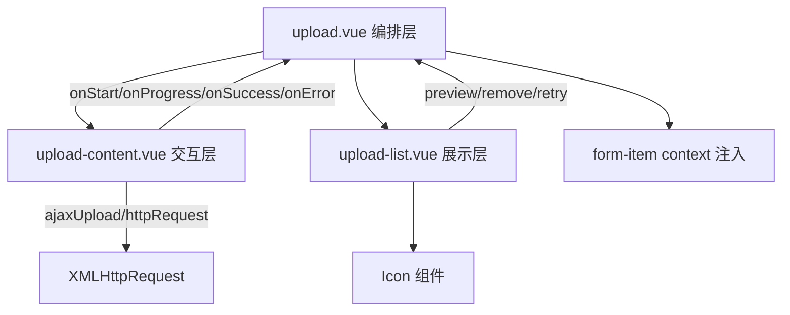
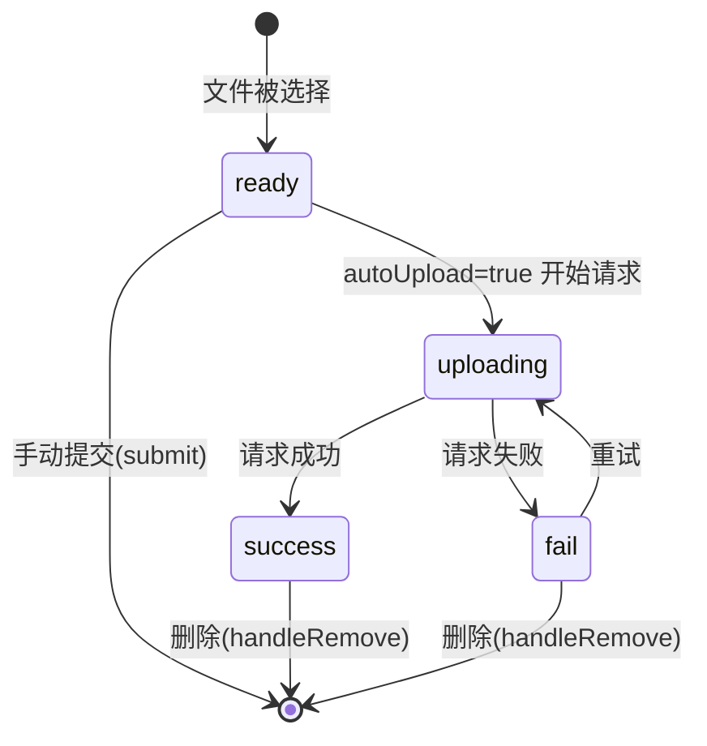
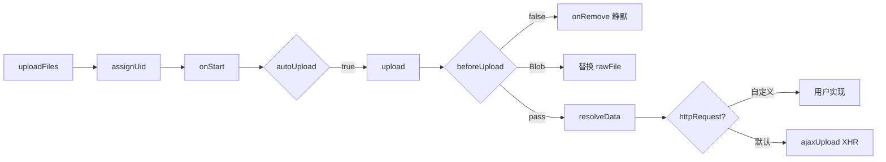

# 50 Upload 上传

> 导读：Upload 是面向企业级文件上传场景的组件，将文件选择、拖拽上传、进度追踪与列表管理融为一体，通过分层架构将交互触发与状态编排解耦，让开发者只需关注业务回调。

## 设计哲学

- **分层解耦**：Upload 组件由三层组成——Upload（编排层）负责文件生命周期管理，UploadContent（交互层）负责文件选择与 HTTP 请求，UploadList（展示层）负责文件列表渲染。每一层职责单一、可独立替换。
- **可插拔请求**：默认提供基于 XMLHttpRequest 的 `ajaxUpload` 实现，同时支持通过 `httpRequest` prop 完全替换为自定义上传逻辑（如 SDK 封装、第三方 COS/OSS 客户端）。
- **预览 URL 管理**：组件内部维护 `generatedObjectUrls` Map，自动为本地文件生成 `URL.createObjectURL` 并在移除时调用 `revokeObjectURL`，防止内存泄漏。



## 源码架构

### 文件结构

```
packages/components/upload/
├── index.ts              # 导出 XyUpload + 类型
├── src/
│   ├── upload.ts         # 类型定义 + ajaxUpload + genFileId
│   ├── upload.vue        # 编排层：文件生命周期管理
│   ├── upload-content.vue # 交互层：文件选择 + HTTP 请求
│   └── upload-list.vue   # 展示层：文件列表渲染
└── __tests__/
    └── upload.spec.ts
```

### 组件关系图



### 核心 type 定义

```typescript
type UploadStatus = "ready" | "uploading" | "success" | "fail"
type UploadListType = "text" | "picture" | "picture-card"

interface UploadFileItem {
  uid: string
  name: string
  size: number
  type?: string
  status?: UploadStatus
  percentage?: number
  response?: unknown
  url?: string
  raw?: UploadRawFile
}

interface UploadRequestOptions {
  action: string
  method: string
  data: Record<string, unknown>
  filename: string
  file: UploadRawFile
  headers: Record<string, string | number | boolean | null | undefined>
  withCredentials: boolean
  onProgress: (event: UploadProgressEvent) => void
  onSuccess: (response: unknown) => void
  onError: (error: Error) => void
}
```

## 核心实现

### 文件生命周期编排

Upload.vue 是编排层，通过 `shallowRef<UploadFileItem[]>` 维护文件列表，统一管理文件从"选择"到"完成/失败"的完整生命周期。

**WHY：** 文件状态散落在 HTTP 请求回调中，如果由 UploadContent 直接管理会导致交互层既管请求又管状态，职责混乱。编排层统一管理使得 `beforeRemove`、`onChange` 等回调能拿到完整的 `displayFiles`，而非请求中间态。

```typescript
// upload.vue — 核心生命周期方法
async function handleStart(rawFile: UploadRawFile) {
  const nextFile = normalizeFileItem({ uid: rawFile.uid, ... })
  const nextFiles = files.value.concat(nextFile)
  const displayFiles = await syncFileList(nextFiles)
  emitChangeEvent(nextFile, displayFiles)
}

async function handleSuccess(response: unknown, rawFile: UploadRawFile) {
  const nextFiles = await updateFile(rawFile.uid, {
    status: "success", percentage: 100, response
  })
  // ... 回调通知
}
```



### 预览 URL 管理

组件使用 `generatedObjectUrls` Map 来追踪通过 `URL.createObjectURL` 生成的预览链接。

**WHY：** `URL.createObjectURL` 不会自动回收，若不调用 `revokeObjectURL` 会导致浏览器内存泄漏。组件在文件移除和组件卸载时统一清理。

```typescript
// upload.vue — 预览 URL 生命周期
function ensurePreviewUrl(file: UploadFileItem) {
  // 已有外部 url → 优先使用，同时清理旧 objectURL
  if (file.url) { revokePreviewUrl(file); return file.url }
  // 本地图片文件 → 生成 objectURL 并缓存
  const previewUrl = URL.createObjectURL(file.raw)
  generatedObjectUrls.set(file.uid, { url: previewUrl, raw: file.raw })
  return previewUrl
}

onBeforeUnmount(() => {
  abort()
  files.value.forEach(revokePreviewUrl) // 组件卸载时统一回收
})
```

### 可插拔上传请求

UploadContent 默认使用 `ajaxUpload`，但可通过 `httpRequest` prop 替换。

**WHY：** 企业场景中上传往往不走通用 HTTP 请求，而是使用 OSS SDK、COS SDK 或自定义签名逻辑。`httpRequest` 让开发者只需实现 `UploadRequestOptions → XMLHttpRequest | Promise | void` 的接口即可替换。

```typescript
// upload-content.vue — 请求分发
const request = (props.httpRequest ?? ajaxUpload)(requestOptions)

if (request instanceof XMLHttpRequest || request instanceof Promise) {
  requests.value[nextRawFile.uid] = { rawFile, request, canceled: false }
}
```



### picture-card 模式

当 `listType="picture-card"` 时，UploadList 以卡片网格展示，UploadContent 作为追加项嵌入列表尾部，实现"触发器 + 已上传卡片"的一体化视觉。

```vue
<!-- upload.vue — picture-card 模式渲染 -->
<upload-list v-if="isPictureCard && props.showFileList" ...>
  <template #append>
    <upload-content ref="uploadRef" ...>
      <div v-else class="xy-upload__picture-card-trigger">
        <span class="xy-upload__picture-card-plus">+</span>
        <small>上传</small>
      </div>
    </upload-content>
  </template>
</upload-list>
```

### 拖拽与粘贴上传

UploadContent 支持三种文件输入方式：点击选择、拖拽放入、粘贴上传。拖拽通过 `dragover/dragleave/drop` 事件驱动，粘贴通过 `paste` 事件截取 `clipboardData.files`。

```typescript
// upload-content.vue — 拖拽上传
async function handleDrop(event: DragEvent) {
  if (!props.drag || props.disabled) return
  isDragOver.value = false
  await uploadFiles(Array.from(event.dataTransfer?.files ?? []))
}

// 粘贴上传
async function handlePaste(event: ClipboardEvent) {
  if (!props.paste || props.disabled) return
  const files = Array.from(event.clipboardData?.files ?? [])
  if (!files.length) return
  event.preventDefault()
  await uploadFiles(files)
}
```

### ajaxUpload 默认实现

`ajaxUpload` 使用原生 XMLHttpRequest 实现，支持进度监听、响应 JSON 解析和错误处理。当 `action` 为空或 `#` 时，走模拟上传（0ms 延迟直接成功）。

**WHY：** 开发阶段经常没有后端接口可用，`action="#"` 的模拟上传让开发者无需配置即可验证交互流程。

```typescript
// upload.ts — ajaxUpload
export function ajaxUpload(options: UploadRequestOptions) {
  if (!options.action || options.action === "#") {
    return new Promise((resolve) => {
      window.setTimeout(() => {
        options.onProgress({ ...percent: 100 } as UploadProgressEvent)
        options.onSuccess({ ok: true })
        resolve({ ok: true })
      }, 0)
    })
  }
  // ... XMLHttpRequest 实现
}
```

### 请求取消机制

UploadContent 维护 `requests` 对象追踪每个文件的请求，`abort()` 方法通过标记 `canceled=true` 并调用 `xhr.abort()` 实现请求取消。

**WHY：** 文件上传可能需要中途取消（用户删除文件、组件卸载）。`canceled` 标志位确保即使 `abort()` 后仍有异步回调到达，也不会触发已取消请求的 success/error 处理。

```typescript
// upload-content.vue — 请求取消
function abort(file?: UploadFileItem) {
  const entries = Object.entries(requests.value)
    .filter(([uid]) => file ? file.uid === uid : true)

  entries.forEach(([uid, requestRecord]) => {
    requestRecord.canceled = true
    delete requests.value[uid]
    if (requestRecord.request instanceof XMLHttpRequest) {
      requestRecord.request.abort()
    }
    void props.onError(new Error("上传已取消"), requestRecord.rawFile)
  })
}
```

## API 参考

### Props

| 属性 | 类型 | 默认值 | 说明 |
|------|------|--------|------|
| fileList | `UploadFileItem[]` | `[]` | 已上传文件列表（支持 v-model） |
| action | `string` | `"#"` | 上传地址，`#` 时走模拟上传 |
| headers | `Record<string, ...>` | `{}` | 请求头 |
| method | `string` | `"post"` | 请求方法 |
| data | `Awaitable<Record<string, unknown>> \| ((file) => Awaitable<...>)` | `{}` | 附加请求参数，支持异步函数 |
| name | `string` | `"file"` | 文件字段名 |
| accept | `string` | `""` | 接受的文件类型 |
| multiple | `boolean` | `false` | 是否支持多选 |
| limit | `number` | — | 最大文件数量 |
| disabled | `boolean` | `false` | 是否禁用 |
| drag | `boolean` | `false` | 是否启用拖拽上传 |
| directory | `boolean` | `false` | 是否支持文件夹上传 |
| paste | `boolean` | `false` | 是否启用粘贴上传 |
| tip | `string` | `""` | 提示文案 |
| size | `ComponentSize` | — | 尺寸 |
| autoUpload | `boolean` | `true` | 选择后自动上传 |
| showFileList | `boolean` | `true` | 是否显示文件列表 |
| withCredentials | `boolean` | `false` | 是否携带跨域凭证 |
| listType | `UploadListType` | `"text"` | 列表样式类型 |
| beforeUpload | `(file) => Awaitable<boolean \| void \| File \| Blob>` | — | 上传前校验 |
| beforeRemove | `(file, files) => Awaitable<boolean>` | — | 删除前校验 |
| httpRequest | `UploadRequestHandler` | — | 自定义上传实现 |

### 事件回调

| 回调 | 参数 | 说明 |
|------|------|------|
| onRemove | `(file, files)` | 文件删除时触发 |
| onChange | `(file, files)` | 文件状态变化时触发 |
| onPreview | `(file)` | 点击预览时触发 |
| onSuccess | `(response, file, files)` | 上传成功时触发 |
| onProgress | `(event, file, files)` | 上传进度更新时触发 |
| onError | `(error, file, files)` | 上传失败时触发 |
| onExceed | `(files, fileList)` | 超出限制时触发 |

### Slots

| 名称 | 作用域参数 | 说明 |
|------|-----------|------|
| default | — | 上传触发器内容 |
| trigger | — | 自定义触发按钮 |
| tip | — | 自定义提示文案 |
| file | `{ file, index }` | 自定义文件列表项 |

### Exposes

| 方法 | 参数 | 说明 |
|------|------|------|
| submit | — | 手动提交所有待上传文件 |
| abort | `(file?)` | 取消上传请求 |
| clearFiles | — | 清空所有文件 |
| handleStart | `(rawFile)` | 手动添加文件 |
| handleRemove | `(file, options?)` | 手动移除文件 |

## 样式系统

### BEM 类名

| 类名 | 层级 | 说明 |
|------|------|------|
| `xy-upload` | Block | 上传组件根容器 |
| `xy-upload--sm/md/lg` | Block modifier | 尺寸变体 |
| `xy-upload.is-drag` | State | 拖拽模式 |
| `xy-upload.is-disabled` | State | 禁用状态 |
| `xy-upload.is-error` | State | 校验错误 |
| `xy-upload__content` | Element | 交互触发区 |
| `xy-upload__content--text/picture/picture-card` | Element modifier | 列表类型 |
| `xy-upload__trigger` | Element | 拖拽/点击区域 |
| `xy-upload__input` | Element | 隐藏 file input |
| `xy-upload__tip` | Element | 提示文案 |
| `xy-upload__picture-card-trigger` | Element | 卡片模式触发器 |
| `xy-upload__picture-card-plus` | Element | 卡片模式加号图标 |
| `xy-upload__preview` | Element | 图片预览遮罩 |
| `xy-upload__preview-shell` | Element | 预览弹窗 |
| `xy-upload__preview-image` | Element | 预览图片 |
| `xy-upload__preview-close` | Element | 预览关闭按钮 |
| `xy-upload-list` | Block | 文件列表组件 |
| `xy-upload-list--text/picture/picture-card` | Block modifier | 列表类型 |
| `xy-upload-list__card` | Element | 卡片项 |
| `xy-upload-list__card-mask` | Element | 卡片操作遮罩 |
| `xy-upload-list__card-actions` | Element | 卡片操作按钮组 |
| `xy-upload-list__item` | Element | 文本列表项 |
| `xy-upload-list__meta` | Element | 文件元信息 |
| `xy-upload-list__progress-bar` | Element | 进度条 |
| `xy-upload-list__actions` | Element | 文件操作按钮组 |

### CSS 变量

组件样式通过 CSS 变量支持主题定制，变量命名遵循 `--xy-upload-*` 规范，可在全局或组件级别覆盖。

## 小结

1. **三层分离架构**：编排层（状态） / 交互层（请求） / 展示层（列表）职责清晰，任何一层可独立替换而不影响其他层。
2. **可插拔请求引擎**：`httpRequest` prop 让上传逻辑完全可替换，`ajaxUpload` 默认实现满足 90% 场景，剩下 10% 只需实现一个函数。
3. **预览 URL 自动回收**：`generatedObjectUrls` Map + `revokeObjectURL` 在文件移除与组件卸载时统一清理，杜绝浏览器内存泄漏。