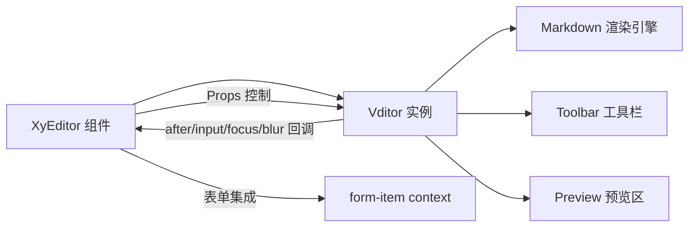
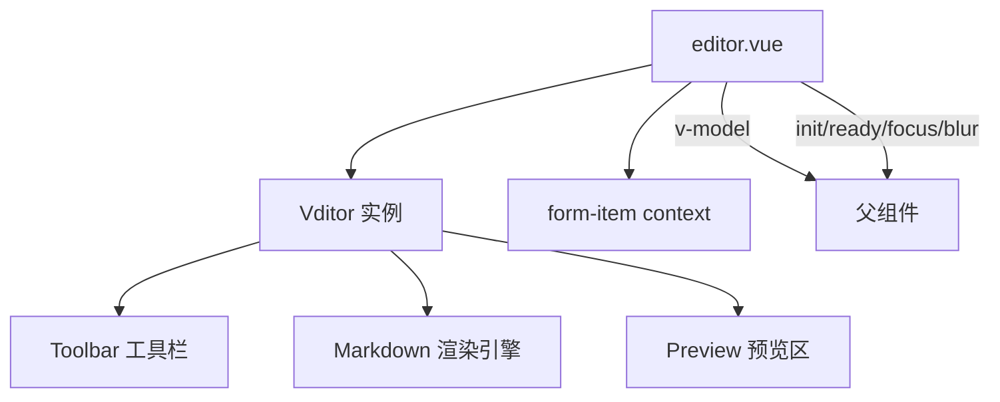
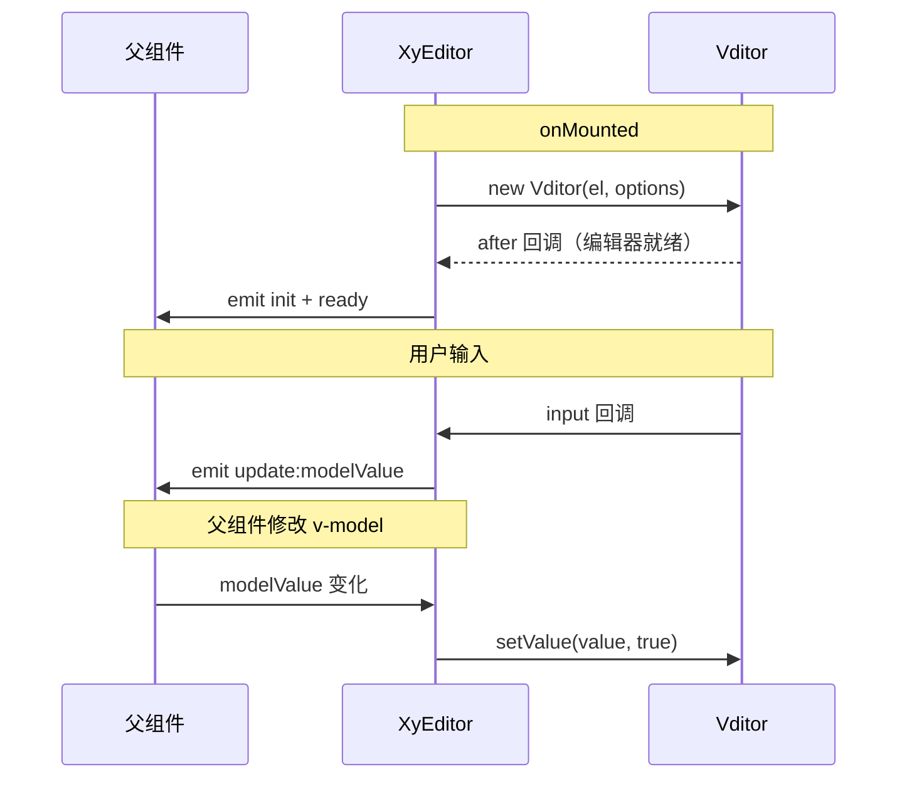
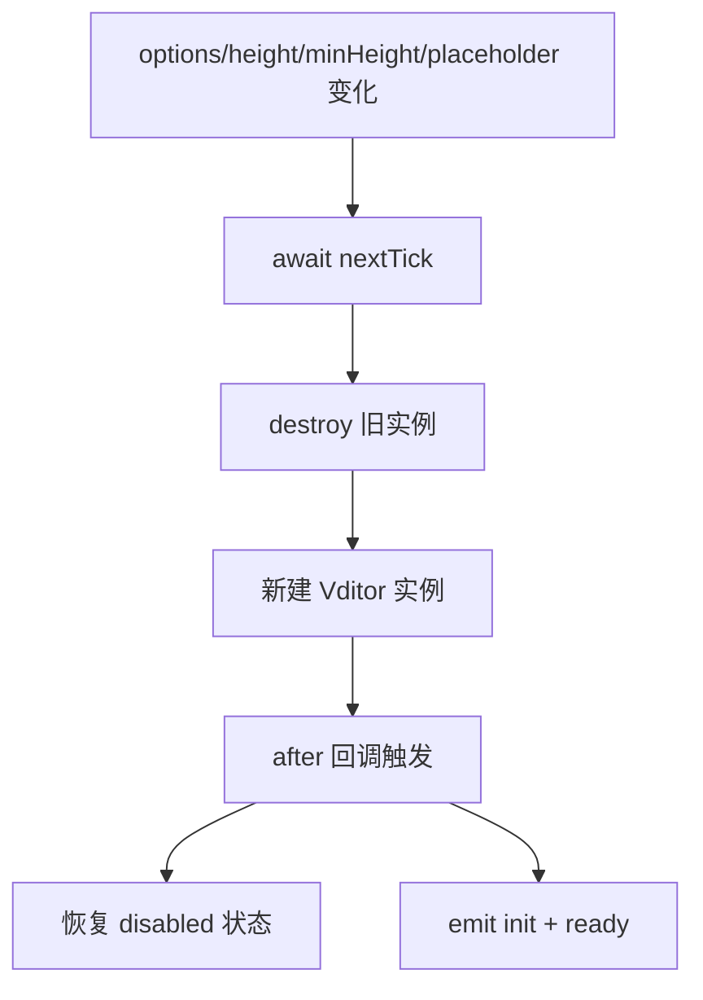
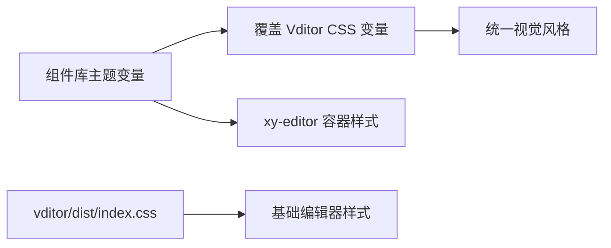

# 51 Editor 编辑器

> 导读：Editor 是基于 Vditor 封装的企业级 Markdown 编辑器组件，通过声明式 v-model、自动实例回收与深度事件代理，让 Vue 3 项目以零配置获得所见即所得编辑能力。

## 设计哲学

- **零配置可用**：组件内置 Vditor 默认选项，只需 `<XyEditor v-model="content" />` 即可开箱使用，无需手动管理 Vditor 实例生命周期。
- **桥接而非重写**：Editor 在 Vditor 之上做 Vue 3 桥接层——将 Vditor 的命令式 API 转为声明式 Props/Emits，将 Vditor 回调转为 Vue 事件，将实例生命周期与组件生命周期自动绑定。
- **安全回收**：Vditor 实例持有 DOM 引用和事件监听器，若不正确销毁会导致内存泄漏。组件在 `onBeforeUnmount` 中自动调用 `destroy()`，同时在 options 变更时先销毁旧实例再重建。



## 源码架构

### 文件结构

```
packages/components/editor/
├── index.ts            # 导出 XyEditor + 类型
├── src/
│   ├── editor.ts       # 类型定义
│   └── editor.vue      # 组件实现
└── __tests__/
    └── editor.spec.ts
```

### 组件关系图



### 核心 type 定义

```typescript
import type Vditor from "vditor"

interface EditorOptions {
  [key: string]: unknown
}

interface EditorProps {
  modelValue?: string
  options?: EditorOptions
  placeholder?: string
  height?: string | number
  minHeight?: string | number
  disabled?: boolean
}

interface EditorInstance {
  editor: Vditor | null
  getValue: () => string
  setValue: (value: string, clearStack?: boolean) => void
  focus: () => void
}
```

## 核心实现

### Vditor 实例初始化与 v-model 桥接

组件在 `onMounted` 时创建 Vditor 实例，通过 `after` 回调确认编辑器就绪，再通过 `input` 回调代理为 Vue 的 `update:modelValue` 事件。

**WHY：** Vditor 是命令式库，其初始化是异步的（`after` 回调才表示就绪）。Vue 3 的响应式系统需要 `v-model` 双向绑定。桥接层在 Vditor 回调和 Vue 响应式之间做双向同步。

```typescript
// editor.vue — 实例初始化
const editorRef = ref<Vditor | null>(null)
const rootRef = ref<HTMLDivElement | null>(null)
const cacheId = `xy-editor-${Math.random().toString(36).slice(2, 10)}`

function createOptions() {
  return {
    cache: { enable: false, id: cacheId },
    minHeight: typeof props.minHeight === "number" ? props.minHeight : 360,
    height: props.height,
    placeholder: props.placeholder,
    value: props.modelValue,
    after: () => {
      queueMicrotask(() => {
        if (props.disabled) editorRef.value?.disabled()
        if (props.modelValue && editorRef.value?.getValue() !== props.modelValue) {
          editorRef.value?.setValue(props.modelValue, true)
        }
        if (editorRef.value) {
          emit("init", editorRef.value)
          emit("ready", editorRef.value)
        }
      })
    },
    input: (value: string) => {
      emit("update:modelValue", value)
    },
    focus: () => { emit("focus") },
    blur: (value: string) => { emit("blur", value) },
    ...props.options
  }
}

function createEditor() {
  if (!rootRef.value) return
  editorRef.value?.destroy()
  editorRef.value = new Vditor(rootRef.value, createOptions())
}
```



### 安全实例回收

Vditor 实例持有大量 DOM 引用和事件监听器，必须正确销毁。组件在两种场景下执行回收：组件卸载和配置变更重建。

**WHY：** 若不调用 `destroy()`，Vditor 保留的 DOM 节点和事件监听器不会被 GC 回收，在 SPA 中反复进入/离开编辑页面会导致严重内存泄漏。

```typescript
// editor.vue — 实例回收
onBeforeUnmount(() => {
  editorRef.value?.destroy()
  editorRef.value = null
})

// 配置变更时重建
watch(
  () => [props.options, props.height, props.minHeight, props.placeholder] as const,
  async () => {
    await nextTick()
    createEditor()
  },
  { deep: true }
)
```



### disabled 状态动态切换

组件通过 watch 监听 `disabled` prop 变化，调用 Vditor 的 `disabled()` / `enable()` 方法动态切换编辑状态。

**WHY：** 表单场景中编辑器常需要根据业务逻辑动态切换可编辑/只读状态（如审批流中"未审批可编辑，已审批只读"），且 Vditor 不提供 Prop 级别的 disabled 控制。

```typescript
// editor.vue — disabled 动态切换
watch(
  () => props.disabled,
  (disabled) => {
    if (!editorRef.value) return
    if (disabled) {
      editorRef.value.disabled()
      return
    }
    editorRef.value.enable()
  }
)
```

### v-model 双向同步

组件通过 watch 监听 `modelValue` 变化，当外部值与 Vditor 内部值不一致时，调用 `setValue` 同步内容。

**WHY：** 表单回填、草稿恢复等场景需要父组件主动设置编辑器内容。`setValue(value, true)` 的第二个参数 `clearStack=true` 确保历史栈被清空，避免用户按 Ctrl+Z 时撤销到之前的状态。

```typescript
// editor.vue — v-model 同步
watch(
  () => props.modelValue,
  (value) => {
    if (!editorRef.value) return
    if (value === editorRef.value.getValue()) return
    editorRef.value.setValue(value, true)
  }
)
```

### Exposes 方法封装

组件将 Vditor 实例和常用方法通过 `defineExpose` 暴露，让开发者可通过 ref 获取。

```typescript
// editor.vue — Exposes
defineExpose({
  editor: editorRef,
  getValue,
  setValue,
  focus
})
```

## API 参考

### Props

| 属性 | 类型 | 默认值 | 说明 |
|------|------|--------|------|
| modelValue | `string` | `""` | 编辑器内容（支持 v-model） |
| options | `EditorOptions` | `{}` | Vditor 初始化选项（透传） |
| placeholder | `string` | `""` | 占位提示文案 |
| height | `string \| number` | `"auto"` | 编辑器高度 |
| minHeight | `string \| number` | `360` | 编辑器最小高度 |
| disabled | `boolean` | `false` | 是否禁用编辑 |

### Emits

| 事件 | 参数 | 说明 |
|------|------|------|
| update:modelValue | `(value: string)` | 内容变化时触发 |
| init | `(editor: Vditor)` | Vditor 实例初始化完成时触发 |
| ready | `(editor: Vditor)` | 编辑器就绪时触发（与 init 同时） |
| focus | `()` | 编辑器获得焦点时触发 |
| blur | `(value: string)` | 编辑器失去焦点时触发 |

### Slots

| 名称 | 作用域参数 | 说明 |
|------|-----------|------|
| — | — | 编辑器不支持插槽，内容完全由 v-model 驱动 |

### Exposes

| 方法/属性 | 类型 | 说明 |
|-----------|------|------|
| editor | `Vditor \| null` | Vditor 原始实例引用 |
| getValue | `() => string` | 获取当前编辑器内容 |
| setValue | `(value: string, clearStack?: boolean) => void` | 设置编辑器内容 |
| focus | `() => void` | 聚焦编辑器 |

## 样式系统

### BEM 类名

| 类名 | 层级 | 说明 |
|------|------|------|
| `xy-editor` | Block | 编辑器根容器 |
| `xy-editor__surface` | Element | Vditor 挂载的 DOM 容器 |

### CSS 变量

组件样式通过 CSS 变量支持主题定制，变量命名遵循 `--xy-editor-*` 规范。Vditor 自身样式通过 `vditor/dist/index.css` 引入，组件库可覆盖其 CSS 变量以统一视觉风格。



## 小结

1. **桥接模式**：在 Vditor 命令式 API 之上构建声明式 Vue 3 桥接层，开发者用 `v-model` 即可驱动 Markdown 编辑器，无需手动管理实例。
2. **安全实例回收**：`onBeforeUnmount` + 配置变更重建确保 Vditor 实例始终被正确销毁，杜绝 SPA 场景下的内存泄漏。
3. **配置变更重建**：当 options/height/minHeight/placeholder 等关键配置变更时，组件自动销毁旧实例并重建，确保 Vditor 状态与 Props 始终一致。