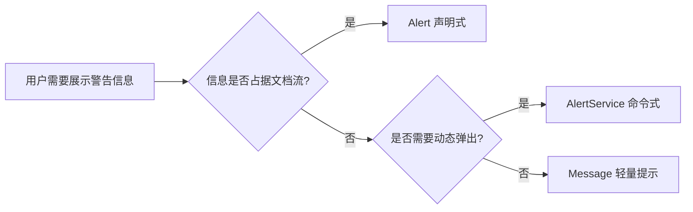
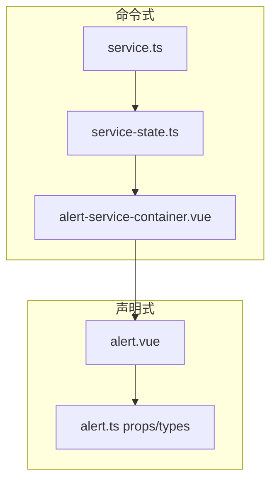
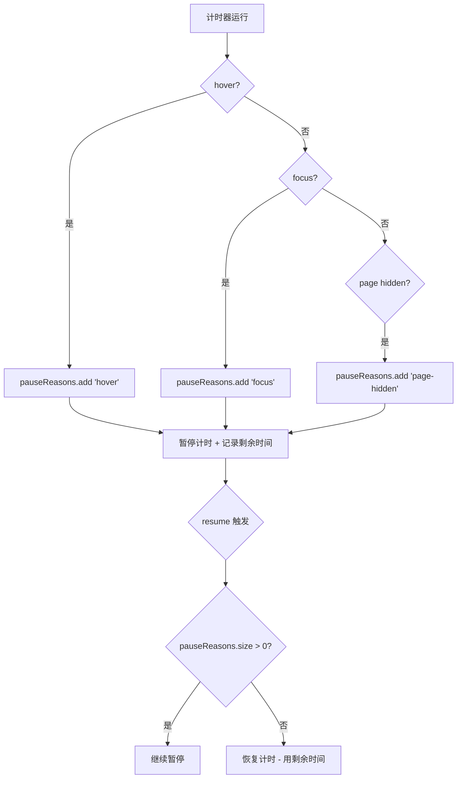
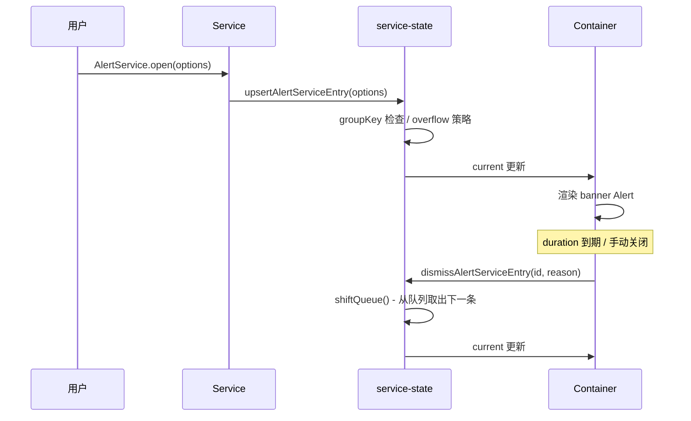

# 52 Alert 警告

> 导读：Alert 是页面级静态警告信息承载组件，用于向用户传达重要提示、警告或错误状态，支持声明式与命令式两种调用模式，以及自动关闭暂停、长文本折叠等企业级特性

## 设计哲学

Alert 解决的核心问题是：**在页面流中嵌入一条不可忽略的上下文感知提示信息**。它不同于 Message 的轻量浮层，Alert 是文档流的一部分，占据布局空间，确保用户在阅读页面内容时必然看到。

设计决策上做了以下取舍：

- **双模式并存** — 声明式（`<xy-alert>`）和命令式（`XyAlertService.open()`）两种调用方式。声明式适合固定位置提示，命令式适合动态弹出场景，两种模式的组件实例共享同一套模板逻辑
- **三变体布局** — `default` / `banner` / `card` 三种视觉形态，default 是经典横向布局，banner 强调行动按钮，card 更适合独立区块嵌入
- **暂停机制三维度** — `pauseOnHover` / `pauseOnFocus` / `pauseOnPageHidden` 三种暂停维度独立叠加，用 `Set<"hover" | "focus" | "page-hidden">` 聚合，任意维度激活即可暂停计时器
- **长文本折叠** — `collapsible` + `lineClamp` 组合，避免长描述撑破布局，同时保留完整信息可达性



与同类组件库的差异化：
- 提供 `XyAlertService` 完整命令式调用链路，返回 `AlertServiceHandle` 可精细控制关闭、更新与回调
- `service-state.ts` 独立管理状态池（current + queue），Service 层与视图层解耦
- 三维度暂停机制 + `beforeClose` 拦截，覆盖企业场景中对计时器精确控制的需求

## 源码架构

```
alert/
├── src/
│   ├── alert.vue                  # 主组件模板与逻辑
│   ├── alert.ts                   # 类型定义、常量映射、beforeClose 工具
│   ├── service.ts                 # 命令式 Service 入口（createApp + 挂载）
│   ├── service-state.ts           # Service 实例状态池管理
│   └── alert-service-container.vue # Service 渲染容器
└── index.ts                       # 导出与 withInstall
```



### 核心 type 定义

```ts
export type AlertType = 'primary' | 'success' | 'info' | 'warning' | 'error'
export type AlertEffect = 'light' | 'dark'
export type AlertVariant = 'default' | 'banner' | 'card'

export interface AlertProps {
  modelValue?: boolean
  title?: string
  description?: string
  type?: AlertType
  closable?: boolean
  closeText?: string
  showIcon?: boolean
  center?: boolean
  effect?: AlertEffect
  duration?: number
  size?: ComponentSize
  variant?: AlertVariant
  beforeClose?: AlertBeforeCloseFn
  pauseOnHover?: boolean
  pauseOnFocus?: boolean
  pauseOnPageHidden?: boolean
  collapsible?: boolean
  defaultExpanded?: boolean
  lineClamp?: number
}

export interface AlertServiceHandle {
  id: string
  close(): void
  update(patch: AlertServiceUpdateOptions): void
}
```

## 核心实现

### 1. 三维度暂停机制

Alert 的自动关闭计时器使用 `Set<"hover" | "focus" | "page-hidden">` 聚合暂停原因，任意维度激活即暂停，全部移除后恢复：

```ts
const pauseReasons = new Set<'hover' | 'focus' | 'page-hidden'>()

function pauseAutoClose(reason: 'hover' | 'focus' | 'page-hidden') {
  pauseReasons.add(reason)
  if (autoCloseTimer != null) {
    autoCloseRemaining = Math.max(autoCloseRemaining - elapsed, 0)
    clearAutoCloseTimer()
  }
}

function resumeAutoClose(reason: 'hover' | 'focus' | 'page-hidden') {
  pauseReasons.delete(reason)
  if (pauseReasons.size > 0) return // 还有暂停维度，不恢复
  scheduleAutoClose(autoCloseRemaining)
}
```

**WHY** — 为什么用 Set 而非布尔值？鼠标 hover 和页面 hidden 可能同时发生，布尔值无法表达叠加状态。Set 精确记录每个暂停维度，只有全部清空才恢复计时。



### 2. beforeClose 拦截

`invokeAlertBeforeClose` 是一个通用拦截器，支持同步和异步两种拦截方式：

```ts
export function invokeAlertBeforeClose(
  beforeClose: AlertBeforeCloseFn | undefined,
  onProceed: () => void
) {
  if (!beforeClose) { onProceed(); return }

  let finished = false
  const done: AlertDoneFn = (cancel?) => {
    if (finished) return
    finished = true
    if (cancel) return
    onProceed()
  }

  const result = beforeClose(done)
  if (result && typeof result.catch === 'function') {
    result.catch(() => { finished = true })
  }
}
```

**WHY** — 为什么用 `done(cancel?)` 而非 Promise？因为 `beforeClose` 可能是同步的（如 `done()` 立即调用），也可能是异步的（如请求确认后调用）。`done` 函数模式兼容两种场景，比 `return false` 更灵活。

### 3. AlertService 状态池

`service-state.ts` 管理一个 `current + queue` 结构，当前展示一条，队列排队后续：

```ts
export const alertServiceState = reactive<{
  current: AlertServiceEntry | null
  queue: AlertServiceEntry[]
}>({ current: null, queue: [] })

export function upsertAlertServiceEntry(options: AlertServiceOptions) {
  // groupKey 匹配：同组更新已有条目而非新增
  if (options.groupKey !== undefined) {
    const matched = getEntryByGroupKey(options.groupKey)
    if (matched) { patchAlertServiceEntry(matched, options); return matched }
  }
  // overflow 策略：drop-oldest 或 drop-newest
  if (maxQueue !== null && queue.length >= maxQueue) {
    if (overflowStrategy === 'drop-oldest') dismissQueuedEntryByIndex(0, 'overflow')
    else invokeAlertServiceClosed(entry, 'overflow')
  }
}
```

**WHY** — 为什么用 `current + queue` 而非数组？因为 Alert 一次只展示一条（banner 模式），current 是当前可见的，queue 是排队的，切换时自然从队列头部取出。



## API 参考

### Props

| 属性 | 类型 | 默认值 | 说明 |
|------|------|--------|------|
| modelValue | `boolean` | — | 受控模式下的可见性 |
| title | `string` | `''` | 标题文本 |
| description | `string` | `''` | 辅助描述文本 |
| type | `AlertType` | `'info'` | 语义类型 |
| closable | `boolean` | `true` | 是否可关闭 |
| closeText | `string` | `''` | 关闭按钮自定义文本 |
| showIcon | `boolean` | `false` | 是否显示类型图标 |
| center | `boolean` | `false` | 文字是否居中 |
| effect | `AlertEffect` | `'light'` | 主题模式 |
| duration | `number` | `0` | 自动关闭延迟(ms)，0 不自动关闭 |
| size | `ComponentSize` | — | 尺寸 |
| variant | `AlertVariant` | `'default'` | 布局变体 |
| beforeClose | `AlertBeforeCloseFn` | — | 关闭前拦截 |
| pauseOnHover | `boolean` | `false` | hover 暂停自动关闭 |
| pauseOnFocus | `boolean` | `false` | focus 暂停自动关闭 |
| pauseOnPageHidden | `boolean` | `false` | 页面隐藏暂停自动关闭 |
| collapsible | `boolean` | `false` | 长描述是否可折叠 |
| defaultExpanded | `boolean` | `false` | 默认展开状态 |
| lineClamp | `number` | `2` | 折叠时最大行数 |

### Emits

| 事件 | 参数 | 说明 |
|------|------|------|
| close | `(event: MouseEvent)` | 手动关闭触发 |
| update:modelValue | `(value: boolean)` | 受控模式值更新 |
| auto-close | — | 自动关闭触发 |

### Slots

| 插槽 | 说明 |
|------|------|
| title | 自定义标题内容 |
| default | 自定义描述内容 |
| icon | 自定义图标 |
| actions | 操作按钮区域 |

### AlertService Methods

| 方法 | 参数 | 返回值 | 说明 |
|------|------|--------|------|
| open | `AlertServiceOptions` | `AlertServiceHandle` | 打开一个 Alert |
| getState | — | `AlertServiceSnapshot` | 获取当前状态快照 |
| closeAll | — | — | 关闭所有 |

### AlertServiceOptions

| 属性 | 类型 | 默认值 | 说明 |
|------|------|--------|------|
| groupKey | `string` | — | 分组标识，同组更新而非新增 |
| appendTo | `string \| HTMLElement` | `'body'` | 挂载容器 |
| maxQueue | `number` | — | 队列最大长度 |
| overflowStrategy | `'drop-oldest' \| 'drop-newest'` | `'drop-oldest'` | 队列溢出策略 |
| onClosed | `AlertServiceClosedFn` | — | 关闭回调（含原因） |

## 样式系统

### BEM 类名

| 类名 | 说明 |
|------|------|
| `xy-alert` | 根元素 |
| `xy-alert--primary/success/info/warning/error` | 类型修饰符 |
| `xy-alert--default/banner/card` | 变体修饰符 |
| `xy-alert--sm/lg` | 尺寸修饰符 |
| `xy-alert.is-light` | light 主题状态 |
| `xy-alert.is-dark` | dark 主题状态 |
| `xy-alert.is-paused` | 暂停态状态 |
| `xy-alert.is-center` | 居中状态 |
| `xy-alert__icon` | 图标区域 |
| `xy-alert__main` | 主体区域 |
| `xy-alert__content` | 内容区域 |
| `xy-alert__title` | 标题 |
| `xy-alert__description` | 描述 |
| `xy-alert__toggle` | 展开/折叠按钮 |
| `xy-alert__actions` | 操作按钮区域 |
| `xy-alert__actions--banner` | banner 变体操作区 |
| `xy-alert__close-btn` | 关闭按钮 |

### CSS 变量

```css
--xy-alert-padding
--xy-alert-border-radius
--xy-alert-gap
--xy-alert-content-gap
--xy-alert-actions-gap
--xy-alert-title-font-size
--xy-alert-title-with-description-font-size
--xy-alert-description-font-size
--xy-alert-icon-size
--xy-alert-icon-large-size
--xy-alert-close-font-size
--xy-alert-toggle-font-size
--xy-alert-line-clamp
--xy-alert-text-color
--xy-alert-title-color
--xy-alert-accent-color
--xy-alert-bg-color
--xy-alert-border-color
--xy-alert-description-color
--xy-alert-close-color
--xy-alert-toggle-color
--xy-alert-service-top
--xy-alert-service-max-width
--xy-alert-service-z-index
```

### 主题定制

```css
:root {
  --xy-alert-border-radius: 8px;
  --xy-alert-padding: 12px 20px;
}
```

暗色变体通过 `effect="dark"` 或覆盖 CSS 变量实现：

```css
.xy-alert.is-dark {
  --xy-alert-title-color: color-mix(in srgb, var(--xy-bg-floating) 96%, var(--xy-mix-light));
  border-color: transparent;
  background: color-mix(in srgb, var(--xy-text-heading) 84%, var(--xy-alert-accent-color));
}
```

## 小结

1. **三维度暂停机制** — hover / focus / page-hidden 三维度用 Set 聚合，精确控制计时器暂停与恢复
2. **current + queue 状态池** — Service 层独立管理一条展示 + 多条排队，溢出时可选择丢弃最老或最新
3. **beforeClose 拦截器** — `done(cancel?)` 函数模式兼容同步与异步拦截，比布尔值更灵活