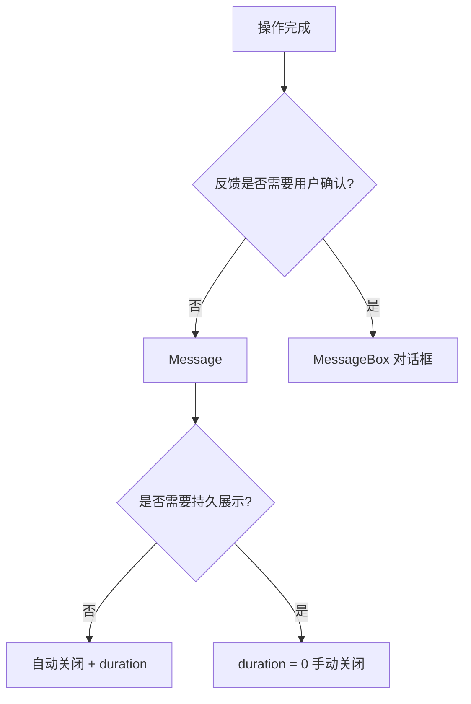
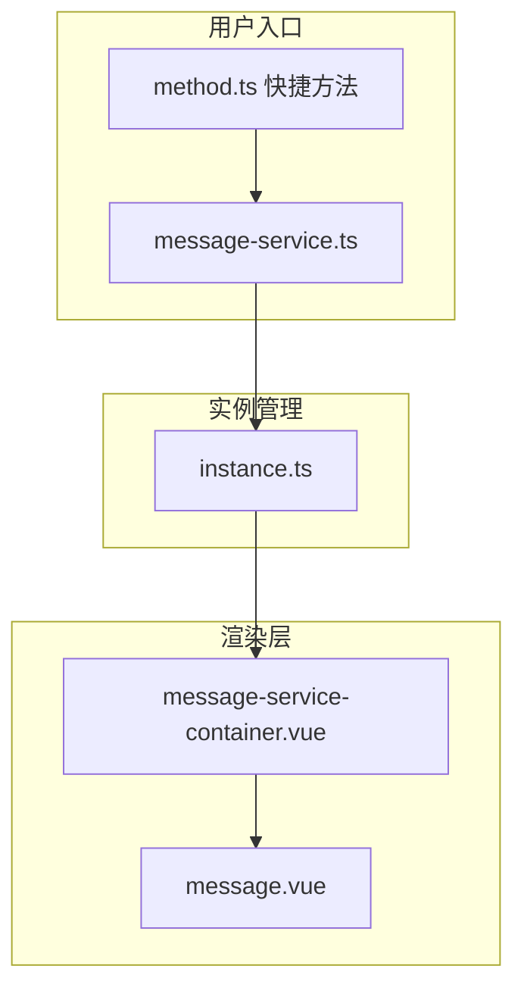
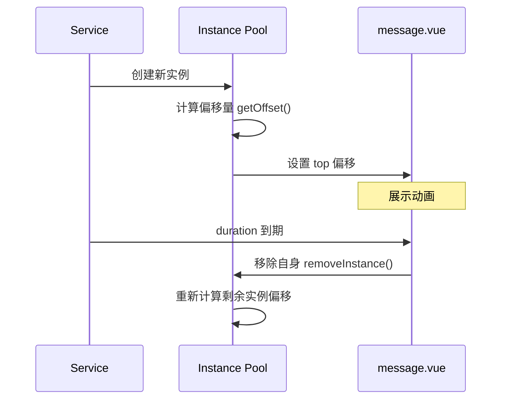

# 53 Message 消息提示

> 导读：Message 是轻量级全局反馈组件，用于操作后的短暂提示，自动消失且不中断用户流程，支持堆叠排列、分组归并和类型快捷方法

## 设计哲学

Message 解决的核心问题是：**在用户完成操作后给予即时、轻量的反馈，且不阻塞后续交互**。它不是对话框，不需要用户确认，是"告知即走"的设计理念。

设计决策：

- **函数式调用优先** — `Message()` / `Message.success()` 的 API 设计比声明式更贴合使用场景。消息提示本质是命令式的"触发-展示-消失"流程
- **实例堆叠管理** — 多条消息垂直堆叠，`instance.ts` 统一管理偏移量计算，每新增/移除一条消息都要重新排列所有实例
- **全类型快捷方法** — `Message.success()` / `Message.warning()` / `Message.info()` / `Message.error()` 快捷方法减少配置代码
- **grouping 归并** — 相同内容的消息自动归并，避免屏幕被重复提示淹没



与同类组件库的差异：
- `method.ts` 提供完整的类型安全快捷方法，每个方法返回 `XyMessageHandler` 可手动关闭
- `instance.ts` 独立管理堆叠布局，偏移量计算与 DOM 解耦
- `grouping` 归并机制基于 message 内容匹配

## 源码架构

```
message/
├── src/
│   ├── message.vue                  # 单条消息组件
│   ├── message.ts                   # 类型定义与 props
│   ├── method.ts                    # 快捷方法（success/warning/info/error）
│   ├── message-service.ts           # Service 核心逻辑
│   ├── instance.ts                  # 实例管理（堆叠偏移）
│   └── message-service-container.vue # 渲染容器
└── index.ts
```



### 核心 type 定义

```ts
export type MessageType = 'success' | 'warning' | 'info' | 'error'

export interface MessageProps {
  id?: string
  type?: MessageType
  message?: string | VNode
  duration?: number
  showClose?: boolean
  center?: boolean
  onClose?: () => void
  offset?: number
  grouping?: boolean
}

export interface XyMessageHandler {
  close: () => void
}
```

## 核心实现

### 1. 实例堆叠 — instance.ts

每条消息需要根据上下消息计算垂直偏移量，`instance.ts` 维护所有活跃实例的引用：

```ts
const instances: ComponentInternalInstance[] = []

export function addInstance(ins: ComponentInternalInstance) {
  instances.push(ins)
}

export function removeInstance(ins: ComponentInternalInstance) {
  const idx = instances.indexOf(ins)
  if (idx !== -1) instances.splice(idx, 1)
}

export function getOffset(id: string, offset: number): number {
  let result = offset
  for (const ins of instances) {
    if (ins.props.id === id) break
    result += (ins.el?.offsetHeight || 0) + GAP
  }
  return result
}
```

**WHY** — 为什么不用 CSS 自动布局（如 flexbox）？因为每条消息独立动画，离开时需要精确控制偏移量以实现平滑上移效果，纯 CSS 无法处理动态高度变化。



### 2. 消息自动关闭 — duration 机制

`message.vue` 内部通过 `startTimer` / `clearTimer` 管理 duration：

```ts
let timer: ReturnType<typeof setTimeout> | null = null

const startTimer = () => {
  if (props.duration === 0) return
  timer = setTimeout(() => {
    close()
  }, props.duration)
}

const close = () => {
  visible.value = false
  props.onClose?.()
}

onMounted(() => startTimer())
onBeforeUnmount(() => clearTimer())
```

**WHY** — `duration = 0` 表示不自动关闭，此时必须显示关闭按钮（`showClose` 自动为 true），这是安全性兜底，防止消息成为无法移除的幽灵。

### 3. 快捷方法 — method.ts

```ts
const types = ['success', 'warning', 'info', 'error'] as const

types.forEach(type => {
  Message[type] = (options: string | MessageProps) => {
    const normalized = typeof options === 'string' ? { message: options } : options
    return MessageService({ ...normalized, type })
  }
})
```

**WHY** — 将快捷方法挂载到 `Message` 函数对象上，保持 `Message.success('ok')` 的直觉调用方式，同时不丢失 TypeScript 类型推导。参数归一化（string → MessageProps）降低了使用门槛。

### 4. grouping 归并

在 `message-service.ts` 中，当 `grouping` 为 true 时，检查已有实例是否有相同 message 内容：

```ts
if (options.grouping) {
  const existed = instances.find(ins => ins.props.message === options.message)
  if (existed) {
    // 重置已有实例的 duration，不创建新实例
    existed.resetTimer()
    return { close: () => existed.close() }
  }
}
```

**WHY** — 连续点击同一操作时，不应产生 N 条相同消息。grouping 归并后只保留一条并重置计时器，用户感知到的是"消息刷新"而非"消息堆积"。这在批量操作场景（如连续保存）中尤其重要。

### 5. 离开动画与偏移重排

当一条消息关闭时，其余消息需要平滑上移填补空位。这依赖于 `instance.ts` 的偏移重算：

```ts
// message.vue 中 close 后
watch(visible, (val) => {
  if (!val) {
    // 等待离开动画完成再移除实例
    setTimeout(() => {
      removeInstance(currentInstance)
    }, 300) // 与 CSS 过渡时间一致
  }
})
```

**WHY** — 为什么延迟移除？因为需要等待 CSS leave 过渡完成后再从实例池中移除，否则偏移重算会在动画进行中触发，导致跳跃。延迟时间必须与 CSS `transition-duration` 一致。

```mermaid
sequenceDiagram
  participant U as 用户
  participant M as Message
  participant I as Instance Pool
  participant V as message.vue
  U->>M: Message.success('保存成功')
  M->>I: 创建实例
  I->>I: 计算偏移量 getOffset()
  I->>V: 设置 top 偏移
  Note over V: 入场动画
  Note over V: 3s duration 倒计时
  V->>V: close() visible = false
  Note over V: 离场动画 300ms
  V->>I: setTimeout 后 removeInstance
  I->>I: 重算剩余实例偏移
  Note over I: 其余消息平滑上移

## API 参考

### Message Methods

| 方法 | 参数 | 返回值 | 说明 |
|------|------|--------|------|
| Message | `string \| MessageProps` | `XyMessageHandler` | 基础调用 |
| Message.success | `string \| MessageProps` | `XyMessageHandler` | 成功类型 |
| Message.warning | `string \| MessageProps` | `XyMessageHandler` | 警告类型 |
| Message.info | `string \| MessageProps` | `XyMessageHandler` | 信息类型 |
| Message.error | `string \| MessageProps` | `XyMessageHandler` | 错误类型 |

### Props（通过 MessageOptions 传入）

| 属性 | 类型 | 默认值 | 说明 |
|------|------|--------|------|
| message | `string \| VNode` | `''` | 消息内容 |
| type | `MessageType` | `'info'` | 语义类型 |
| duration | `number` | `3000` | 展示时长(ms)，0 为不自动关闭 |
| showClose | `boolean` | `false` | 是否显示关闭按钮 |
| center | `boolean` | `false` | 文字是否居中 |
| offset | `number` | `20` | 距顶偏移量 |
| grouping | `boolean` | `false` | 是否合并相同内容的消息 |
| onClose | `() => void` | — | 关闭回调 |

### XyMessageHandler

| 属性 | 类型 | 说明 |
|------|------|------|
| close | `() => void` | 手动关闭消息 |

## 样式系统

### BEM 类名

| 类名 | 说明 |
|------|------|
| `xy-message` | 根元素 |
| `xy-message--success/warning/info/error` | 类型修饰符 |
| `xy-message__content` | 消息内容区 |
| `xy-message__close-btn` | 关闭按钮 |
| `xy-message__icon` | 类型图标 |

### CSS 变量

```css
--xy-message-padding
--xy-message-border-radius
--xy-message-font-size
--xy-message-icon-size
--xy-message-close-size
--xy-message-bg-color
--xy-message-border-color
--xy-message-title-color
--xy-message-close-color
--xy-message-close-hover-color
--xy-message-shadow
```

### 主题定制

```css
:root {
  --xy-message-border-radius: 8px;
  --xy-message-shadow: 0 6px 16px 0 rgba(0, 0, 0, 0.08);
}
```

通过 CSS 变量覆盖实现品牌定制，每个语义类型也有对应的颜色变量：

```css
.xy-message--success {
  --xy-message-bg-color: var(--xy-color-success-light-9);
  --xy-message-title-color: var(--xy-color-success);
}
```

## 小结

1. **函数式优先** — 以 `Message.success()` 快捷方法为核心 API，贴合"触发-展示-消失"的命令式语义
2. **堆叠偏移计算** — `instance.ts` 独立管理实例池，精确计算垂直偏移量实现平滑堆叠动画
3. **grouping 归并** — 相同内容消息自动归并并重置计时器，避免重复消息堆积