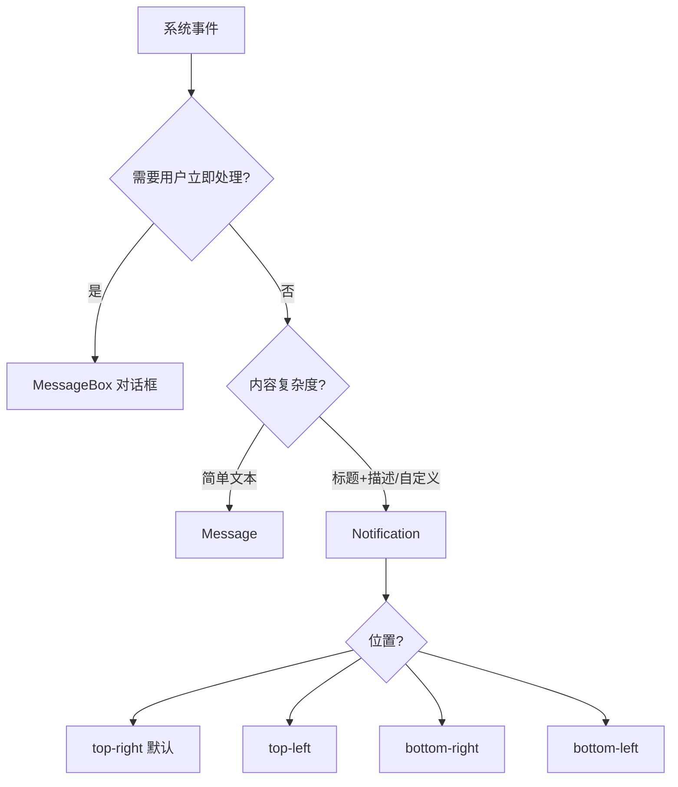
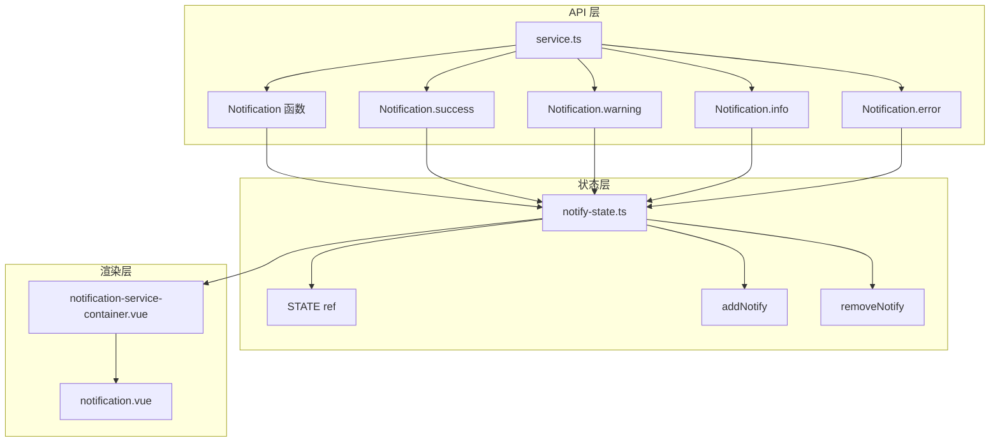
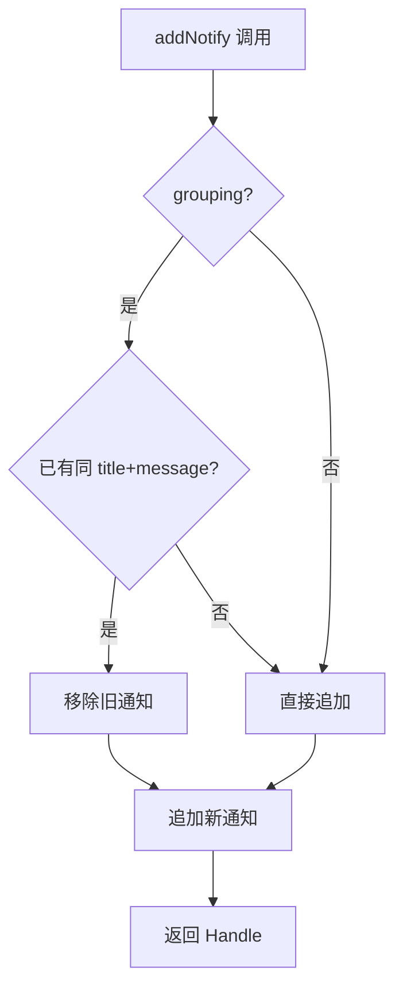
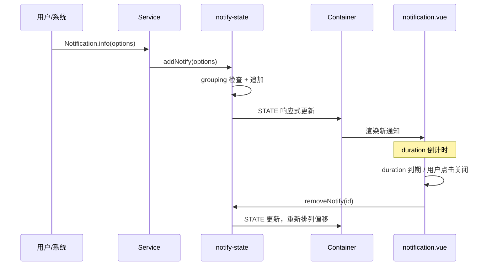

# 54 Notification 通知

> 导读：Notification 是远离操作区域的全局通知组件，用于系统级消息推送，支持自定义 HTML、四方位定位、分组归并和命令式调用

## 设计哲学

Notification 解决的核心问题是：**在页面边缘展示系统级通知，不遮挡用户当前操作区域**。它比 Message 更重，承载更丰富的内容（标题 + 描述 + 自定义 HTML），适合后台任务完成、系统消息等场景。

设计决策：

- **位置四象限** — 支持 `top-right`、`top-left`、`bottom-right`、`bottom-left` 四个方向，适配不同产品布局
- **分组归并** — 通过 `grouping` 属性将同类通知归并，避免屏幕被重复消息淹没
- **通知状态独立管理** — `notify-state.ts` 将通知池与容器解耦，支持独立增删操作
- **HTML 安全渲染** — `dangerousUseHTMLString` 命名在 API 层面强调 XSS 风险，提醒开发者谨慎使用
- **命令式快捷方法** — `Notification.success()` / `Notification.warning()` 等快捷方法减少配置代码



与同类组件库的差异：
- `notify-state.ts` 独立管理通知池状态，容器组件只负责渲染
- 原生 `grouping` 分组机制，同 title+message 的通知只保留最新一条
- 四方位定位 + offset 偏移，满足复杂布局需求

## 源码架构

```
notification/
├── src/
│   ├── notification.vue                  # 单条通知组件
│   ├── notification.ts                   # 类型定义与 props
│   ├── service.ts                        # 命令式 Service 入口 + 快捷方法
│   ├── notify-state.ts                   # 通知状态池管理
│   └── notification-service-container.vue # 渲染容器
└── index.ts
```



### 核心 type 定义

```ts
export type NotificationType = 'success' | 'warning' | 'info' | 'error'
export type NotificationPosition =
  | 'top-right' | 'top-left' | 'bottom-right' | 'bottom-left'

export interface NotificationProps {
  title?: string
  message?: string | VNode
  type?: NotificationType
  duration?: number
  position?: NotificationPosition
  showClose?: boolean
  offset?: number
  grouping?: boolean
  dangerousUseHTMLString?: boolean
  onClose?: () => void
}

export interface XyNotificationHandle {
  close: () => void
}
```

## 核心实现

### 1. 状态池管理 — notify-state.ts

Notification 通过独立状态文件管理通知列表，使用递增 ID 标识每个实例：

```ts
const STATE = ref<NotificationServiceItem[]>([])
let seedId = 0

export function addNotify(options: NotificationServiceOptions): XyNotificationHandle {
  const id = seedId++
  // grouping: 同组只保留最新
  if (options.grouping) {
    const idx = STATE.value.findIndex(
      item => item.options.message === options.message && item.options.title === options.title
    )
    if (idx !== -1) STATE.value.splice(idx, 1)
  }
  STATE.value.push({ id, options, visible: true })
  return { close: () => removeNotify(id), id }
}

export function removeNotify(id: number) {
  const idx = STATE.value.findIndex(item => item.id === id)
  if (idx !== -1) STATE.value.splice(idx, 1)
}
```

**WHY** — 为什么 grouping 的判断条件是 `message + title`？因为同内容通知才有归并意义，仅靠 group 名归并可能丢失不同内容的同类通知。这个策略比 Element Plus 的 `key` 归并更直觉，开发者无需额外配置标识。



### 2. 位置与偏移 — notification.vue

通知组件根据 `position` 和 `offset` 计算定位样式，通过 `computed` 响应式更新：

```ts
const positionStyle = computed(() => {
  const pos = props.position || 'top-right'
  const isTop = pos.startsWith('top')
  const isRight = pos.endsWith('right')
  return {
    [isTop ? 'top' : 'bottom']: `${props.offset}px`,
    [isRight ? 'right' : 'left']: '16px',
  }
})
```

**WHY** — 为什么用 `computed` 而非内联样式？position 和 offset 都可能动态变化（如新增通知导致偏移重算），`computed` 保证响应式更新。此外，四象限定位使用 `startsWith/endsWith` 字符串解析而非枚举映射，因为 CSS 属性名（top/bottom/left/right）可以直接从 position 字符串推导。

### 3. HTML 内容渲染

当 `dangerousUseHTMLString` 为 true 时，使用 `v-html` 渲染消息内容：

```html
<div v-if="dangerousUseHTMLString" v-html="message" />
<div v-else>{{ message }}</div>
```

**WHY** — 命名为 `dangerousUseHTMLString` 而非 `html` 或 `rawHtml`，是在 API 层面强调 XSS 风险，提醒开发者谨慎使用。这是 Element Plus 的设计传统，已被业界广泛认可。长命名本身就是文档：看到这个 prop 名的开发者会意识到需要确保内容安全。

### 4. 自动关闭与手动关闭

每条通知内部维护一个定时器：

```ts
let timer: ReturnType<typeof setTimeout> | null = null

const startTimer = () => {
  if (props.duration === 0) return
  timer = setTimeout(() => close(), props.duration)
}

const clearTimer = () => {
  if (timer) { clearTimeout(timer); timer = null }
}

const close = () => {
  visible.value = false
  props.onClose?.()
}

onMounted(() => startTimer())
onBeforeUnmount(() => clearTimer())
```

**WHY** — `duration = 0` 表示不自动关闭。Notification 默认 duration 为 4500ms（比 Message 的 3000ms 长），因为通知包含更丰富的内容，用户需要更多阅读时间。关闭按钮默认可见（`showClose` 默认 true），确保用户始终有主动关闭的途径。



### 5. Service 快捷方法 — service.ts

与 Message 类似，Notification 也提供类型快捷方法：

```ts
const types = ['success', 'warning', 'info', 'error'] as const

types.forEach(type => {
  Notification[type] = (options) => {
    const normalized = typeof options === 'string' ? { message: options } : options
    return addNotify({ ...normalized, type })
  }
})
```

**WHY** — 为什么将快捷方法挂载到 Notification 函数对象上？保持 `Notification.success('ok')` 的直觉调用方式。参数归一化（string 自动转为 `{ message }`）降低使用门槛，TypeScript 类型推导仍然完整。

## API 参考

### Notification Methods

| 方法 | 参数 | 返回值 | 说明 |
|------|------|--------|------|
| Notification | `string \| NotificationProps` | `XyNotificationHandle` | 基础调用 |
| Notification.success | `string \| NotificationProps` | `XyNotificationHandle` | 成功类型 |
| Notification.warning | `string \| NotificationProps` | `XyNotificationHandle` | 警告类型 |
| Notification.info | `string \| NotificationProps` | `XyNotificationHandle` | 信息类型 |
| Notification.error | `string \| NotificationProps` | `XyNotificationHandle` | 错误类型 |

### Props

| 属性 | 类型 | 默认值 | 说明 |
|------|------|--------|------|
| title | `string` | `''` | 通知标题 |
| message | `string \| VNode` | `''` | 通知内容 |
| type | `NotificationType` | `''` | 语义类型 |
| duration | `number` | `4500` | 展示时长(ms)，0 为不自动关闭 |
| position | `NotificationPosition` | `'top-right'` | 出现位置 |
| showClose | `boolean` | `true` | 是否显示关闭按钮 |
| offset | `number` | `0` | 偏移距离 |
| grouping | `boolean` | `false` | 是否合并相同通知 |
| dangerousUseHTMLString | `boolean` | `false` | 是否将 message 作为 HTML 渲染 |
| onClose | `() => void` | — | 关闭回调 |

### XyNotificationHandle

| 属性 | 类型 | 说明 |
|------|------|------|
| close | `() => void` | 手动关闭通知 |

## 样式系统

### BEM 类名

| 类名 | 说明 |
|------|------|
| `xy-notification` | 根元素 |
| `xy-notification--success/warning/info/error` | 类型修饰符 |
| `xy-notification__title` | 标题区域 |
| `xy-notification__content` | 内容区域 |
| `xy-notification__close-btn` | 关闭按钮 |
| `xy-notification__icon` | 类型图标 |

### CSS 变量

```css
--xy-notification-width
--xy-notification-padding
--xy-notification-border-radius
--xy-notification-title-font-size
--xy-notification-content-font-size
--xy-notification-icon-size
--xy-notification-close-size
--xy-notification-bg-color
--xy-notification-border-color
--xy-notification-title-color
--xy-notification-content-color
--xy-notification-close-color
--xy-notification-close-hover-color
--xy-notification-shadow
```

### 主题定制

```css
:root {
  --xy-notification-width: 360px;
  --xy-notification-shadow: 0 6px 16px 0 rgba(0, 0, 0, 0.08);
}
```

不同语义类型通过 CSS 变量映射到对应颜色 token：

```css
.xy-notification--success {
  --xy-notification-accent-color: var(--xy-color-success);
  --xy-notification-title-color: var(--xy-color-success-dark-2);
}
```

暗色主题下通过 `color-mix` 自动适配：

```css
.xy-notification {
  background: color-mix(in srgb, var(--xy-bg-color-floating) 96%, var(--xy-mix-light));
  border-color: color-mix(in srgb, var(--xy-border-color-subtle) 84%, var(--xy-border-color));
}
```

## 小结

1. **位置四象限** — 支持 `top-right/left` 与 `bottom-right/left` 四个方位，`startsWith/endsWith` 字符串解析驱动 CSS 属性推导
2. **grouping 分组归并** — 同 title+message 的通知自动归并，避免屏幕被重复消息淹没
3. **状态池解耦** — `notify-state.ts` 独立管理通知池，容器只负责响应式渲染