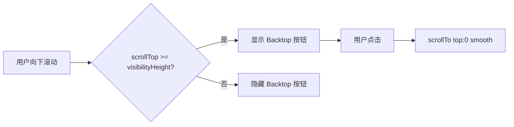
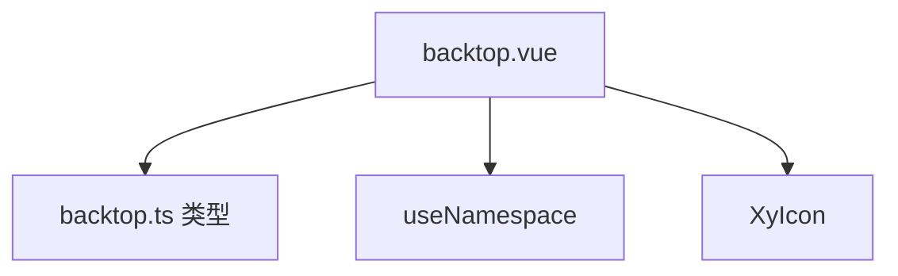
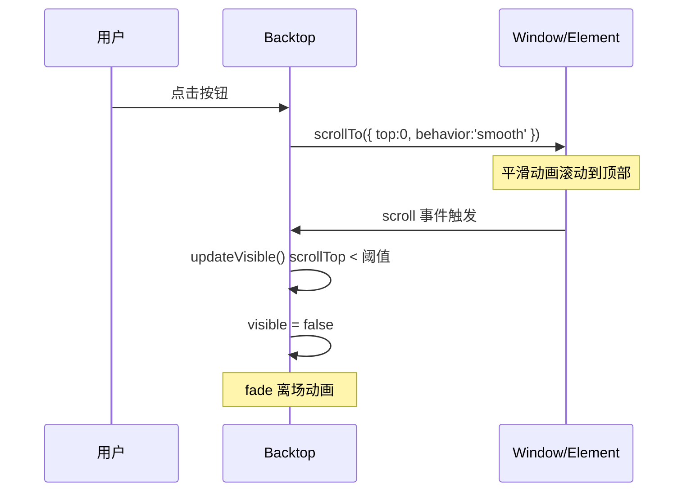
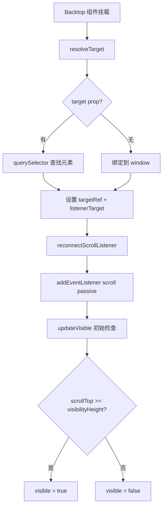

# 55 Backtop 回到顶部

> 导读：Backtop 是固定在视口角落的回到顶部按钮，支持整页和局部滚动容器，自动根据滚动距离控制显隐

## 设计哲学

Backtop 解决的核心问题是：**当页面内容较长、用户滚动到深位后，提供一个快速回到顶部的快捷入口**。它是一个纯导航辅助组件，不承载业务逻辑。

设计决策：

- **滚动容器可配** — `target` 属性支持 CSS 选择器，既可绑定整个窗口，也可绑定局部滚动容器（如表格、侧边栏）
- **显隐阈值可调** — `visibilityHeight` 控制按钮出现的最低滚动距离，默认 200px，避免短页面出现无意义的回顶按钮
- **平滑滚动** — 使用 `scrollTo({ behavior: 'smooth' })` 实现平滑动画，而非瞬间跳转
- **渐进显示** — 使用 Vue `<Transition>` 驱动入场/离场动画



与同类组件库的差异：
- 使用 `passive: true` 监听滚动事件，避免阻塞主线程
- `target` 解析失败时抛出明确错误，而非静默失败
- 支持 `beforeClose` 拦截和 `click` 事件，允许在回顶操作前后执行自定义逻辑

## 源码架构

```
backtop/
├── src/
│   ├── backtop.vue    # 组件模板与逻辑
│   └── backtop.ts     # 类型定义
└── index.ts           # 导出
```



### 核心 type 定义

```ts
export interface BacktopProps {
  visibilityHeight?: number
  target?: string
  right?: number
  bottom?: number
}
```

## 核心实现

### 1. 滚动容器解析

`resolveTarget()` 根据配置将监听目标绑定到窗口或指定 DOM 元素：

```ts
function resolveTarget() {
  if (props.target) {
    const element = document.querySelector<HTMLElement>(props.target)
    if (!element) {
      throw new Error(`[XyBacktop] target does not exist: ${props.target}`)
    }
    targetRef.value = element
    listenerTarget.value = element
    return
  }
  targetRef.value = document.documentElement
  listenerTarget.value = window
}
```

**WHY** — 为什么同时维护 `targetRef` 和 `listenerTarget`？因为 `scrollTo` 需要操作实际滚动元素（HTMLElement），而 `addEventListener('scroll')` 需要绑定到产生滚动事件的宿主（Window 或 HTMLElement），两者可能不同。

### 2. 滚动监听与被动模式

```ts
function reconnectScrollListener() {
  disconnectScrollListener()
  const target = listenerTarget.value
  target.addEventListener('scroll', updateVisible, { passive: true })
  removeScrollListener = () => {
    target.removeEventListener('scroll', updateVisible)
  }
}
```

**WHY** — `{ passive: true }` 告诉浏览器此监听器不会调用 `preventDefault()`，允许浏览器在主线程优化滚动性能。对于纯读取 `scrollTop` 的场景，这是最佳实践。

### 3. 平滑滚动

```ts
function scrollToTop() {
  if (listenerTarget.value === window) {
    window.scrollTo({ top: 0, behavior: 'smooth' })
    return
  }
  if (isElementContainer(targetRef.value)) {
    targetRef.value.scrollTo({ top: 0, behavior: 'smooth' })
  }
}
```

**WHY** — 为什么优先使用 `scrollTo` 而非 `scrollTop = 0`？`scrollTo` 支持 `behavior: 'smooth'`，提供视觉连续性；直接赋值 `scrollTop` 会瞬间跳转，用户体验差。同时保留 `scrollTop = 0` 作为降级方案（部分旧浏览器不支持 `scrollTo` 的 `behavior` 选项）。



### 4. 显隐控制

```ts
function updateVisible() {
  visible.value = getScrollTop(targetRef.value ?? listenerTarget.value) >= props.visibilityHeight
}
```

`getScrollTop` 统一处理 Window 和 HTMLElement 两种容器的 scrollTop 读取：

```ts
function getScrollTop(container: ScrollContainer | null) {
  if (!container) return 0
  if (isElementContainer(container)) return container.scrollTop
  return window.pageYOffset || document.documentElement.scrollTop || 0
}
```

**WHY** — 为什么 Window 容器不直接读 `window.scrollTop`？因为 `window.scrollTop` 在大部分浏览器中始终为 0，需要读 `pageYOffset` 或 `document.documentElement.scrollTop`。这是一个常见的浏览器兼容陷阱。

### 5. 生命周期与清理

组件在挂载时初始化监听，卸载时清理，避免内存泄漏：

```ts
onMounted(() => {
  resolveTarget()
  reconnectScrollListener()
  updateVisible()
})

onBeforeUnmount(() => {
  disconnectScrollListener()
})
```

**WHY** — 为什么 `resolveTarget` 放在 `onMounted` 而非 setup 阶段？因为 `target` 是 CSS 选择器，需要 DOM 已渲染后才能 `querySelector`。setup 阶段 DOM 尚未挂载，选择器会匹配失败。

### 6. 定位样式

按钮通过内联样式定位到视口角落，right/bottom 由 props 驱动：

```ts
const backtopStyle = computed(() => ({
  right: `${props.right}px`,
  bottom: `${props.bottom}px`,
}))
```

**WHY** — 为什么用内联样式而非 CSS 变量？right/bottom 是动态值，通过 props 传入。内联样式比 CSS 变量更直接，且避免了变量命名冲突。这是实用主义的设计选择——不是所有样式都需要走 CSS 变量系统。



## API 参考

### Props

| 属性 | 类型 | 默认值 | 说明 |
|------|------|--------|------|
| visibilityHeight | `number` | `200` | 出现的最低滚动距离(px) |
| target | `string` | `''` | 滚动容器的 CSS 选择器，为空则绑定窗口 |
| right | `number` | `40` | 距视口右侧距离(px) |
| bottom | `number` | `40` | 距视口底部距离(px) |

### Emits

| 事件 | 参数 | 说明 |
|------|------|------|
| click | `(event: MouseEvent)` | 点击按钮时触发 |

### Slots

| 插槽 | 说明 |
|------|------|
| default | 自定义按钮内容，默认为向上箭头图标 |

## 样式系统

### BEM 类名

| 类名 | 说明 |
|------|------|
| `xy-backtop` | 根元素（固定定位按钮） |
| `xy-backtop__icon` | 图标容器 |

### CSS 变量

```css
/* 按钮本身继承通用圆角和阴影变量 */
--xy-backtop-right    /* 通过 right prop 内联设置 */
--xy-backtop-bottom    /* 通过 bottom prop 内联设置 */
```

### 主题定制

Backtop 的视觉样式通过根元素 CSS 直接定制。按钮使用圆形设计，hover 时微微上浮并变为主题色：

```css
.xy-backtop {
  /* 按钮尺寸 */
  min-width: 44px;
  height: 44px;
  border-radius: 999px;

  /* 颜色使用 token */
  border-color: color-mix(in srgb, var(--xy-border-subtle) 84%, var(--xy-border));
  background: color-mix(in srgb, var(--xy-bg-floating) 98%, var(--xy-bg-subtle));
}

.xy-backtop:hover {
  background: color-mix(in srgb, var(--xy-brand-soft) 52%, var(--xy-bg-floating));
  color: var(--xy-brand);
  transform: translateY(-1px);
}
```

使用 `color-mix` 混合 token，确保暗色主题下自动适配。按钮的圆形设计 (`border-radius: 999px`) 是 FAB（Floating Action Button）设计模式的最佳实践，与 Material Design 的 FAB 规范一致。

### 无障碍

Backtop 按钮使用 `role="button"` 和 `aria-label` 增强可访问性：

```html
<div
  role="button"
  :aria-label="t('xy.backtop.backToTop') || 'Back to top'"
  tabindex="0"
  @click="handleClick"
  @keydown.enter="handleClick"
  @keydown.space.prevent="handleClick"
>
```

**WHY** — 为什么按钮是 div 而非 button？因为 Backtop 的视觉样式（圆形、无边框、悬浮）与原生 button 样式冲突，清除浏览器默认样式成本高于直接用 div + role。同时添加键盘支持（Enter/Space）确保键盘用户可操作。

## 小结

1. **双容器模型** — `targetRef` 和 `listenerTarget` 分离，精确支持 Window 与 HTMLElement 两种滚动宿主
2. **passive 监听** — 使用 `{ passive: true }` 优化滚动性能，避免阻塞主线程
3. **平滑滚动优先** — 优先使用 `scrollTo({ behavior: 'smooth' })`，降级到 `scrollTop = 0`