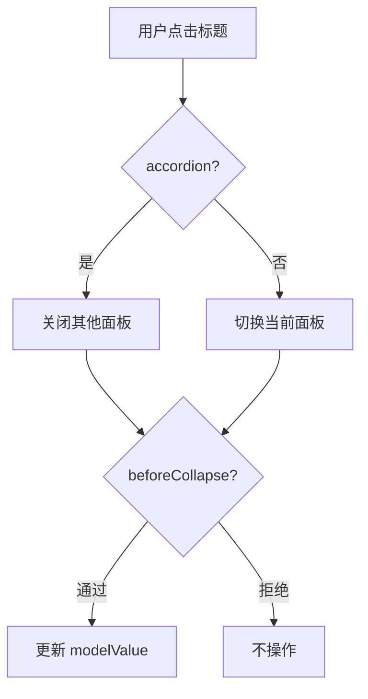
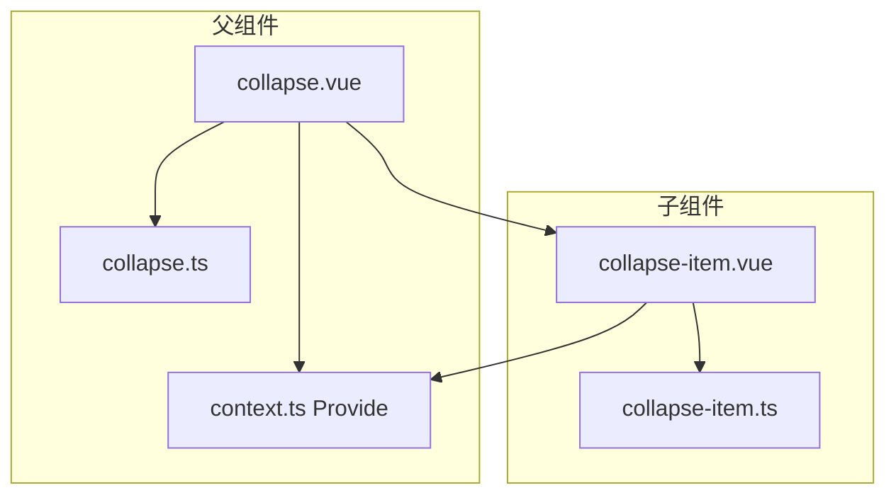
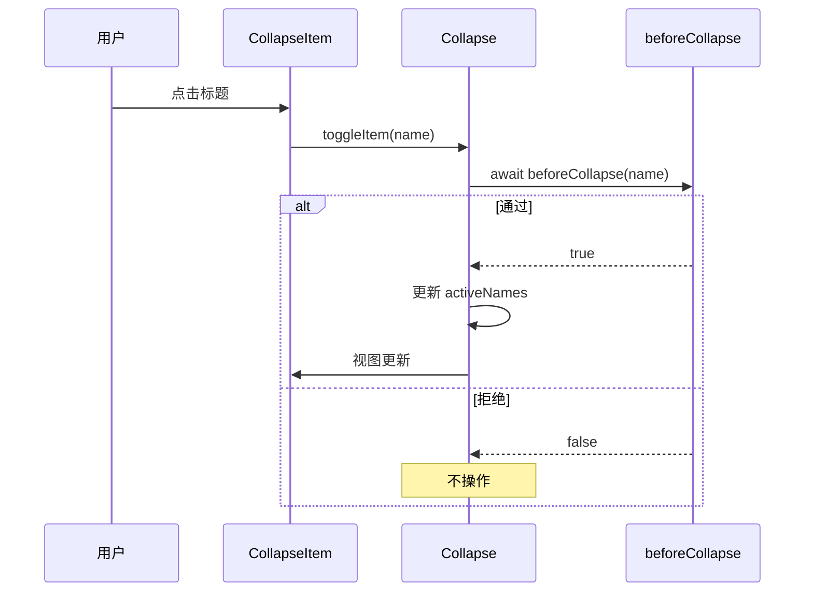

# 56 Collapse 折叠面板

> 导读：Collapse 是内容收展组件，通过标题触发展开/折叠，支持手风琴模式与异步拦截，常用于 FAQ、筛选配置和说明文档

## 设计哲学

Collapse 解决的核心问题是：**在有限空间内收纳可折叠内容，让用户按需展开**。它不是 Tab 切换，不强调"同一时刻只有一个面板激活"，而是允许任意组合展开。

设计决策：

- **手风琴可选** — `accordion` 模式限制同一时刻只能展开一个面板，默认不限制
- **v-model 驱动** — 通过 `modelValue` 控制展开项，支持数组（多选）和字符串/数字（手风琴单选）
- **异步拦截** — `beforeCollapse` 钩子允许在展开/折叠前执行异步校验，阻止不合规操作
- **Provide/Inject 通信** — 父子组件通过 `collapseContextKey` 注入上下文，子组件无需关心全局状态



与同类组件库的差异：
- `beforeCollapse` 支持异步（Promise）拦截，比 Element Plus 的同步拦截更灵活
- `ensureCollapseNames` 工具函数归一化 modelValue 类型，统一数组处理

## 源码架构

```
collapse/
├── src/
│   ├── collapse.vue          # 父组件
│   ├── collapse.ts           # 父组件类型
│   ├── collapse-item.vue     # 子组件
│   ├── collapse-item.ts      # 子组件类型
│   └── context.ts            # Provide/Inject 上下文
└── index.ts
```



### 核心 type 定义

```ts
export type CollapseActiveName = string | number
export type CollapseModelValue = CollapseActiveName | CollapseActiveName[]
export type CollapseExpandIconPosition = 'left' | 'right'
export type CollapseBeforeCollapse = (
  name: CollapseActiveName
) => boolean | Promise<boolean>

export interface CollapseProps {
  modelValue?: CollapseModelValue
  accordion?: boolean
  expandIconPosition?: CollapseExpandIconPosition
  beforeCollapse?: CollapseBeforeCollapse
}

export interface CollapseItemProps {
  title?: string
  name?: CollapseActiveName
  disabled?: boolean
}
```

## 核心实现

### 1. Provide/Inject 上下文

`context.ts` 定义注入 key 和上下文结构：

```ts
export interface CollapseContext {
  activeNames: Ref<CollapseActiveName[]>
  accordion: ComputedRef<boolean>
  expandIconPosition: ComputedRef<CollapseExpandIconPosition>
  toggleItem: (name: CollapseActiveName) => Promise<void>
}

export const collapseContextKey: InjectionKey<CollapseContext> =
  Symbol('xiaoye-collapse')
```

父组件 `provide`，子组件 `inject`：

```ts
// collapse.vue
provide(collapseContextKey, {
  activeNames,
  accordion,
  expandIconPosition,
  toggleItem
})
```

**WHY** — 为什么用 Provide/Inject 而非 props 传递？Collapse-Item 嵌套层级可能不固定（如中间包一层 div），props 逐层传递会断裂。Provide/Inject 跨层级通信，与 DOM 结构解耦。

### 2. 异步拦截 — beforeCollapse

`toggleItem` 支持 Promise 返回值：

```ts
async function toggleItem(name: CollapseActiveName) {
  const allowed = await canToggle(name)
  if (!allowed) return

  if (props.accordion) {
    setActiveNames(activeNames.value[0] === name ? [] : [name])
    return
  }

  const nextNames = [...activeNames.value]
  const index = nextNames.indexOf(name)
  if (index >= 0) nextNames.splice(index, 1)
  else nextNames.push(name)
  setActiveNames(nextNames)
}
```

`canToggle` 封装了异步校验：

```ts
async function canToggle(name: CollapseActiveName) {
  if (!props.beforeCollapse) return true
  try {
    return (await props.beforeCollapse(name)) !== false
  } catch {
    return false
  }
}
```

**WHY** — 为什么 catch 后返回 false？如果 beforeCollapse 抛出异常（如网络请求失败），应该阻止状态变更，而非静默放行。这是安全优先的设计。



### 3. modelValue 归一化

`ensureCollapseNames` 将各种 modelValue 类型统一为数组：

```ts
export function ensureCollapseNames(value: CollapseModelValue | undefined) {
  if (value == null || value === '') return [] as CollapseActiveName[]
  return Array.isArray(value) ? [...value] : [value]
}
```

**WHY** — 为什么需要归一化？手风琴模式下 modelValue 是单值（string | number），多选模式下是数组。内部统一用数组处理，避免分支逻辑散落在每个操作点。

### 4. Collapse-Item 的无障碍

子组件通过 `role` 和 `aria-*` 属性增强可访问性：

```html
<header
  role="button"
  :tabindex="props.disabled ? -1 : 0"
  :aria-expanded="isActive"
  :aria-controls="contentId"
  :aria-disabled="props.disabled ? 'true' : undefined"
  @click="toggle"
  @keydown="handleKeydown"
>
```

键盘支持 Enter 和 Space 触发切换：

```ts
function handleKeydown(event: KeyboardEvent) {
  if (event.key !== 'Enter' && event.key !== ' ') return
  event.preventDefault()
  toggle()
}
```

## API 参考

### Collapse Props

| 属性 | 类型 | 默认值 | 说明 |
|------|------|--------|------|
| modelValue | `CollapseModelValue` | `[]` | 展开项名称（手风琴模式为单值） |
| accordion | `boolean` | `false` | 是否手风琴模式 |
| expandIconPosition | `'left' \| 'right'` | `'right'` | 展开图标位置 |
| beforeCollapse | `CollapseBeforeCollapse` | — | 展开前异步拦截 |

### Collapse Emits

| 事件 | 参数 | 说明 |
|------|------|------|
| update:modelValue | `(value: CollapseModelValue)` | v-model 更新 |
| change | `(value: CollapseModelValue)` | 展开项变化 |

### Collapse Exposes

| 属性 | 类型 | 说明 |
|------|------|------|
| activeNames | `Ref<CollapseActiveName[]>` | 当前展开项 |
| setActiveNames | `(names: CollapseActiveName[]) => void` | 设置展开项 |

### CollapseItem Props

| 属性 | 类型 | 默认值 | 说明 |
|------|------|--------|------|
| title | `string` | `''` | 面板标题 |
| name | `CollapseActiveName` | 自动生成 | 唯一标识 |
| disabled | `boolean` | `false` | 是否禁用 |

### CollapseItem Slots

| 插槽 | 作用域 | 说明 |
|------|--------|------|
| title | `{ isActive: boolean }` | 自定义标题内容 |
| default | — | 面板内容 |

### CollapseItem Exposes

| 属性 | 类型 | 说明 |
|------|------|------|
| isActive | `ComputedRef<boolean>` | 当前面板是否展开 |

## 样式系统

### BEM 类名

| 类名 | 说明 |
|------|------|
| `xy-collapse` | 父容器 |
| `xy-collapse--icon-left` | 图标左侧布局 |
| `xy-collapse__item` | 面板项 |
| `xy-collapse__header` | 面板标题栏 |
| `xy-collapse__title` | 标题文本 |
| `xy-collapse__icon` | 展开/折叠图标 |
| `xy-collapse__wrap` | 内容包裹层 |
| `xy-collapse__content` | 实际内容 |

### CSS 变量

```css
--xy-collapse-border-color       /* 边框颜色 */
--xy-collapse-header-bg          /* 标题栏背景 */
--xy-collapse-header-height      /* 标题栏最小高度 */
--xy-collapse-header-font-size   /* 标题字号 */
--xy-collapse-content-font-size  /* 内容字号 */
--xy-collapse-content-padding    /* 内容区内边距 */
```

### 主题定制

```css
:root {
  --xy-collapse-header-bg: var(--xy-surface-raised);
  --xy-collapse-content-padding: 0 16px 18px;
}
```

## 小结

1. **Provide/Inject 通信** — 父子组件通过上下文注入通信，与 DOM 嵌套层级解耦
2. **异步拦截** — `beforeCollapse` 支持 Promise 返回，异常时安全阻断状态变更
3. **modelValue 归一化** — 内部统一用数组处理，消除手风琴/多选模式间的类型分支