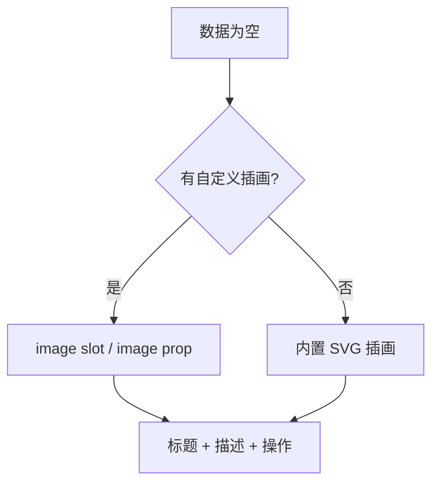
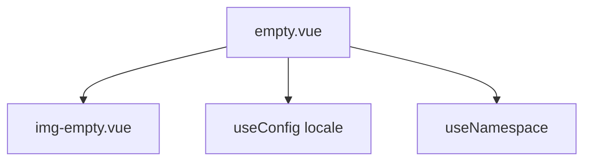
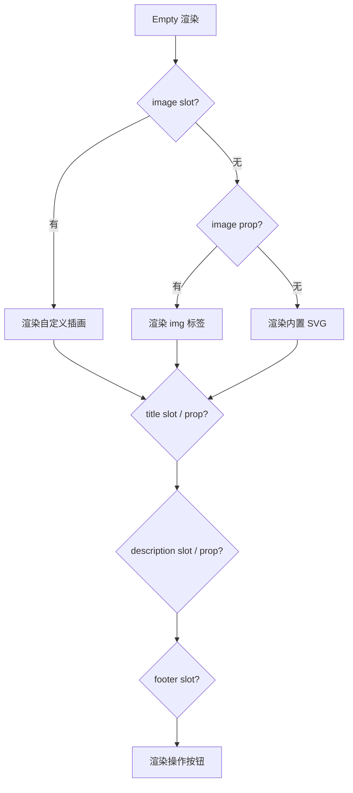
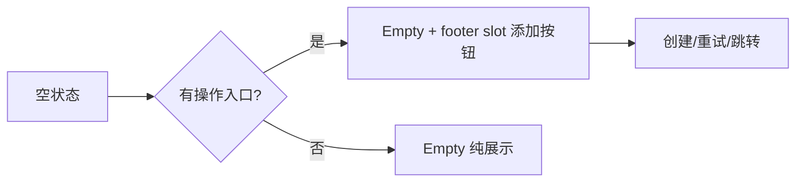

# 57 Empty 空状态

> 导读：Empty 用于承接空数据、空搜索结果和首次进入时暂无内容的页面状态，内置 SVG 插画与国际化文案

## 设计哲学

Empty 解决的核心问题是：**当页面内容为空时，提供一个有意义的视觉占位，而非留白**。空状态不是"什么都没有"，而是"这里暂时没有，但系统正常运转"。

设计决策：

- **内置 SVG 插画** — `img-empty.vue` 提供默认 SVG 插图，不依赖外部图片资源，减少网络请求
- **国际化文案** — 标题和描述通过 `useConfig()` 读取 locale，支持多语言
- **四插槽扩展** — `image` / `title` / `description` / `default(footer)` 四个插槽覆盖所有自定义场景
- **image 尺寸可控** — `imageSize` 支持 number（px）和 string，灵活适配不同布局



与同类组件库的差异：
- 内置 SVG 完全内联，不依赖外部图片 URL
- 标题和描述走国际化系统，默认值由 `locale.emptyTitle` / `locale.emptyDescription` 决定

## 源码架构

```
empty/
├── src/
│   ├── empty.vue          # 主组件
│   └── img-empty.vue      # 内置 SVG 插画
└── index.ts               # 导出
```



### 核心 type 定义

```ts
export interface EmptyProps {
  title?: string
  description?: string
  image?: string
  imageAlt?: string
  imageSize?: number | string
}
```

## 核心实现

### 1. 国际化文案

标题和描述支持国际化，通过 `useConfig()` 读取 locale 配置：

```ts
const { locale } = useConfig()

const resolvedTitle = computed(() => {
  if (props.title !== undefined) return props.title
  return locale.value.emptyTitle ?? '暂无数据'
})

const resolvedDescription = computed(() => {
  if (props.description !== undefined) return props.description
  return locale.value.emptyDescription ?? '这里还没有可展示的内容'
})
```

**WHY** — 为什么 props 优先级高于 locale？因为 props 是组件级的精确配置，locale 是全局的默认配置。当开发者显式传入 title 时，说明需要覆盖全局默认值。

### 2. 内置 SVG 插画

`img-empty.vue` 是一个纯模板组件，内联 SVG 图形：

```html
<template>
  <svg viewBox="0 0 160 120" fill="none" aria-hidden="true" class="xy-empty__default-art">
    <rect x="18" y="24" width="124" height="72" rx="24" fill="#F8FAFC" />
    <rect x="34" y="42" width="68" height="10" rx="5" fill="#CBD5E1" />
    <rect x="34" y="60" width="48" height="10" rx="5" fill="#E2E8F0" />
    <!-- 更多图形元素 -->
  </svg>
</template>
```

**WHY** — 为什么用内联 SVG 而非 base64 或外部图片？内联 SVG 无网络请求、支持 CSS 变量着色、缩放无损。这是组件库零依赖设计的核心原则。

### 3. 插槽与条件渲染

组件根据插槽和 props 的存在性决定各区域的渲染：

```html
<div :class="ns.base.value">
  <div class="xy-empty__illustration" :style="imageStyle">
    <slot name="image">
      
      
    </slot>
  </div>
  <strong v-if="hasTitle" class="xy-empty__title">
    <slot name="title">{{ resolvedTitle }}</slot>
  </strong>
  <div v-if="hasDescription" class="xy-empty__description">
    <slot name="description"><p>{{ resolvedDescription }}</p></slot>
  </div>
  <div v-if="slots.default" class="xy-empty__footer">
    <slot />
  </div>
</div>
```

**WHY** — 为什么用 `hasTitle` 计算属性而非直接判断 `props.title`？因为标题可能来自 slot，而 slot 的存在性需要通过 `slots.title` 判断。`hasTitle` 统一了 props 和 slot 两种来源。



### 4. imageSize 归一化

```ts
const imageStyle = computed(() =>
  props.imageSize !== undefined && props.imageSize !== ''
    ? {
        width: typeof props.imageSize === 'number'
          ? `${props.imageSize}px`
          : props.imageSize
      }
    : undefined
)
```

**WHY** — 为什么 number 自动加 px？因为 CSS `width` 属性不接受裸数字，需要带单位。自动添加 px 是最常见的约定，同时保留 string 类型支持 `rem`、`%` 等其他单位。

### 5. 渲染决策流程

组件的渲染逻辑基于插槽和 props 的存在性，形成完整的决策树：

```ts
const hasTitle = computed(() => Boolean(slots.title) || resolvedTitle.value !== '')
const hasDescription = computed(
  () => Boolean(slots.description) || resolvedDescription.value !== ''
)
```

插画区域的三层决策：`image slot` > `image prop (URL)` > `img-empty (内置 SVG)`

**WHY** — 为什么 slot 优先级高于 prop？slot 支持任意 Vue 组件内容（包括动画、交互），prop 只支持 URL。slot 提供更大的表达空间，应该在有内容时优先使用。

### 6. 居中布局与最大宽度

Empty 组件使用 `margin: 0 auto` 居中，且限制 `max-width: 440px`：

```css
.xy-empty {
  max-width: 440px;
  margin: 0 auto;
  text-align: center;
}
```

**WHY** — 为什么限制最大宽度？空状态插画和文案在超宽容器中会过度拉伸，降低阅读体验。440px 是一个经验值，能容纳插画 + 一行标题 + 两行描述。描述区域还限制 `max-width: 32ch`，确保最佳阅读行长。

## API 参考

### Props

| 属性 | 类型 | 默认值 | 说明 |
|------|------|--------|------|
| title | `string` | locale 默认值 | 标题文本 |
| description | `string` | locale 默认值 | 描述文本 |
| image | `string` | `''` | 自定义图片 URL |
| imageAlt | `string` | `''` | 图片 alt 属性 |
| imageSize | `number \| string` | `''` | 图片尺寸 |

### Slots

| 插槽 | 说明 |
|------|------|
| image | 自定义插画区域 |
| title | 自定义标题内容 |
| description | 自定义描述内容 |
| default | 底部操作区域（footer） |

## 样式系统

### BEM 类名

| 类名 | 说明 |
|------|------|
| `xy-empty` | 根容器 |
| `xy-empty__illustration` | 插画区域 |
| `xy-empty__default-art` | 内置 SVG 图形 |
| `xy-empty__image` | 自定义图片 |
| `xy-empty__title` | 标题 |
| `xy-empty__description` | 描述 |
| `xy-empty__footer` | 底部操作区 |

### CSS 变量

```css
--xy-empty-padding
--xy-empty-gap
--xy-empty-image-width
--xy-empty-title-color
--xy-empty-description-color
--xy-empty-footer-margin-top
--xy-empty-illustration-background
--xy-empty-illustration-border-color
```

### 主题定制

```css
:root {
  --xy-empty-padding: 32px 16px;
  --xy-empty-image-width: 160px;
}
```

插画区域的背景色和边框也可定制：

```css
.xy-empty__illustration {
  background: var(--xy-empty-illustration-background);
  border: 1px solid var(--xy-empty-illustration-border-color);
}
```

暗色主题下，SVG 插画中的 fill 色会通过 CSS 变量自动调整：

```css
.xy-empty__default-art rect {
  fill: var(--xy-bg-raised);
}
```

### 使用场景

Empty 组件在以下场景中尤其有价值：

- **列表数据为空** — 搜索结果为空、筛选无匹配项
- **首次进入** — 用户尚未创建任何内容时的引导状态
- **权限不足** — 用户无权访问某资源时的占位
- **网络异常** — 数据加载失败后的重试入口



## 小结

1. **内联 SVG 零依赖** — 默认插画完全内联，不依赖外部资源，支持 CSS 变量着色
2. **国际化文案** — 标题和描述走 `useConfig()` 的 locale 系统，props 优先级高于全局配置
3. **四插槽扩展** — image / title / description / footer 四个插槽覆盖所有自定义需求