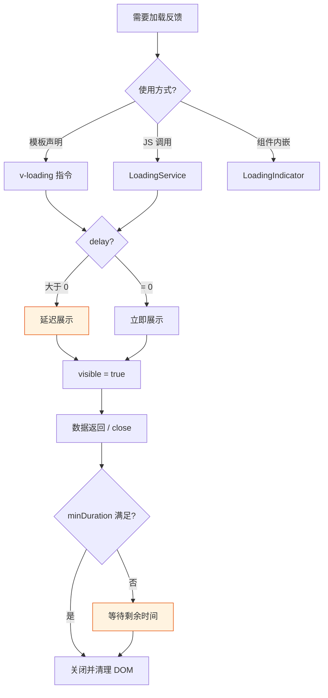
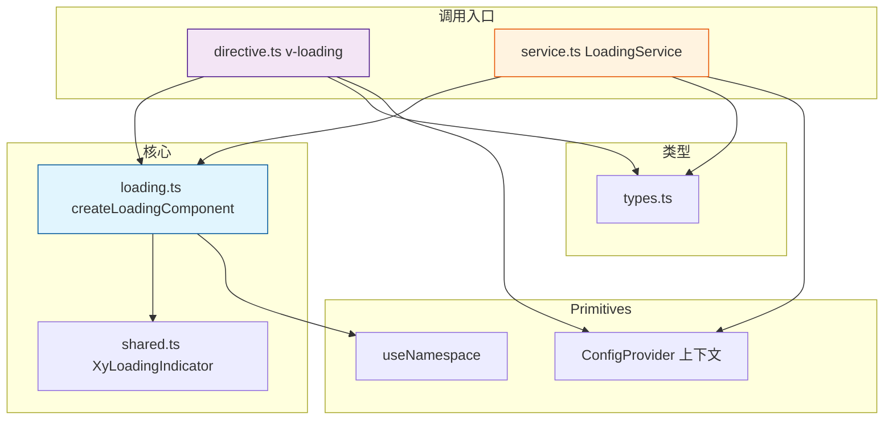
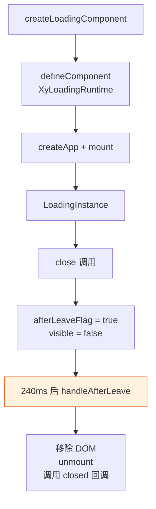
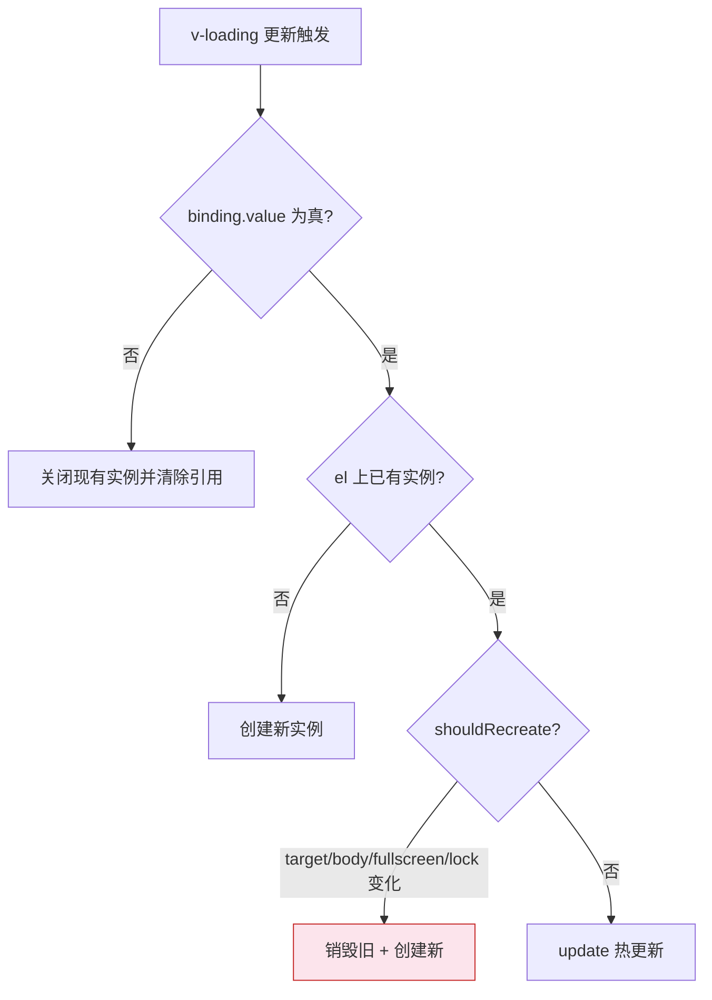
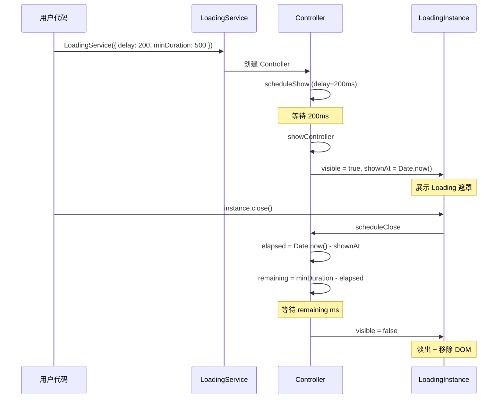

# 58 Loading 加载

> 导读：Loading 是数据加载遮罩组件，支持指令式（v-loading）、服务式（LoadingService）和组件式三种调用方式，覆盖局部和全屏场景，内置 delay 防闪烁和 minDuration 保底机制。

## 设计哲学

- **解决的问题**：数据加载期间的视觉占位不是空状态，不是错误状态，而是中间态的"系统正在工作"信号。原生方案要么没有反馈（白屏等待），要么手动管理遮罩（大量样板代码）。Loading 把"展示遮罩 → 等待数据 → 关闭遮罩"的完整流程收敛为三种调用入口。
- **设计决策**：提供三种调用形态——指令式 `v-loading`（声明式，适合模板绑定布尔值）、服务式 `LoadingService()`（命令式，适合 JS 异步流程）、组件式 `<xy-loading>`（适合内嵌到自定义布局）。三者共享同一套渲染逻辑（XyLoadingIndicator），确保视觉一致性。`delay` 延迟展示避免快速返回请求的闪烁；`minDuration` 保证最短展示时间避免一闪而过；`groupKey` 允许多个调用点共享同一实例避免遮罩堆叠。
- **差异化**：`LoadingService.with()` 是最高层的 API 抽象——一行代码完成"展示 Loading → 执行异步任务 → 自动关闭"的完整流程。`beforeClose` 拦截器允许在关闭前执行校验。全屏 Loading 的单例保证避免同时弹出多个全屏遮罩。



## 源码架构

### 文件结构

```
packages/components/loading/
├── index.ts              # 导出入口 + Plugin 安装
├── src/
│   ├── loading.ts        # 核心 Loading 实例创建（渲染函数组件）
│   ├── types.ts          # 类型定义
│   ├── directive.ts      # v-loading 指令实现
│   ├── service.ts        # LoadingService + Controller 管理
│   └── shared.ts         # XyLoadingIndicator 共享组件
└── __tests__/
```

### 组件关系图



### 核心 type 定义

```ts
type LoadingText = string | VNode | VNode[]

interface LoadingOptionsResolved {
  parent: HTMLElement
  background: string
  svg: string
  svgViewBox: string
  spinner: string
  text: LoadingText
  fullscreen: boolean
  lock: boolean
  customClass: string
  visible: boolean
  target: HTMLElement
  delay: number
  minDuration: number
  groupKey?: string
  beforeClose?: () => boolean
  closed?: () => void
}

type LoadingOptions = Partial<
  Omit<LoadingOptionsResolved, "parent" | "target"> & {
    target: HTMLElement | string
    body: boolean
  }
>

interface LoadingInstance {
  close: () => void
  update: (patch: LoadingUpdatableOptions) => void
  setText: (text: LoadingText) => void
  visible: Ref<boolean>
  $el: HTMLElement
}
```

## 核心实现

### 1. createLoadingComponent — 渲染函数式组件

Loading 的核心是一个通过 `createApp` 动态挂载的渲染函数组件，它不依赖 SFC 模板：

```ts
function createLoadingComponent(
  options: LoadingOptionsResolved,
  appContext: AppContext | null,
  initialZIndex: number
): LoadingInstance {
  const data = reactive({ ...options, originalPosition: "", originalOverflow: "", zIndex: 0 })
  const closed = ref(false)
  const afterLeaveFlag = ref(false)

  const LoadingComponent = defineComponent({
    name: "XyLoadingRuntime",
    setup() {
      const ns = useNamespace("loading")
      data.zIndex = initialZIndex
      return () => h("div", {
        class: [`${ns.base.value}-mask`, ns.is("fullscreen", data.fullscreen),
          data.visible ? "is-visible" : "is-hidden"],
        style: { backgroundColor: data.background || "", zIndex: data.zIndex }
      }, [
        h(XyLoadingIndicator, {
          text: data.text, spinner: data.spinner, svg: data.svg,
          svgViewBox: data.svgViewBox, layout: "stacked",
          size: data.fullscreen ? "lg" : "md", surface: true
        })
      ])
    }
  })

  const loadingApp = createApp(LoadingComponent)
  Object.assign(loadingApp._context, appContext ?? {})
  const vm = loadingApp.mount(host)
  const element = host.firstElementChild as HTMLElement

  function close() {
    if (afterLeaveFlag.value) return
    afterLeaveFlag.value = true
    data.visible = false
    afterLeaveTimer = setTimeout(handleAfterLeave, LOADING_CLOSE_DELAY)
  }

  function handleAfterLeave() {
    if (!afterLeaveFlag.value) return
    afterLeaveFlag.value = false
    removeLoadingChild()
    loadingApp.unmount()
    closed.value = true
    data.closed?.()
  }

  return { ...toRefs(data), setText, update, close, handleAfterLeave, vm, $el: element }
}
```



**WHY**：渲染函数而非 SFC，是因为 Loading 需要在命令式场景中动态创建和销毁——没有模板编译的约束，渲染函数可以直接控制 VNode 结构。`createApp` 独立实例确保 Loading 的样式和上下文与主应用隔离，同时通过 `Object.assign(loadingApp._context, appContext)` 保留插件注册和全局配置的访问能力。`afterLeaveFlag` + 240ms 延迟是为 CSS transition 留出淡出动画的时间窗口。

### 2. v-loading 指令

`directive.ts` 实现了 `v-loading` 指令，在 `mounted` 和 `updated` 钩子中管理实例生命周期：

```ts
const vLoading = {
  mounted(el, binding) {
    if (binding.value) createInstance(el, binding)
  },
  updated(el, binding) {
    if (!binding.value) {
      el[INSTANCE_KEY]?.instance.close()
      el[INSTANCE_KEY] = null
      return
    }
    if (!el[INSTANCE_KEY]) { createInstance(el, binding); return }
    const nextOptions = resolveOptions(el, binding)
    if (shouldRecreate(prev, next)) { recreate(); return }
    el[INSTANCE_KEY].instance.update(toUpdatableOptions(next))
  },
  unmounted(el) { el[INSTANCE_KEY]?.instance.close() }
}
```



**WHY**：`shouldRecreate` 检查 `target`/`body`/`fullscreen`/`lock` 四个选项，因为这些选项影响 DOM 挂载位置和布局行为（如 parent 的 position 类、body 的 overflow 锁定），无法通过 `update` 热更新，必须销毁重建。其他选项（`text`/`background`/`spinner` 等）只影响遮罩内部样式，可以热更新。

### 3. LoadingService — 控制器模式

`service.ts` 通过 `LoadingController` 管理每个 Service 实例的完整生命周期：

```ts
interface LoadingController {
  appContext: AppContext | null
  currentOptions: LoadingOptionsResolved
  followerCleanup: (() => void) | null
  isMounted: boolean
  isVisible: boolean
  isClosing: boolean
  namespace: string
  pendingShowTimer: ReturnType<typeof setTimeout> | null
  pendingCloseTimer: ReturnType<typeof setTimeout> | null
  shownAt: number | null
  instance: LoadingInstance
}
```

delay 机制——延迟展示避免闪烁：

```ts
function scheduleShow(controller: LoadingController) {
  if (controller.currentOptions.delay > 0) {
    controller.pendingShowTimer = setTimeout(() => {
      controller.pendingShowTimer = null
      showController(controller)
    }, controller.currentOptions.delay)
    return
  }
  showController(controller)
}
```

minDuration 机制——保证最短展示时间：

```ts
function scheduleClose(controller: LoadingController) {
  controller.isClosing = true
  const elapsed = controller.shownAt == null ? 0 : Date.now() - controller.shownAt
  const remaining = Math.max(0, controller.currentOptions.minDuration - elapsed)

  if (remaining > 0) {
    controller.pendingCloseTimer = setTimeout(executeClose, remaining)
    return
  }
  executeClose()
}
```



**WHY**：`delay` + `minDuration` 是性能与体验的平衡。`delay` 防闪烁——大量快速返回的请求（<200ms）根本不需要展示 Loading，延迟后如果数据已返回，直接取消定时器，用户毫无感知。`minDuration` 防一闪——当请求耗时刚好超过 delay 但仍然很短时，Loading 一闪而过反而比不展示更糟糕，保底 500ms 让用户有足够时间理解"系统在工作"。

### 4. LoadingService.with — Promise 包裹

```ts
XyLoadingService.with = async <T>(
  task: Promise<T> | (() => T | Promise<T>),
  options?: LoadingOptions,
): Promise<T> => {
  const instance = XyLoadingService(options)
  try {
    return await (typeof task === "function" ? task() : task)
  } finally {
    instance.close()
  }
}
```

**WHY**：这是最高层的 API 抽象，一行代码完成"展示 Loading → 执行异步任务 → 自动关闭"的完整流程。`finally` 保证即使 Promise reject 也会关闭 Loading，不会留下永久遮罩。`task` 同时支持 `Promise` 和 `() => Promise`，后者适合需要延迟初始化的场景（如 `task` 函数内部才创建请求）。

### 5. parent 位置修正与引用计数

```ts
function addParentClassList(controller: LoadingController) {
  const parent = controller.currentOptions.parent
  const originalPosition = controller.instance.originalPosition.value

  if (!["absolute", "fixed", "sticky", "relative"].includes(originalPosition)) {
    parent.classList.add(`${namespace}-loading-parent--relative`)
    incrementCount(parent, LOADING_RELATIVE_COUNT_ATTR)
  }

  if (controller.currentOptions.fullscreen && controller.currentOptions.lock) {
    parent.classList.add(`${namespace}-loading-parent--hidden`)
    incrementCount(parent, LOADING_HIDDEN_COUNT_ATTR)
  }
}
```

**WHY**：Loading 遮罩使用 `position: absolute` 定位，如果父元素没有 position 属性，遮罩会相对于最近有 position 的祖先定位——通常是 body，导致位置完全错误。自动添加 `position: relative` 并用 `data-*` 属性做引用计数，是因为同一父元素可能同时有多个 Loading（如多个请求并行），只有最后一个关闭时才能移除 position 类。

### 6. groupKey 去重与全屏单例

```ts
function openLoading(options, context, trackAsService) {
  if (trackAsService && resolved.groupKey) {
    const existing = serviceGroupControllers.get(resolved.groupKey)
    if (existing) { updateController(existing, patch); return existing.instance }
  }
  if (trackAsService && !resolved.groupKey && resolved.fullscreen && fullscreenInstance) {
    return fullscreenInstance  // 全屏单例，复用已有实例
  }
  // 创建新实例
}
```

**WHY**：全屏 Loading 在同一时刻只应存在一个——如果两个全屏 Loading 同时出现，用户看到两层遮罩叠加，既视觉混乱又影响性能。`groupKey` 去重更进一步——同一组的 Loading 共享实例，如"分页请求 + 筛选请求"共享同一个局部 Loading，避免同一区域出现多层遮罩。

## API 参考

### v-loading 指令

| 用法 | 说明 |
|------|------|
| `v-loading="true"` | 在元素上显示加载遮罩 |
| `v-loading.fullscreen="true"` | 全屏模式 |
| `v-loading.lock="true"` | 全屏时锁定滚动 |
| `v-loading="{ text: '加载中', delay: 200 }"` | 对象式绑定 |

### LoadingService Methods

| 方法 | 参数 | 返回值 | 说明 |
|------|------|--------|------|
| LoadingService | `LoadingOptions` | `LoadingInstance` | 打开 Loading |
| LoadingService.closeAll | — | `void` | 关闭所有 Service Loading |
| LoadingService.with | `task, options, context` | `Promise<T>` | Promise 包裹，自动管理生命周期 |

### LoadingOptions

| 属性 | 类型 | 默认值 | 说明 |
|------|------|--------|------|
| target | `HTMLElement \| string` | `document.body` | 挂载目标元素或选择器 |
| body | `boolean` | `false` | 是否挂载到 body |
| fullscreen | `boolean` | `true` | 全屏模式 |
| lock | `boolean` | `false` | 全屏时锁定滚动 |
| text | `LoadingText` | `""` | 加载文案（支持 VNode） |
| background | `string` | `""` | 遮罩背景色 |
| spinner | `string` | `""` | 自定义 spinner 类名 |
| svg | `string` | `""` | 自定义 SVG 内容 |
| svgViewBox | `string` | `"0 0 50 50"` | SVG viewBox |
| customClass | `string` | `""` | 自定义类名 |
| visible | `boolean` | `true` | 初始可见状态 |
| delay | `number` | `0` | 延迟展示时间（ms） |
| minDuration | `number` | `0` | 最短展示时间（ms） |
| groupKey | `string` | — | 分组标识（同组共享实例） |
| beforeClose | `() => boolean` | — | 关闭前拦截钩子 |
| closed | `() => void` | — | 关闭完成回调 |

### LoadingInstance

| 属性/方法 | 类型 | 说明 |
|-----------|------|------|
| close | `() => void` | 关闭 Loading |
| update | `(patch: LoadingUpdatableOptions) => void` | 热更新选项 |
| setText | `(text: LoadingText) => void` | 更新文案 |
| visible | `Ref<boolean>` | 当前可见状态 |
| $el | `HTMLElement` | Loading DOM 元素 |

## 样式系统

### BEM 类名

| 类名 | 说明 |
|------|------|
| `.xy-loading-mask` | 遮罩层根 |
| `.xy-loading-mask.is-fullscreen` | 全屏模式 |
| `.xy-loading-mask.is-visible` | 可见状态 |
| `.xy-loading-mask.is-hidden` | 隐藏状态 |
| `.xy-loading__indicator` | 指示器根 |
| `.xy-loading__indicator--stacked` | 垂直布局（图标+文案纵向排列） |
| `.xy-loading__indicator--inline` | 水平布局（图标+文案横向排列） |
| `.xy-loading__indicator--sm` | 小尺寸 |
| `.xy-loading__indicator--md` | 中尺寸 |
| `.xy-loading__indicator--lg` | 大尺寸 |
| `.xy-loading__indicator.is-surface` | 带面板背景的指示器 |
| `.xy-loading__circular` | SVG 圆形动画 |
| `.xy-loading__path` | SVG 路径 |
| `.xy-loading__text` | 加载文案 |
| `.xy-loading-spinner__icon` | 自定义 spinner 图标 |
| `.xy-loading-parent--relative` | 父元素 position 修正 |
| `.xy-loading-parent--hidden` | 父元素 overflow 修正 |

### CSS 变量

| 变量 | 默认值 | 说明 |
|------|--------|------|
| `--xy-loading-text-font-size` | `14px` | 加载文案字号 |
| `--xy-loading-text-color` | `var(--xy-text-muted)` | 加载文案颜色 |
| `--xy-loading-mask-background` | `color-mix(...)` | 遮罩背景色 |
| `--xy-loading-indicator-size` | `20px` | 指示器图标尺寸 |
| `--xy-loading-indicator-text-size` | 继承 text-font-size | 指示器文案字号 |

### 动画关键帧

```css
@keyframes xy-loading-rotate {
  from { transform: rotate(0deg); }
  to   { transform: rotate(360deg); }
}

@keyframes xy-loading-dash {
  0%   { stroke-dasharray: 1, 150; stroke-dashoffset: 0; }
  50%  { stroke-dasharray: 90, 150; stroke-dashoffset: -35; }
  100% { stroke-dasharray: 90, 150; stroke-dashoffset: -124; }
}
```

### 主题定制方式

通过 CSS 变量覆盖即可定制 Loading 主题：
- 遮罩背景色：覆盖 `--xy-loading-mask-background`
- 文案颜色/字号：覆盖 `--xy-loading-text-color` / `--xy-loading-text-font-size`
- SVG 路径颜色：SVG 的 stroke 直接引用 `--xy-brand`，可通过全局主色变量联动修改
- 指示器面板样式：`.xy-loading__indicator.is-surface` 的边框/阴影/圆角均引用全局变量

## 小结

1. **三形态调用**：指令式（`v-loading`）、服务式（`LoadingService`）、组件式（`XyLoadingIndicator`）三种调用入口，覆盖声明式和命令式编程范式，共享同一套渲染逻辑确保视觉一致。
2. **delay + minDuration 双保险**：延迟展示防闪烁（快速返回的请求不展示 Loading），最短展示防一闪（过快的 Loading 反而比不展示更糟糕），是性能与体验的精准平衡。
3. **引用计数 + groupKey 去重**：同一父元素的 `position: relative` 修正使用引用计数确保安全移除；`groupKey` 允许多个调用点共享同一实例避免遮罩堆叠；全屏 Loading 单例保证避免多层遮罩叠加。