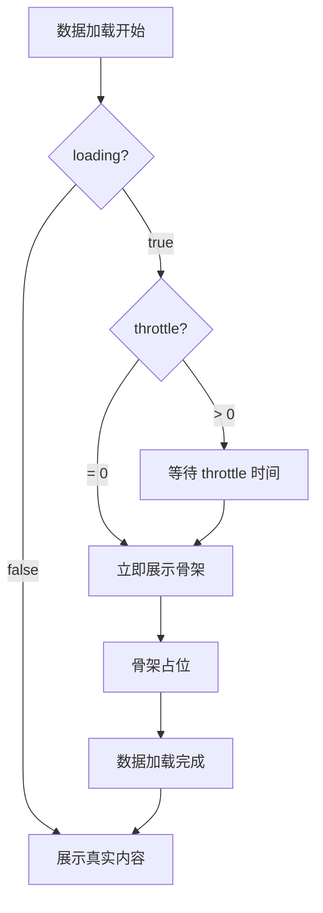
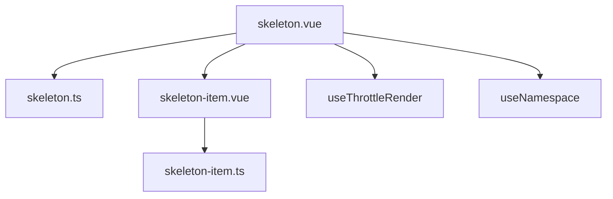
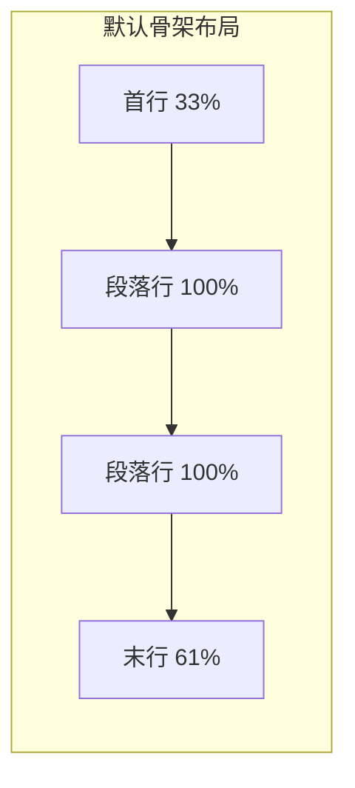

# 59 Skeleton 骨架屏

> 导读：Skeleton 是加载占位组件，用灰色块模拟目标内容的布局轮廓，降低用户对加载延迟的感知焦虑

## 设计哲学

Skeleton 解决的核心问题是：**在数据加载完成前，用低成本的视觉占位降低用户感知延迟**。它不是真实内容，而是真实内容的"轮廓预告"，让用户提前知道"即将出现什么形状的内容"。

设计决策：

- **模板与默认布局** — `template` slot 允许自定义骨架布局，无 slot 时使用默认的"标题行 + N 段落行"组合
- **throttle 防闪烁** — `throttle` 参数控制 loading 状态到骨架展示的延迟，避免快速返回的请求产生骨架闪烁
- **9 种变体** — `circle` / `rect` / `h1` / `h3` / `text` / `caption` / `p` / `image` / `button` 覆盖常见 UI 元素
- **animated 渐变动画** — 开启后使用 CSS gradient 动画模拟加载状态



与同类组件库的差异：
- `useThrottleRender` 将 throttle 逻辑封装为通用 hook，可复用到其他组件
- `Skeleton.Item` 子组件模式提供精细变体控制

## 源码架构

```
skeleton/
├── src/
│   ├── skeleton.vue        # 主组件
│   ├── skeleton.ts         # 主组件类型
│   ├── skeleton-item.vue   # 单个骨架条目
│   ├── skeleton-item.ts    # 条目类型与变体枚举
└── index.ts                # 导出 + 子组件挂载
```



### 核心 type 定义

```ts
export interface SkeletonProps {
  animated?: boolean
  count?: number
  rows?: number
  loading?: boolean
  throttle?: SkeletonThrottle
}

export type SkeletonThrottle = number | SkeletonThrottleOptions

export interface SkeletonThrottleOptions {
  leading?: number
  trailing?: number
  initVal?: boolean
}

export type SkeletonItemVariant =
  | 'circle' | 'rect' | 'h1' | 'h3' | 'text'
  | 'caption' | 'p' | 'image' | 'button'

export interface SkeletonItemProps {
  variant?: SkeletonItemVariant
}
```

## 核心实现

### 1. throttle 防闪烁 — useThrottleRender

`useThrottleRender` 是一个通用 hook，将 `loading` prop 延迟映射到实际展示状态：

```ts
export function useThrottleRender(
  loading: Ref<boolean>,
  throttle: SkeletonThrottle
): Ref<boolean> {
  // throttle = 0: 不延迟
  // throttle = number: loading → true 时延迟 number ms
  // throttle = { leading, trailing, initVal }: 精细控制
}
```

`skeleton.vue` 中使用：

```ts
const uiLoading = useThrottleRender(toRef(props, 'loading'), props.throttle)
```

模板根据 `uiLoading` 切换骨架和真实内容：

```html
<div v-if="uiLoading" :class="rootKls">
  <!-- 骨架占位 -->
</div>
<slot v-else v-bind="attrs" />
```

**WHY** — 为什么 loading 和展示状态分离？如果请求在 200ms 内返回，骨架屏闪现一下就消失，比没有骨架更差。`throttle` 让骨架只在加载超过阈值时才出现，保证展示有意义。

### 2. 默认布局生成

当没有 `template` slot 时，组件自动生成"首行 + N 段落行"的默认骨架：

```html
<template v-for="index in normalizedCount" :key="index">
  <slot v-if="slots.template" name="template" />
  <template v-else>
    <XySkeletonItem :class="ns.is('first', true)" variant="p" />
    <XySkeletonItem
      v-for="row in normalizedRows"
      :key="row"
      :class="[ns.is('last', row === normalizedRows && normalizedRows > 1)]"
      variant="p"
    />
  </template>
</template>
```

- `is-first` 让首行宽度为 33%，模拟标题
- `is-last` 让末行宽度为 61%，模拟段落结尾截断

**WHY** — 为什么首行 33%、末行 61%？这是模拟真实文本布局的经验值。标题通常比内容短，段落末行通常比前几行短。这些宽度不是精确值，而是视觉暗示。



### 3. animated 渐变动画

开启 `animated` 后，骨架条目使用 CSS gradient 动画：

```css
.xy-skeleton.is-animated .xy-skeleton__item {
  background: linear-gradient(
    90deg,
    var(--xy-skeleton-color) 25%,
    var(--xy-skeleton-to-color) 37%,
    var(--xy-skeleton-color) 63%
  );
  background-size: 400% 100%;
  animation: xy-skeleton-loading 1.6s ease infinite;
}

@keyframes xy-skeleton-loading {
  0%   { background-position: 100% 50%; }
  100% { background-position: 0 50%; }
}
```

**WHY** — 为什么用 gradient 动画而非 opacity 动画？gradient 动画模拟了"扫描线"效果，像一道光从左到右扫过骨架区域，更符合用户对"正在加载"的直觉感知。opacity 动画只是脉冲式明暗交替，信息量更低。

### 4. Skeleton.Item 变体

`skeleton-item.vue` 支持 9 种变体：

```html
<div :class="[`${ns.base.value}__item`, `${ns.base.value}__${props.variant}`]" aria-hidden="true">
  <XyIcon v-if="props.variant === 'image'" icon="mdi:image-outline" size="22%" />
</div>
```

每种变体有不同的 CSS 尺寸和形状：

| 变体 | CSS 类 | 尺寸特征 |
|------|--------|----------|
| circle | `xy-skeleton__circle` | 40x40px 圆形 |
| rect | `xy-skeleton__rect` | min-height 72px 圆角矩形 |
| h1 | `xy-skeleton__h1` | 28px 高度 |
| h3 | `xy-skeleton__h3` | 20px 高度 |
| text | `xy-skeleton__text` | font-size-sm 高度 |
| caption | `xy-skeleton__caption` | 11px 高度 |
| p | `xy-skeleton__p` | 默认 16px 高度 |
| image | `xy-skeleton__image` | min-height 96px + 图标 |
| button | `xy-skeleton__button` | 88x36px |

### 5. throttle 精细控制

`SkeletonThrottleOptions` 提供比简单数字更精细的控制：

```ts
export interface SkeletonThrottleOptions {
  leading?: number   // loading → true 时的延迟
  trailing?: number  // loading → false 时的延迟
  initVal?: boolean  // 初始值（首帧是否展示骨架）
}
```

**WHY** — 为什么需要 leading 和 trailing 分开？leading 延迟骨架出现（防闪烁），trailing 延迟骨架消失（保证最短展示时间）。这两者解决的问题不同，不应共用一个值。例如 `leading: 200, trailing: 0` 表示"加载超过 200ms 才展示骨架，加载完成立即消失"。

### 6. count 与 rows 的组合

`count` 控制骨架组的重复次数，`rows` 控制每组内的段落行数。两者独立配置：

```html
<!-- count=2, rows=3 会渲染两组，每组 1 首行 + 3 段落行 -->
<XySkeleton :count="2" :rows="3" animated />
```

**WHY** — 为什么 count 和 rows 分开而非用 items 数组？count+rows 覆盖了最常见的列表加载场景（N 个相同结构的列表项），配置简单。items 数组虽然更灵活，但增加了使用复杂度，通过 `template` slot 已经可以实现相同效果。

```mermaid
flowchart TD
  A[Skeleton 渲染] --> B{template slot?}
  B -->|有| C[渲染自定义布局 x count]
  B -->|无| D[渲染默认布局]
  D --> E[首行 variant=p is-first]
  E --> F[段落行 x rows variant=p]
  F --> G[末行 is-last]
  G --> H{count > 1?}
  H -->|是| I[重复以上布局]
  H -->|否| J[完成]

## API 参考

### Skeleton Props

| 属性 | 类型 | 默认值 | 说明 |
|------|------|--------|------|
| animated | `boolean` | `false` | 是否开启渐变动画 |
| count | `number` | `1` | 骨架组重复次数 |
| rows | `number` | `3` | 段落行数 |
| loading | `boolean` | `true` | 加载状态 |
| throttle | `SkeletonThrottle` | `0` | 展示延迟(ms) |

### Skeleton Slots

| 插槽 | 说明 |
|------|------|
| template | 自定义骨架布局（重复 count 次） |
| default | 加载完成后的真实内容 |

### Skeleton Exposes

| 属性 | 类型 | 说明 |
|------|------|------|
| uiLoading | `Ref<boolean>` | 经过 throttle 处理后的展示状态 |

### SkeletonItem Props

| 属性 | 类型 | 默认值 | 说明 |
|------|------|--------|------|
| variant | `SkeletonItemVariant` | `'text'` | 骨架条目变体 |

## 样式系统

### BEM 类名

| 类名 | 说明 |
|------|------|
| `xy-skeleton` | 根容器 |
| `xy-skeleton__item` | 骨架条目基类 |
| `xy-skeleton__circle` | 圆形变体 |
| `xy-skeleton__rect` | 矩形变体 |
| `xy-skeleton__h1` | 一级标题变体 |
| `xy-skeleton__h3` | 三级标题变体 |
| `xy-skeleton__text` | 文本变体 |
| `xy-skeleton__caption` | 小文本变体 |
| `xy-skeleton__p` | 段落变体 |
| `xy-skeleton__image` | 图片变体 |
| `xy-skeleton__button` | 按钮变体 |
| `xy-skeleton__paragraph` | 段落行容器 |

### CSS 变量

```css
--xy-skeleton-color       /* 骨架背景色 */
--xy-skeleton-to-color    /* 动画渐变终止色 */
--xy-skeleton-circle-size /* 圆形尺寸 */
```

### 主题定制

```css
:root {
  --xy-skeleton-color: color-mix(in srgb, var(--xy-bg-color-subtle) 84%, var(--xy-surface-raised));
  --xy-skeleton-to-color: color-mix(in srgb, var(--xy-bg-color-floating) 88%, var(--xy-bg-color-subtle));
}
```

骨架颜色使用 `color-mix` 混合 token，自动适配亮色和暗色主题。

## 小结

1. **throttle 防闪烁** — `useThrottleRender` 延迟 loading → 骨架的映射，避免快速请求导致骨架闪烁
2. **默认布局暗示** — 首行 33%、末行 61%，模拟真实文本布局的经验值
3. **gradient 扫描线动画** — 比 opacity 动画信息量更高，更符合用户对加载的直觉感知